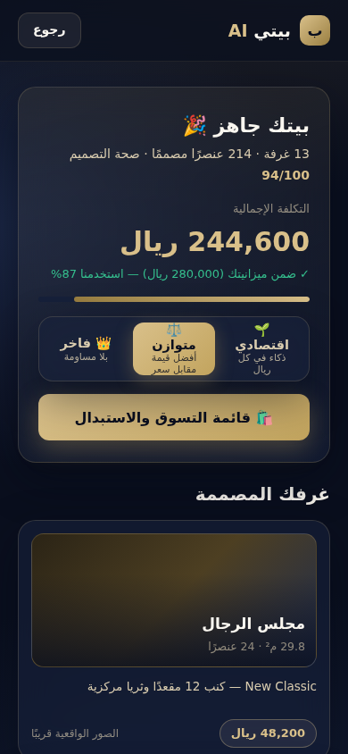

# Bayti AI — بيتي

> **من مخطط ورقي إلى منزل جاهز للتنفيذ — بقوة مجلس من وكلاء الذكاء الاصطناعي.**

Bayti AI هي منصة ذكاء اصطناعي تحوّل أي مخطط منزل (PDF / DWG / PNG / JPG) إلى تصميم تنفيذي كامل: أثاث، إنارة، كهرباء، تكييف، مطابخ، حمامات، حدائق، واجهات — مع قائمة تسوّق حقيقية من المتاجر السعودية، وتكلفة مفصّلة، وصور فوتوريالية، ونموذج ثلاثي الأبعاد.

**السوق الأول:** السعودية 🇸🇦 → الخليج → العالم.

---

## 📚 الوثائق التأسيسية

> 🔒 **Architecture v1.0 (Frozen)** — ابدأ القراءة من [**دستور المشروع**](docs/PROJECT_CONSTITUTION.md)، ثم [الـ PRD الرسمي](docs/02-prd.md) (المرجع عند أي تعارض)، و[سجل القرارات ADR](docs/ADR.md) و[تقرير الـ Freeze](docs/ARCHITECTURE_FREEZE_v1.md).

| # | الوثيقة | الوصف |
|---|---------|-------|
| ⭐ | [PROJECT_CONSTITUTION](docs/PROJECT_CONSTITUTION.md) | الدستور المختصر — يُقرأ أولًا |
| ⭐ | [ADR](docs/ADR.md) | سجل القرارات المعمارية (32 قرارًا — Frozen) |
| ⭐ | [ARCHITECTURE_FREEZE_v1](docs/ARCHITECTURE_FREEZE_v1.md) | تقرير التجميد: قاموس، مخاطر، ديون، جاهزية 89/100 |
| ⭐ | [ARCHITECTURE_RELEASE_NOTES_v1.0](docs/ARCHITECTURE_RELEASE_NOTES_v1.0.md) | مذكرة إصدار المعمارية: ما أُنجز، ما تغيّر، ولماذا |
| ⭐ | [ENGINEERING_BOOTSTRAP](docs/ENGINEERING_BOOTSTRAP.md) | خطة الانطلاق: ترتيب الأقسام 7–12، Sprint 0، البوابات، ومتى يبدأ الكود |
| ⭐ | [WOW_MOMENTS](docs/WOW_MOMENTS.md) | هوية التجربة: لحظات الانبهار ولغة الفخامة — مرجع كل قرارات الواجهة |
| 1 | [Product Vision](docs/01-product-vision.md) | الرؤية، الرسالة، ولماذا سنفوز |
| 2 | [PRD](docs/02-prd.md) | متطلبات المنتج التفصيلية ورحلة المستخدم |
| 3 | [Software Architecture](docs/03-software-architecture.md) | المعمارية البرمجية للنظام |
| 4 | [AI Architecture](docs/04-ai-architecture.md) | مجلس وكلاء الذكاء الاصطناعي (Agent Council) |
| 5 | [Database Design](docs/05-database-design.md) | تصميم قواعد البيانات |
| 6 | [API Design](docs/06-api-design.md) | تصميم الواجهات البرمجية |
| 7 | [Folder Structure](docs/07-folder-structure.md) | هيكلة المشروع (Monorepo) |
| 8 | [Development Roadmap](docs/08-roadmap.md) | خارطة الطريق التنفيذية |
| 9 | [Security Architecture](docs/09-security.md) | معمارية الأمان |
| 10 | [Scalability Plan](docs/10-scalability.md) | خطة التوسع |
| 11 | [Tech Stack](docs/11-tech-stack.md) | الحزمة التقنية ومبررات كل اختيار |
| 12 | [Risks & Mitigation](docs/12-risks.md) | المخاطر وخطط معالجتها |
| 13 | [MVP](docs/13-mvp.md) | تعريف النسخة الأولى القابلة للإطلاق |
| 14 | [Future Versions](docs/14-future-versions.md) | النسخ المستقبلية والأفكار الاستراتيجية |

---

## ⚡ الفكرة في 30 ثانية

```
مخطط المنزل  →  تحليل بالذكاء الاصطناعي  →  مجلس من 11 وكيل AI متخصص
     →  تصميم كامل لكل عنصر (نوع، مقاس، لون، خامة، كمية، مكان)
     →  منتجات حقيقية من متاجر سعودية (سعر + رابط شراء + بدائل)
     →  3 نسخ: اقتصادي / متوازن / فاخر
     →  تكلفة كل غرفة وكل قسم وإجمالي المشروع
     →  صور فوتوريالية + فيديو + نموذج 3D + تقرير PDF
     →  تعديل فوري بالمحادثة: "غيّر الكنبة" ، "اجعل المجلس أفخم"
```

## 🏛️ مجلس الوكلاء (AI Agent Council)

| الوكيل | المسؤولية |
|--------|-----------|
| **Architect AI** | يفهم المخطط: الجدران، الغرف، الأبواب، الشبابيك، الأبعاد، المساحات |
| **Interior Designer AI** | يصمم جميع الغرف حسب النمط المختار |
| **Lighting Engineer AI** | تصميم الإنارة بالكامل (طبقات الإضاءة، درجات الحرارة اللونية) |
| **Electrical Engineer AI** | مواقع الأفياش والمفاتيح ولوحات التوزيع |
| **HVAC Engineer AI** | حساب أحمال التكييف واقتراح الأنظمة |
| **Kitchen Designer AI** | تصميم المطبخ بالكامل (مثلث العمل، الخزائن، الأجهزة) |
| **Bathroom Designer AI** | تصميم الحمامات (تمديدات، تشطيبات، أطقم) |
| **Landscape Designer AI** | الحديقة، السور، الواجهة، المسبح، الممرات |
| **Furniture AI** | اختيار الأثاث بمقاسات تطابق الغرف فعليًا |
| **Cost Engineer AI** | حساب التكلفة بندًا بندًا وموازنتها مع ميزانية العميل |
| **Shopping AI** | مطابقة كل عنصر بمنتجات حقيقية من المتاجر السعودية |

## 🚀 التشغيل — Sprint 1 Preview (v0.1)

> **نسخة تعمل الآن!** واجهة فاخرة كاملة فوق خدمات محاكاة (Mock) بعقود مجمدة — تُستبدل بالخدمات الحقيقية تدريجيًا دون تغيير الواجهة.

```bash
pnpm install
cd apps/web && pnpm dev
# افتح http://localhost:3000 — ومن جوالك: http://<IP جهازك>:3000
```

**الدخول التجريبي:** أي رقم بصيغة `05XXXXXXXX` → رمز التحقق **`1234`**
> ⚠️ الرمز التجريبي يعمل في development فقط — في production معطّل بنيويًا (يُفعَّل لبيئات المعاينة حصريًا عبر `NEXT_PUBLIC_ALLOW_TEST_OTP=true`).

### الرحلة التي تعمل حاليًا
`الصفحة الرئيسية → دخول OTP → لوحة المشاريع → مشروع جديد + رفع المخطط → التحليل المرحلي → 🏛️ مجلس الذكاء الحي (13 خبيرًا + تعارض يُحسم أمامك) → المعاينة الأولى → النسخ الثلاث (اقتصادي/متوازن/فاخر) بتبديل فوري → قائمة التسوق مع عدّاد التوفير واستبدال القطع (أرخص/أفخم)`

### ما هو Mock وما هو حقيقي

| المكوّن | الحالة | الـ Flag |
|---------|--------|----------|
| الواجهة كاملة (RTL، جوال، Bayti Glass) | ✅ **حقيقي** | — |
| العقود (`packages/contracts` + `design-schema`) | ✅ **حقيقية ومجمدة** — الـ mocks تطبّقها حرفيًا | — |
| الدخول OTP | 🎭 Mock | `NEXT_PUBLIC_USE_MOCK_AUTH` |
| تحليل المخطط | 🎭 Mock (سيناريو يطابق مراحل §4.12) | `NEXT_PUBLIC_USE_MOCK_ANALYSIS` |
| مجلس الوكلاء | 🎭 Mock (سيناريو فيلا النرجس §6.19 بعقد SSE) | `NEXT_PUBLIC_USE_MOCK_COUNCIL` |
| النتائج والتسوق | 🎭 Mock — **المتاجر مُعلَّمة "تجريبي" بوضوح، لا روابط تدّعي أنها حقيقية** | `NEXT_PUBLIC_USE_MOCK_RESULTS` |

قلب أي flag إلى `false` يوجّه الشاشة للخدمة الحقيقية (يفشل بوضوح إن لم تُربط بعد) — **صفر تغيير في كود الشاشات** (AC12-3).

الإصدار: **`v0.1-preview`** (tag محلي — راجع [ENGINEERING_BACKLOG](ENGINEERING_BACKLOG.md) لحالة الشرائح).

### لقطات من النسخة الحالية (جوال 390px)

| الرئيسية | المجلس الحي (W3) | النسخ الثلاث (W4) | التسوق + التوفير (W6) |
|---|---|---|---|
|  |  |  |  |

---

*"نحن لا نبني أداة تصميم. نحن نبني الطبقة الذكية بين حلم الإنسان بمنزله وبين تنفيذه على أرض الواقع."*
