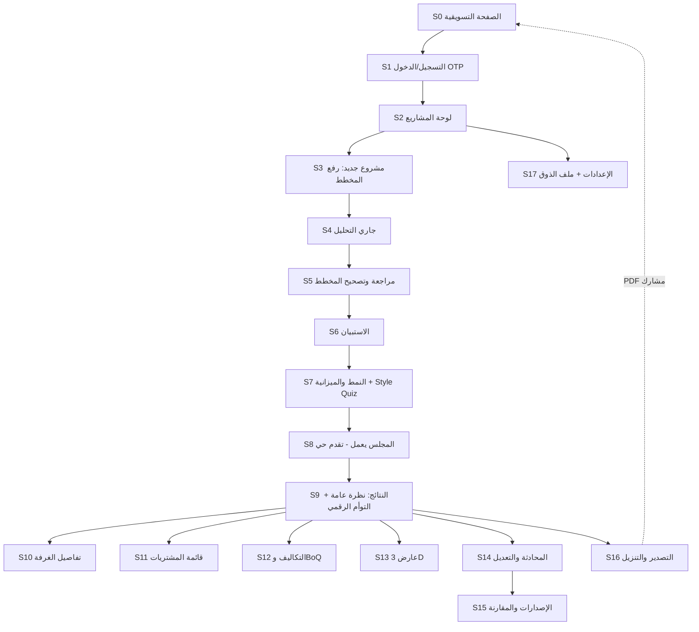
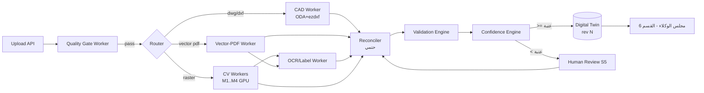
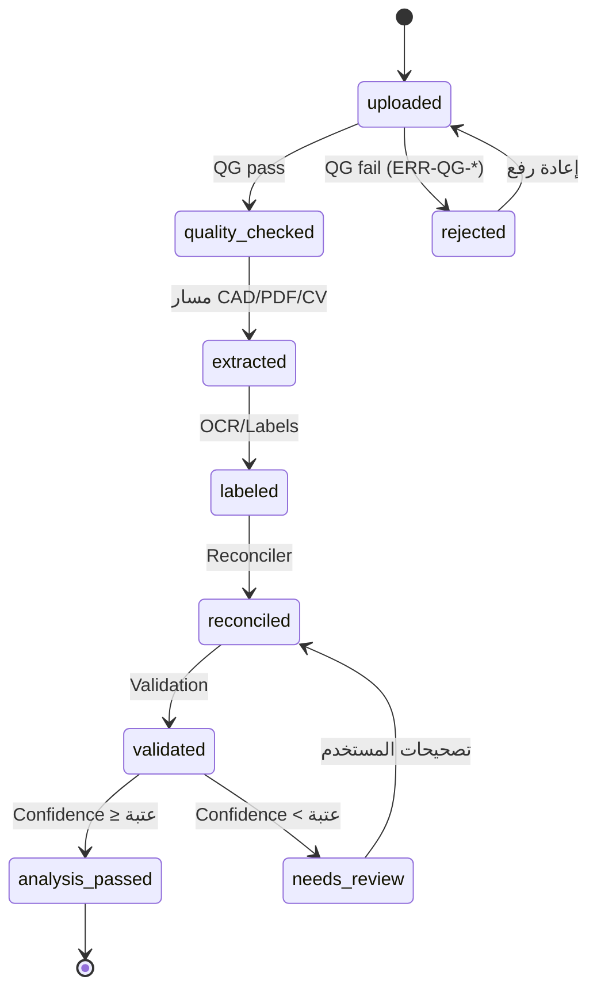
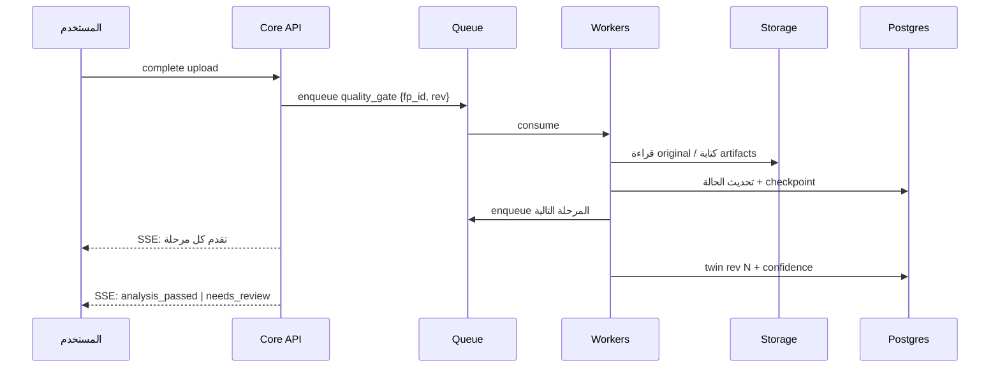
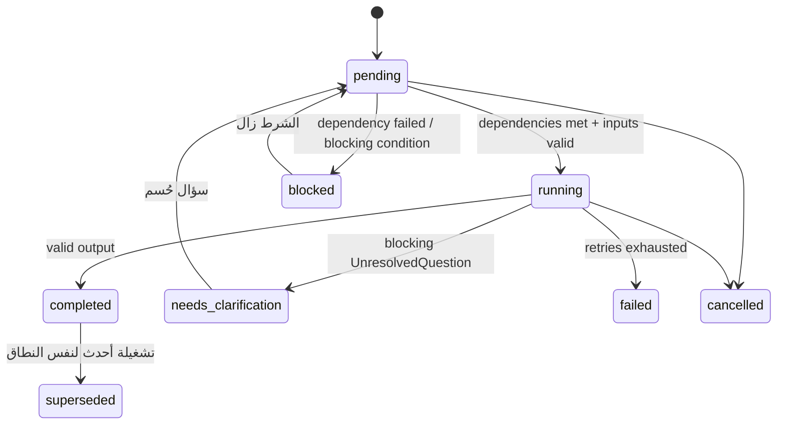
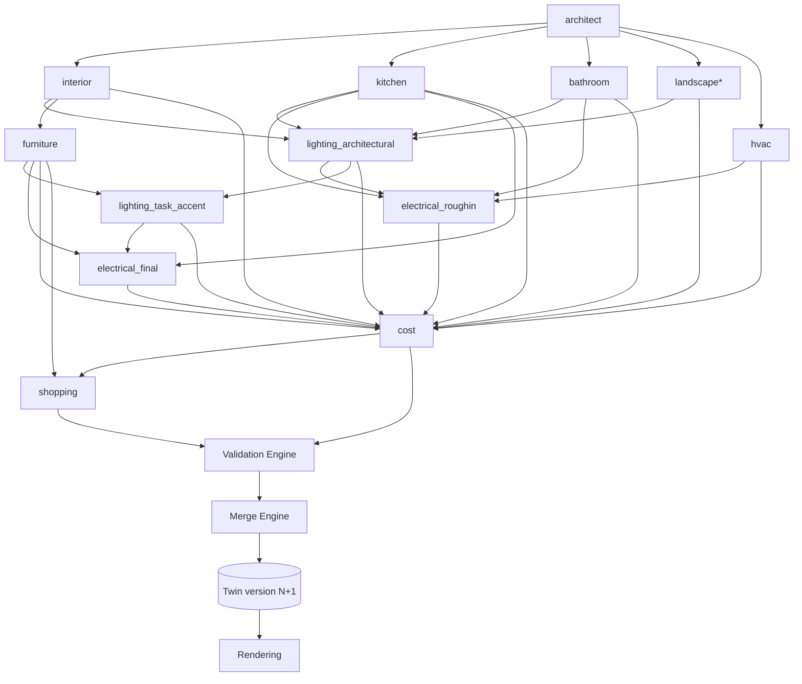

# Product Requirements Document (PRD) — Bayti AI

| | |
|---|---|
| **المنتج** | Bayti AI — منصة تحويل مخططات المنازل إلى تصاميم تنفيذية مُسعَّرة |
| **الإصدار** | v2.0 — يُبنى قسمًا بقسم باعتماد المؤسس |
| **المالك** | CTO |
| **الحالة** | 🔒 Frozen · الأقسام 1–9 معتمدة · القسم 10 جاهز للمراجعة |
| **آخر تحديث** | 2026-07-14 |

---

## فهرس الوثيقة (خطة الأقسام)

| # | القسم | الحالة |
|---|-------|--------|
| 1 | **الملخص التنفيذي ونظرة المنتج** + المبادئ الحاكمة الثمانية | ✅ **معتمد من المؤسس** |
| 2 | السوق والمستخدمون (تحليل السوق، TAM/SAM/SOM، Personas، JTBD، رحلة المستخدم، المنافسون، خطة التوسع) | ✅ **معتمد (بعد تعديلات المؤسس)** |
| 3 | رحلة المستخدم التفصيلية (شاشة بشاشة — UX) | ✅ **معتمد** |
| 4 | المواصفة الهندسية: رفع المخطط وتحليله وتحويله إلى Digital Twin | ✅ **معتمد (مع إضافات المؤسس 4.16–4.24)** |
| 5 | المواصفة الهندسية: الاستبيان، الذوق، والقيود (Intake & Style) | ✅ **معتمد** |
| 6 | المواصفة الهندسية: مجلس الوكلاء ومواصفات التصميم (قلب النظام) | ✅ **معتمد بدفعاته الأربع** |
| — | **Architecture Freeze v1.0** — [التقرير الكامل](ARCHITECTURE_FREEZE_v1.md) + [الدستور المختصر](PROJECT_CONSTITUTION.md) | ✅ **Approved — Architecture v1.0 (Frozen)** بمصادقة المؤسس 2026-07-15 |
| 7 | **Commerce Platform** (منصة تجارة كاملة تشمل مواد البناء) | ✅ **معتمد — ADR-033…036 مفعّلة** |
| 8 | **Digital Twin Outputs & Rendering** | ✅ **معتمد** |
| 9 | AI Conversation & Design Editing | ✅ **معتمد** |
| 10 | Costing, Plans & Payments (نطاق مؤسس — 15 بندًا · يُقفل F-11) | 🔍 **جاهز للمراجعة** |
| 11 | Security, Infrastructure & Deployment | ⬜ |
| 12 | UI/UX System & Final Acceptance | ⬜ |
| ملحق A | Future AI Improvements + Future Scope — موثقة ولا تُنفذ الآن (قرار مؤسس) | 📘 حي |

> **منهجية العمل:** لا يُكتب قسم قبل اعتماد الذي يسبقه. لا برمجة قبل اعتماد الوثائق كاملة.
> ⚡ **قاعدة الانضباط بالنطاق (قرار مؤسس — سارية من القسم 8):** أي فكرة جديدة غير ضرورية للتنفيذ الأول: تُوثَّق في Future Scope فقط · لا ADR جديد لها · لا توسّع القسم الحالي · لا تؤخر الكود. لا مراجعات معمارية بعد كل قسم — مراجعة سريعة، إغلاق، انتقال. **الهدف: إنهاء 8–12 ثم Sprint 0.**
> **سجل القرارات:** [`docs/ADR.md`](ADR.md) — 36 قرارًا مفعّلًا.

---

# القسم 1 — الملخص التنفيذي ونظرة المنتج

## 1.1 المشكلة

عائلة تستلم منزلها (فيلا من مطوّر، شقة تمليك، أو بيت أنهى مرحلة العظم) تواجه فجوة ضخمة بين **المخطط** وبين **منزل جاهز للسكن**:

1. **آلاف القرارات المتشابكة بلا خبرة:** أثاث، إنارة، كهرباء، تكييف، أرضيات، دهانات، مطبخ، حمامات، حديقة — كل قرار يؤثر على غيره، والعائلة تقرر بالتخمين.
2. **الخيار البشري مكلف وبطيء:** مصمم داخلي محترف يكلف 10,000–100,000+ ريال، يستغرق أسابيع لكل نسخة، وغالبًا يغطي "الديكور" فقط دون الكهرباء والتكييف والتكلفة التنفيذية.
3. **لا أحد يجيب على السؤال الحقيقي: "كم سيكلفني فعلًا؟"** — الميزانيات تنفجر لأن التقدير يتم بعد الالتزام، لا قبله.
4. **الفجوة بين التصميم والشراء:** حتى مع وجود تصميم، تتحول رحلة الشراء إلى أسابيع من البحث في المتاجر عن قطع "تشبه" الصورة — وغالبًا بمقاسات خاطئة.
5. **أدوات التصميم الحالية لا تحل المشكلة:** أدوات مثل Planner 5D وHomestyler تتطلب أن يبني المستخدم النموذج بنفسه يدويًا، وتنتج صورًا لا قوائم شراء حقيقية ولا تكاليف موثوقة، ولا تفهم السياق الخليجي (مجلس، ملحق، غرفة سائق).

**حجم الألم في سوقنا الأول:** برنامج سكني ورؤية 2030 يستهدفان تملّك 70% — مئات آلاف الوحدات الجديدة سنويًا في السعودية، كل واحدة تمر بهذه الفجوة، بمتوسط إنفاق تأثيث وتشطيب يتراوح بين 100 ألف وأكثر من 500 ألف ريال للفيلا.

## 1.2 الحل

**Bayti AI: مجلس من وكلاء ذكاء اصطناعي متخصصين يحوّل مخطط المنزل إلى مشروع تنفيذي كامل خلال دقائق.**

المستخدم يرفع مخططه (PDF/DWG/PNG/JPG)، يجيب عن أسئلة قصيرة (المدينة، الميزانية، تكوين الأسرة)، يختار نمطه المفضل — ثم يعمل لأجله 11 وكيلًا متخصصًا (معماري، مصمم داخلي، مهندس إنارة، كهرباء، تكييف، مطابخ، حمامات، حدائق، أثاث، تكاليف، تسوق) ليستلم:

1. **تصميمًا كاملًا لكل عنصر في المنزل** — بالنوع والمقاس واللون والخامة والكمية ومكان التركيب.
2. **قائمة تسوق حقيقية** من متاجر سعودية: اسم المنتج، صورته، سعره، رابط شرائه، مع بديل أرخص وبديل أفخم لكل قطعة.
3. **ثلاث نسخ كاملة:** اقتصادي / متوازن / فاخر.
4. **تكلفة مفصلة** لكل غرفة وكل قسم وإجمالي المشروع — مقارنة بميزانيته.
5. **مخرجات بصرية:** صور فوتوريالية مطابقة لغرفه الحقيقية، فيديو، نموذج 3D، وتقرير PDF شامل.
6. **تعديل فوري بالمحادثة:** "غيّر الكنبة"، "اجعل المجلس أفخم"، "قلّل الميزانية 20%" — والتصميم والتكلفة يتحدثان أمامه.

## 1.3 لماذا نحن ولماذا الآن (بإيجاز)

- **نضج تقني:** نماذج الرؤية واللغة أصبحت قادرة على فهم المخططات، والتوليد الصوري الموجَّه قادر على إنتاج صور تطابق هندسة الغرفة الفعلية.
- **فجوة سوقية:** لا يوجد لاعب — عالميًا — يربط السلسلة كاملة: مخطط → تصميم متعدد التخصصات → منتجات محلية حقيقية → تكلفة → تنفيذ.
- **أفضلية محلية قابلة للتصدير:** فهم السياق الخليجي (مجلس رجال/نساء، ملحق خارجي، غرفة خادمة/سائق) لا يملكه أي منتج عالمي، والبنية متعددة الدول تجعل كل سوق جديد "تكوينًا" لا إعادة بناء.

## 1.4 أهداف المنتج (Goals)

| # | الهدف | المقياس |
|---|-------|---------|
| G1 | إثبات الثقة: المستخدم يبني قرارات مالية حقيقية على مخرجاتنا | ≥ 25% من المشاريع المكتملة يتبعها ضغط روابط شراء أو تصدير PDF |
| G2 | تجربة "الوااو" خلال الجلسة الأولى | زمن النظام الصافي من الرفع إلى نتائج قابلة للتصفح ≤ 7 دقائق (P95) — مفكك أدناه (F-05) |
| G3 | دقة هندسية غير قابلة للتفاوض | ≥ 95% من القطع المقترحة تدخل مقاساتها فعليًا في أماكنها |
| G4 | تسعير موثوق | ≥ 80% من العناصر القابلة للشراء لها منتج متاح بسعر بعمر ≤ 72 ساعة |
| G5 | اقتصاد وحدة صحي | تكلفة AI للمشروع ≤ 30% من سعر الباقة |
| G6 | بناء أصول البيانات من اليوم الأول | كل تصحيح مخطط وكل قبول/استبدال منتج يُسجَّل كبيانات تدريب |

**تفكيك G2 (قرار مؤسس — F-05):** كل مرحلة لها هدف زمني مستقل، ويُقاس كلٌّ منها منفردًا:

| المرحلة | الهدف (P95) | ملاحظة |
|---------|--------------|---------|
| رفع الملف | ≤ 10 ث | لملف 10MB على 4G |
| التحليل (رفع مكتمل → جاهز للمراجعة) | ≤ 120 ث | المعالجة نفسها ≤ 90 ث (F-03) |
| مراجعة المخطط + الاستبيان + النمط | زمن مستخدم — خارج زمن النظام | أهدافه المستقلة: S5 ≤ 90 ث، الاستبيان ≤ 3 دقائق (AC5-1) |
| مجلس الوكلاء شاملًا الدمج | ≤ 300 ث | SLO شاشة S8 |
| عرض النتائج (تصميم + تكلفة + تسوق) | فوري عند اكتمال الدمج | — |
| أول رندر صوري | ≤ 90 ث بعد الدمج — **تدفقي لا يحجب النتائج** | الصور تظهر تباعًا |
| **زمن النظام الصافي (رفع + تحليل + مجلس)** | **≈ 430 ث ≤ 7 دقائق** | تعريف G2 الرسمي |

**North Star Metric:** عدد المشاريع التي تصل شهريًا إلى "قائمة تسوق مُسعَّرة كاملة".

**مقياس الجودة المقابل (Quality Counter-Metric):** نسبة المشاريع التي **يقبل المستخدم تصميمها فعليًا** — يصدّر التقرير أو يضغط رابط شراء منتج. الوصول إلى القائمة وحده لا يثبت أن التصميم مفيد؛ المقياسان يُقرآن معًا دائمًا، وارتفاع الأول مع انخفاض الثاني إنذار جودة فوري.

## 1.5 غير الأهداف (Non-Goals) — ما لا نفعله عمدًا

| ✗ | لماذا |
|---|-------|
| التصميم الإنشائي أو تعديل جدران حاملة | مسؤولية هندسية/قانونية خارج رسالتنا؛ نتكامل لاحقًا مع مكاتب هندسية |
| التراخيص والتقديم الحكومي | خارج الرحلة الأساسية؛ شراكات مستقبلية |
| تنفيذ الأعمال (مقاولات) في v1 | يحتاج كثافة طلب أولًا — Marketplace في v3 |
| بناء متجر إلكتروني خاص (مخزون/شحن) | نحن طبقة القرار فوق المتاجر، لسنا منافسًا لها |
| أداة CAD احترافية للمهندسين | جمهورنا الأساسي العائلة، ثم المصمم عبر وضع Pro لاحقًا |

## 1.6 الجمهور المستهدف (موجز — تفصيله في القسم 2)

- **أساسي:** مالك منزل جديد في السعودية (فيلا/شقة) مقبل على تأثيث وتشطيب كامل.
- **ثانوي:** المُجدِّد (غرف محددة)، والمصمم الداخلي المستقل (كأداة تسريع).
- **مستقبلي (B2B):** المطور العقاري، والمتاجر.

## 1.7 مقاييس نجاح المنتج (أول 12 شهرًا بعد الإطلاق)

| المقياس | الهدف |
|---------|-------|
| Activation: رفع مخطط → نتائج كاملة | ≥ 60% |
| تعديلات محادثة لكل مشروع (مؤشر انخراط) | 3–15 |
| تحويل Free → مدفوع | ≥ 8% |
| NPS | ≥ 50 |
| نسبة الروابط الصالحة في قوائم التسوق | ≥ 95% |
| مشاريع مكتملة شهريًا (نهاية السنة الأولى) | 1,000+ |

## 1.8 الافتراضات الحرجة (Assumptions نختبرها مبكرًا)

1. المستخدم السعودي **يثق** بتصميم من AI بما يكفي للشراء بناءً عليه — إذا شارك في تأكيد المخطط ورأى منتجات حقيقية بأسعار حقيقية.
2. يمكن الوصول لدقة تحليل مخططات ≥ 85% (بمساعدة تصحيح المستخدم) على المخططات السعودية الشائعة.
3. المتاجر الكبرى ستتعاون (feeds/affiliate) لأننا قناة مبيعات لهم وليس خصمًا.
4. تكلفة التوليد لكل مشروع يمكن ضبطها تحت سقف يحفظ هامشًا صحيًا.

> كل افتراض من هذه الأربعة له اختبار مبكر في خارطة الطريق؛ فشل أي منها يستدعي مراجعة استراتيجية لا ترقيعًا.

## 1.9 المبادئ الحاكمة الثمانية (Core Principles) — متطلبات أساسية معتمدة من المؤسس

> هذه المبادئ **دستور المنتج**: كل قسم قادم في هذه الوثيقة، وكل قرار معماري، وكل سطر كود — يُقاس عليها. أي ميزة تخالف مبدأً منها تُرفض.

### P1 — التنفيذ أولًا (Execution First)
كل قرار يتخذه الذكاء يجب أن يكون **قابلًا للتنفيذ في الواقع**، لا مجرد تصميم جميل: المنتج موجود ويُشترى فعلًا، المقاس يدخل من الباب ويُركَّب في مكانه، الخامة متوفرة في السوق المحلي، والسعر حقيقي.
**الأثر على النظام:** كل عنصر تصميمي يحمل حالة `executability` تُفحص آليًا (متوفر/قابل للتركيب/ضمن السوق المحلي)، وأي عنصر غير قابل للتنفيذ لا يظهر للمستخدم.

### P2 — كل قرار مُبرَّر (Justified Decisions)
لكل عنصر يعرضه النظام **سبب اختيار** واضح بلغة المستخدم. أمثلة: *"اخترنا هذه الإنارة لأن مساحة الغرفة 24م² تحتاج 4 نقاط إضاءة عامة"*، *"اخترنا هذا الباب لأنه مقاوم للرطوبة (حمّام)"*, *"اخترنا هذا الرخام لأنه ضمن ميزانيتك"*.
**الأثر على النظام:** حقل `justification_ar` إلزامي في مخرجات كل وكيل لكل عنصر — عنصر بلا مبرر يُرفض آليًا في مرحلة الدمج.

### P3 — القوانين الهندسية حاكمة (Engineering Rules Engine)
التصميم يخضع لمحرك قواعد هندسية صارم لا يسمح بتصميم غير عملي، يشمل كحد أدنى:
- مسافات الحركة (ممرات ≥ 75–90 سم حسب الاستخدام)
- خلوص فتح الأبواب كاملًا دون اصطدام
- خلوص فتح الأدراج والخزائن (أمام المطبخ والدواليب)
- خلوص فتح باب الثلاجة والأجهزة
- منطق أماكن الجلوس (مسافات المشاهدة، الحوار، الطاولات)
- توزيع الإضاءة (شدة كافية لكل وظيفة غرفة — Lux لكل استخدام)
- توزيع الكهرباء (أفياش كافية وفي الأماكن الصحيحة، بعيدة عن الماء)
- قواعد السلامة (زوايا آمنة مع الأطفال، مواد مقاومة للانزلاق في المناطق الرطبة، تهوية)
**الأثر على النظام:** هذه القواعد **كود حتمي** (لا اجتهاد LLM) تعمل كبوابة فحص إلزامية قبل إخراج أي تصميم — التصميم الذي يكسر قاعدة يُعاد للوكيل المختص لتصحيحه آليًا.

### P4 — كل منتج قابل للاستبدال (Swappable Products)
أي عنصر يمكن استبداله (ببديل أرخص/أفخم/مختلف) **دون إعادة تصميم المشروع** — يُعاد حساب التكلفة والتحقق الهندسي للعنصر ومحيطه فقط.
**الأثر على النظام:** فصل صارم بين "القرار التصميمي" (كنبة 3 مقاعد، 220سم، بيج، مكانها هنا) وبين "المنتج المطابق" (موديل معين من متجر معين) — الاستبدال يمس الطبقة الثانية فقط.

### P5 — النظام يتعلم من المستخدم (Personalization Memory)
تفضيلات المستخدم (ألوان، خامات، متاجر مفضلة، نطاق ميزانية، أنماط) تُستخلص من سلوكه (قبول/استبدال/رفض/تعديلات المحادثة) وتُخزَّن في **ملف ذوق شخصي** يُغذّي كل مشروع قادم — المشروع الثاني أدق من الأول.
**الأثر على النظام:** كيان `UserTasteProfile` يُبنى تراكميًا ويُمرَّر للوكلاء كسياق؛ مع شفافية كاملة (المستخدم يرى ويعدّل ملف ذوقه).

### P6 — التعديل بالمحادثة حق أساسي (Conversational Editing)
أي تعديل يكتبه المستخدم يُنفَّذ مباشرة: *"غيّر الكنبة"، "أضف مكتبة"، "اجعل المجلس أفخم"، "قلّل الميزانية 15%"، "استبدل الأرضية برخام"*. التعديل يشمل الإضافة والحذف والاستبدال وتغيير الخامات والميزانية — ويُحدَّث التصميم والتكلفة والمبررات فورًا.

### P7 — كل مشروع له إصدارات (Versioning)
كل تعديل ينشئ نسخة جديدة (Version 1, 2, 3...) مع إمكانية **الرجوع لأي إصدار سابق** والمقارنة بين إصدارين (ما الذي تغيّر؟ وكم فرق التكلفة؟). لا يُفقد عمل المستخدم أبدًا.

### P8 — المشروع مبني على توأم رقمي (Digital Twin)
النظام **لا يولّد صورًا** — بل يبني **نموذجًا رقميًا كاملًا للمنزل** (هندسة المخطط + كل عنصر بموقعه ومواصفاته وعلاقاته) هو مصدر الحقيقة الوحيد. الصور والفيديو والـ 3D والتقارير والتكلفة كلها **مشتقات** من هذا التوأم، وجميع التعديلات تتم عليه ثم تنعكس على كل المشتقات.
**الأثر على النظام:** أي ميزة تنتج مخرجًا بصريًا غير مشتق من التوأم الرقمي (صورة "جميلة" لا تطابق النموذج) مرفوضة من حيث المبدأ.

### P9 — نظام الثقة (Confidence System): النظام لا يخمّن
كل مرحلة في النظام تُخرج **نسبة ثقة رقمية** لكل ناتج (تحليل المخطط 98%، اكتشاف الأبواب 94%، الشبابيك 91%، الغرف 99%...). لكل مرحلة **حد أدنى معتمد**: إذا انخفضت الثقة عنه يتوقف التنفيذ الآلي وينتقل الناتج إلى المراجعة اليدوية — **النظام لا يخمّن أبدًا في قرار منخفض الثقة**.
**الأثر على النظام:** حقل `confidence` إلزامي في مخرجات كل مرحلة وكل عنصر؛ جداول عتبات معتمدة لكل مرحلة (تُعرَّف في أقسامها)؛ تجاوز العتبة شرط عبور آلي، ودونها بوابة مراجعة.

### P10 — طبقة التحقق البشري (Human Verification Layer)
أي خطوة منخفضة الثقة تُعرض على المستخدم للتعديل، **ثم يتابع المشروع من نفس النقطة** — لا إعادة من البداية أبدًا.
**الأثر على النظام:** خط المعالجة مبني على **checkpoints** قابلة للاستئناف؛ التصحيح البشري يُبطل فقط النتائج المشتقة من العنصر المصحح (invalidation انتقائي) ويعيد تشغيلها وحدها.

### P11 — قابلية التفسير الكاملة (Explainability)
كل قرار يتخذه أي وكيل قابل للتفسير: لماذا وُضعت الكنبة هنا؟ لماذا هذا الباب؟ لماذا هذا اللون؟ لماذا هذا النوع من الإنارة؟ كل قرار يحتوي إلزاميًا على:
1. **السبب** (بلغة المستخدم)
2. **القاعدة المستخدمة** (مرجع قاعدة هندسية/تصميمية مرقمة)
3. **التأثير على الميزانية**
4. **التأثير على الاستخدام** (الحركة، الراحة، السلامة)
**الأثر على النظام:** بنية `DecisionExplanation` إلزامية لكل عنصر (توسيع P2)؛ قرار بلا تفسير رباعي يُرفض في مرحلة الدمج.

### P12 — محرك القواعد قبل الذكاء (Rule Engine First)
أي شيء يمكن حسمه بقواعد هندسية ثابتة **لا يُترك للـ LLM**. الترتيب المعماري الملزم لكل خط معالجة:
```
Rule Engine  →  AI Agents  →  Validation Engine  →  Digital Twin  →  Rendering
```
القواعد تسبق الذكاء (تقيّد فضاء الحلول قبل التوليد)، والتحقق يلي الذكاء (يرفض ما كسر قاعدة)، والتوأم يُحدَّث فقط بما اجتاز التحقق، والرندر لا يقرأ إلا من التوأم.
**الأثر على النظام:** كل وكيل يستلم "قيود القواعد" كمدخل صريح؛ وأي منطق حتمي يُكتشف داخل prompt يُنقل إلى المحرك.

### P13 — لوحة صحة المشروع (Project Health)
كل مشروع يعرض لوحة صحة حية لكل مرحلة/قسم: ✅ سليم، ⚠ يحتاج مراجعة (مع السبب: "الإنارة: غرفتان دون العتبة"، "المشتريات: منتجان غير متوفرين")، ❌ فشل. اللوحة هي المدخل الدائم لطبقة التحقق البشري (P10).
**الأثر على النظام:** كيان `ProjectHealth` محسوب آليًا من حالات المراحل والثقة والتحقق، ويتحدث لحظيًا مع كل تغيير.

### P14 — سجل التدقيق (Audit Log)
كل تعديل يُسجَّل: **من** قام به (مستخدم/وكيل/نظام)، **متى**، **ما الذي تغيّر** (قبل/بعد)، **ولماذا** (أمر محادثة، تصحيح يدوي، قاعدة فرضت التغيير). السجل غير قابل للتعديل ويغذي شاشة الإصدارات (P7).

### P15 — ذاكرة المشروع المستقلة (AI Memory)
كل مشروع يملك ذاكرة مستقلة تتذكر: ألوان المستخدم، متاجره المفضلة، خاماته، ميزانيته، وكل تعديلاته السابقة — **ولا يُسأل المستخدم عن الشيء نفسه مرتين**. ذاكرة المشروع (خاصة بسياقه) تتكامل مع ملف الذوق العام (P5) دون أن تختلط به: ما قرره في هذا المشروع لا يُفرض على غيره إلا كاقتراح.
**الأثر على النظام:** كيان `ProjectMemory` يُمرَّر لكل وكيل في كل استدعاء؛ أي سؤال للمستخدم يمر بفحص "هل أجاب عنه سابقًا؟" قبل العرض.

## 1.10 معايير التوثيق الهندسي الملزمة (تسري على كل الأقسام من 4 فصاعدًا)

> هذه الوثيقة هي **المرجع الرسمي الوحيد للمشروع** — يجب أن تكفي لبدء فريق من 30 مهندسًا العمل دون الرجوع للمؤسس.

1. **البنية السباعية:** كل قسم/بند هندسي جديد يحتوي: `Purpose · Inputs · Outputs · Rules · Failure Cases · Acceptance Criteria · ADR` (الأخير عند وجود قرار يصعب عكسه).
2. **Schemas كاملة:** أي Model/Schema جديد يُعرَّف بكل حقوله وأنواع بياناته وعلاقاته — لا أسماء كيانات بلا تعريف.
3. **معيار الـ Pipeline:** أي pipeline يوثَّق بـ: Sequence Diagram، State Machine، Retry Strategy، Timeout Strategy، Error Codes، Recovery Strategy.
4. **Rule Engine قبل Prompt:** أي قاعدة هندسية قابلة للتحويل إلى قاعدة حتمية لا تبقى داخل Prompt — بند إلزامي في مراجعة كل prompt (امتداد P12).
5. **Thresholds في Configuration:** كل عتبة/مهلة/سقف تعيش في ملفات config مُدارة بالإصدارات (`config/*.yaml`) — **ليست ثوابت في الكود** — قابلة للتحديث دون نشر.
6. **سجل قرارات مستقل:** كل ADR يُسجَّل أيضًا في [`docs/ADR.md`](ADR.md) — السجل الرسمي المجمع لكل القرارات المعمارية.

---

# القسم 2 — السوق والمستخدمون

## 2.1 تحليل السوق السعودي

### المحركات الكلية (لماذا السعودية هي أفضل نقطة انطلاق في العالم لهذا المنتج)

1. **أكبر موجة بناء سكني في تاريخ المنطقة:** برنامج الإسكان (رؤية 2030) يستهدف رفع تملّك الأسر السعودية للمساكن إلى 70%. أكثر من **117 ألف أسرة** استفادت من منصة سكني في 2024 وحدها، و54 ألف أسرة في النصف الأول من 2025، والشركة الوطنية للإسكان (NHC) ملتزمة بـ **600 ألف وحدة بحلول 2030**. كل وحدة جديدة = مشروع تأثيث وتشطيب كامل — عميل مثالي لـ Bayti.
2. **سوق أثاث ومفروشات ضخم ونامٍ:** تقديرات سوق الأثاث السعودي لعام 2025 تتراوح بين **4.8 و9.3 مليار دولار** — التفاوت سببه اختلاف تعريف السوق بين المصادر (انظر جدول المصادر أدناه)، ولذلك نعتمد النطاق لا رقمًا قطعيًا. وهذا قبل إضافة التشطيبات (أرضيات، دهانات، إنارة، أدوات صحية) التي تزيد الإنفاق القابل للتأثير بشكل كبير.

### جدول مصادر أرقام السوق (تاريخ الوصول لجميع المصادر: 2026-07-14)

| المصدر | التقدير (2025) | تعريف السوق المشمول |
|--------|----------------|----------------------|
| [Nexdigm](https://www.nexdigm.com/market-research/report-store/ksa-home-furniture-market-research-report/) | 4.76 مليار دولار | الأثاث **المنزلي** فقط |
| [Expert Market Research](https://www.expertmarketresearch.com/reports/saudi-arabia-home-furniture-market) | ~6.60 مليار دولار | الأثاث المنزلي |
| [IMARC Group](https://www.imarcgroup.com/saudi-arabia-furniture-market) | 6.9 مليار دولار | الأثاث الكلي (منزلي + تجاري) |
| [Statista](https://www.statista.com/outlook/cmo/furniture/saudi-arabia) | 7.18 مليار دولار | الأثاث الكلي (منهجية Consumer Market Outlook) |
| [Mordor Intelligence](https://www.mordorintelligence.com/industry-reports/saudi-arabia-furniture-market) | 8.27 مليار دولار | الأثاث الكلي شاملًا الفندقي/المكتبي |
| [Research and Markets](https://www.researchandmarkets.com/reports/5012744/saudi-arabia-furniture-market-share-analysis) | 9.33 مليار دولار | الأثاث الكلي بأوسع تعريف |

### التمييز بين الأسواق الأربعة التي نلمسها (لا يجوز خلطها)

| السوق | طبيعته | علاقتنا به |
|-------|---------|-------------|
| **سوق الأثاث والمفروشات** (~4.8–9.3 مليار دولار/سنة) | بيع منتجات | **نؤثر فيه** (عمولة توجيه شراء) — لا نبيع مخزونًا |
| **سوق خدمات التصميم الداخلي** | أتعاب مصممين ومكاتب | **ننافس/نمكّن** — منتجنا بديل ذاتي وأداة Pro للمصممين |
| **سوق التشطيب والتنفيذ (Fit-out)** | مقاولات وتوريد | **نُسعّره ونوجهه** (BoQ) — لا ننفذه في v1 |
| **سوق برمجيات التصميم** (Planner 5D وأشباهه) | اشتراكات أدوات | **سوقنا المباشر للإيراد الاشتراكي** — الأصغر حجمًا لكنه مدخلنا للثلاثة الأخرى |

> إيراداتنا تأتي من سوق البرمجيات (اشتراكات) + هامش تأثير على سوق الأثاث (عمولات) — ولذلك نموذج TAM/SAM/SOM أدناه يقيس **إيرادات Bayti الممكنة**، لا مجموع أحجام هذه الأسواق.
3. **ديموغرافيا مثالية:** مجتمع شاب (غالبية تحت 35)، من الأعلى عالميًا في تبنّي التقنية والتجارة الإلكترونية والذكاء الاصطناعي، ويتخذ قرارات المنزل عائليًا عبر الجوال وواتساب — يطابق تمامًا نموذج "تقرير يُشارك ويُناقش".
4. **خصوصية ثقافية تصنع حاجزًا تنافسيًا:** المجلس (رجال/نساء)، الملحق الخارجي، غرف الخدم والسائق، الفصل بين المطبخ النظيف و"المطبخ التحضيري" — لا تفهمها أي أداة عالمية، ونحن نبنيها في قلب النظام.
5. **فجوة عرض الخدمة:** المصممون المحترفون متركزون في الرياض/جدة وبأسعار تبدأ من ~10 آلاف ريال، بينما شريحة الطلب الأكبر (وحدات سكني، 100–300 ألف ريال ميزانية تجهيز) غير مخدومة إطلاقًا — هذه فجوتنا.

### توقيت الدخول
ذروة تسليمات الوحدات 2026–2030 تعني أن **نافذة بناء العلامة كـ"الخيار الافتراضي" مفتوحة الآن** — من يبني الثقة والكتالوج المحلي أولًا يحصد الموجة.

## 2.2 حجم السوق (TAM / SAM / SOM)

> **منهجية:** نُسعّر سوقنا نحن (إيرادات Bayti الممكنة)، لا إنفاق الناس على الأثاث. مصادر دخلنا: باقات مدفوعة + عمولة تسوق + اشتراكات Pro + B2B لاحقًا. لكل رقم: معادلة، افتراضات، مصدر، مستوى ثقة، وثلاثة سيناريوهات. تُراجع الأرقام كل ربع سنة مقابل الفعلي.

### 2.2.1 الجدول الرئيسي: TAM / SAM / SOM بالسيناريوهات

| | **TAM** (عالمي) | **SAM** (السعودية + الخليج، أفق 5 سنوات) | **SOM** (السعودية، نهاية سنة 3) |
|---|---|---|---|
| **المعادلة** | GMV الأثاث العالمي × نسبة العمولة الممكنة + (وحدات جديدة/مجددة عالميًا × سعر باقة) | GMV أثاث الخليج × الحصة القابلة للتأثير رقميًا × العمولة + اشتراكات الشريحة الرقمية | نموذج من الأسفل للأعلى (2.2.2) عبر 3 فئات عملاء |
| **الافتراضات** | GMV عالمي ~700 مليار دولار؛ عمولة توجيه 2–3%؛ اختراق طويل الأمد لطبقة "القرار الرقمي" | GMV خليجي 10–14 مليار دولار (منزلي)؛ 35–45% مرتبط بسكن جديد/تجديد شامل؛ عمولة 2–3% | انظر جدول 2.2.2 — كل متغير مفصّل |
| **المصدر** | تقارير الأثاث العالمية (نطاقات عامة) — **رقم اتجاهي لا تشغيلي** | جدول مصادر 2.1 (تاريخ الوصول 2026-07-14) + استقراء للإمارات/الخليج | افتراضاتنا التشغيلية + بيانات سكني/NHC |
| **مستوى الثقة** | 🔴 منخفض (استدلالي — للسياق الاستثماري فقط) | 🟡 متوسط (مصادر متعددة لكن التعريفات متفاوتة) | 🟢 الأعلى (تحت سيطرتنا وقابل للقياس شهريًا) |
| **محافظ** | ~8 مليار دولار/سنة | ~200 مليون دولار/سنة | **3.8 مليون ريال/سنة** |
| **أساسي** | ~15 مليار دولار/سنة | ~350 مليون دولار/سنة | **22.5 مليون ريال/سنة** |
| **متفائل** | ~25 مليار دولار/سنة | ~550 مليون دولار/سنة | **72.8 مليون ريال/سنة** |

### 2.2.2 بناء SOM من الأسفل إلى الأعلى (السيناريو الأساسي، نهاية سنة 3)

**الفئة أ — أصحاب المنازل (B2C):**

| المتغير | محافظ | أساسي | متفائل | أساس الافتراض |
|---------|-------|-------|--------|----------------|
| زوار مسجلون/سنة | 150k | 300k | 500k | تسويق + انتشار التقارير |
| يرفعون مخططًا ويكملون (Activation) | 45% | 60% | 70% | بوابة G2 |
| تحويل إلى مدفوع | 5% | 8% | 12% | معيار freemium أدوات |
| **مشاريع مدفوعة/سنة** | **3,400** | **14,400** | **42,000** | — |
| إيراد الباقة المتوسط | 250 ريال | 300 ريال | 350 ريال | تسعير القسم 10 |
| نسبة مشاريع تولّد شراء عبر روابطنا | 30% | 50% | 65% | مقياس الجودة المقابل |
| سلة متأثرة متوسطة × عمولة فعلية | 40k × 2% | 60k × 2.5% | 80k × 3% | اتفاقيات المتاجر |
| **إيراد الفئة أ** | **~1.7م + 0.8م = 2.5م ريال** | **~4.3م + 10.8م = 15.1م ريال** | **~14.7م + 32.8م = 47.5م ريال** | باقات + عمولات |

**الفئة ب — المصممون المستقلون وشركات التصميم الصغيرة (Pro):**

| المتغير | محافظ | أساسي | متفائل |
|---------|-------|-------|--------|
| مشتركو Pro (أفراد + مكاتب صغيرة) | 150 | 500 | 1,200 |
| متوسط الاشتراك/شهر | 400 ريال | 500 ريال | 600 ريال |
| معدل الاحتفاظ السنوي | 60% | 75% | 85% |
| **إيراد الفئة ب** | **~0.5م ريال** | **~2.6م ريال** | **~7.3م ريال** |

**الفئة ج — المطورون العقاريون (يبدأ تجاريًا نهاية سنة 2 — عمدًا محدود):**

| المتغير | محافظ | أساسي | متفائل |
|---------|-------|-------|--------|
| مطورون متعاقدون | 2 | 6 | 15 |
| متوسط العقد السنوي | 400k ريال | 800k ريال | 1.2م ريال |
| **إيراد الفئة ج** | **0.8م ريال** | **4.8م ريال** | **18م ريال** |

**الإجمالي (SOM سنة 3):** محافظ **≈ 3.8م ريال** · أساسي **≈ 22.5م ريال** · متفائل **≈ 72.8م ريال**
*(قرار مؤسس — F-04: أرقام البناء من الأسفل هي المعتمدة حرفيًا في الجدول الرئيسي 2.2.1 — الرقم القابل لإعادة الاشتقاق أمام المستثمر أفضل من رقم أكبر لا يطابق النموذج.)*

**اقتصاد الوحدة المفترض (يُثبت قبل التوسع):**

| المتغير | الهدف |
|---------|-------|
| CAC (تكلفة اكتساب عميل مدفوع B2C) | ≤ 150 ريال (مزيج أداء + انتشار عضوي للتقارير) |
| LTV للعميل الفرد (مشروع + عمولات + عودة/إحالة) | ≥ 900 ريال |
| LTV/CAC | ≥ 3x شرط التوسع |
| معدل عودة/إحالة خلال 24 شهرًا | ≥ 25% (مشروع ثانٍ، غرفة جديدة، إحالة عائلية) |
| تكلفة توليد AI للمشروع الكامل (COGS) | ≤ 90 ريال أساسي / سقف 150 ريال |

### 2.2.3 اختبار الحساسية (على السيناريو الأساسي — إيراد سنة 3)

| الصدمة | الأثر على الإيراد | الأثر على الهامش | خطة الاستجابة |
|--------|--------------------|-------------------|----------------|
| التحويل المدفوع ينخفض 8% → 5% | 27م → **~18م ريال** (-33%) | محايد نسبيًا | تعزيز الباقة المجانية كمولّد عمولات؛ رفع قيمة النسخة المدفوعة (3D/PDF) |
| نسبة الشراء عبر الروابط تنخفض 50% → 30% | 27م → **~20.5م ريال** (-24%) | محايد | تحسين المطابقة؛ اتفاقيات خصم حصرية تدفع الشراء عبرنا |
| تكلفة التوليد ترتفع 90 → 180 ريال/مشروع | محايد على الإيراد | هامش المساهمة B2C ينخفض من ~70% إلى **~40%** | model routing أرخص؛ قوالب معادة الاستخدام؛ رفع سعر الباقة 50–100 ريال |
| الصدمتان الأوليان معًا | **~13–14م ريال** (-50%) | — | خطة النجاة: التركيز على Pro (إيراد متكرر) + مطوّرين اثنين إضافيين يعوضان الفجوة |

> **الخلاصة الإدارية:** أخطر متغيرين هما التحويل المدفوع ونسبة الشراء عبر الروابط — وكلاهما يقاس أسبوعيًا من الشهر الأول للإطلاق، مع مراجعة التسعير كل ربع.

### 2.2.4 ترتيب العملاء عند الإطلاق (قرار مؤسس معتمد)

| الأولوية | الفئة | التوقيت | ملاحظة حاكمة |
|----------|-------|---------|----------------|
| 1 | **صاحب المنزل الفردي** | من اليوم الأول | كل قرارات v1 تُبنى له |
| 2 | **المصمم الداخلي المستقل (Pro)** | بعد استقرار v1 (شهور 3–6 من الإطلاق) | نفس المنتج + طبقة إدارة عملاء — لا fork |
| 3 | **شركات التصميم الصغيرة** | مع نضج Pro (فرق صغيرة، فوترة موحدة) | امتداد لـ Pro لا منتج جديد |
| 4 | **المطور العقاري** | لاحقًا (نهاية سنة 2+) | ⚠️ **قاعدة صارمة: لا يُسمح لأي متطلب B2B مطورين بتعقيد النسخة الأولى** — تُبنى له واجهات لاحقة فوق نفس المحرك |

## 2.3 الشخصيات المستهدفة (Personas)

### Persona 1 — "أبو سعود" · مالك فيلا جديدة (الشخصية الأساسية — 60% من التركيز)
| | |
|---|---|
| العمر/الحالة | 32–45، متزوج، 2–4 أطفال، موظف حكومي/قطاع خاص |
| الموقف | استلم فيلا (سكني/مطوّر) أو أنهى العظم؛ معه المخطط PDF وميزانية 150–400 ألف ريال |
| هدفه | تجهيز كامل: أثاث + تشطيب + مطبخ + حوش، **ضمن الميزانية وبدون أخطاء مكلفة** |
| آلامه | لا يعرف من أين يبدأ؛ عروض المصممين غالية وبطيئة؛ يخاف من مقاسات خاطئة وميزانية تنفجر؛ زوجته وأمه شريكتا القرار وكل واحدة برأي |
| اقتباس | *"أبغى أحد يقول لي: هذا اللي تحتاجه بالضبط، وهذا سعره، ومن وين أشتريه"* |
| معيار نجاحه معنا | تقرير كامل يشاركه بالواتساب مع العائلة والمقاول، وقائمة شراء يمشي عليها |
| استعداده للدفع | 200–500 ريال للمشروع الكامل — يقارنها بعشرات الآلاف للمصمم |

### Persona 2 — "سارة" · شقة تمليك أول (25% من التركيز)
| | |
|---|---|
| العمر/الحالة | 26–35، موظفة/متزوجة حديثًا، شقة 120–180م² |
| الموقف | ميزانية 40–120 ألف ريال؛ ذوق واضح تكوّن من Pinterest وTikTok لكن لا خبرة تنفيذية |
| هدفها | بيت "يشبه الصور" لكن بمقاسات شقتها الفعلية وضمن ميزانيتها |
| آلامها | تشتري قطعًا تتضارب مع بعضها؛ المقاسات تخونها؛ تعرف "الشكل" ولا تعرف "التنفيذ" |
| اقتباس | *"عندي 100 صورة حفظتها… بس ما أعرف كيف أحولها لبيتي أنا"* |
| ميزة حاسمة لها | Style Quiz البصري + التعديل بالمحادثة + البدائل الأرخص |

### Persona 3 — "المهندسة نورة" · مصممة داخلية مستقلة (10% — بوابة قناة Pro)
| | |
|---|---|
| الموقف | تخدم 3–8 عملاء/شهر عبر إنستغرام؛ تستهلك 70% من وقتها في القياسات والبحث عن منتجات والتسعير |
| هدفها | مضاعفة عدد عملائها دون فريق |
| قيمتنا لها | Bayti ينجز المسودة الأولى والتسعير في دقائق، وهي تضيف لمستها — **من منافس محتمل إلى أقوى قناة توزيع** |
| استعدادها للدفع | اشتراك شهري احترافي (Pro) 300–800 ريال |

### Persona 4 — "شركة التطوير العقاري" (5% الآن — محرك الهامش في v3)
مطوّر لديه 500 وحدة من 4 نماذج مخططات: يريد بيعها "مؤثثة افتراضيًا" لرفع التحويل، وباقات تأثيث حقيقية عند التسليم. 4 عمليات توليد تخدم 500 عميل — أعلى هامش في المنصة. تُبنى له البنية الآن ويُفعَّل تجاريًا لاحقًا (وفق قاعدة 2.2.4: لا تعقيد للنسخة الأولى).

### المصفوفة السلوكية للـ Personas (متطلبات مؤسس معتمدة)

| البُعد | أبو سعود (فيلا) | سارة (شقة) | نورة (مصممة Pro) | المطور العقاري |
|--------|------------------|-------------|--------------------|-----------------|
| **المحفز لبدء المشروع** | استلام الفيلا/مفاتيح سكني؛ ضغط العائلة "متى نجهز؟" | عقد شقة أول + حماس التجهيز قبل الزواج/الانتقال | عميل جديد وقّع، وضيق الوقت | حملة بيع وحدات على الخارطة تحتاج تمايزًا |
| **الاعتراضات المتوقعة** | "AI يفهم بيوتنا؟ والمجلس؟"؛ "الأسعار صحيحة؟" | "بيطلع شكله عام مو أنا"؛ "ليش أدفع وفي Pinterest؟" | "بياخذ مكاني؟"؛ "جودته تليق باسمي أمام عميلي؟" | "أين استوديو الرندر الذي أعرفه؟"؛ مشتريات بطيئة |
| **مستوى الثقة المطلوب قبل الدفع** | مرتفع: يرى تحليل مخططه صحيحًا + أمثلة فلل سعودية + تجربة غرفة مجانية | متوسط: تجربة مجانية لغرفتها + صور تشبه ذوقها | مرتفع جدًا: يجرب على مشروع حقيقي له قبل الاشتراك | صفقة مؤسسية: pilot مدفوع مصغّر |
| **الجهاز الأساسي** | جوال (آيفون) + مشاركة واتساب؛ يفتح التقرير على الابتوب أحيانًا | جوال بالكامل | لابتوب (عمل) + جوال (تواصل عملاء) | ديسكتوب + عروض داخلية |
| **طريقة الدفع المفضلة** | مدى / Apple Pay | Apple Pay / STC Pay / تقسيط (تمارا وأشباهها) | بطاقة ائتمانية باشتراك شهري | فاتورة وتحويل بنكي (آجل 30 يوم) |
| **نقطة الانسحاب المحتملة** | شاشة التصحيح إن بدت "شغلة مهندسين"؛ أو أول سعر خاطئ يكتشفه | طول الاستبيان؛ نتيجة أول غرفة لا تشبه ذوقها | أول مخرج ضعيف أمام عميل | غياب SLA أو تكامل مع أنظمة مبيعاته |
| **الميزة التي تُرجعه للمنصة** | تحديث الأسعار الحي + مشروع الملحق/الحوش القادم + تقرير يفتخر به | ملف الذوق (المشروع الثاني أدق) + التعديل بالمحادثة | توفير 70% من وقته لكل عميل جديد | لوحة قياس أثر التأثيث الافتراضي على مبيعاته |

## 2.4 المهام المطلوب إنجازها (Jobs To Be Done)

| # | عندما... (السياق) | أريد أن... (المهمة) | حتى... (النتيجة) |
|---|---|---|---|
| J1 | أستلم منزلًا جديدًا ومعي مخططه | أعرف بالضبط ماذا أحتاج لكل غرفة وبكم | أبدأ التنفيذ بثقة ودون استشارات مكلفة |
| J2 | أملك ميزانية محددة | أتأكد أن التجهيز الكامل يدخل فيها قبل أن ألتزم | لا أتفاجأ في منتصف الطريق |
| J3 | أرى تصميمًا أعجبني | أعرف أين أشتري كل قطعة فيه بمقاس يناسب غرفتي | لا أضيع أسابيع بحثًا عن "شيء يشبهه" |
| J4 | أختلف مع عائلتي على قرار | أعرض بدائل جاهزة بمستوياتها وأسعارها | نحسم القرار بمعلومات لا بجدال |
| J5 | يتغير ذوقي أو ميزانيتي أثناء المشروع | أعدّل بجملة واحدة وأرى الأثر فورًا | لا أعيد المشروع من الصفر |
| J6 | أسلّم القوائم للمقاول/المنفذ | أعطيه مستندًا دقيقًا بالمواصفات والكميات | ينفذ ما قررته أنا، لا ما يرتجله هو |

## 2.5 رحلة المستخدم الكاملة (User Journey)

> هذه الرحلة على مستوى التجربة والمشاعر؛ التفصيل شاشة-بشاشة في القسم 3.

| المرحلة | ما يفعله المستخدم | ما يفعله النظام | الشعور المستهدف |
|---------|-------------------|------------------|------------------|
| **1. الاكتشاف** | يصل عبر إعلان/توصية/تقرير مشارك | صفحة تعرض "قبل/بعد" حقيقي بمثال مخطط سعودي | *"هذا اللي كنت أدور عليه"* |
| **2. الرفع** | يرفع المخطط (PDF/DWG/صورة) | معاينة فورية + بدء التحليل مع مؤشر تقدم | سهولة — "أقل من دقيقة" |
| **3. التأكيد** | يراجع الغرف المكتشفة، يصحح اسمًا أو حدًا، يجيب سؤال المقياس | مخطط تفاعلي ملوّن بأسماء الغرف والمساحات | ثقة — *"النظام فهم بيتي فعلًا"* |
| **4. التعريف** | يجيب 7 أسئلة (مدينة/ميزانية/أسرة/أطفال/كبار سن/حيوانات) | أسئلة ذكية إضافية حسب المخطط (مسبح؟ ملحق؟) | اهتمام شخصي — "يسأل الأسئلة الصح" |
| **5. الذوق** | يختار النمط (أو Style Quiz بصري: أعجبني/لا) | 8 أنماط بصور مرجعية + استثناءات لغرف محددة | متعة — أشبه بلعبة |
| **6. المجلس** | يشاهد شاشة المجلس الحية | 11 وكيلًا يعملون بالتوازي مع ملخص عربي لكل منجز | انبهار — *لحظة الـ TikTok* |
| **7. النتيجة** | يتصفح غرفه: تصاميم، مواصفات، مبررات، صور | التوأم الرقمي كاملًا: 3 نسخ، تكلفة حية مقابل الميزانية | **الوااو + الثقة** (كل قرار مُبرَّر) |
| **8. الضبط** | يعدّل بالمحادثة: "غيّر الكنبة"، "قلّل الميزانية 15%" | تنفيذ فوري + إصدار جديد + فرق التكلفة | تحكم — "البيت بيتي والقرار قراري" |
| **9. الحسم** | يشارك التقرير مع العائلة، يقارن الإصدارات | PDF بهوية جميلة + روابط شراء حية | فخر — *"شوفوا وش سويت"* |
| **10. التنفيذ** | يشتري بالروابط، يسلّم الـ BoQ للمقاول | تتبع الروابط، تحديث الأسعار، ملف الذوق يتحدث | إنجاز — ويعود للمشروع القادم |

**لحظات الحقيقة الثلاث (Moments of Truth):** (م3) هل فهم النظام مخططي؟ — (م7) هل النتيجة تستحق الدفع؟ — (م10) هل الروابط والأسعار صادقة؟ فشل أي منها يقتل الثقة؛ ولذلك ربطنا بها بوابات إطلاق صريحة (القسم 12).

## 2.6 المنافسون ونقاط ضعفهم

### المنافسون العالميون

| المنافس | ما يقدمه | نقاط ضعفه أمامنا |
|---------|-----------|-------------------|
| **Planner 5D / Homestyler / Coohom** | محررات 2D/3D منزلية بمكتبات أثاث عامة | المستخدم يبني النموذج **يدويًا** (ساعات)؛ كتالوج عام لا يُشترى محليًا؛ لا تكلفة حقيقية؛ لا عربي/سياق خليجي؛ لا كهرباء/تكييف |
| **Foyr Neo** | أداة رندر سريعة للمصممين المحترفين | B2B للمصممين فقط؛ منحنى تعلم؛ لا يخدم العائلة النهائية؛ لا تسوق محلي |
| **RoomGPT / Interior AI وأشباهها** | إعادة تصميم صورة غرفة واحدة بالـ AI | صور "إلهام" لا تصميم: لا مقاسات، لا منتجات، لا تكلفة، لا مخطط — **جميل وغير قابل للتنفيذ** (عكس مبدئنا P1) |
| **Houzz / Decorilla / Havenly** | ربط بمصممين بشر + متجر (أمريكا أساسًا) | نموذج بشري: أيام وتكلفة أعلى؛ لا يعمل في السعودية؛ الشراء من متاجر أمريكية |
| **IKEA Kreativ وأدوات المتاجر** | تصميم داخل كتالوج المتجر الواحد | محبوس في متجر واحد وأصنافه؛ لا حيادية؛ لا يغطي التشطيب/الكهرباء/التكييف |

### المنافسون المحليون (فئات)

| الفئة | نقاط ضعفها |
|-------|-------------|
| **مكاتب التصميم الداخلي** | 10–100+ ألف ريال؛ أسابيع لكل نسخة؛ تتركز في "الديكور" وتترك التسعير الحقيقي والشراء للعميل |
| **المصممون المستقلون (إنستغرام)** | جودة متفاوتة؛ لا التزام زمني؛ نادرًا ما يقدمون BoQ وتكلفة بندية — **وهم شريحة سنحوّلها لعملاء Pro** |
| **المقاول "يصمم لك"** | تضارب مصالح (يبيع ما يربحه)؛ ذوق محدود؛ لا بدائل ولا شفافية تكلفة |
| **قرار العائلة الذاتي (المنافس الأكبر فعليًا: "بدون حل")** | أخطاء مقاسات وتضارب أسلوب وميزانية تنفجر — وهو بالضبط الألم الذي نحل |

### مصفوفة المقارنة الموحدة (بتاريخ البحث: 2026-07-14)

> ✅ متوفر · 🟡 جزئي/بقيود · ❌ غير متوفر — بناءً على مراجعة المواقع والوثائق العامة لكل منافس بتاريخ البحث؛ تُحدَّث المصفوفة كل ربع سنة.

| القدرة | Planner 5D / Homestyler / Coohom | Foyr Neo | RoomGPT / Interior AI | Houzz / Decorilla | أدوات المتاجر (IKEA Kreativ) | مكاتب التصميم المحلية | **Bayti AI (المستهدف)** |
|--------|-----------------------------------|----------|------------------------|--------------------|------------------------------|------------------------|--------------------------|
| تحليل مخطط حقيقي (PDF/DWG/صورة) تلقائيًا | 🟡 استيراد كخلفية للرسم اليدوي | 🟡 مشابه | ❌ | ❌ (يدوي بشري) | ❌ (مسح غرفة لا مخطط) | ✅ بشريًا | ✅ آلي + تأكيد المستخدم |
| Digital Twin (نموذج رقمي مصدر حقيقة واحد) | 🟡 نموذج ثابت يبنيه المستخدم | 🟡 | ❌ صور فقط | ❌ | 🟡 داخل نطاق المتجر | ❌ ملفات متفرقة | ✅ P8 |
| دقة مقاسات ملزمة (لا عنصر لا يدخل مكانه) | 🟡 بجهد المستخدم | 🟡 | ❌ | ✅ بشريًا | 🟡 | ✅ بشريًا | ✅ محرك قواعد آلي |
| تصميم كامل للمنزل (داخلي + خارجي) | 🟡 حسب جهد المستخدم | 🟡 | ❌ غرفة/صورة | 🟡 حسب العقد | ❌ | 🟡 غالبًا ديكور فقط | ✅ 11 تخصصًا |
| إنارة + كهرباء + تكييف + أبواب/شبابيك + مطبخ + حمامات | ❌ | ❌ | ❌ | 🟡 نادرًا | ❌ | 🟡 بمقابل إضافي | ✅ ضمن الرحلة الواحدة |
| محرك قواعد هندسية (حركة/خلوص/سلامة) | ❌ | ❌ | ❌ | 🟡 خبرة المصمم | ❌ | 🟡 خبرة | ✅ P3 حتمي |
| ثلاث مستويات ميزانية جاهزة | ❌ | ❌ | ❌ | 🟡 بالتفاوض | ❌ | 🟡 نادرًا | ✅ |
| منتجات سعودية حقيقية بروابط شراء وبدائل | ❌ | ❌ | ❌ | ❌ (أمريكا) | 🟡 متجر واحد | 🟡 عروض أسعار يدوية | ✅ متعدد المتاجر |
| عربي كامل + RTL | 🟡 ترجمات جزئية | ❌ | ❌ | ❌ | 🟡 | ✅ | ✅ أصلي |
| تعديل بالمحادثة ينفَّذ فورًا | ❌ | ❌ | 🟡 إعادة توليد صورة | ❌ (إيميلات وأيام) | ❌ | ❌ | ✅ P6 |
| Versioning ورجوع لأي نسخة | 🟡 حفظ يدوي | 🟡 | ❌ | ❌ | ❌ | ❌ | ✅ P7 |
| قابلية تنفيذ (كل عنصر يُشترى ويُركَّب فعلًا) | ❌ | ❌ | ❌ | ✅ بشريًا وببطء | 🟡 | ✅ بشريًا | ✅ P1 مفحوصة آليًا |

**الخلاصة بصياغة دقيقة:** كل قدرة من هذه القدرات موجودة منفردة أو جزئيًا عند طرف ما — لكن **لم نجد، حتى تاريخ البحث (2026-07-14)، منصة تجمع هذه القدرات كلها في تجربة واحدة موجهة للسوق السعودي**. تمايزنا هو التركيبة والسياق المحلي، لا اختراع كل قدرة من الصفر — وهذه المصفوفة تُراجع ربع سنويًا لرصد أي متغير تنافسي.

### لماذا سيفضّل المستخدم Bayti AI (خلاصة التمايز)

1. **يبدأ من مخططك الحقيقي** — لا بناء يدوي كأدوات المحررات، ولا صور عامة كأدوات إعادة التصميم.
2. **يغطي المنزل كله في رحلة واحدة** — من الأثاث إلى الكهرباء والتكييف والحديقة، بمجلس متخصصين.
3. **ينتهي بقائمة شراء سعودية حقيقية** بأسعار وروابط وبدائل — تصميم يُنفَّذ لا يُشاهَد.
4. **صدق هندسي مضمون بمحرك قواعد** (P3) — كل قطعة تدخل مكانها فعلًا.
5. **كل قرار مُبرَّر** (P2) — ثقة تُبنى بالمنطق لا بالصور.
6. **ثلاث نسخ وتكلفة مقابل ميزانيتك** — يجيب السؤال الذي يتجنبه الجميع: "بكم؟"
7. **سرعة وتحكم:** دقائق للنتيجة، وجملة واحدة لأي تعديل، وذاكرة تتعلم ذوقك.
8. **يفهم بيتك الخليجي:** مجلس، ملحق، غرفة خادمة — من قلب النظام لا كترجمة شكلية.

## 2.7 خطة التوسع: السعودية ← الخليج ← العالم

### الترتيب المبدئي (خريطة لا قيد)

1. **السعودية** — بناء النموذج المرجعي (الرياض ثم جدة/الدمام).
2. **الإمارات** — أكبر سوق ثانٍ، متاجر متداخلة (IKEA/Home Centre/West Elm تعمل في البلدين → جهد كتالوج أقل)، وتتطلب الإنجليزية كاملة.
3. **الكويت وقطر** — بعد إثبات ملاءمة نموذج "التكوين لكل سوق" في الإمارات.
4. **البحرين وعُمان** — استكمال الخليج.
5. **الأسواق العالمية** — المرشحون الأوائل: مصر وتركيا (روابط ثقافية وحجم)، ثم جنوب شرق آسيا؛ وB2B (مطورون/متاجر) كقناة دخول أسرع من B2C في الأسواق الجديدة.

> هذا الترتيب **مبدئي وقابل لإعادة الترتيب**: القرار الفعلي لدخول أي سوق تحكمه بوابة المعايير الرقمية أدناه، لا الترتيب الجامد. إن أظهر سوقٌ لاحق جاهزية أعلى (شريك مطّور كبير في قطر مثلًا)، يُقدَّم.

### بوابة دخول السوق الجديد (Market Entry Gate — كل المعايير إلزامية)

| # | المعيار | العتبة الرقمية |
|---|---------|-----------------|
| 1 | اقتصاد وحدة إيجابي في السوق الحالي | LTV/CAC ≥ 3x لربعين متتاليين + هامش مساهمة موجب |
| 2 | دقة المنتجات والأسعار في السوق الحالي | ≥ 95% روابط صالحة، أسعار بعمر ≤ 72 ساعة |
| 3 | معدل إكمال المشاريع | Activation ≥ 60% + وصول لقائمة مُسعَّرة ≥ 80% من المدفوعة |
| 4 | رضا المستخدمين | NPS ≥ 50 + مقياس الجودة المقابل ≥ 40% |
| 5 | جاهزية السوق المستهدف: شركاء ومتاجر | ≥ 3 متاجر رئيسية بتغطية ≥ 70% من فئات العناصر (feeds أو اتفاقيات موقعة قبل الإطلاق) |
| 6 | جاهزية السوق المستهدف: قواعد البناء والخامات | Cost database محلي مُتحقق ميدانيًا + معايرة أنواع الغرف/الأنماط/الخامات المحلية + قواعد P3 مُراجعة لكود البناء المحلي |

### ما يتطلبه كل سوق جديد (بحكم البنية multi-country الجاهزة)
كتالوج متاجر محلي + أسعار سوق مرجعية + عملة + طبقة تكوين ثقافية (أنواع غرف، أنماط، خصوصية) — **تكوين وتشغيل، لا إعادة بناء**. درسنا السعودي (المجلس، الملحق) هو منهج الدخول المتكرر لأي سوق.

> **القاعدة الذهبية:** التوسع يُموَّل من النجاح لا من الأمل — لا سوق جديد قبل أن يجتاز السابق البوابة كاملة.

---

# القسم 3 — رحلة المستخدم التفصيلية (شاشة بشاشة)

## 3.1 خريطة الشاشات الكاملة



**التدفق الحرج (Critical Path):** S3 → S5 → S7 → S8 → S9 → S11 — أي احتكاك فيه يقاس ويحسَّن أسبوعيًا.

## 3.2 معايير عامة تسري على كل الشاشات

### الجوال وRTL (الجمهور الأساسي جوال — Persona 1 و2)
- تصميم **Mobile-first**: كل شاشة تُصمَّم للجوال أولًا ثم تتوسع للديسكتوب؛ عناصر اللمس ≥ 44px.
- RTL أصلي: كل التخطيطات بخصائص منطقية (start/end لا left/right)؛ الأرقام بالصيغة العربية الغربية (1,234.56)؛ العملة "ريال" بعد الرقم؛ التواريخ ميلادية بصيغة محلية.
- المخطط التفاعلي وعارض 3D يدعمان إيماءات اللمس (قرص للتقريب، سحب للتحريك).
- مشاركة أي شيء (تقرير/صورة/غرفة) عبر Share Sheet الأصلي (واتساب أولًا).

### حالات التحميل والفشل (نمط موحد)
- **تحميل قصير (< 2 ث):** skeleton screens — لا spinners فارغة.
- **تحميل طويل (تحليل/مجلس/رندر):** شاشة تقدم ذات مراحل مسماة + تقدير زمني + إمكانية المغادرة والعودة (يُكمل في الخلفية ويُشعر عند الانتهاء).
- **فشل قابل للإعادة:** رسالة عربية واضحة بسبب الفشل + زر "أعد المحاولة" + الحالة محفوظة (لا يفقد المستخدم خطوة أبدًا).
- **فشل يحتاج تدخلًا:** توجيه محدد قابل للتنفيذ ("الصورة منخفضة الدقة — صوّر المخطط بإضاءة أفضل أو ارفع ملف PDF الأصلي").
- كل شاشة لها حالة **فارغة** مصممة (لا صفحات بيضاء).

## 3.3 مواصفات الشاشات

### S0 — الصفحة التسويقية
- **الهدف:** تحويل الزائر إلى "رفع أول مخطط" خلال دقيقة.
- **العناصر:** عرض قبل/بعد لمخطط فيلا سعودية حقيقية؛ شريط الرحلة (ارفع → أكّد → استلم)؛ أمثلة النسخ الثلاث بأسعارها؛ CTA واحد: "ابدأ بمخططك مجانًا".
- **معايير القبول:** ① زمن تحميل LCP < 2.5s على 4G ② CTA يعمل قبل التسجيل (الرفع أولًا، الحساب عند الحفظ) ③ عربي/إنجليزي بتبديل فوري.

### S1 — التسجيل/الدخول (OTP)
- **العناصر:** رقم الجوال → رمز SMS؛ بريد إلكتروني اختياري لاحقًا؛ الموافقات (خصوصية، واستخدام البيانات للتدريب opt-in منفصل).
- **الحالات:** رمز لا يصل (إعادة إرسال بعد 30 ث + بديل مكالمة)؛ رقم غير سعودي (يُقبل مع تنبيه أن الأسعار سعودية).
- **معايير القبول:** ① الرحلة كاملة ≤ 30 ثانية ② لا يُطلب أي حقل غير ضروري ③ استئناف الجلسة يعيد المستخدم لآخر خطوة كان فيها.

### S2 — لوحة المشاريع
- **العناصر:** بطاقات المشاريع (اسم، صورة مصغرة للمخطط، الحالة، آخر تحديث، الإصدار الحالي)؛ زر "مشروع جديد" بارز؛ مؤشر حصة الباقة المتبقية.
- **الحالة الفارغة:** بطاقة تجريبية بمشروع مثال جاهز للاستكشاف (فيلا نموذجية) — يجرب قبل أن يرفع.
- **معايير القبول:** ① مشروع قيد المعالجة يعرض تقدمًا حيًا دون دخول ② حذف مشروع يتطلب تأكيدًا مزدوجًا ويوضح أنه نهائي.

### S3 — مشروع جديد: رفع المخطط
- **العناصر:** منطقة سحب/إفلات + كاميرا الجوال + اختيار ملف؛ الصيغ المدعومة ظاهرة (PDF/DWG/DXF/PNG/JPG ≤ 50MB)؛ دعم تعدد الطوابق (إضافة ملف لكل طابق)؛ معاينة فورية مع تدوير/قص.
- **حالات الفشل (إلزامية التصميم):**
  - صيغة غير مدعومة → رسالة بالصيغ المقبولة.
  - ملف تالف/محمي بكلمة مرور → طلب نسخة غير محمية.
  - **صورة غير واضحة (كشف مبكر قبل التحليل الكامل):** فحص جودة فوري (دقة/تباين/انحراف زاوية) → "المخطط غير واضح — جرّب: تصوير عمودي من الأعلى، إضاءة أقوى، أو ملف PDF الأصلي من المطور" + أمثلة صورة جيدة/سيئة.
  - PDF متعدد الصفحات → شاشة اختيار الصفحات التي تمثل مخططات.
- **معايير القبول:** ① رفع ناجح ≤ 10 ث لملف 10MB على 4G ② رسالة الفشل تشرح "ماذا أفعل" لا "ماذا حدث" فقط ③ فحص الجودة المبكر يرفض قبل إهدار وقت المستخدم في تحليل سيفشل.

### S4 — جاري التحليل
- **العناصر:** مراحل مسماة تتقدم فعليًا ("قراءة الملف → كشف الجدران → تحديد الغرف → قراءة الأبعاد")؛ تقدير زمني؛ زر "أشعرني عند الانتهاء" (يغادر بأمان).
- **حالات الفشل:** فشل جزئي (طابق من اثنين) → يكمل الناجح ويطلب إعادة رفع الفاشل؛ فشل كامل → تحويل لمسار S3 مع التوجيه.
- **معايير القبول:** ① P95 لمعالجة المخطط ≤ 90 ث، ضمن إجمالي "اكتمال الرفع → جاهز للمراجعة" ≤ 120 ث (التعريف الرسمي الموحد — F-03) ② لا شاشة تجمد أبدًا: أي انتظار > 10 ث يظهر تقدمًا حقيقيًا ③ مغادرة الصفحة لا تفقد شيئًا.

### S5 — مراجعة وتصحيح المخطط (أهم شاشة ثقة في المنتج)
- **العناصر:** المخطط الأصلي وفوقه طبقة SVG ملونة (كل غرفة بلون + اسمها + مساحتها)؛ قائمة جانبية بالغرف المكتشفة مع confidence؛ عناصر منخفضة الثقة مميزة بصريًا للمراجعة.
- **أدوات التصحيح اليدوي:** إعادة تسمية غرفة (من قائمة أنواع خليجية + حر)؛ دمج/تقسيم غرف؛ تعديل حدود (سحب رؤوس المضلع)؛ إضافة/حذف باب أو نافذة (نقر على الجدار)؛ تصحيح المساحة رقميًا.
- **سؤال المقياس (عند غيابه):** "ما طول هذا الجدار؟" مع تظليل الجدار المسؤول عنه — سؤال واحد فقط.
- **معايير القبول:** ① متوسط زمن الشاشة ≤ 90 ث (إن زاد فالتحليل ضعيف — يقاس كمؤشر جودة) ② كل تصحيح يُخزَّن كبيانات تدريب ③ زر "يبدو صحيحًا — تابع" بارز دائمًا ④ على الجوال: التصحيح باللمس مريح فعليًا (يُختبر مع مستخدمين حقيقيين كشرط إطلاق).

### S6 — الاستبيان
- **العناصر:** 7 أسئلة أساسية بخطوة لكل سؤال (مدينة، ميزانية بشريط + إدخال يدوي، أفراد الأسرة، أطفال + أعمار، كبار سن، حيوانات، أولويات الإنفاق)؛ + حتى سؤالين ديناميكيين حسب المخطط (مسبح → أمان أطفال؛ ملحق → تأثيثه؟).
- **معايير القبول:** ① إكمال الاستبيان ≤ 60 ث ② كل سؤال يوضح "لماذا نسأل" بسطر واحد ③ يمكن التخطي (بقيم افتراضية معلنة) عدا المدينة والميزانية.

### S7 — النمط والميزانية
- **العناصر:** الأنماط الثمانية ببطاقات بصرية (4–6 صور لكل نمط)؛ **Style Quiz** اختياري (10 صور أعجبني/لا → يرشّح نمطًا مع نسبة ثقة)؛ استثناءات لغرف محددة (المجلس New Classic والباقي Modern)؛ ملخص الميزانية مقابل توزيع مبدئي تقديري بالأقسام.
- **معايير القبول:** ① اختيار نمط ≤ 45 ث بدون Quiz ② الـ Quiz كاملًا ≤ 90 ث ③ عند تعارض (ميزانية 80k + نمط Luxury لفيلا 400م²) يظهر تنبيه صادق مبكر: "هذا النمط بهذه الميزانية سيكون تحديًا — سنريك أفضل الممكن + نسخة أعلى للمقارنة".

### S8 — المجلس يعمل (شاشة التقدم الحية)
- **العناصر:** 11 بطاقة وكيل (صورة رمزية + تخصص)؛ حالة كل وكيل (ينتظر/يعمل/أنجز)؛ عند الإنجاز يظهر ملخص عربي بجملة ("مهندس الإنارة: صممت 46 نقطة إضاءة على 3 طبقات")؛ تقدير زمني إجمالي.
- **الحالات:** فشل وكيل → "يعيد المحاولة" ثم عند الفشل النهائي يستمر الباقون ويُعلَّم قسمه "قيد المراجعة" (لا يفشل المشروع كاملًا)؛ مغادرة آمنة مع إشعار عند الاكتمال.
- **معايير القبول:** ① P95 للجولة الكاملة ≤ 5 دقائق ② الشاشة مشوّقة فعلًا (تُختبر: هل يشاركها الناس؟) ③ لا يظهر مصطلح تقني إنجليزي واحد للمستخدم.

### S9 — النتائج: نظرة عامة + التوأم الرقمي (قلب المنتج)
- **العناصر:**
  - **مبدّل النسخ الثلاث** (اقتصادي/متوازن/فاخر) ثابت أعلى الشاشة مع السعر الإجمالي لكل نسخة مقابل الميزانية (شريط ملون: ضمن/فوق).
  - المخطط التفاعلي (التوأم الرقمي 2D): كل غرفة تفتح تفاصيلها، وكل عنصر عليه نقطة قابلة للنقر.
  - ملخص "ملاحظات كبير المصممين" (3–5 أسطر عربية عن روح التصميم وقراراته الكبرى).
  - بطاقات الغرف (صورة فوتوريالية مصغرة + التكلفة + عدد العناصر).
  - أزرار عائمة: محادثة التعديل، 3D، تصدير.
- **معايير القبول:** ① التبديل بين النسخ ≤ 1 ث (البيانات الثلاث محملة مسبقًا) ② كل رقم تكلفة يطابق مجموع بنوده حسابيًا 100% ③ أول انطباع (فوق الطية على الجوال) يعرض: صورة + سعر إجمالي + زر استكشاف.

### S10 — تفاصيل الغرفة
- **العناصر:** صور الغرفة الفوتوريالية (2+ زاوية)؛ مخطط الغرفة مع مواقع كل عنصر؛ قائمة العناصر مجمعة (أثاث/إنارة/كهرباء/تشطيب) — لكل عنصر: النوع، المقاس، اللون، الخامة، الكمية، مكان التركيب، **والمبرر (P2)** بجملة عربية؛ المنتج المطابق + بديلاه (أرخص/أفخم) مع الصور والأسعار.
- **استبدال منتج (P4):** زر "استبدل" يفتح: البديلين الجاهزين + "أرني خيارات أخرى" (قائمة مرشحة بفلاتر سعر/متجر/لون) → الاختيار يُحدّث التكلفة فورًا ويُسجَّل في ملف الذوق؛ إن كان البديل بمقاس مختلف يمر بفحص P3 قبل التأكيد ("هذا الخيار أعرض 15سم — سيضيق الممر إلى 70سم. متابعة؟").
- **معايير القبول:** ① كل عنصر بلا استثناء يعرض مبررًا ② الاستبدال يكتمل ≤ 5 ث مع تحديث التكلفة في نفس الشاشة ③ فحص المقاس يمنع الاستبدال الكاسر لقاعدة هندسية إلا بتأكيد صريح.

### S11 — قائمة المشتريات
- **العناصر:** كل المنتجات مجمعة بالغرفة أو بالمتجر (تبديل عرض)؛ لكل منتج: صورة، اسم، متجر، سعر + تاريخه، كمية، رابط شراء مباشر؛ حالة كل بند (مقترح/مؤكد من المستخدم/تم شراؤه — checklist تنفيذي)؛ إجمالي متحرك؛ تصدير Excel.
- **الحالات:** منتج نفد → شارة "غير متوفر حاليًا" + بديل مقترح تلقائيًا؛ سعر تغيّر منذ التوليد → شارة "السعر تحدّث" بالقيمتين.
- **معايير القبول:** ① كل رابط يفتح صفحة المنتج الصحيحة في المتجر (يُفحص آليًا يوميًا) ② وضع Checklist يجعل القائمة أداة تنفيذ فعلية تُستخدم لأسابيع ③ عمر كل سعر ظاهر بشفافية.

### S12 — التكاليف وBoQ
- **العناصر:** إجمالي مقابل الميزانية (رسم واضح)؛ تفكيك بالغرفة وبالقسم (أثاث/إنارة/كهرباء/تشطيب/...)؛ مقارنة النسخ الثلاث جنبًا إلى جنب؛ بنود السوق المرجعية (دهان/م²) معلَّمة "تقديري ±" بتمييز بصري عن أسعار المنتجات الحقيقية؛ تصدير BoQ (Excel/CSV) بصيغة يفهمها المقاول.
- **معايير القبول:** ① لا رقم واحد بلا مصدر (منتج حقيقي أو سعر سوق مؤرخ) ② التقديري والحقيقي لا يختلطان بصريًا أبدًا ③ تغيير أي عنصر في أي شاشة ينعكس هنا فورًا.

### S13 — عارض 3D (التوأم الرقمي مجسّمًا)
- **العناصر (MVP):** نموذج 2.5D/3D مبسط مشتق من التوأم الرقمي (الجدران بارتفاعها، الفتحات، الأثاث بأحجامه الفعلية بأشكال مبسطة)؛ تنقل حر + مسار جولة مقترح؛ النقر على عنصر يفتح بطاقته.
- **معايير القبول:** ① يعمل على متصفح جوال متوسط ≥ 30fps ② كل ما يظهر مشتق من التوأم الرقمي (P8) — لا عنصر "ديكوري" غير موجود في القوائم ③ تحميل أولي ≤ 8 ث.

### S14 — المحادثة والتعديل (P6)
- **العناصر:** محادثة عربية بسياق المشروع كاملًا؛ اقتراحات جاهزة ("أفخم"، "أرخص"، "غيّر الأرضية"، "زد الإنارة")؛ كل رد يعرض: ما فُهم (الإجراء/النطاق) → ما تغيّر → **فرق التكلفة** → رقم الإصدار الجديد.
- **الحالات:** طلب غامض → سؤال توضيح بخيارات ("أي كنبة تقصد: المجلس أم المعيشة؟") — لا تخمين؛ طلب يكسر قاعدة هندسية → رفض مُعلَّل ببديل ("لا تتسع كنبة رابعة مع ممر آمن — أقترح استبدال الثلاثية بزاوية")؛ طلب خارج النطاق (هدم جدار) → اعتذار واضح بحدود المنتج.
- **معايير القبول:** ① P95 للتعديل النصي ≤ 15 ث ② لا تعديل ينفَّذ دون عرض أثره على التكلفة ③ الأوامر المركبة ("أفخم وقلل الإنارة") تُفكَّك وتُنفَّذ كلها ④ كل تعديل ينشئ إصدارًا (P7).

### S15 — الإصدارات والمقارنة (P7)
- **العناصر:** خط زمني بالإصدارات (رقم + وصف التغيير + التاريخ + التكلفة)؛ مقارنة إصدارين جنبًا إلى جنب (ما تغيّر من عناصر + فرق التكلفة ملوّنًا)؛ زر "ارجع لهذا الإصدار" (ينشئ إصدارًا جديدًا من القديم — لا يمحو التاريخ).
- **معايير القبول:** ① الرجوع لا يفقد أي إصدار أبدًا ② المقارنة تعرض فروقًا فعلية قابلة للفهم (لا JSON) ③ كل إصدار يحتفظ بأسعاره لحظة إنشائه.

### S16 — التصدير والتنزيل
- **العناصر:** تقرير PDF كامل (غلاف باسم العائلة، المخطط، تصاميم الغرف بصورها ومبرراتها، قائمة المشتريات، التكاليف، QR يفتح المشروع التفاعلي)؛ تنزيل الصور بدقة عالية؛ تنزيل الفيديو؛ تنزيل النموذج ثلاثي الأبعاد (GLB) وBoQ (Excel)؛ مشاركة رابط للقراءة فقط.
- **الحالات:** التوليد يستغرق (> 15 ث) → يعمل بالخلفية + إشعار؛ المشروع على إصدار قديم → تنبيه "تُصدّر الإصدار 3 وليس الأحدث 5".
- **معايير القبول:** ① PDF عربي RTL سليم 100% (أرقام، اتجاه، خطوط) على أي قارئ ② كل تصدير يحمل رقم إصداره وتاريخ أسعاره ③ رابط المشاركة لا يكشف بيانات المالك الشخصية.

### S17 — الإعدادات + ملف الذوق (P5)
- **العناصر:** بيانات الحساب والباقة؛ **ملف الذوق الشخصي ظاهر وقابل للتعديل**: الألوان المفضلة/المرفوضة، الخامات، المتاجر المفضلة، نطاق الميزانية المعتاد — مع مصدر كل استنتاج ("لأنك استبدلت 3 قطع بنية اللون")؛ مفاتيح الخصوصية (opt-in للتدريب).
- **معايير القبول:** ① المستخدم يستطيع حذف أي استنتاج ذوقي فيتوقف أثره فورًا ② حذف الحساب متاح ذاتيًا وواضح العواقب.

## 3.4 مصفوفة القبول الإجمالية للقسم 3

| المعيار الجامع | العتبة |
|-----------------|--------|
| الرحلة الحرجة كاملة (S3→S11) لمستخدم جديد على جوال | ≤ 12 دقيقة شاملة وقت المعالجة |
| كل شاشة لها حالات: تحميل/فشل/فارغة مصممة | 100% قبل الإطلاق |
| اختبار قابلية استخدام مع 10 مستخدمين حقيقيين (جوال، عربي) | ≥ 8 يكملون دون مساعدة |
| كل نص واجهة بالعربية دون مصطلح تقني إنجليزي | 100% |
| WCAG AA (تباين، أحجام لمس، قارئ شاشة للمسارات الأساسية) | ملتزم |

---

# القسم 4 — المواصفة الهندسية: رفع المخطط، تحليله، وتحويله إلى Digital Twin

> **طبيعة القسم:** مواصفة تنفيذية (Engineering Spec) يبدأ منها الفريق مباشرة. كل قرار معماري يصعب تغييره لاحقًا مسجَّل مع سببه وبدائله المرفوضة (ADR). المصطلح "Twin" هنا = `DigitalTwin` كيان النظام المركزي.

## 4.0 القرارات المعمارية الحاكمة (ADRs — قرارات يصعب عكسها)

### ADR-4.1 · تمثيل الـ Digital Twin
- **القرار:** التوأم الرقمي = **مستند JSON هندسي هرمي** (`DigitalTwin v1`) بمخطط صارم (JSON Schema)، وحداته بالمتر، يُخزَّن في PostgreSQL (JSONB) مع جداول مشتقة مفهرسة (rooms, openings, items) تُبنى منه آليًا، وإصداراته immutable (P7).
- **لماذا:** قابل للتحقق الآلي 100%؛ يقرؤه TypeScript وPython معًا؛ يدعم partial re-run (كل عقدة لها id ثابت)؛ رخيص التخزين والنسخ.
- **البدائل المرفوضة:**
  - **IFC/BIM كامل (IfcOpenShell):** أثقل بعشرات المرات مما نحتاج، أدواته ضعيفة خارج عالم الإنشاءات، ويبطئ كل تكرار منتج. *(نضيف مسار تصدير IFC لاحقًا للB2B — التصدير سهل، الأساس عليه مستحيل التغيير.)*
  - **صورة + annotations فقط:** غير قابلة للاستعلام الهندسي (لا يمكن حساب "هل تتسع الكنبة؟").
  - **3D Scene Graph (glTF) كمصدر حقيقة:** يخلط همّ العرض بهمّ المجال؛ الرندر مشتق لا مصدر (P8).

### ADR-4.2 · استراتيجية التحليل: ثلاثة مسارات متخصصة تصب في Reconciler واحد
- **القرار:** لكل صيغة مسار مستقل (CAD path / Vector-PDF path / Raster path) تنتهي كلها إلى **تمثيل وسيط موحد** `RawExtraction` ثم **Reconciler** واحد يبني التوأم.
- **لماذا:** DXF يعطي دقة شبه كاملة حتميًا — إهداره بالتحويل لصورة جريمة هندسية؛ والصور تحتاج CV/OCR لا يحتاجه CAD. فصل المسارات يسمح بتحسين كل واحد مستقلًا وقياسه مستقلًا.
- **البدائل المرفوضة:** "كل شيء يُحوَّل صورة ثم Vision-LLM" (أبسط تنفيذًا، لكنه يهدر دقة CAD ويجعل السقف الأعلى للدقة رهين نموذج رؤية)؛ "Vision-LLM فقط بلا CV متخصص" (لا يعطي إحداثيات هندسية موثوقة ولا confidence حقيقي قابل للمعايرة).

### ADR-4.3 · الـ Pipeline محرك حالات بcheckpoints لا سلسلة jobs حرة
- **القرار:** التحليل **آلة حالات صريحة** (State Machine) كل انتقال فيها job idempotent، وناتج كل مرحلة **checkpoint** مخزَّن (S3 + DB). الاستئناف من أي نقطة، والإبطال انتقائي (P10).
- **لماذا:** المراجعة البشرية في المنتصف (P9/P10) تجعل الـ pipeline قابلًا للتوقف بطبيعته؛ بدون checkpoints سنعيد الحساب من الصفر بعد كل تصحيح — تكلفة وزمن غير مقبولين.
- **البديل المرفوض:** orchestration ضمني (سلاسل callbacks/jobs) — يعمل شهرًا ثم يصبح غير قابل للتتبع أو الاستئناف.

### ADR-4.4 · الثقة معايَرة إحصائيًا لا أرقام النماذج الخام
- **القرار:** confidence كل مرحلة يُحسب بدالة معايرة (calibration) مبنية على الـ Golden Set — لا تُستخدم أرقام النماذج الخام أبدًا (النماذج مغرورة بطبعها). المعايرة تُعاد مع كل إصدار نموذج.
- **لماذا:** P9 يوقف التنفيذ على عتبات — عتبة فوق رقم غير معاير = قرارات إيقاف عشوائية.
- **البديل المرفوض:** استخدام softmax/logprob مباشرة — غير قابل للمقارنة بين نماذج ولا يعكس الدقة الفعلية.

---

## 4.1 رفع المخطط (Upload Service)

### الوظيفة
استلام الملفات بأمان، التحقق منها، تخزينها، وفتح مشروع تحليل.

### المواصفات
| البند | القيمة |
|-------|--------|
| الصيغ | `pdf`, `dwg`, `dxf`, `png`, `jpg/jpeg`, `webp`, `heic` (جوال) |
| الحد الأقصى | 50MB/ملف، 10 صفحات/PDF، 6 طوابق/مشروع |
| التحقق | **Magic bytes** (لا الامتداد)، فحص فيروسات (ClamAV)، فحص PDF خبيث (qpdf --check)، رفض PDF محمي بكلمة مرور برسالة موجهة |
| المسار | Presigned S3 upload مباشر من العميل → `POST /floorplans/complete` يؤكد ويطلق المعالجة |
| مفاتيح S3 | `projects/{project_id}/floorplans/{fp_id}/original.{ext}` — versioning مفعّل، تشفير SSE-KMS |
| HEIC/WEBP | تُطبَّع إلى PNG في مرحلة الاستقبال (worker `normalize`) |

### بوابة الجودة المبكرة (Pre-flight Quality Gate) — قبل أي معالجة مكلفة
Worker خفيف (< 5 ثوانٍ) يحسب على الصور/الـ PDF الممسوح:
- الدقة الفعلية (≥ 1200px على البعد الأطول للطابق الواحد)
- التباين والحدة (Laplacian variance فوق عتبة معايرة)
- زاوية الانحراف (deskew angle ≤ 15° قابل للتصحيح آليًا، فوقها يُطلب إعادة تصوير)
- نسبة "حبر/خلفية" (كشف الصفحة الفارغة أو الصورة الفوتوغرافية غير المخططية — مصنّف ثنائي صغير: مخطط/ليس مخططًا)

**النتيجة:** `pass` / `pass_with_warning` / `reject(reason_code)` — كل reason_code له رسالة عربية موجهة بفعل محدد (S3 في القسم 3).

## 4.2 تحليل PDF

```
PDF ──► pdfium: هل يحتوي مسارات vector ونصوص؟
        ├─ Vector-born (مصدَّر من CAD) ──► Vector-PDF Path
        └─ Scanned (صورة داخل PDF)  ──► rasterize 300dpi ──► Raster Path (4.4)
```

### Vector-PDF Path
1. استخراج المسارات (lines/polylines/rects) والنصوص مع إحداثياتها عبر `pdfium/pikepdf`.
2. تصنيف المسارات هندسيًا: جدران (أزواج خطوط متوازية بسماكة 10–40سم بعد الscale)، فتحات (أقواس الأبواب)، أثاث مرسوم (يُتجاهل كهندسة ويُستخدم كتلميح لنوع الغرفة).
3. النصوص تذهب لمسار OCR-free (نص أصلي) → نفس معالج التسميات (4.5).
4. الناتج: `RawExtraction(source=vector_pdf)` بثقة أساس أعلى (calibrated base ≥ 0.9).

**كشف الـ scale:** البحث عن نص مقياس ("1:100")، أو أبعاد مكتوبة على جدران تُطابق أطوالها المرسومة (أقوى إشارة)، وإلا `scale_source=missing` → سؤال المستخدم (S5).

## 4.3 تحليل DWG/DXF

1. **DWG → DXF** عبر ODA File Converter (حاوية معزولة — ملفات CAD ناقل exploits معروف: sandbox بلا شبكة، قتل بعد 60 ثانية).
2. **DXF عبر `ezdxf`:** قراءة entities (LINE, LWPOLYLINE, ARC, INSERT blocks, TEXT/MTEXT, DIMENSION).
3. **استدلال الطبقات (Layer Heuristics):** قاموس أسماء طبقات شائع (wall/جدار/A-WALL/...) + مصنّف احتياطي عند غياب التسمية المنطقية (تصنيف بالهندسة: السماكة، الإغلاق، التوازي).
4. Blocks الأبواب/الشبابيك تُميَّز بالاسم وبالشكل (قوس ربع دائرة = باب).
5. وحدات القياس من header الملف (`$INSUNITS`) مع تحقق صحة (مساحة منزل بين 40 و3000م² وإلا علم `unit_suspect`).
6. الناتج: `RawExtraction(source=cad)` — أعلى ثقة أساس في النظام (≥ 0.95 بعد المعايرة).

## 4.4 تحليل الصور (Raster Path)

### Preprocessing (حتمي — OpenCV)
`EXIF orientation → grayscale → denoise (fastNlMeans) → deskew (Hough dominant angle) → adaptive binarization → morphological cleanup` — كل خطوة تحفظ ناتجها للـ debugging (S3: `.../pipeline/preproc/`).

### نماذج الـ CV (تفصيلها في 4.6)
segmentation + detection على الصورة المطبَّعة.

### قيد معماري
الصور الفوتوغرافية للمخططات (تصوير جوال بمنظور) تمر بتصحيح المنظور أولًا (كشف حدود الورقة → homography). فشل الكشف = رسالة "صوّر عموديًا من الأعلى".

## 4.5 OCR (النصوص العربية والأبعاد)

| المهمة | الأداة | الدور |
|--------|--------|------|
| نص عربي/إنجليزي عام (أسماء الغرف) | **Vision-LLM (Claude)** على قصاصات مناطق النص | القارئ الأساسي — الأفضل عربيًا في النص المشوش |
| كشف مواقع النص (text regions) | نموذج detection (DBNet/CRAFT) | يحدد القصاصات قبل إرسالها |
| الأبعاد الرقمية ("4.50"، "3500"، "12'-6\"") | OCR متخصص أرقام + parser قواعدي | regex + وحدات: م/سم/مم/قدم — التحقق بمطابقة الطول المرسوم |
| Cross-validation | مقارنة ناتج المصدرين عند توفرهما | اختلاف = خفض confidence للعنصر |

**معالج التسميات (Label Processor):** تطبيع الأسماء العربية إلى enum أنواع الغرف (مجلس/مقلط/صالة/معيشة/نوم رئيسية/طعام/مطبخ/دورة مياه/غسيل/خزين/ملحق/غرفة سائق...) بقاموس مرادفات سعودي مُدار كملف بيانات (`room_synonyms_ar.yaml`) + fallback تصنيف LLM بالسياق (الموقع، المساحة، الجيران).

## 4.6 Computer Vision Pipeline

```
الصورة المطبَّعة
  ├─► [M1] Wall Segmentation (semantic seg. — U-Net/DeepLab family)
  │        fine-tuned بدءًا من أوزان CubiCasa5K → على مخططات سعودية موسومة
  ├─► [M2] Opening Detection (object det. — أبواب/شبابيك/سلالم/أقواس مجالس)
  ├─► [M3] Room Instance Extraction (من M1: flood-fill + polygonization → مضلعات غرف)
  └─► [M4] Junction/Vectorization (تحويل pixels الجدران إلى segments متعامدة نظيفة
           مع snap للزوايا 0/90/45 ± tolerance)
```

- **M1..M4 نماذج/خوارزميات منفصلة قابلة للاستبدال مستقلًا** — لكل واحدة evals خاصة على الـ Golden Set.
- كل كشف يخرج بـ raw score → يمر بالمعايرة (ADR-4.4) → confidence لكل جدار/باب/شباك/غرفة.
- **خطة النماذج:** MVP يبدأ بالأوزان المفتوحة + Vision-LLM كطبقة سد فجوات (يُسأل عن المناطق الغامضة تحديدًا لا الصورة كلها — تكلفة أقل ودقة أعلى)، وبعد 10k مخطط مصحح: fine-tune شامل. **مقياس القرار:** أي مكون يظل تحت عتبته على الـ Golden Set إصدارين متتاليين يُستبدل.

## 4.7 التحويل إلى Digital Twin (Reconciler)

يستلم `RawExtraction` (من أي مسار) + تصحيحات المستخدم إن وجدت، ويبني `DigitalTwin v1`:

### خطوات الدمج (حتمية بالكامل — P12)
1. **بناء topology:** إغلاق فجوات الجدران الصغيرة (≤ 15سم)، تقاطعات نظيفة، كشف المضلعات المغلقة = غرف.
2. **ربط الفتحات:** كل باب/شباك يُسند لأقرب جدار ويُحسب اتجاه فتحه (من قوس الباب إن وجد).
3. **حل الـ scale:** أولوية: أبعاد مكتوبة متحققة > مقياس مكتوب > بُعد مرجعي من المستخدم > رفض (لا تخمين — P9).
4. **إسناد الأسماء:** ناتج معالج التسميات + استدلال بالسياق للغرف بلا اسم (مساحة + جيران + تجهيزات مرسومة) — الاستدلال يخفض confidence ويعلَّم `inferred`.
5. **بناء العلاقات:** adjacency (غرف متجاورة)، connectivity (عبر الأبواب)، orientation (إن وُجد سهم الشمال).
6. **التحقق الأولي** (4.9-A) ثم حساب الثقة الإجمالية (4.8).

### مقتطف مخطط `DigitalTwin v1` (JSON Schema كامل في `packages/design-schema`)
```jsonc
{
  "twin_version": "1.0",
  "project_id": "prj_...",
  "revision": 3,                          // يزيد مع كل تصحيح/تعديل (P7)
  "scale": { "source": "user_confirmed", "confidence": 0.99 },
  "floors": [{
    "level": 0,
    "rooms": [{
      "id": "room_a1f4",                  // ثابت عبر المراجعات
      "type": "majlis_men",
      "name_ar": "مجلس الرجال",
      "name_source": "ocr",               // ocr | inferred | user
      "polygon_m": [[0,0],[6.2,0],[6.2,4.8],[0,4.8]],
      "area_m2": 29.76,
      "confidence": 0.97,
      "provenance": { "path": "cad", "corrected_by_user": false }
    }],
    "walls":   [{ "id": "w_01", "from": [0,0], "to": [6.2,0], "thickness_m": 0.2, "confidence": 0.98 }],
    "openings":[{ "id": "d_01", "kind": "door", "wall_id": "w_01", "width_m": 1.0,
                  "offset_m": 2.1, "swing": "inward_left", "confidence": 0.94 }]
  }],
  "graph": { "adjacency": [["room_a1f4","room_b2c1"]], "connectivity": [["room_a1f4","room_b2c1","d_01"]] },
  "audit": [ { "at": "...", "actor": "reconciler_v1", "action": "twin_created", "why": "initial_analysis" } ]
}
```

## 4.8 Confidence Pipeline (تطبيق P9)

### الحساب
- **عنصر** (جدار/باب/غرفة/اسم/بُعد): score خام → **دالة معايرة** لكل (مكوّن × إصدار نموذج) مبنية على Golden Set (isotonic regression) → `confidence ∈ [0,1]`.
- **مرحلة:** دالة تجميع محافظة — ليست المتوسط بل **مرجحة بالأثر**: `stage_conf = min(weighted_mean, worst_critical_element)` — غرفة واحدة مجهولة الاسم لا تُخفيها 9 غرف ممتازة.
- **مشروع (تحليل):** أدنى ثقة مراحل حرجة (rooms, scale) موزونة مع البقية.

### جدول العتبات المعتمد v1 (يُعاير ربع سنويًا مع الـ Golden Set)
| المخرج | ✅ عبور آلي | ⚠ مراجعة بشرية (P10) | ❌ إيقاف (رفض/إعادة رفع) |
|--------|------------|------------------------|---------------------------|
| كشف الغرف (المجموعة) | ≥ 0.90 | 0.65–0.90 | < 0.65 |
| غرفة مفردة (حدود+نوع) | ≥ 0.85 | 0.55–0.85 | تُعلَّم للمراجعة دائمًا |
| الأبواب/الشبابيك | ≥ 0.85 | 0.60–0.85 | < 0.60 (يرسم المستخدم) |
| الأبعاد/الـ scale | ≥ 0.95 | 0.80–0.95 | < 0.80 → سؤال البُعد المرجعي إلزاميًا |
| أسماء الغرف | ≥ 0.90 | 0.70–0.90 | < 0.70 → قائمة اختيار للمستخدم |

**قاعدة صارمة:** المشروع لا يعبر إلى مجلس الوكلاء إلا بثقة تحليل إجمالية ≥ 0.85 **وscale مؤكد** — دونها بوابة S5 إلزامية. النظام لا يخمّن.

## 4.9 Validation Pipeline (حتمي 100% — P12)

**A. تحقق هندسي (بعد الـ Reconciler):**
مضلعات صالحة غير متقاطعة ذاتيًا؛ لا تداخل غرف؛ مجموع مساحات الغرف ≤ مساحة الطابق؛ كل باب على جدار فعلًا وعرضه 0.6–2.5م؛ كل شباك sill ≥ 0؛ سماكات جدران 5–60سم؛ كل غرفة ≥ 1.5م² وقابلة للوصول (متصلة بالـ graph عبر باب — غرفة معزولة = خطأ topology).

**B. تحقق منطقي (سلامة النموذج):**
مطبخ/حمام بلا باب؟ منزل بلا مدخل؟ مساحة إجمالية خارج نطاق 40–3000م²؟ طابق علوي بلا سلم؟

كل فشل → `ValidationIssue{code, severity, element_id, auto_fixable}`:
- `auto_fixable` (فجوة جدار صغيرة) → يصلحها الـ Reconciler ويسجل في الـ audit.
- غير قابلة → تخفض confidence العنصر تحت عتبة المراجعة → تظهر في S5 بتمييز بصري + في لوحة الصحة (P13).

## 4.10 Human Review Pipeline (تطبيق P10)

```
Twin(rev N) + قائمة العناصر ⚠ ──► S5 (شاشة المراجعة)
   المستخدم يصحح: rename/merge/split/redraw/add_opening/set_reference_length
        │  كل تصحيح = CorrectionOp مسجل (P14) ومخزن كبيانات تدريب
        ▼
   Reconciler.apply(corrections) ──► Twin(rev N+1)
        │  إبطال انتقائي: يعاد حساب المشتقات المتأثرة فقط
        │  (تعديل اسم غرفة ≠ إعادة CV؛ تعديل حدود = إعادة topology محلية)
        ▼
   Validation ──► Confidence ──► عبور أو جولة مراجعة أخرى
```

- **عقد الاستئناف:** كل `CorrectionOp` يصرّح بما يُبطله (`invalidates: [topology?, labels?, scale?]`) — المحرك يعيد فقط المراحل المعلنة ومشتقاتها. لا إعادة من البداية أبدًا.
- تصحيحات المستخدم ترفع confidence العنصر إلى 1.0 (`source=user`) — الإنسان مرجع أعلى.
- حد أقصى معروض: كل العناصر ⚠ مرتبة بالأثر (scale أولًا، ثم الغرف، ثم الفتحات) — لا نغرق المستخدم: ما دون العتبة الحمراء فقط إلزامي، والباقي "راجع إن شئت".

## 4.11 معمارية التحليل (Components)



| المكوّن | التقنية | الموارد |
|---------|---------|---------|
| Quality Gate / Router / Reconciler / Validation / Confidence | Python (CPU) | خفيف — replicas بالطلب |
| CAD Worker | حاوية sandbox معزولة | CPU، بلا شبكة |
| CV Workers (M1..M4) | PyTorch — GPU | serverless GPU (يتوسع لصفر) |
| OCR/Label | detection (GPU خفيف) + Vision-LLM API | حسب الحمل |
| Queues (BullMQ/Redis) | `q.analysis.quality`, `q.analysis.cad`, `q.analysis.cv`, `q.analysis.ocr`, `q.analysis.reconcile` | أولوية بالباقة |

## 4.12 Data Flow (المسار الكامل بالـ artifacts)

| # | الخطوة | المدخل | المخرج (S3/DB) | الحالة بعدها |
|---|--------|--------|-----------------|---------------|
| 1 | Upload complete | ملف المستخدم | `original.{ext}` + صف `floorplans` | `uploaded` |
| 2 | Quality Gate | original | `quality_report.json` | `quality_checked` أو `rejected(reason)` |
| 3 | Route + Extract | original | `raw_extraction.json` (+ `preproc/*.png` للraster) | `extracted` |
| 4 | OCR/Labels | text regions | `labels.json` | `labeled` |
| 5 | Reconcile | 3+4 (+corrections) | **`twin.rev{N}.json`** | `reconciled` |
| 6 | Validate | twin | `validation_report.json` | `validated` |
| 7 | Confidence | كل ما سبق | `confidence_report.json` + تحديث `ProjectHealth` | `analysis_passed` أو `needs_review` |
| 8 | Human Review (شرطي) | تقارير 6+7 | `corrections.rev{N}.json` → عودة لخطوة 5 | `needs_review` → `reconciled` |

- كل ملف مفتاحه: `projects/{pid}/floorplans/{fpid}/pipeline/{step}/...` — **كل شيء قابل للتدقيق وإعادة التشغيل من أي خطوة**.
- الأحداث تُبث SSE لكل انتقال حالة (عقد الأحداث في القسم 6 من وثيقة API).

## 4.13 Failure Recovery

| نمط الفشل | السلوك |
|-----------|--------|
| فشل عابر (OOM، timeout، API 5xx) | Retry تلقائي ×3 بـ exponential backoff (10s/60s/300s) — الـ job idempotent بمفتاح `{fp_id}:{step}:{rev}` |
| فشل مستمر لمرحلة | إلى DLQ + إنذار فريق + المستخدم يرى "نراجع مخططك يدويًا" (فريق العمليات يعالج من لوحة داخلية — أول أشهر الإطلاق هذا **ميزة** تعلم لا عيب) |
| فشل طابق من متعدد | الطوابق الناجحة تتقدم؛ الفاشل يُطلب بديله — المشروع لا يفشل كاملًا |
| فشل GPU provider | failover تلقائي للمزود الثاني (تجريد provider في طبقة inference) |
| انقطاع منتصف مرحلة | الاستئناف من آخر checkpoint (ADR-4.3) — لا فقدان عمل المستخدم أبدًا |
| ملف يعطّل الـ worker (poison) | عزل بعد محاولتين + بصمة الملف تُحفظ لمنع إعادة إدخاله + تذكرة تحقيق |

## 4.14 Performance Targets (P95 ما لم يُذكر)

| المرحلة | الهدف |
|---------|-------|
| Upload (10MB على 4G) | ≤ 10s |
| Quality Gate | ≤ 5s |
| مسار CAD كامل | ≤ 30s |
| مسار Vector-PDF كامل | ≤ 45s |
| مسار Raster كامل (CV+OCR) | ≤ 90s |
| Reconcile + Validate + Confidence | ≤ 10s |
| تطبيق تصحيح واحد (S5) وإعادة الحساب | ≤ 5s |
| **الرفع → جاهز للمراجعة (إجمالي)** | **≤ 120s** |
| Throughput تصميمي (مرحلة الإطلاق) | 50 تحليلًا متزامنًا دون تدهور |

## 4.15 Acceptance Criteria (تُقاس على Golden Set: 50 مخططًا سعوديًا موسومًا يدويًا + مجموعة عمياء 20)

| # | المعيار | العتبة |
|---|---------|--------|
| AC-1 | استخراج الغرف (نوع صحيح + IoU حدود ≥ 0.85) | ≥ 85% من الغرف (raster) / ≥ 95% (CAD) |
| AC-2 | خطأ المساحة لكل غرفة بعد تأكيد الـ scale | ≤ ±5% |
| AC-3 | كشف الأبواب والشبابيك (F1) | ≥ 0.85 (raster) / ≥ 0.97 (CAD) |
| AC-4 | قراءة أسماء الغرف العربية الصحيحة | ≥ 90% حيث الاسم مقروء بشريًا |
| AC-5 | معايرة الثقة: في نطاق الثقة المصرح 0.9 تكون الدقة الفعلية | 90% ±5 (calibration error ≤ 0.05) |
| AC-6 | صفر "تخمين صامت": كل عنصر دون عتبته معلَّم ⚠ في S5 | 100% |
| AC-7 | الاستئناف بعد تصحيح لا يعيد مراحل غير متأثرة | 100% (يُختبر آليًا) |
| AC-8 | كل مخرج مطابق لـ JSON Schema | 100% (فشل schema = فشل بناء) |
| AC-9 | كل تعديل مسجل في الـ Audit Log بمن/متى/ماذا/لماذا | 100% |
| AC-10 | زمن الرحلة الكاملة رفع→مراجعة | ≤ 120s (P95) |

> **بوابة القسم:** لا يُبنى فوق هذا الأساس (مجلس الوكلاء) في الإنتاج قبل تحقيق AC-1 حتى AC-8 على الـ Golden Set — هذا هو خطر R1 الوجودي، ونحسمه هنا.

## 4.16 وحدات القياس ونظام الإحداثيات (CoordinateSystem)

- **Purpose:** توحيد كل الهندسة داخليًا، ومنع أي عنصر غامض المرجعية من دخول التوأم النهائي.
- **Inputs:** `RawExtraction` (وحدات المصدر وهندسته)، إجابات المستخدم (بُعد مرجعي/ارتفاع).
- **Outputs:** كيان `CoordinateSystem` مؤكد لكل طابق + كل الهندسة محوّلة للمتر.

```typescript
interface CoordinateSystem {
  unit: "m";                                   // ثابت داخليًا — float64
  original_unit: "mm"|"cm"|"m"|"ft_in"|"px"|"unknown";  // تُحفظ دائمًا للتدقيق
  original_to_m_factor: number | null;
  origin: "floor_bbox_bottom_left";            // تعريف موحد v1
  axes: "right_handed_xy_z_up";                // x يمين الورقة، y أعلاها، z للأعلى
  rotation_north_deg: number | null;           // اتجاه الشمال إن عُرف
  scale_source: "cad_units"|"written_dims"|"scale_text"|"user_reference"|"missing";
  scale_confidence: number;                    // معاير (ADR-4.4)
  status: "confirmed"|"unconfirmed";
}
```

- **Rules:** كل الحسابات الداخلية بالمتر (float64) وtolerances في config (`geometry.tolerance_m: 0.005`)؛ الوحدة الأصلية وعاملها يُحفظان في provenance؛ `confirmed` يتطلب `scale_confidence ≥ thresholds.scale_confirm` **و** `scale_source ≠ missing`؛ **قاعدة صلبة: أي عنصر على طابق CS غير مؤكد لا يدخل الـ Digital Twin النهائي** (يبقى في مسودة التحليل فقط).
- **Failure Cases:** `$INSUNITS` كاذبة في DWG → فحص معقولية المساحة الكلية (40–3000م²)؛ تعارض بُعد مكتوب مع المرسوم > 5% → خفض ثقة وسؤال المستخدم؛ صورة بلا أي مرجع قياس → سؤال البُعد المرجعي إلزامي.
- **Acceptance Criteria:** 100% من عناصر التوأم النهائي تحت CS مؤكد (فحص آلي)؛ خطأ round-trip لتحويل الوحدات = 0 على الـ Golden Set.
- **ADR-4.5 — المتر float64 داخليًا:** **مرفوض:** milimeter integers (يمنع أخطاء الفاصلة لكنه يعقّد كل الحسابات المساحية والتكاملات الخارجية)، والإبقاء على وحدات المصدر في الحسابات (أخطاء تحويل متراكمة — درس معروف من صناعة CAD).

## 4.17 الجدران والأسقف والارتفاعات (Wall / Ceiling / FloorLevel)

- **Purpose:** تمثيل الجدار بجسمه الحقيقي (سماكة + ارتفاع) لا بخط أوسط فقط، ودعم اختلاف ارتفاعات الأسقف.
- **Inputs:** هندسة المسارات الثلاثة؛ تأكيدات المستخدم للارتفاعات.
- **Outputs:** كيانات `Wall/Ceiling/FloorLevel` كاملة داخل التوأم.

```typescript
interface Wall {
  id: string;
  centerline: { from: Vec2; to: Vec2 };        // متر
  thickness_m: number;                          // ممثلة دائمًا — لا خط مجرد
  height_m: number | null;                      // null = بانتظار تأكيد المستخدم
  kind: "exterior"|"interior"|"partition"|"parapet";
  load_bearing: boolean | null;                 // null = غير معروف (لا نخمّن — P9)
  opening_ids: string[];
  confidence: number;
  provenance: Provenance;
}
interface Ceiling {
  room_id: string;
  height_m: number;
  kind: "flat"|"double_height"|"dropped_gypsum"|"sloped";
  height_source: "plan"|"user_confirmed"|"default_confirmed";
}
interface FloorLevel {
  level: number;                                // 0 أرضي
  elevation_m: number;
  default_ceiling_height_m: number;
  room_ids: string[];
  coordinate_system: CoordinateSystem;
}
```

- **Rules:** السماكة من المصدر (CAD/CV) لا قيمة افتراضية صامتة؛ **الارتفاع لا يُخمَّن أبدًا:** غيابه في المخطط → سؤال تأكيد واحد لكل طابق (خيارات شائعة: 2.7/3.0/3.3م + إدخال حر) مع overrides لغرف بارتفاع مختلف (مجلس double height)؛ `default_confirmed` تعني أن المستخدم أكد الافتراضي صراحة — التمييز محفوظ للتدقيق.
- **Failure Cases:** مخطط خطّي بلا سماكات (رسم بخط مفرد) → تقدير من عرض الخط مع علم `thickness_estimated=true` وإدراجه في المراجعة؛ سماكة خارج 5–60سم → مراجعة.
- **Acceptance Criteria:** صفر جدران `height_m=null` في توأم مؤكد؛ 100% غرف لها `Ceiling` بمصدر معلن.

## 4.18 الفتحات والتعارضات (Opening / Door / Window + Conflict Rules)

- **Purpose:** تمثيل كامل لكل فتحة بموضعها واتجاه فتحها ومساحة حركتها، وكشف حتمي لكل تعارض.
- **Inputs:** كشوف الفتحات من المسارات الثلاثة + هندسة الجدران.
- **Outputs:** كيانات `Door/Window` + `clearance_polygon` محسوبة + تقارير تعارض.

```typescript
interface Opening {
  id: string;
  kind: "door"|"window"|"arch"|"pass_through";
  wall_id: string;                              // الجدار المرتبط — إلزامي
  offset_m: number;                             // من بداية centerline الجدار
  width_m: number;
  height_m: number | null;
  confidence: number;
  provenance: Provenance;
}
interface Door extends Opening {
  kind: "door";
  door_type: "hinged"|"double"|"sliding"|"pocket"|"folding";
  swing: { direction: "inward"|"outward"; hinge: "left"|"right" } | null;  // null للمنزلق
  clearance_polygon_m: Vec2[];                  // يُحسب آليًا: قوس الفتح + منطقة العبور
  connects: [string, string | "exterior"];      // room_id ↔ room_id/خارج
}
interface Window extends Opening {
  kind: "window";
  sill_height_m: number;
  window_type: "fixed"|"sliding"|"casement"|"awning";
  clearance_polygon_m: Vec2[];                  // منطقة يُمنع حجبها بأثاث مرتفع
}
```

- **Rules — قواعد التعارض (Rule Engine، العتبات في `config/opening_rules.yaml`):**

| Code | القاعدة | Severity |
|------|---------|----------|
| OPN-C1 | قوس باب يتقاطع مع جدار/عمود ثابت | error |
| OPN-C2 | قوسا بابين يتداخلان | error |
| OPN-C3 | عنصر أثاث داخل `clearance_polygon` لباب (يُفحص بعد كل توزيع أثاث) | error |
| OPN-C4 | أثاث أعلى من `sill_height` يحجب شباكًا | warning |
| OPN-C5 | فتحة تتجاوز نهاية جدارها أو تتداخل مع فتحة أخرى | error |
| OPN-C6 | عرض باب دون الحد: رئيسي < 0.9م، داخلي < 0.7م، حمام < 0.6م | warning |

- **Failure Cases:** قوس فتح غير مرسوم → `swing=null` بثقة منخفضة → سؤال المستخدم، وإلى حين الجواب تُفحص التعارضات بافتراض **أسوأ حالة** (حجز أكبر clearance ممكن — لا تفاؤل صامت).
- **Acceptance Criteria:** F1 للكشف وفق AC-3؛ 100% أبواب التوأم النهائي لها `connects` محسوبة؛ صفر تعارضات `error` غير محلولة في أي تصميم يصل للمستخدم.

## 4.19 بوابة جودة التصحيح اليدوي (Correction Quality Gate)

- **Purpose:** لا يقبل النظام تعديلًا بشريًا ينتج مخططًا هندسيًا مكسورًا — الإنسان مرجع أعلى للحقيقة، لا للهندسة المكسورة.
- **Inputs:** `CorrectionOp[]` من S5. **Outputs:** توأم rev جديد أو رفض مُعلَّل.
- **Pipeline (بعد كل حفظ):**

```
CorrectionOp ──► [1] Geometry validation   (مضلعات صالحة، لا تقاطع ذاتي)
             ──► [2] Topology validation   (لا تداخل غرف، كل فتحة على جدارها)
             ──► [3] Scale validation      (الأبعاد الجديدة معقولة ولا تكسر مقياسًا مؤكدًا)
             ──► [4] Room closure validation (كل غرفة مغلقة، مساحة ≥ 1.5م²)
     قبول ► Twin rev N+1 + Audit    |    رفض ► RJC-code + شرح بصري + اقتراح snap بضغطة
```

- **Rules:** كل `CorrectionOp` معاملة ذرية (تُقبل كاملة أو تُرفض كاملة)؛ الرفض يظلل موضع الكسر على المخطط ويقترح إصلاحًا تلقائيًا (snap لأقرب زاوية/جدار).
- **Error Codes:** `RJC-GEO-01` تقاطع ذاتي · `RJC-TOP-01` تداخل غرف · `RJC-TOP-02` فتحة بلا جدار · `RJC-SCL-01` بُعد غير معقول · `RJC-CLS-01` غرفة غير مغلقة.
- **Acceptance Criteria:** يستحيل حفظ توأم مكسور من أي مسار — يُثبت بـ **property-based testing** يولّد آلاف التعديلات العشوائية ويتحقق أن الـ invariants لا تُكسر أبدًا.

## 4.20 مواصفات الـ Golden Set (معتمدة)

- **Purpose:** المرجع الوحيد لقياس الدقة ومعايرة الثقة (ADR-4.4) وبوابات الإطلاق.
- **التركيبة (70 مخططًا سعوديًا حقيقيًا: 50 تطوير/معايرة + 20 اختبار أعمى):**

| البُعد | التوزيع |
|--------|---------|
| النوع | فلل 40% · شقق 35% · دوبلكس/أدوار متعددة 15% · ملاحق/أخرى 10% |
| الصيغة | Vector PDF 30% · DWG/DXF 20% · PDF ممسوح 20% · **صور جوال 30%** |
| التسميات | عربية 60% · إنجليزية 20% · **بلا تسميات 20%** |
| الجودة | واضحة 60% · **رديئة (ميلان/ظلال/ضغط) 40%** |

- **Ground Truth:** مختصان مستقلان (مهندس معماري + مصمم داخلي) يوسّمان كلٌّ على حدة؛ الخلاف يحسمه محكّم ثالث؛ حد الاتفاق المقبول: Cohen's κ ≥ 0.8 لأنواع الغرف وIoU ≥ 0.9 للحدود — دونه يُعاد توسيم العينة.
- **الفصل الصارم:** تدريب/fine-tune 60% · معايرة 20% · **اختبار أعمى 20% في bucket منفصل بصلاحيات CI فقط — لا يراه أي مطور**؛ وأي مخطط استُخدم في prompt engineering يُنقل خارج العمياء فورًا (قاعدة منع التسرب).
- **التحديث:** +10 مخططات كل ربع من فئات الفشل الأعلى (تغذية راجعة من metrics 4.23). كل المخططات بموافقة كتابية أو مجهولة المصدر تمامًا.

## 4.21 الخصوصية وحماية المخططات

- **Purpose:** مخطط المنزل بيان حساس يكشف تفاصيل سكن العائلة — حمايته شرط ثقة وجودي.
- **Rules:**
  1. **نقل:** TLS 1.3 حصرًا. **تخزين:** SSE-KMS + تشفير حقول PII في قاعدة البيانات.
  2. **وصول:** Presigned URLs ≤ 15 دقيقة؛ عزل S3 ببادئة لكل مشروع + شروط IAM تمنع القراءة العرضية بين المشاريع؛ أي وصول إداري لملفات المستخدمين يُسجَّل في Audit (P14) ويُراجع شهريًا.
  3. **تدريب:** موافقة opt-in **منفصلة وصريحة** (ليست بندًا داخل الشروط العامة)، قابلة للسحب بأثر فوري على أي استخدام مستقبلي.
  4. **حذف:** pipeline حذف موثق يشمل: الملف الأصلي + كل artifacts المراحل (`pipeline/*`) + النسخ المؤقتة + الكاش + الفهارس + الإخراج من أي مجموعة تدريب مستقبلية. Soft-delete فوري → hard-delete ≤ 30 يومًا شاملًا انتهاء دورة النسخ الاحتياطي. شهادة حذف عند الطلب.
- **Failure Cases:** فشل حذف artifact → إنذار فوري + إعادة محاولة + بند في تقرير الامتثال الأسبوعي.
- **Acceptance Criteria:** اختبار دوري آلي: بعد حذف مشروع اختباري، فحص بالبصمة (hash) عبر كل المخازن يثبت **صفر بقايا** خلال الـ SLA.

## 4.22 الميزانية الزمنية والمالية لكل مرحلة (Cost & Time Budgets)

- **Purpose:** التحكم في COGS التحليل كمقياس هندسي — لا مفاجآت تشغيلية.
- **الميزانيات (لكل طابق — كلها في `config/cost_budgets.yaml`):**

| المرحلة | زمن P95 | تكلفة مستهدفة | ملاحظات |
|---------|---------|----------------|----------|
| Quality Gate | ≤ 5s | 0.005 ريال | CPU خفيف |
| مسار CAD | ≤ 30s | 0.02 ريال | حتمي |
| مسار Vector-PDF | ≤ 45s | 0.05 ريال | حتمي |
| CV (M1..M4) | ≤ 60s | 0.15 ريال | GPU serverless |
| OCR / Vision-LLM | ≤ 30s | 0.40 ريال | الأغلى — قصاصات لا صورة كاملة |
| Reconcile + Validate + Confidence | ≤ 10s | 0.01 ريال | حتمي |
| **الإجمالي/طابق** | **≤ 120s** | **≤ 0.65 ريال هدف / 1.5 ريال سقف** | |
| Human review (ops داخلي) | — | تُقاس بدقائق المشغّل | هدف < 5 دقائق/حالة موجهة |

- **سقف تكلفة تحليل المشروع الواحد (كل الطوابق + إعادات التشغيل) لكل باقة:** Free ≤ **3 ريال** (طابقان، إعادة واحدة) · Pro ≤ **8 ريال** · Premium ≤ **15 ريال** + أولوية طابور.
- **Rules:** تجاوز السقف → إيقاف مؤدب + خيار ترقية أو تحويل ops — لا استنزاف صامت. كل الأرقام config لا كود (معيار 1.10-5).
- **Acceptance Criteria:** لوحة تكلفة لكل مشروع تعمل من اليوم الأول؛ تنبيه آلي عند تجاوز أي مرحلة ميزانيتها 20%.

## 4.23 المراقبة التشغيلية (Mandatory Metrics)

| Metric | الهدف | عتبة الإنذار |
|--------|-------|---------------|
| نسبة الرفض في بوابة الجودة | < 15% | > 25% |
| نسبة التحليل الآلي الكامل (بلا مراجعة بشرية) | ≥ 60% بعد 6 أشهر | < 40% |
| نسبة التحويل للمراجعة اليدوية | ≤ 35% | > 50% |
| متوسط عدد التصحيحات لكل مخطط | ≤ 3 | > 5 |
| أكثر عناصر الاكتشاف فشلًا (Pareto) | تقرير أسبوعي آلي → يغذي Golden Set | — |
| تكلفة وزمن كل مرحلة (P50/P95) | ضمن ميزانيات 4.22 | تجاوز 20% |
| نسبة المشاريع المُعاد تشغيلها من checkpoint | تُقاس (مؤشر صحة الأساس) | إعادة كاملة > 10% |

- كل metric له dashboard (Grafana) + مالك محدد؛ مراجعة أسبوعية مثبتة في طقوس الفريق.

## 4.24 التوحيد القياسي للـ Pipeline (State Machine / Sequence / Errors / Recovery)

### State Machine (رسمية — تُنفذ كما هي)



### Sequence (الطلب الكامل)



### Retry / Timeout Matrix (config: `config/pipeline_retries.yaml`)

| المرحلة | Timeout | Retries | Backoff | عند الاستنفاد |
|---------|---------|---------|---------|----------------|
| Quality Gate | 15s | 2 | 5s ثابت | ERR-QG-TIMEOUT → مسار رفض |
| CAD (sandbox) | 60s | 1 | — | ERR-CAD-002 → تحويل لمسار raster (rasterize) |
| CV | 120s | 3 | 10/60/300s | DLQ + ops |
| OCR/VLM | 90s | 3 | 10/60/300s + مزود بديل | DLQ + ops |
| Reconcile/Validate | 30s | 2 | 10/60s | DLQ + ops (خطأ برمجي محتمل) |

### Error Code Registry (بادئة `ERR-` — كل كود له رسالة عربية وrecovery معلن)

| Code | المعنى | Recoverable | Recovery |
|------|--------|-------------|----------|
| ERR-UPL-001/002/003 | صيغة/حجم/ملف خبيث | ❌ | رسالة توجيه للمستخدم |
| ERR-QG-001/002/003 | دقة منخفضة/ليس مخططًا/انحراف شديد | ❌ | توجيه إعادة تصوير |
| ERR-CAD-001/002 | فشل تحويل DWG / sandbox timeout | ✅ | fallback إلى مسار raster |
| ERR-CV-001 | فشل نموذج | ✅ | retry ثم مزود GPU بديل |
| ERR-OCR-001 | فشل قراءة | ✅ | مزود بديل ثم استمرار بلا أسماء (تُطلب من المستخدم) |
| ERR-REC-001 | topology غير قابل للبناء | ⚠ | تحويل كامل للمراجعة اليدوية |
| ERR-CNF-001 | ثقة دون العتبة | ⚠ | مسار needs_review الطبيعي |

**Recovery العام:** استئناف من آخر checkpoint دائمًا (ADR-4.3)؛ فشل نهائي = DLQ + إنذار + رسالة "نراجع مخططك يدويًا" — لا يُترك المستخدم في المجهول أبدًا.

---

# القسم 5 — المواصفة الهندسية: الاستبيان، الذوق، والقيود (Intake & Style)

> يطبّق معايير 1.10 بالكامل. مخرجات هذا القسم هي **العقد الرسمي** الذي يستلمه مجلس الوكلاء (القسم 6).

## 5.0 القرارات المعمارية (ADRs)

### ADR-5.1 · تمثيل الذوق: StyleVector بأبعاد مسماة متصلة
- **القرار:** الذوق يُمثَّل بـ **10 أبعاد مسماة** قيمها `[0,1]` (5.5) مع ثقة لكل بُعد — قابل للحساب (مسافات، مزج، فلترة) وقابل للتفسير (P11: "اخترنا هذا القماش لأن ذوقك يميل للخامات الطبيعية 0.8").
- **البدائل المرفوضة:** enum أنماط فقط (لا يمزج ولا يمثل ذوقًا بين نمطين — وذوق الناس الحقيقي دائمًا بينهما)؛ embedding معتم فقط (غير قابل للتفسير — يكسر P11؛ قد يُضاف *بجانب* الأبعاد لاحقًا للبحث، لا بديلًا عنها).

### ADR-5.2 · مخرجات الاستبيان كيانات مُنمَّطة منفصلة لا blob واحد
- **القرار:** 8 كيانات معرفة Schema (5.10) تُخزن وتُتحقق مستقلة، ولكل كيان دورة حياة وإصدار.
- **البدائل المرفوضة:** JSONB واحد حر (لا يُتحقق، يتعفن مع الزمن، ولا يدعم إعادة تشغيل جزئية)؛ محادثة حرة تُفسَّر لاحقًا (غير حتمية — تكسر P9).

### ADR-5.3 · نقل التفضيلات للذاكرة العامة بموافقة صريحة فقط
- **القرار:** كل ما يُستخلص يبقى **داخل المشروع** افتراضيًا؛ الترقية إلى `UserTasteProfile` تتطلب موافقة صريحة لكل تفضيل (أو دفعة معروضة بوضوح).
- **البدائل المرفوضة:** التعلم الصامت التلقائي (يكسر الثقة والخصوصية، ويخلط ذوق مشروع استثنائي — مجلس فخم لبيت العائلة — بذوق المستخدم الدائم).

## 5.1 Project Intake (ProjectBrief)

- **Purpose:** التقاط سياق المشروع الذي لا يستطيع التوأم استنتاجه.
- **Inputs:** التوأم المؤكد (يملأ مسبقًا كل ما يعرفه — P15: لا سؤال عن معلوم)؛ إجابات المستخدم.
- **Outputs:** `ProjectBrief` مكتمل.

```typescript
interface ProjectBrief {
  project_id: string;
  property_type: "villa"|"apartment"|"duplex"|"floor_in_villa"|"annex"|"traditional_house"|"chalet";
  tenure: "owned"|"rented";
  condition: "new_empty"|"existing_occupied";
  stage: "plan_only"|"structure"|"finishing"|"occupied";   // مخطط | عظم | تشطيب | قائم
  scope: "full_home"|"selected_rooms";
  rooms_to_design: string[];               // room_ids من التوأم — تُعرض قائمة، لا يُسأل نصيًا
  area_m2_confirmed: number;               // من التوأم — للعرض والتأكيد فقط
  floors_count: number;                    // من التوأم
  timeline_target: "asap"|"1_3_months"|"3_6_months"|"flexible";
  created_at: string; version: number;
}
```

- **Rules (Rule Engine):** `stage` يقيّد النطاق آليًا: `occupied` → لا أعمال تمديدات افتراضيًا (تُعرض كخيار صريح)؛ `structure` → كامل الكهرباء والتكييف متاح؛ `rented` → تفعيل قيود الإيجار (5.7) تلقائيًا مع سؤال تأكيد واحد.
- **Failure Cases:** تعارض إدخال المستخدم مع التوأم (يقول 3 غرف نوم والتوأم يظهر 5) → لا قبول صامت: توضيح بصري وسؤال حسم.
- **Acceptance Criteria:** صفر أسئلة عن حقائق موجودة في التوأم (اختبار آلي)؛ إكمال 5.1 ≤ 45 ثانية.

## 5.2 بيانات الأسرة (HouseholdProfile)

```typescript
interface HouseholdProfile {
  occupants_count: number;
  adults: number; children: { count: number; ages: number[] };
  elderly: { count: number; mobility_needs: boolean };
  accessibility_needs: ("wheelchair"|"walker"|"low_vision"|"hearing"|"none")[];
  pets: { type: "cat"|"dog"|"bird"|"other"; indoor: boolean }[];
  hospitality: {
    frequency: "weekly"|"monthly"|"occasions_only";
    typical_guest_count: "under_5"|"5_15"|"over_15";
    gender_separated_majlis: boolean;          // يؤثر على تصميم المجالس مباشرة
  };
  staff: { live_in_maid: boolean; driver: boolean };  // يُسأل فقط إن وُجدت غرفهم في التوأم
  version: number;
}
```

- **Rules:** كل حقل هنا **يُستخدم فعليًا في قاعدة تصميم واحدة على الأقل** (أطفال → زوايا آمنة/خامات قابلة للتنظيف/ارتفاعات أفياش؛ كبار سن → مقابض، إضاءة ممرات ليلية، لا عتبات؛ حيوانات → أقمشة مقاومة للخدش) — حقل بلا قاعدة مستهلكة يُحذف من الاستبيان.
- **قاعدة خصوصية (تفصيل P15):** يُمنع جمع أو استنتاج: الديانة/المذهب، الحالة الصحية (خارج احتياجات الوصول المصرّح بها)، الدخل (خارج الميزانية المصرّح بها)، الجنسية/العرق. قائمة المنع في `config/privacy_forbidden_inferences.yaml` وتُفحص مخرجات الوكلاء ضدها.
- **Acceptance Criteria:** كل سؤال يعرض "لماذا نسأل" بسطر؛ إكمال ≤ 60 ثانية.

## 5.3 الميزانية (BudgetEnvelope)

```typescript
interface BudgetEnvelope {
  mode: "total"|"per_room";
  total_sar: number | null;
  per_room_sar: { room_id: string; amount: number }[] | null;
  includes: { furniture: boolean; finishing: boolean; appliances: boolean;
              lighting_fixtures: boolean; hvac: boolean };   // ما الذي تشمله الميزانية؟
  contingency_pct: number;                  // افتراضي 10% — يظهر ويُعدَّل
  no_compromise: { kind: "room"|"category"|"item_type"; ref: string }[];  // لا توفير هنا
  economy_ok:   { kind: "room"|"category"|"item_type"; ref: string }[];  // بدائل اقتصادية مقبولة
  currency: "SAR"; version: number;
}
```

- **Rules:** فحص معقولية مبكر (Rule Engine): الميزانية ÷ المساحة المشمولة تقارن بنطاقات `market_rates` — خارج النطاق يغذي محرك التناقضات (5.9) **قبل** بدء المجلس، لا بعده؛ `no_compromise ∩ economy_ok = ∅` (تحقق فوري).
- **Failure Cases:** المستخدم لا يعرف ميزانيته → وضع "اقترحوا لي": يقترح النظام 3 نطاقات من متوسطات السوق لمساحته ويختار.
- **Acceptance Criteria:** تحذير الميزانية غير الواقعية يظهر خلال ثانية من الإدخال؛ لا يصل مشروع للمجلس بميزانية غير معقولة دون قرار مستخدم موثق.

## 5.4 Style Quiz (بصري — لا يعتمد على أسماء الأنماط)

- **Purpose:** استخراج الذوق الفعلي ممن لا يعرف الفرق بين Japandi وScandinavian.
- **البنية (3 طبقات):**
  1. **اختيار سريع اختياري** لنمط مسمى (لمن يعرف ماذا يريد) — يعطي prior لا قرارًا نهائيًا.
  2. **مقارنات بصرية A/B تكيفية (8–14 سؤالًا):** كل زوج صور مُوسَّم مسبقًا على أبعاد الـ StyleVector (توسيم فريق التصميم + VLM، بمراجعة بشرية)؛ كل إجابة تحدّث التوزيع الاحتمالي للأبعاد المستهدفة (Bayesian update)؛ **يتوقف تكيفيًا** حين يضيق نطاق الثقة لكل بُعد دون `thresholds.style_ci_width` أو عند الحد الأقصى.
  3. **أسئلة مفاضلة مباشرة (sliders مصورة):** دافئ↔بارد، بسيط↔مزخرف، فاتح↔داكن، خامات طبيعية↔لامعة، أثاث منخفض↔رسمي، إضاءة هادئة↔قوية.
- **Outputs:** `StyleVector` + ثقة لكل بُعد + سجل الإجابات (للتدقيق وإعادة الحساب عند تحسين الخوارزمية).
- **Failure Cases:** إجابات متذبذبة (تناقض داخلي عالٍ) → لا تخمين: يُعرض على المستخدم البعدان الأقل حسمًا كسؤال مباشر أخير.
- **Acceptance Criteria:** Quiz كامل ≤ 90 ثانية (P75)؛ صور الأزواج محايدة (نفس جودة التصوير والغرفة — يختلف النمط فقط) لمنع انحياز الجودة.

## 5.5 StyleVector (العقد الرسمي للذوق)

```typescript
interface StyleVector {
  schema_version: "1.0";
  dims: {
    modernity: number;             // 0 تراثي ← 1 معاصر
    ornamentation: number;         // 0 بسيط ← 1 مزخرف
    warmth: number;                // 0 بارد ← 1 دافئ
    color_saturation: number;      // 0 محايد ← 1 مشبع
    material_naturalness: number;  // 0 صناعي/لامع ← 1 طبيعي
    luxury_level: number;          // 0 عملي ← 1 فاخر
    minimalism: number;            // 0 غني بالعناصر ← 1 مينيمال
    formality: number;             // 0 مريح/عائلي ← 1 رسمي
    contrast: number;              // 0 متجانس ← 1 متباين
    maintenance_tolerance: number; // 0 يريد صيانة صفرية ← 1 يتقبل عناية عالية
  };
  confidence_per_dim: Record<keyof dims, number>;
  sources: ("named_style"|"quiz_ab"|"quiz_sliders"|"reference_images"|"user_edit")[];
  room_overrides: { room_id: string; dims: Partial<dims> }[];   // مجلس ≠ غرفة أطفال
  version: number;
}
```

- **جدول الأنماط الثمانية كنقاط مرجعية** (presets معتمدة في `config/style_presets.yaml` — مقتطف):

| النمط | modernity | ornamentation | warmth | luxury | minimalism | formality |
|-------|-----------|---------------|--------|--------|------------|-----------|
| Modern | 0.9 | 0.2 | 0.5 | 0.5 | 0.6 | 0.4 |
| New Classic | 0.5 | 0.7 | 0.6 | 0.8 | 0.2 | 0.8 |
| Japandi | 0.7 | 0.1 | 0.7 | 0.5 | 0.9 | 0.2 |
| Industrial | 0.8 | 0.3 | 0.3 | 0.4 | 0.5 | 0.2 |

- **Rules:** كل وكيل تصميمي يستلم الـ StyleVector (مع overrides غرفته) كمدخل إلزامي؛ اختيار نمط مسمى = تحميل الـ preset ثم تعديله بالـ Quiz — **الاسم واجهة، والـ vector هو الحقيقة**.

## 5.6 الصور المرجعية (Reference Images)

- **Purpose:** "أرني ما يعجبك" أدق من أي سؤال.
- **Pipeline:** رفع ≤ 10 صور → فحص محتوى → استخراج لوحة الألوان (k-means في فضاء Lab) → توسيم VLM (خامات، أشكال أثاث، مزاج إضاءة) → StyleVector ضمني لكل صورة → دمج مرجح في الـ vector العام.
- **كشف التعارض:** المسافة الزوجية بين vectors الصور > `thresholds.ref_conflict_distance` → تجميع (clustering) وسؤال المستخدم: *"صورك تميل لذوقين مختلفين — أيهما أقرب لك؟ أم نخصص الأول للمجلس والثاني لغرف النوم؟"* — **لا متوسط صامت يفسدهما معًا**.
- **Failure Cases:** صورة غير داخلية/غير ذات صلة → تستبعد بلطف مع السبب؛ فشل الاستخراج → تُتجاهل الصورة ولا تعطل المسار.
- **Acceptance Criteria:** معالجة 10 صور ≤ 30 ثانية؛ كل تعارض مكتشف يُحسم بسؤال لا بتخمين (P9).

## 5.7 الممنوعات والقيود (HardConstraints / SoftPreferences / ExistingAssets)

```typescript
interface HardConstraints {           // فلاتر مطلقة في Rule Engine — لا يتجاوزها وكيل (P12)
  banned_colors: string[];            // قيم قياسية من نظام ألواننا
  banned_materials: string[];
  banned_stores: string[];
  banned_item_types: string[];
  allergy_flags: ("dust_fabrics"|"feathers"|"strong_voc_paint"|"other")[];
  cleaning_requirement: "standard"|"easy_clean_priority";
  rental_restrictions: { no_drilling: boolean; no_wall_changes: boolean; no_painting: boolean } | null;
  structural: { wall_demolition_allowed: false };   // ثابت v1 — خارج النطاق دائمًا
  version: number;
}
interface SoftPreferences {           // أوزان في دوال الترشيح — تُفضَّل ولا تُفرض
  preferred_stores: string[];
  preferred_colors: string[];
  preferred_materials: string[];
  notes_freeform_ar: string | null;   // يُفسَّر ويُحوَّل لقيود مهيكلة بمراجعة المستخدم
}
interface ExistingAsset {             // قطع حالية يجب/يفضَّل الاحتفاظ بها
  id: string; name_ar: string; category: string;
  dimensions_cm: [number, number, number] | null;   // إن جهلت → تقدير من الصورة + تأكيد
  photo_key: string | null;
  keep_level: "must_keep"|"prefer_keep";
  current_room_id: string | null;
  condition: "good"|"fair"|"needs_refurb";
}
```

- **Rules:** `HardConstraints` تُطبَّق **قبل** الوكلاء (فلترة الكتالوج وفضاء الحلول) وتُفحص **بعدهم** (Validation) — خرقها خطأ نظام لا ملاحظة؛ `must_keep` assets تدخل توزيع الأثاث كعناصر مثبتة الأبعاد ويصمم حولها.
- **Failure Cases:** قيد يجعل الحل مستحيلًا (كل المتاجر محظورة) → محرك التناقضات لا رسالة خطأ عامة.
- **Acceptance Criteria:** صفر خروقات HardConstraints في أي مخرج (فحص آلي على كل design version)؛ كل asset بلا أبعاد يُطلب تأكيد تقديرها قبل الاستخدام.

## 5.8 ذاكرة المشروع وملف الذوق (تطبيق P5 + P15 + ADR-5.3)

| البيان | أين يعيش | متى يُرقّى للذاكرة العامة |
|--------|-----------|----------------------------|
| كل إجابات الاستبيان والقيود | `ProjectMemory` (المشروع فقط) | لا يُرقّى تلقائيًا أبدًا |
| أنماط سلوك متكررة (رفض اللون البني 3 مرات، تفضيل متجر) | يُرصد في المشروع | **اقتراح ترقية بموافقة صريحة:** "نحفظ هذا في ذوقك العام؟" |
| ميزانيات ومقاسات المشروع | المشروع فقط | لا — خاصة بسياقه |

- **Rules:** شاشة S17 تعرض كل بند في `UserTasteProfile` مع **مصدر استنتاجه** وزر حذف فوري الأثر؛ الحذف يمنع إعادة الاستنتاج الصامت لنفس البند (قائمة suppressed)؛ قائمة الاستنتاجات المحظورة (5.2) تسري هنا أيضًا.
- **Acceptance Criteria:** لا بند يدخل الذاكرة العامة بلا موافقة مسجلة في Audit (P14)؛ اختبار آلي: مشروعان لنفس المستخدم لا يتسرب بينهما تفضيل غير مُرقّى.

## 5.9 محرك التناقضات (Contradiction Engine)

- **Purpose:** التناقض يُدار كحوار محترم، لا يُرفض ولا يُتجاهل.
- **قواعد الكشف (Rule Engine — `config/contradiction_rules.yaml`):**

| Code | التناقض | مثال |
|------|----------|------|
| CNT-01 | ميزانية × (luxury_level × مساحة النطاق) دون الحد الأدنى الممكن من market_rates | فاخر جدًا بميزانية 60k لفيلا 400م² |
| CNT-02 | صور مرجعية تناقض النمط المختار | اختار Minimal وصوره كلها New Classic |
| CNT-03 | must_keep assets تنافر ذوقيًا مع الـ StyleVector | كنبة كلاسيكية ثقيلة في توجه Japandi |
| CNT-04 | مجموع بنود no_compromise وحدها > الميزانية | — |
| CNT-05 | rental_restrictions × نطاق تشطيب واسع | يريد تغيير أرضيات وهو مستأجر بلا صلاحية |

- **بروتوكول الاستجابة (إلزامي — لا رفض مباشر):** يعرض النظام: (1) **ما يمكن تحقيقه** ضمن قيوده كما هي، (2) **ما يحتاج تنازلًا** — مسمى وبأرقام، (3) **ثلاثة مسارات بديلة** قابلة للنقر (مثال CNT-01: «فخامة انتقائية: مجلس ومدخل فاخران والباقي متوازن ضمن 60k» / «نفس الفخامة بنطاق أضيق: 4 غرف الآن والبقية مرحلة ثانية» / «رفع الميزانية إلى ~110k — هذا أقل مبلغ يحقق طلبك كاملًا»).
- **Outputs:** القرار يُسجَّل في `ProjectBrief` + Audit؛ ما لم يُحسم → `UnresolvedQuestions` (blocking إن كان يمنع المجلس).
- **Acceptance Criteria:** 100% من تناقضات CNT-* المكتشفة تُعرض قبل بدء المجلس؛ صفر مشاريع تدخل المجلس بتناقض blocking غير محسوم.

## 5.10 مخرجات القسم (العقد الرسمي لمجلس الوكلاء)

```typescript
interface IntakeBundle {              // يُسلَّم للقسم 6 كاملًا
  project_brief: ProjectBrief;
  household: HouseholdProfile;
  budget: BudgetEnvelope;
  style: StyleVector;
  hard_constraints: HardConstraints;
  soft_preferences: SoftPreferences;
  existing_assets: ExistingAsset[];
  unresolved_questions: UnresolvedQuestion[];
  bundle_version: number;             // أي تعديل لاحق = نسخة (P7)
}
interface UnresolvedQuestion {
  id: string; question_ar: string;
  blocking: boolean;                  // blocking يوقف المجلس (P9: لا تخمين)
  default_if_deferred: string | null; // non-blocking يتقدم بافتراض معلن
  raised_by: string;                  // rule code أو agent
  resolution: { answer: string; at: string } | null;
}
```

- **Rules:** كل كيان يُتحقق بـ JSON Schema عند الكتابة؛ الحزمة تُجمَّد (snapshot) لحظة إطلاق المجلس — تعديل لاحق ينشئ bundle version جديدة ويحدد الوكلاء المتأثرين (إعادة تشغيل جزئية).
- **Acceptance Criteria:** لا يبدأ المجلس إلا بحزمة كاملة الصحة schema + صفر blocking questions.

## 5.11 معايير قبول القسم 5 (تجربة + هندسة)

| # | المعيار | العتبة |
|---|---------|--------|
| AC5-1 | إكمال الاستبيان الأساسي (5.1+5.2+5.3 + نمط سريع) | ≤ 3 دقائق (P75) |
| AC5-2 | تخطي/حفظ/استكمال لاحق من نفس النقطة | متاح في كل خطوة |
| AC5-3 | صفر إعادة سؤال عن معلوم (توأم/ذاكرة/إجابة سابقة) | 100% — اختبار آلي |
| AC5-4 | كل سؤال غير بديهي يعرض سببه | 100% |
| AC5-5 | جوال + RTL كامل | 100% |
| AC5-6 | شاشة ملخص Brief قابلة للمراجعة والتعديل قبل بدء المجلس | إلزامية — وكل تعديل فيها يحدّث الكيان المصدر |
| AC5-7 | نسبة إكمال الاستبيان ممن بدأوه | ≥ 85% (يُقاس ويُحسَّن) |

---

# ملحق A — Future AI Improvements (موثقة فقط — **لا تُنفذ الآن** بقرار مؤسس)

> الغرض: حفظ الأفكار بمداخلها المعمارية حتى لا تُتخذ اليوم قرارات تسدّ طريقها غدًا. كل بند: ما هو، شرطه المسبق، ونقطة اتصاله بالنظام.

| # | التحسين | الوصف | الشرط المسبق | نقطة الاتصال المعمارية |
|---|---------|--------|----------------|--------------------------|
| F1 | توليد فيديو واقعي | جولة سينمائية photorealistic داخل المنزل | نضج نماذج video-gen الموجهة هندسيًا | مشتق جديد من الـ Digital Twin (P8) — لا تغيير في الأساس |
| F2 | تصميم الحدائق المتقدم | نباتات محلية حسب مناخ المدينة، ري، ظل | قاعدة نباتات خليجية + بيانات مناخ | توسيع Landscape Agent بمصدر بيانات جديد |
| F3 | اقتراح الطاقة الشمسية | جدوى ألواح على السطح: مساحة، ميل، إنتاج متوقع | مساحة السطح والاتجاه (موجودة في التوأم) + بيانات إشعاع | وكيل جديد يقرأ التوأم — البنية جاهزة |
| F4 | تحسين استهلاك الكهرباء | محاكاة استهلاك التصميم المقترح واقتراح بدائل موفرة | بيانات استهلاك الأجهزة في الكتالوج | حقل `energy_rating` في Product schema (يُضاف الآن كحقل اختياري فارغ) |
| F5 | تحليل الإضاءة الطبيعية | محاكاة مسار الشمس حسب `rotation_north_deg` والموقع الجغرافي وتأثيرها على كل غرفة | التوأم يحفظ الاتجاه (4.16 ✓) | Lighting Agent يستهلك sun-path engine حتمي |
| F6 | تصميم المنازل الذكية | تخطيط KNX/Matter: حساسات، إنارة ذكية، ستائر | كتالوج أجهزة ذكية + قواعد تمديد | يوسّع Electrical Agent — نقاط smart تُحجز في schema الكهرباء من الآن |
| F7 | تقدير تكلفة الصيانة السنوية | لكل تصميم: كلفة صيانة متوقعة (خامات، أجهزة، حديقة) | بيانات أعمار الخامات ومعدلات الصيانة | حقل `maintenance_profile` في Material schema (اختياري الآن) |
| F8 | AR بالجوال | وضع القطع المقترحة في الغرفة الفعلية بالكاميرا | تطبيق جوال + نماذج 3D للمنتجات | مشتق من التوأم + كتالوج 3D assets |
| F9 | توليد مخططات من الوصف | "فيلا 400م² بثلاث غرف نوم ومجلسين" → مخططات مقترحة | نموذج توليدي مقيد بقواعد البناء | يولّد Digital Twin مباشرة — نفس العقد |

**قاعدة الملحق:** أي بند يُرقّى للتنفيذ يدخل الـ PRD كقسم كامل بمعايير 1.10 — لا تنفيذ من الملحق مباشرة.

---

# القسم 6 — المواصفة الهندسية: مجلس الوكلاء ومواصفات التصميم (قلب النظام)

> **خطة التسليم على دفعات (قرار مؤسس):**
> **الدفعة 1/4 (هذه):** 6.1 الدستور · 6.2 عقود الوكلاء الأحد عشر · 6.3 AgentContract · 6.4 Proposal Model · 6.5 DecisionExplanation
> **الدفعة 2/4:** 6.6 DAG والتبعيات · 6.7 Orchestrator · 6.8 محرك القواعد · 6.9 الإنارة · 6.10 الكهرباء
> **الدفعة 3/4:** 6.11 المطبخ · 6.12 الحمامات · 6.13 ConflictResolver · 6.14 Merge Engine · 6.15 قانون تغييرات التوأم · 6.16 معيار سيناريوهات الاختبار · 6.17 Simulation Layer · 6.18 Twin Health · 6.19 مثال End-to-End
> **الدفعة 4/4:** 6.20 النسخ الثلاث · 6.21 Cost Engineer · 6.22 Shopping Agent · 6.23 Human Review · 6.24 الجودة والتقييم · 6.25 المراقبة · 6.26 الأمن · 6.27 الكيانات النهائية · 6.28 معايير قبول القسم

## 6.1 المبادئ الحاكمة للمجلس (Council Constitution — C1…C10)

| # | المبدأ (معتمد من المؤسس) | آلية الفرض التقنية |
|---|---------------------------|----------------------|
| **C1** | لا وكيل يعدّل الـ Digital Twin مباشرة | الوكلاء بلا صلاحية كتابة على التوأم إطلاقًا (فصل IAM) — الكتابة حصرية لـ Merge Engine |
| **C2** | كل وكيل يُصدر Proposals منظمة فقط | مخرج الوكيل يُرفض آليًا إن لم يطابق `AgentProposal` schema (6.4) |
| **C3** | Rule Engine يفحص المقترحات قبل قبولها | بوابة `RuleEvaluation` إلزامية لكل proposal قبل دخوله طابور الدمج |
| **C4** | Validation Engine يفحص النتيجة بعد الدمج | فحص التوأم المدموج كاملًا (اتساق كلي) قبل تجميد النسخة |
| **C5** | الـ Orchestrator هو الوحيد المسؤول عن: الترتيب، السياق، التبعيات، إعادة المحاولة، حل التعارضات، تجميد النسخة | لا وكيل يستدعي وكيلًا آخر مباشرة — كل التنسيق عبر الـ Orchestrator (6.7) |
| **C6** | لا يُسمح للـ LLM بإصدار أرقام هندسية من الذاكرة دون قاعدة أو مصدر أو حساب حتمي | كل رقم هندسي في proposal يجب أن يحمل `evidence` (rule_id أو calculation أو مصدر بيانات) — رقم بلا سند = رفض آلي في C3 |
| **C7** | كل قرار: قابل للتفسير، للتدقيق، للتراجع، ومرتبط بإصدار محدد | `DecisionExplanation` إلزامي (6.5) + `reversible` + `twin_version_id` في كل proposal |
| **C8** | لا يُعرض للمستخدم تصميم فشل في أي Hard Constraint | بوابة عرض نهائية: `hard_constraint_violations.length === 0` شرط النشر |
| **C9** | عند غياب معلومة مؤثرة → `UnresolvedQuestion` بدل التخمين | حالة `needs_clarification` في عقد الوكيل (6.3) — مسار رسمي لا استثناء |
| **C10** | النتائج الاحتمالية لا تتجاوز القواعد الحتمية | ترتيب P12 مفروض بنيويًا: مخرج LLM مهما بلغت ثقته لا يمر إن كسر قاعدة حتمية |

### ADR-6.1 · معمارية المقترحات (Proposal-Based Architecture)
- **القرار:** الوكلاء **يقترحون ولا يكتبون**. التدفق الوحيد: `Agent → Proposals → Rule Gate → Merge Engine → Twin version جديدة (immutable)`.
- **لماذا:** يجعل C1–C10 قابلة للفرض تقنيًا لا تنظيميًا؛ كل تغيير traceable لوكيل وقرار وسبب؛ التراجع والمقارنة مجانيان؛ التوازي آمن (لا سباقات كتابة).
- **البدائل المرفوضة:** كتابة مباشرة بأقفال (سباقات، لا تدقيق، rollback كابوسي)؛ وكيل واحد عملاق يفعل كل شيء (لا تخصص، لا قياس منفصل، prompt غير قابل للصيانة — عكس فلسفة المجلس أصلًا).

### ADR-6.2 · سجل الوكلاء تصريحي (Declarative Agent Registry)
- **القرار:** كل وكيل مسجل بـ **Manifest** بياني (`config/agents/{agent_id}.yaml`): الإصدار، التبعيات، الميزانيات، العتبات، سياسة النموذج — الـ Orchestrator يقرأ السجل ولا يعرف الوكلاء hardcoded.
- **لماذا:** إضافة/تعطيل/ترقية وكيل دون لمس كود الـ Orchestrator؛ feature flags لكل وكيل؛ توافق مع معيار 1.10-5 (config لا كود).
- **البدائل المرفوضة:** pipeline مكتوب صلبًا (كل تعديل نشر كامل، ولا يمكن تفعيل وكيل تجريبيًا لمشاريع محددة).

## 6.2 عقود الوكلاء الأحد عشر

### الافتراضات المشتركة (AgentDefaults — يرثها كل وكيل ما لم يصرّح بخلافها)

| البند | القيمة الافتراضية |
|-------|---------------------|
| Retry policy | 2 محاولة إضافية، backoff 30s/120s، على أخطاء عابرة فقط (5xx/timeout/schema-fail-once) |
| Timeout | 120s لكل استدعاء، 3 استدعاءات كحد أقصى للجولة |
| Fallback | فشل نهائي → قسم الوكيل يُعلَّم ⚠ في ProjectHealth ويستمر الباقون (لا يفشل المشروع) |
| Model policy | توجيه بالتعقيد عبر طبقة LLM الموحدة: `simple → small` (Haiku-class)، `standard → mid` (Sonnet-class)، `complex → large` (Opus-class)؛ التصنيف بقواعد حجم المدخل في الـ manifest |
| Versioning | `agent_version` (semver) + `prompt_version` مثبتة في كل run — أي مخرج قابل النسب لنسخته |
| Metrics (لكل وكيل إلزاميًا) | نجاح/فشل، زمن P50/P95، تكلفة/تشغيلة، نسبة رفض المقترحات في C3، نسبة needs_clarification، نسبة override بشري |
| Confidence (الهيكل العام) | `conf = w1·rule_coverage + w2·schema_validity_history + w3·calibrated_model_conf` — الأوزان لكل وكيل في manifest؛ المعايرة على Golden Set الوكيل (6.19) |
| أمن السياق | يستلم الحد الأدنى فقط (6.21): لا PII، لا بيانات مشاريع أخرى، النصوص المستخرجة من ملفات المستخدم معاملة كبيانات غير موثوقة |

### 6.2.1 · Architect Agent (`agent.architect`)

| البند | المواصفة |
|-------|-----------|
| Purpose | الإثراء الدلالي للتوأم: فهم المنزل كمساحات معيشة لا مضلعات — تمهيدًا لكل الوكلاء |
| Scope | تقسيم المناطق (خاص/ضيوف/خدمة)، شبكة الحركة، تحليل الاتجاهات، فرص وتحذيرات تصميمية |
| خارج الـ Scope (محظور) | **أي تعديل هندسي على الجدران/الفتحات** (التوأم من القسم 4 نهائي هندسيًا في v1)؛ اختيار أثاث أو خامات |
| Inputs | `DigitalTwin` (مؤكد)، `IntakeBundle` |
| Required context | rooms + openings + connectivity graph + orientation إن وُجد |
| Optional context | ملاحظات المستخدم الحرة، صور مرجعية للمخطط الأصلي |
| Outputs / Proposal types | `zone_assignment` (لكل غرفة: zone + دور وظيفي)، `circulation_path`، `design_opportunity` (مثل: "المجلس قابل للفصل الكامل عن الجناح العائلي")، `design_warning` (مثل: "ممر المطبخ-الغسيل يمر بالمعيشة") |
| Rules owned | `ARC-*`: تحقق المناطق (ضيوف لا يخترق خاصًا إجباريًا)، حدود عرض الممرات، منطق الوصول |
| Rules prohibited | قواعد الإنارة/الكهرباء/الأثاث — يقرأ نتائجها لاحقًا فقط عبر الـ Orchestrator |
| Dependencies | لا شيء (أول وكيل) |
| Confidence | نسبة الغرف المصنفة zone بقاعدة حتمية (اسم+موقع) مقابل المستنتجة LLM |
| Blocking conditions | توأم غير مؤكد؛ scale غير مؤكد |
| Failure modes | تصنيف zone متناقض مع نوع الغرفة المؤكد → رفض C3 وإعادة توجيه |
| Timeout (override) | 90s |
| Acceptance criteria | 100% غرف لها zone؛ صفر تعارض مع أنواع الغرف المؤكدة من المستخدم |
| Model policy (override) | mid دائمًا (مهمة فهم لا توليد) |

### 6.2.2 · Interior Designer Agent (`agent.interior`)

| البند | المواصفة |
|-------|-----------|
| Purpose | المفهوم التصميمي لكل غرفة: الهوية، اللوحة اللونية، الخامات، التشطيبات |
| Scope | لكل غرفة في النطاق: concept، palette (ألوان قياسية من نظامنا)، أرضيات (خامة/لون/نمط تركيب)، دهانات/تجليدات لكل جدار، أسقف جبس (مستوياتها)، أنماط الأبواب/الشبابيك (مواصفة لا منتج) |
| خارج الـ Scope (محظور) | مواقع أثاث بإحداثيات (Furniture)؛ حسابات إنارة (Lighting)؛ **أي مقاس هندسي غير مأخوذ من التوأم** (C6) |
| Inputs | Twin + IntakeBundle + مخرجات Architect (zones) |
| Required context | StyleVector (مع room_overrides) + HardConstraints + ExistingAssets |
| Optional context | صور مرجعية موسومة، ProjectMemory |
| Outputs / Proposal types | `room_concept`، `finish_spec` (أرضية/جدار/سقف)، `palette_assignment`، `door_window_style` |
| Rules owned | `INT-*`: توافق الخامات مع الاستخدام (رطوبة/أطفال/حيوانات)، حدود تباين اللوحة، اتساق العائلة اللونية بين الغرف المتصلة بصريًا |
| Rules prohibited | Lux/BTU/أحمال — أي حساب فيزيائي |
| Dependencies | Architect |
| Confidence | مطابقة الـ StyleVector (مسافة المفهوم المولد عن vector المستخدم) + rule_coverage |
| Blocking conditions | StyleVector بثقة أبعاد حرجة < عتبة manifest؛ غرفة بلا نوع مؤكد |
| Failure modes | خرق HardConstraint لوني/خامي → C3 يرفض بندًا محددًا ويعيد بتعليمة تصحيح |
| Acceptance criteria | كل غرفة نطاق لها concept كامل التشطيبات؛ صفر خروقات قيود؛ مسافة style ≤ عتبة |
| Model policy | complex للغرف الاجتماعية (مجلس/معيشة)، standard للخدمية |

### 6.2.3 · Lighting Engineer Agent (`agent.lighting`)

| البند | المواصفة |
|-------|-----------|
| Purpose | خطة إنارة محسوبة هندسيًا لكل غرفة — لا سبوتات زينة بلا حساب (تفصيلها الكامل 6.9) |
| Scope | طبقات ambient/task/accent، حساب lumen المطلوب، عدد الوحدات وتوزيعها بإحداثيات، خصائص كل وحدة (K/CRI/beam/dimming) |
| خارج الـ Scope (محظور) | الدوائر والمفاتيح (Electrical)؛ اختيار منتجات (Shopping)؛ **أي target lux من الذاكرة — حصريًا من جدول LGT-TBL-01** |
| Inputs | Twin + room_concepts + **furniture placements النهائية** (task lighting يتبع الأثاث) |
| Required context | ceiling heights مؤكدة، نوافذ الغرفة (إضاءة طبيعية)، zone الغرفة |
| Optional context | `rotation_north_deg` (تحليل شمس مستقبلي F5) |
| Outputs / Proposal types | `lighting_layer` (لكل غرفة×طبقة)، `fixture_placement` (إحداثيات + مواصفة)، `LightingPlan` مجمعة قابلة للرسم فوق التوأم |
| Rules owned | `LGT-*`: جداول lux المستهدفة، معادلة lumen، spacing/beam، مسافات الجدران، glare control |
| Rules prohibited | ELE-* (دوائر)، وضع نقاط في مناطق أمان الحمامات (يستشير BTH zones كمدخل) |
| Dependencies | Interior + Furniture (+Kitchen/Bathroom لغرفهما) |
| Confidence | نسبة الوحدات الناتجة عن حساب حتمي كامل (المستهدف ≈ 100%) — أي وحدة "تقديرية" تخفضه حادًا |
| Blocking conditions | ارتفاع سقف غير مؤكد؛ توزيع أثاث غير مجمد للغرفة |
| Failure modes | إجمالي lumen ينحرف عن المحسوب > 10% → رفض C3 |
| Acceptance criteria | كل غرفة تحقق lux المستهدف ±10%؛ كل وحدة لها إحداثيات ومواصفة كاملة وسبب |
| Model policy | standard — الحسابات في Rule Engine، الوكيل يوزع ويصوغ فقط |

### 6.2.4 · Electrical Engineer Agent (`agent.electrical`)

| البند | المواصفة |
|-------|-----------|
| Purpose | خطة نقاط كهربائية مرتبطة بالاستخدام الفعلي — كل نقطة تخدم شيئًا حقيقيًا (تفصيلها 6.10) |
| Scope | أفياش/مفاتيح/إنترنت/TV/USB-C/نقاط أجهزة/مرايا/كاميرات/ستائر كهربائية + ربط المفاتيح بدوائر الإنارة + تجميع الدوائر منطقيًا |
| خارج الـ Scope (محظور) | حساب الأحمال الإنشائي للوحة الرئيسية (يُعلَّم "يحتاج مهندس كهرباء معتمد" — 6.18)؛ تغيير خطة الإنارة |
| Inputs | Twin + furniture placements + LightingPlan + HVAC unit placements + kitchen/bathroom plans |
| Required context | مناطق الماء والحرارة (من BTH/KIT)، stage المشروع (عظم = حرية كاملة، قائم = الحد الأدنى) |
| Outputs / Proposal types | `electrical_point` (كل نقطة: نوع/جدار/ارتفاع/غرض/العنصر المخدوم/دائرة)، `switch_group`، `ElectricalPlan` مجمعة |
| Rules owned | `ELE-*` + `SAF-ELE-*`: مسافات الأمان عن الماء/الحرارة، ارتفاعات قياسية، حد أدنى للنقاط لكل غرفة/استخدام، كل نقطة لها served_item |
| Rules prohibited | KIT/BTH التصميمية — يستهلك مخرجاتها |
| Dependencies | Furniture + Lighting + HVAC + Kitchen + Bathroom |
| Confidence | نسبة النقاط المسندة لعنصر مخدوم فعلي (target 100%) |
| Blocking conditions | توزيع أثاث غير مجمد؛ خطة إنارة غير معتمدة من C3 |
| Failure modes | نقطة داخل safety zone → رفض حتمي؛ نقطة بلا غرض → رفض C6 |
| Acceptance criteria | صفر نقاط بلا سبب/عنصر مخدوم؛ صفر خروقات SAF-ELE؛ كل مفتاح مرتبط بدائرته |
| Model policy | standard |

### 6.2.5 · HVAC Engineer Agent (`agent.hvac`)

| البند | المواصفة |
|-------|-----------|
| Purpose | تبريد مناسب محسوب لكل غرفة — في مناخ سعودي هذا قرار جودة حياة أول |
| Scope | حمل تبريد لكل غرفة (BTU — بمعادلة حتمية في Rule Engine: مساحة×ارتفاع×اتجاه×زجاج×إشغال×مدينة)، نوع النظام (سبليت/مخفي/مركزي/VRF حسب stage والميزانية)، مواقع الوحدات الداخلية والخارجية بإحداثيات، مسارات دكت مبدئية للمخفي |
| خارج الـ Scope (محظور) | **BTU من ذاكرة LLM — الحساب حصريًا HVAC-CALC-01**؛ التصميم النهائي للدكت (يُعلَّم "مراجعة مختص" للمركزي) |
| Inputs | Twin (مساحات/ارتفاعات/نوافذ/اتجاه) + المدينة (بيانات مناخ) + stage + الميزانية |
| Required context | zones (توجيه الوحدات الخارجية بعيدًا عن الواجهة/الجلسات) |
| Outputs / Proposal types | `cooling_load` (لكل غرفة + المعادلة بمدخلاتها)، `hvac_unit_placement`، `hvac_system_choice` |
| Rules owned | `HVAC-*`: معادلة الحمل، حدود مواقع الوحدات (ليس فوق سرير مباشرة، ميل الصرف، مسافة الخارجية عن النوافذ)، ضجيج مسموح لغرف النوم |
| Rules prohibited | ELE-* (يطلب نقطة تغذية كمتطلب، لا يضعها) |
| Dependencies | Architect (+Interior للتنسيق الجمالي لمواقع الوحدات) |
| Confidence | 100% حسابي بطبيعته — الثقة تعكس جودة مدخلات التوأم (نوافذ/ارتفاعات) |
| Blocking conditions | ارتفاعات غير مؤكدة؛ مدينة غير محددة |
| Failure modes | حمل محسوب خارج نطاق معقولية (Sanity: 400–1400 BTU/م² سعوديًا) → مراجعة |
| Acceptance criteria | كل غرفة نطاق لها حمل محسوب بمعادلة ظاهرة قابلة لإعادة التشغيل + وحدة مسندة |
| Model policy | small — الذكاء في المعادلات لا النموذج |

### 6.2.6 · Kitchen Designer Agent (`agent.kitchen`)

| البند | المواصفة |
|-------|-----------|
| Purpose | مطبخ قابل للتنفيذ بالملليمتر (تفصيله الكامل 6.11) |
| Scope | تخطيط الخزائن بوحدات قياسية (modules)، مثلث/مناطق العمل، الأجهزة بأبعاد تركيبها، الأسطح والـ backsplash، مغسلة/موقد/فرن/ثلاجة/غسالة صحون، تهوية، مخازن نفايات |
| خارج الـ Scope (محظور) | اقتراح جهاز دون أبعاد تركيب مثبتة؛ نقاط كهربائية نهائية (يصدر متطلبات لـ ELE)؛ إنارة نهائية (متطلبات لـ LGT) |
| Inputs | Twin (غرفة المطبخ: هندسة+فتحات) + HouseholdProfile (عدد مستخدمين متزامنين، أطفال، يمين/يسار إن أثّر) + الميزانية + StyleVector |
| Required context | مواقع تمديدات موجودة إن عُرفت (stage=قائم)، `kitchen_dirty` إن وُجد بالتوأم |
| Outputs / Proposal types | `cabinet_layout` (modules بمقاسات)، `appliance_placement` (بأبعاد + متطلبات: ماء/صرف/كهرباء/تهوية)، `worktop_spec`، `kitchen_requirements` (موجهة لـ ELE/LGT/BTH-plumbing) |
| Rules owned | `KIT-*`: مثلث العمل وبدائله، clearances (ممرات، فتح أدراج/أفران متقابلة)، ارتفاعات العمل، سلامة الأطفال (موقد بعيد عن الممر) |
| Rules prohibited | ELE-*/LGT-* النهائية |
| Dependencies | Architect + Interior (لغة المطبخ الجمالية) |
| Confidence | نسبة الـ modules المطابقة للمقاسات القياسية والمساحة المتاحة حتميًا |
| Blocking conditions | أبعاد المطبخ أو ارتفاعه غير مؤكدة؛ مواقع الصرف مجهولة وstage=قائم → UnresolvedQuestion |
| Failure modes | جهاز بلا أبعاد تركيب → يُستبعد ويُطلب بديل (لا تخمين) |
| Acceptance criteria | envelope فتح كل باب/درج خالٍ من التعارض 100%؛ مثلث العمل ضمن حدود KIT |
| Model policy | complex — أعقد غرفة تصميميًا |

### 6.2.7 · Bathroom Designer Agent (`agent.bathroom`)

| البند | المواصفة |
|-------|-----------|
| Purpose | حمامات آمنة قابلة للتنفيذ، بوعي صريح بحدود ما يُستنتج من مخطط معماري (تفصيله 6.12) |
| Scope | الأطقم الصحية بمواقعها، wet/dry zones، ميول ونقاط صرف (اقتراحية)، عتبة الدش، مناطق العزل، تهوية، إنارة مرايا (متطلب لـ LGT)، سلامة كهربائية (zones لـ ELE) |
| خارج الـ Scope (محظور) | اعتماد مواقع صرف نهائية دون معرفة الموجود — **كل ما يحتاج سباكة تنفيذية يُعلَّم `requires_site_review`** |
| Inputs | Twin (الحمامات) + HouseholdProfile (كبار سن/أطفال/إعاقة) + الميزانية + StyleVector |
| Required context | stage (عظم = حرية مواقع، قائم = التقيد بالموجود)، مواقع الصرف إن عُرفت |
| Outputs / Proposal types | `sanitary_placement`، `wet_zone_definition`، `drainage_suggestion` (مع تصنيف: تصميمي/يحتاج مراجعة موقع/غير قابل للاستنتاج)، `waterproofing_zone`، `bathroom_requirements` |
| Rules owned | `BTH-*` + `ACC-BTH-*`: clearances الأطقم، عتبات، مقابض لكبار السن، فتح الباب للخارج في حمامات كبار السن |
| Rules prohibited | ELE-* النهائية (يصدر safety zones فقط) |
| Dependencies | Architect + Interior |
| Confidence | يعكس نسبة القرارات المعتمدة على معلومات مؤكدة مقابل `requires_site_review` |
| Blocking conditions | حمام بلا أبعاد مؤكدة |
| Failure modes | تعارض طقم مع فتح الباب → رفض حتمي BTH-C |
| Acceptance criteria | كل عنصر مصنف بوضوح (تصميمي/مراجعة موقع/غير مستنتج)؛ صفر تعارضات clearance |
| Model policy | standard |

### 6.2.8 · Landscape Designer Agent (`agent.landscape`)

| البند | المواصفة |
|-------|-----------|
| Purpose | الهوية الخارجية: حديقة، واجهة، سور، ممرات، جلسات، مسبح (محيطه)، جراج |
| Scope | تقسيم المساحات الخارجية، hardscape/softscape، نباتات مناسبة لمناخ المدينة (من قاعدة نباتات مُدارة كبيانات)، إنارة خارجية (متطلبات لـ LGT)، ري أساسي |
| خارج الـ Scope (محظور) | إنشائيات المسبح نفسه (`requires_site_review` دائمًا)؛ أي تعديل على مبنى |
| Inputs | Twin (المساحات الخارجية + اتجاه) + Intake (أطفال→أمان المسبح، حيوانات) + الميزانية + StyleVector |
| Conditional activation | **يعمل فقط إن وُجدت مساحة خارجية في التوأم** (manifest: `activation_condition`) |
| Outputs / Proposal types | `outdoor_zone`، `hardscape_spec`، `planting_plan`، `facade_concept`، `fence_spec`، `outdoor_requirements` |
| Rules owned | `LND-*`: أمان مسبح مع أطفال (سياج/بوابة)، مسافات النباتات عن الأساسات، نسب تغطية خضراء مستدامة مائيًا |
| Dependencies | Architect |
| Confidence | نسبة النباتات المطابقة لمناخ المدينة من القاعدة (target 100%) |
| Blocking conditions | مساحة خارجية بلا أبعاد |
| Acceptance criteria | كل نبتة من قاعدة النباتات المعتمدة للمنطقة المناخية؛ أمان الأطفال مفروض إن وُجدوا |
| Model policy | standard |

### 6.2.9 · Furniture Agent (`agent.furniture`)

| البند | المواصفة |
|-------|-----------|
| Purpose | تحويل مفاهيم Interior إلى قطع محددة المواصفات **موضوعة بإحداثيات مثبتة هندسيًا** |
| Scope | لكل غرفة: قائمة القطع (نوع/أبعاد/لون/خامة/كمية) + placement (x,y,rotation) + دمج ExistingAssets الملزمة |
| خارج الـ Scope (محظور) | **اختراع أبعاد** — الأبعاد من مكتبة أبعاد قياسية للفئات (`furniture_dimension_sets.yaml`) تتقاطع لاحقًا مع منتجات حقيقية؛ الأسعار (Cost)؛ المنتجات (Shopping) |
| Inputs | Twin + room_concepts + HouseholdProfile + ExistingAssets + zones |
| Required context | clearance_polygons لكل الفتحات (من التوأم)، ممرات الحركة (من Architect) |
| Outputs / Proposal types | `furniture_item` (spec + placement + غرض استخدامي)، `layout_variant` (حتى 2 بديل توزيع للغرف الرئيسية) |
| Rules owned | `FUR-*` + `ACC-*`: مسافات الحركة، خلوص الفتحات، مسافات الجلوس/المشاهدة/الطاولات، ارتفاعات متوافقة مع كبار السن، ثبات القطع مع الأطفال |
| Rules prohibited | تعديل تشطيبات Interior |
| Dependencies | Interior (+ Kitchen/Bathroom لا يضع فيهما إلا القطع الحرة) |
| Confidence | نسبة القطع العابرة لفحص الملاءمة الهندسية من أول توليد (تقيس جودة الوكيل ذاته) |
| Blocking conditions | غرفة بلا concept معتمد |
| Failure modes | قطعة تكسر FUR-C → جولة تصحيح ذاتية واحدة ثم تصعيد للـ Orchestrator |
| Acceptance criteria | 100% قطع تجتاز الفحص الهندسي (P3)؛ كل must_keep asset مدمج أو مصعَّد بسؤال |
| Model policy | complex للتوزيع، small لتوليد البدائل |

### 6.2.10 · Cost Engineer Agent (`agent.cost`)

| البند | المواصفة |
|-------|-----------|
| Purpose | الحقيقة المالية للمشروع — تجميع حتمي، وLLM للصياغة فقط (تفصيله 6.16) |
| Scope | BoQ كامل بطبقات التكلفة، تكلفة/غرفة و/قسم/نسخة، مطابقة الميزانية، توصيات الموازنة، نطاقات عدم اليقين |
| خارج الـ Scope (محظور) | **أي سعر من ذاكرة LLM** — الأسعار حصريًا من الكتالوج أو market_rates؛ تغيير قرارات تصميمية (يوصي فقط) |
| Inputs | كل الـ proposals المقبولة + market_rates + الكتالوج (أسعار فئات) + BudgetEnvelope |
| Outputs / Proposal types | `cost_line` (بكل حقول 6.16)، `budget_recommendation`، `CostEstimate` مجمع |
| Rules owned | `CST-*`: اكتمال التغطية (كل عنصر مسعّر أو معلَّم)، حساب VAT، contingency، unavailable_price_allowance |
| Dependencies | جميع وكلاء التصميم (يعمل بعد استقرارهم) |
| Confidence | مرجح بمصادر الأسعار: كتالوج حي > market_rate حديث > تقدير معلَّم بنطاق |
| Blocking conditions | proposals غير مستقرة (جولة تصحيح جارية) |
| Failure modes | مجموع لا يطابق البنود → خطأ نظام (حتمي — لا يحدث إلا bug) → فشل صريح لا إخفاء |
| Acceptance criteria | 100% عناصر مغطاة؛ المجاميع تطابق البنود حسابيًا؛ كل رقم بمصدر وتاريخ |
| Model policy | small (صياغة التوصيات فقط) |

### 6.2.11 · Shopping Agent (`agent.shopping`)

| البند | المواصفة |
|-------|-----------|
| Purpose | مطابقة كل عنصر بمنتجات سعودية حقيقية قابلة للشراء (عقده الكامل 6.17) |
| Scope | primary + cheaper_alt + premium_alt لكل عنصر قابل للشراء، من **الكتالوج الداخلي فقط** |
| خارج الـ Scope (محظور) | **تصفح الويب الحي وقت الطلب** (الكتالوج يُبنى بخط ingestion مستقل يحترم شروط المتاجر — 6.17)؛ تغيير مواصفات التصميم ليطابق منتجًا (يقترح `spec_adjustment` proposal يمر بالمسار الكامل) |
| Inputs | furniture/finish/fixture specs + الكتالوج + مدينة المستخدم + tier + HardConstraints (متاجر محظورة) |
| Outputs / Proposal types | `product_match` (بترتيب مطابقة 6.17)، `match_gap` (عنصر بلا مطابق → يسعَّر market_rate ويُعلَّم) |
| Rules owned | `SHP-*`: ترتيب المطابقة (مقاس قبل شكل)، عتبة موثوقية المقاسات، التوفر بالمدينة |
| Dependencies | Furniture + Cost |
| Confidence | لكل match: مرجح بدقة أبعاد المنتج المصدرية — **منتج بلا مقاسات موثوقة = "مرشح يحتاج تحقق" وليس مطابقًا أبدًا** |
| Blocking conditions | كتالوج الفئة أقدم من عتبة العمر (config) |
| Failure modes | فئة بلا أي مطابق → match_gap صريح (لا حشو بمنتج خاطئ) |
| Acceptance criteria | ≥ 80% عناصر لها primary (بوابة G4)؛ 100% روابط صالحة عند النشر |
| Model policy | small + embeddings (المطابقة أساسًا vector search حتمي) |

## 6.3 العقد الموحد (AgentContract / AgentRun)

```typescript
interface AgentRun {                    // سجل تشغيلة واحدة لوكيل — immutable بعد الاكتمال
  // الهوية والنسب
  run_id: string;                       // ULID
  correlation_id: string;               // يربط كل تشغيلات جولة المجلس الواحدة
  agent_id: string;                     // "agent.lighting"
  agent_version: string;                // semver من الـ manifest
  model_id: string;                     // المستخدم فعليًا (بعد التوجيه/الfallback)
  prompt_version: string;
  // السياق
  project_id: string;
  intake_bundle_version: string;        // نسخة حزمة السياق المجمدة (أُعيدت تسميته من project_version_id — F-07)
  twin_version_id: string;              // C7: كل نتيجة مرتبطة بإصدار توأم محدد
  input_artifact_ids: string[];         // كل مدخل مسمى — قابلية إعادة تشغيل كاملة
  dependency_results: { agent_id: string; run_id: string }[];
  // المخرجات
  proposals: AgentProposal[];           // 6.4
  rejected_options: { summary_ar: string; reason: string }[];  // ما فكر فيه ورفضه — ذهب للتفسير
  assumptions: { id: string; text_ar: string; risk: "low"|"medium"|"high" }[];
  unresolved_questions: UnresolvedQuestion[];   // C9
  warnings: { code: string; text_ar: string }[];
  hard_constraint_violations: RuleViolationRef[];  // يجب أن تكون فارغة للنشر (C8)
  soft_constraint_tradeoffs: { constraint: string; tradeoff_ar: string }[];
  estimated_cost_impact: MoneyRange | null;
  estimated_usage_impact: string | null;
  confidence: number;                   // معاير — حسب معادلة manifest الوكيل
  explanation: DecisionExplanation;     // 6.5 — على مستوى التشغيلة
  // القياس
  token_usage: { input: number; output: number; cost_usd: number };
  latency_ms: number;
  status: AgentRunStatus;
  created_at: string;
}

type AgentRunStatus =
  | "pending"              // في الخطة، لم يبدأ
  | "running"
  | "completed"            // مخرجات صالحة schema وجاهزة لبوابة C3
  | "needs_clarification"  // C9: أصدر UnresolvedQuestion حاجبة
  | "blocked"              // تبعية فشلت أو شرط blocking قائم
  | "failed"               // بعد استنفاد retries
  | "superseded"           // حلت محله تشغيلة أحدث (تعديل جزئي)
  | "cancelled";           // ألغاه Orchestrator (مستخدم غادر/ميزانية)
```



## 6.4 نموذج المقترح (AgentProposal)

```typescript
interface AgentProposal {
  proposal_id: string;                  // ULID
  agent_id: string;
  run_id: string;
  target_entity_id: string;             // room_id / wall_id / item_id / "project"
  proposal_type: string;                // من قائمة أنواع الوكيل (6.2)
  operation: "create"|"update"|"replace"|"remove";
  before_state: object | null;         // null لـ create — وإلا لقطة الكيان الحالي
  proposed_state: object;               // يطابق schema كيان الهدف
  // الآثار (تقييم ذاتي يتحقق منه C3)
  geometric_effect: { changed: boolean; summary?: string; affected_entities?: string[] };
  budget_effect: MoneyRange | null;
  usability_effect: string | null;
  maintenance_effect: string | null;
  safety_effect: string | null;
  sustainability_effect: string | null;
  // السند (C6)
  required_rules: string[];             // القواعد التي يجب أن يجتازها
  evidence: EvidenceRef[];              // rule_id | calculation | catalog_ref | twin_ref — رقم بلا سند يُرفض
  alternatives: { summary_ar: string; why_not_chosen_ar: string }[];
  confidence: number;
  explanation: DecisionExplanation;     // 6.5 — على مستوى القرار
  reversible: boolean;                  // C7 — v1: يجب true لكل شيء
  dependencies: string[];               // proposal_ids يعتمد عليها
  conflicts: string[];                  // proposal_ids يتعارض معها (تصريح ذاتي + كشف ConflictResolver)
  status: "proposed"|"rule_checked"|"accepted"|"rejected"|"merged"|"superseded";
}

type EvidenceRef =
  | { kind: "rule";        rule_id: string }
  | { kind: "calculation"; calc_id: string; formula_ref: string; inputs: Record<string, number>; result: number; unit: string }
  | { kind: "catalog";     ref: string }        // dimension set / market rate / product
  | { kind: "twin";        entity_id: string; field: string };  // "من التوأم نفسه"
```

### أنواع الـ Proposals لكل وكيل (السجل الرسمي)

| الوكيل | proposal_types |
|--------|----------------|
| architect | `zone_assignment` · `circulation_path` · `design_opportunity` · `design_warning` |
| interior | `room_concept` · `finish_spec` · `palette_assignment` · `door_window_style` |
| lighting | `lighting_layer` · `fixture_placement` |
| electrical | `electrical_point` · `switch_group` |
| hvac | `cooling_load` · `hvac_unit_placement` · `hvac_system_choice` |
| kitchen | `cabinet_layout` · `appliance_placement` · `worktop_spec` · `kitchen_requirements` |
| bathroom | `sanitary_placement` · `wet_zone_definition` · `drainage_suggestion` · `waterproofing_zone` · `bathroom_requirements` |
| landscape | `outdoor_zone` · `hardscape_spec` · `planting_plan` · `facade_concept` · `fence_spec` · `outdoor_requirements` |
| furniture | `furniture_item` · `layout_variant` |
| cost | `cost_line` · `budget_recommendation` |
| shopping | `product_match` · `match_gap` · `spec_adjustment` |

## 6.5 مواصفة التفسير الكاملة (DecisionExplanation)

> توسيع البنية الرباعية (P11) إلى مواصفة نهائية. **القاعدة الحاكمة: أي قرار لا يمكن إعادة حسابه أو تفسيره يُرفض في بوابة C3.**

```typescript
interface DecisionExplanation {
  // 1) طبقة المستخدم (تُعرض في الواجهة — عربية بسيطة)
  decision_summary_ar: string;          // "3 نقاط إضاءة سقفية للمجلس"
  reason_ar: string;                    // "لأن مساحة 24م² بسقف 3م تحتاج ~7200 lumen للإضاءة العامة"
  budget_impact:  { text_ar: string; amount: MoneyRange | null };
  usability_impact: string;             // الأثر على الاستخدام اليومي
  maintenance_impact: string | null;
  safety_impact: string | null;
  user_visible: boolean;                // قرارات تقنية داخلية قد لا تُعرض — لكنها تُدقَّق دائمًا

  // 2) طبقة التدقيق (فنية — للفريق والمراجعين)
  rule_ids: string[];                   // القواعد المستندة (6.8)
  evidence_sources: EvidenceRef[];
  assumptions: string[];
  alternatives_considered: { option_ar: string; score?: number }[];
  rejected_alternatives: { option_ar: string; rejection_reason_ar: string }[];
  technical_details: string | null;

  // 3) الطبقة الحسابية (قابلة لإعادة التشغيل آليًا)
  calculations: {
    calc_id: string;
    formula_ref: string;                // مرجع معادلة مسماة في Rule Engine — ليست نصًا حرًا
    inputs: Record<string, number|string>;
    result: number; unit: string;
  }[];

  confidence: number;
  uncertainty: { level: "low"|"medium"|"high"; reason_ar: string } | null;
}
```

- **Rules:** الطبقات الثلاث مفصولة بالبنية لا بالاجتهاد — الواجهة تقرأ (1) فقط، التدقيق يقرأ (1+2)، والـ CI يعيد تشغيل (3) آليًا: **إعادة تنفيذ كل `calculations` بمدخلاتها يجب أن تعطي نفس النتائج بت-بت** (اختبار انحدار دائم).
- **Failure Cases:** قرار بأرقام في (1) لا تظهر في (3) → رفض C6؛ `formula_ref` غير موجود في سجل المعادلات → رفض.
- **Acceptance Criteria:** 100% قرارات معروضة لها الطبقات الثلاث؛ 100% من `calculations` قابلة لإعادة التشغيل في CI.
- **ADR-6.3 · الحسابات كمراجع معادلات لا نصوص:** `formula_ref` يشير لمعادلة مسجلة في Rule Engine بإصدار — **مرفوض:** معادلات حرة نصية داخل الـ explanation (غير قابلة لإعادة التشغيل ولا للتدقيق، وتفتح باب C6 من النافذة).

## 6.6 الـ DAG والتبعيات (رسمي)

> **قرار مؤسس مثبّت:** الإنارة مرحلتان (Architectural / Task & Accent) والكهرباء مرحلتان (Rough-in / Final) — هذا ما يكسر الدورة `Lighting ↔ Furniture ↔ Electrical` نهائيًا: مراحل صريحة ونسخ وسيطة مجمدة، لا تكرار تفاوضي بين وكلاء.

### الـ DAG المعتمد v1


`landscape*` مشروط بوجود مساحة خارجية (manifest activation).

### مستويات التوازي

| المستوى | يعمل بالتوازي | ينتظر |
|---------|----------------|--------|
| L0 | architect | التوأم المؤكد + IntakeBundle مجمدة |
| L1 | interior · kitchen · bathroom · landscape · hvac | L0 |
| L2 | lighting_architectural **·** furniture | L1 (كلاهما — مستقلان عن بعضهما) |
| L3 | electrical_roughin **·** lighting_task_accent | roughin: يحتاج LA+K+B+H · task: يحتاج F+LA |
| L4 | electrical_final | F + LT + K (الأجهزة) |
| L5 | cost | كل التصميم |
| L6 | shopping | F + C |
| L7 | validation → merge → twin freeze → rendering | تسلسلي |

### مصفوفة التبعيات (Dependency Matrix — ✔ = يعتمد على)

| ↓ يعتمد على → | ARC | INT | KIT | BTH | LND | HVAC | LA | FUR | LT | ERI | EF | CST | SHP |
|---|---|---|---|---|---|---|---|---|---|---|---|---|---|
| interior | ✔ | | | | | | | | | | | | |
| kitchen | ✔ | | | | | | | | | | | | |
| bathroom | ✔ | | | | | | | | | | | | |
| landscape | ✔ | | | | | | | | | | | | |
| hvac | ✔ | | | | | | | | | | | | |
| **lighting_arch (LA)** | ✔ | ✔ | ✔ | ✔ | ✔ | | | **✘ لا يعتمد على الأثاث** | | | | | |
| furniture (FUR) | ✔ | ✔ | | | | | | | | | | | |
| **lighting_task (LT)** | | | | | | | ✔ | **✔** | | | | | |
| electrical_roughin (ERI) | ✔ | | ✔ | ✔ | | ✔ | ✔ | | | | | | |
| **electrical_final (EF)** | | | ✔ | | | | | **✔** | **✔** | ✔ | | | |
| cost (CST) | ✔ | ✔ | ✔ | ✔ | ✔ | ✔ | ✔ | ✔ | ✔ | ✔ | ✔ | | |
| shopping (SHP) | | | | | | | | ✔ | | | | ✔ | |

**فحص الدورات:** المصفوفة مثلثية (topological order موجود) — فحص آلي في CI على manifests السجل: **أي PR يضيف تبعية تخلق دورة يُرفض قبل الدمج**.

### نموذج الأحداث (Event Model + Ordering — قرار مؤسس)

```typescript
interface CouncilEvent {
  event_id: string;                 // ULID
  correlation_id: string;           // جولة المجلس
  project_id: string;
  sequence_number: number;          // ⭐ متزايد ذريًا لكل project (Postgres sequence)
  event_version: "1.0";             // إصدار الـ schema
  type: "run_started"|"run_completed"|"run_failed"|"run_superseded"
       |"proposal_rule_checked"|"conflict_detected"|"merge_committed"
       |"twin_version_frozen"|"clarification_needed"|"budget_exceeded";
  payload: object;
  emitted_at: string;
}
```
- **قاعدة الترتيب:** كل مستهلك (واجهة، health، مراقبة) يخزّن آخر `sequence_number` عالجه **ويرفض أي حدث أقدم** (لا يطبّقه — يسجله فقط) — يستحيل أن يخرّب حدث متأخر حالة أحدث.
- الأحداث immutable وتغذي: SSE للواجهة، ProjectHealth، الـ Audit (P14).

### دلالات النتائج الجزئية (Partial Results — قرار مؤسس)

1. نجاح وكيل = **artifact غير مدموج** (proposals بحالة `rule_checked`) محفوظ بمفتاح `{correlation_id}:{agent_id}:{inputs_hash}`.
2. فشل وكيل آخر **لا يمس** النتائج الناجحة — لا يُعاد تشغيل ناجح بلا سبب (السبب الوحيد: تغيّر مدخلاته → يظهر في `inputs_hash`).
3. الفاشل يستأنف من checkpoint مرحلته، لا من الصفر.
4. **لا يصدر Final Twin (merge) حتى تكتمل جميع المسارات الحاجبة** — المسارات غير الحاجبة (landscape لغياب حديقة، shopping المؤجل) تُعلَّم skipped صراحة.

### مصفوفة إعادة التشغيل الانتقائية (Selective Rerun Matrix — معتمدة)

| التغيير | يعيد | **لا** يعيد |
|---------|-------|--------------|
| استبدال قطعة أثاث (نفس الفئة والموضع التقريبي) | FUR(الغرفة) → LT(الغرفة) → EF(نقاط العنصر) → CST → SHP(العنصر) → V/M → R(الغرفة) | ARC، تحليل المخطط، INT، KIT، BTH، **LA**، ERI |
| تغيير توزيع أثاث غرفة | FUR(الغرفة) → LT → EF → CST → SHP → V/M → R | LA **إلا إذا** غيّر التوزيع مناطق الاستخدام الأساسية (يقرره فحص zone-diff حتمي) |
| تغيير تقسيم مناطق غرفة (دمج جلستين، نقل ركن طعام) | INT(الغرفة) → **LA(الغرفة)** → FUR → LT → ERI(الغرفة) → EF → CST → SHP → V/M → R | باقي الغرف |
| تغيير ارتفاع سقف / سقف جبس جديد | **LA + LT + ERI + EF (للغرفة) + HVAC(الغرفة)** → CST → V/M → R | FUR (إلا تعارض ارتفاعي مكتشف) |
| تغيير تشطيب (لون جدار/أرضية) | INT(البند) → CST → SHP(البند) → R(الغرفة) | كل الهندسة والإنارة والكهرباء |
| تغيير نمط غرفة كاملة | INT → LA(إن تغيّرت الأجواء الضوئية المطلوبة) → FUR → LT → EF → CST → SHP → V/M → R | ARC، غرف أخرى |
| خفض/رفع ميزانية | CST → توصيات → SHP (نفس التصميم، منتجات أخرى) | كل التصميم الهندسي |
| تعديل جدار/فتحة في المخطط | **عودة للقسم 4** (twin جديد) → إبطال انتقائي بالغرف المتأثرة فقط عبر geometry-diff | الغرف غير المتأثرة هندسيًا |

- **حدود الإبطال:** يقررها **diff حتمي** (geometry-diff / zone-diff / spec-diff) لا اجتهاد LLM — الـ Orchestrator يحسب مجموعة الإبطال الدنيا من مصفوفة التبعيات + نطاق التغيير.

### ADR-6.4 · مراحل مجمدة بدل حلقات تفاوض (Two-Phase Lighting & Electrical)
- **القرار:** كسر دورة `Lighting ↔ Furniture ↔ Electrical` بمرحلتين لكل من الإنارة والكهرباء مع **نسخ وسيطة مجمدة** بينهما — LA يُجمَّد قبل FUR، وERI يُجمَّد قبل EF.
- **البدائل المرفوضة:** حلقة تفاوض تكرارية بين الوكلاء حتى "يتفقوا" (غير حتمية، لا ضمان تقارب، غير قابلة للتدقيق)؛ إنارة واحدة بعد الأثاث بالكامل (تجعل الإنارة المعمارية — الأغلى تنفيذًا في السقف — رهينة كل تعديل كنبة: إعادة حساب مكلفة وخاطئة مفهوميًا لأن rough-in ينفَّذ في الموقع قبل دخول الأثاث أصلًا — **الـ DAG يطابق تسلسل البناء الواقعي**).

## 6.7 الـ Orchestrator (مكوّن مستقل)

- **Purpose:** المنفذ الوحيد لدستور C5 — كل تنسيق المجلس يمر به، ولا شيء غيره يملك صورة الجولة الكاملة.
- **Inputs:** IntakeBundle مجمدة + Twin مؤكد + Agent Manifests + Rule Pack versions. **Outputs:** `OrchestrationPlan` ثم تنفيذها حتى `twin_version_frozen` أو توقف آمن.

### القدرات (كلها إلزامية v1)

| القدرة | المواصفة |
|--------|-----------|
| بناء خطة التنفيذ | من السجل التصريحي + الـ DAG: يحسب topological order والتوازي المتاح لكل مشروع (غرف النطاق فقط) |
| الجدولة والـ concurrency | حد تواز لكل جولة (config: `council.max_parallel_agents: 5`) + أولوية طابور بالباقة |
| توزيع السياق الأدنى | **Context Contracts** (أدناه) — لا وكيل يستلم أكثر من عقده |
| منع تضخم السياق | ميزانية tokens لسياق كل وكيل في الـ manifest؛ التجاوز → تقليم بالأولوية (النطاق المستهدف أولًا) + تسجيل تحذير |
| Retries | سياسة الوكيل من manifest؛ الفشل schema مرة واحدة → إعادة مع رسالة الخطأ؛ مرتان → فشل |
| Circuit breakers | فشل متتالٍ لوكيل عبر N مشاريع (config) → فتح الدائرة: تعليم أقسامه ⚠ آليًا + إنذار فريق، بدل إغراق المزود |
| Idempotency | مفتاح `{correlation_id}:{agent_id}:{inputs_hash}` — إعادة التسليم لا تكرر التنفيذ |
| Deduplication | نفس المفتاح قيد التنفيذ → انتظار النتيجة لا تشغيل موازٍ |
| Caching | نتيجة بنفس `inputs_hash` + نفس `agent_version+prompt_version+rule_packs` → تُستخدم من الكاش (أساس كفاءة النسخ الثلاث والتعديلات) |
| Cancellation | إلغاء جولة → إيقاف الـ pending، إكمال الـ running الرخيص، حفظ كل شيء كـ artifacts |
| Human checkpoints | نقاط توقف معلنة في الخطة (مثل: مراجعة المستخدم بعد LA للنطاق الواسع) — قابلة للتفعيل بالباقة/الحجم |
| Budgets ⭐ | أدناه |
| Model fallback | عبر طبقة LLM الموحدة؛ **عدد الـ fallbacks محسوب ضمن ميزانية الجولة** |
| Audit trail | كل قرار جدولة/تخطي/إلغاء حدث مسجل (P14) |
| **Fail-fast gate** | **لا يشغّل وكيلًا مكلفًا إن كانت مدخلاته ناقصة أو كان Hard Constraint معروف سيُفشل المشروع لاحقًا** — فحص مسبق حتمي قبل كل L-level (مثال: الميزانية أقل من حد أدنى محسوب → يتوقف قبل حرق تكلفة المجلس ويعيد المستخدم لمحرك التناقضات 5.9) |

### Context Contracts (قرار مؤسس — الحد الأدنى لكل وكيل)

```typescript
interface ContextContract {           // جزء من Agent Manifest
  agent_id: string;
  allowed_inputs: ArtifactType[];     // قائمة بيضاء — ما ليس فيها لا يصل للوكيل
  scope_filter: "rooms_in_scope"|"target_room_only"|"outdoor_only"|"project_wide";
  pii_allowed: false;                 // ثابت — لا وكيل يستلم PII
  max_context_tokens: number;
  redactions: string[];               // حقول تُحذف دائمًا (أسماء، هاتف، عنوان دقيق...)
}
```

| الوكيل | يستلم فقط |
|--------|------------|
| architect | Twin كامل + Intake بلا PII |
| interior | Twin(غرف النطاق) + zones + StyleVector + قيود + أصول قائمة |
| kitchen / bathroom | Twin(غرفته فقط) + Household(الحقول المؤثرة) + ميزانية قسمه + Style |
| landscape | Twin(الخارجي فقط) + مناخ المدينة + قيود |
| hvac | هندسة الغرف + نوافذ + اتجاه + مدينة — **بلا أي تفاصيل أسلوبية** |
| lighting (LA/LT) | هندسة الغرف + concepts (+furniture للـ LT فقط) |
| electrical (ERI/EF) | LA/LT + متطلبات KIT/BTH/HVAC (+furniture للـ EF فقط) |
| furniture | Twin(غرف النطاق) + concepts + Household + أصول + clearances |
| cost | كل الـ proposals المقبولة + market_rates + الميزانية — **بلا صور مرجعية/ذوق** |
| shopping | specs المجمدة + كتالوج مرشّح + مدينة + متاجر محظورة |

### ميزانيات الجولة (Orchestrator Budgets — قرار مؤسس)

```typescript
interface RunBudget {                  // لكل جولة مجلس — من config حسب الباقة
  max_wall_time_s: number;             // Free: 420 · Pro: 600 · Premium: 900
  max_cost_sar: number;                // Free: 6 · Pro: 15 · Premium: 30
  max_tokens_total: number;
  max_retries_total: number;           // عبر كل الوكلاء
  max_model_fallbacks: number;
  max_external_calls: number;          // كتالوج/تخزين — حماية من الحلقات
}
```
- **عند تجاوز أي حد: توقف آمن** — حفظ كل الـ artifacts، تجميد الجولة بحالة `budget_exceeded`، وعرض قرار على المستخدم/العمليات (أكمل بترقية / أكمل نطاقًا أضيق / راجع) — **لا استمرار مفتوح أبدًا**.

## 6.8 محرك القواعد الهندسية (Rule Engine)

### نظام الترقيم الرسمي

`ARC-` معماري · `INT-` داخلي · `LGT-` إنارة · `ELE-` كهرباء · `HVAC-` تكييف · `KIT-` مطبخ · `BTH-` حمامات · `FUR-` أثاث · `LND-` خارجي · `ACC-` وصول · `SAF-` سلامة · `CST-` ميزانية · `SHP-` مطابقة — الرقم `XXX-NNN` ثابت مدى الحياة (لا يُعاد استخدام رقم محذوف).

### RuleDefinition (Schema كامل)

```typescript
interface RuleDefinition {
  rule_id: string;                     // "FUR-001"
  title_ar: string;
  description: string;
  jurisdiction: "SA"|"GCC"|"global";
  room_types: RoomType[] | "all";
  inputs: string[];                    // الحقول المطلوبة من التوأم/الproposal
  predicate: string;                   // تعبير حتمي مسمى (CEL-like) أو formula_ref
  threshold: number | null;            // القيمة من configuration_key — ليست هنا
  unit: string | null;
  severity: "error"|"warning"|"info";
  hard_or_soft: "hard"|"soft";
  remediation_ar: string;              // ماذا يفعل الوكيل/المستخدم لإصلاحها
  source: RuleSource;                  // ⭐ التصنيف الخماسي أدناه
  source_version: string | null;
  effective_date: string;
  configuration_key: string;           // "rules.fur.min_walkway_m" — القيمة في config (1.10-5)
  test_cases: { given: object; expect: "pass"|"fail" }[];   // إلزامية — قاعدة بلا اختبارات لا تُفعَّل
  exceptions: { condition: string; reason_ar: string }[];
  confidence_requirement: number;      // أدنى ثقة مدخلات لتقييم موثوق — دونها = "غير قابلة للتقييم" وليس "ناجحة"
}

type RuleSource =
  | { kind: "official_code";        ref: string; version: string; verified_by: string; verified_at: string }
  | { kind: "industry_standard";    ref: string }        // IES, EN 12464, NKBA...
  | { kind: "recommended_practice"; ref: string | null }
  | { kind: "adjustable_preference" }                     // قابل للتعديل من المستخدم
  | { kind: "internal_product_rule" };
```

> ⚠ **قاعدة إلزامية (قرار مؤسس):** لا توصف أي قاعدة بأنها "مطابقة لكود البناء السعودي" إلا بـ `kind=official_code` مع مرجع محدد وإصدار **وتحقق موثق باسم مهندس/مستشار قانوني وتاريخ** (`verified_by/verified_at`). حتى إتمام التحقق، تُصنف القواعد المستلهمة منه `industry_standard` أو `internal_product_rule` — **الصدق في مصدر القاعدة جزء من الصدق الهندسي.**

### التقييم الحتمي (Deterministic Evaluation — قرار مؤسس)

- **الضمان:** `evaluate(inputs, rule_pack_versions) → نفس النتيجة دائمًا، بت-بت.` لا وصول شبكة، لا عشوائية، لا ساعة نظام داخل predicates (الزمن يُمرر كمدخل إن لزم).
- يُثبت باختبار CI: كل rule pack يقيَّم على مدخلات الـ Golden Set مرتين بترتيبين مختلفين — نتائج متطابقة.

```typescript
interface RuleEvaluation {
  evaluation_id: string;
  rule_id: string; rule_pack_version: string;
  target: { proposal_id?: string; entity_id?: string };
  inputs_snapshot: object;             // ما قُيّم عليه فعلًا — قابلية إعادة تشغيل
  result: "pass"|"fail"|"not_applicable"|"not_evaluable";  // الأخيرة عند نقص ثقة المدخلات
  measured_value: number | null; threshold_used: number | null;
  evaluated_at: string;
}
```

### Rule Packs (قرار مؤسس)

| Pack | المحتوى | ملاحظة |
|------|----------|--------|
| `saudi-baseline` | قواعد السياق السعودي العامة (مجالس، خصوصية، مناخ) | internal + recommended |
| `accessibility` | ACC-* (كبار سن، كراسي متحركة) | يُفعَّل تلقائيًا حسب HouseholdProfile |
| `child-safety` | SAF-CHD-* | يُفعَّل بوجود أطفال |
| `kitchen` / `bathroom` / `lighting` / `electrical` | KIT-* / BTH-* / LGT-* / ELE-* | دائمًا |
| `internal-product` | قواعد جودة منتجنا (اتساق، اكتمال) | دائمًا |

- كل مشروع يسجل **`rule_pack_versions` المستخدمة في كل جولة** (في AgentRun وMergeTransaction) — إعادة فتح مشروع قديم تقيّم بنُسخه هو ما لم يطلب المستخدم الترقية.

### Shadow Evaluation (قرار مؤسس — بوابة إطلاق نسخ القواعد)

```
نسخة pack جديدة ──► تعمل shadow بالتوازي على حركة الإنتاج الحقيقية (تقيّم ولا تؤثر)
   ──► مقارنة آلية: فروق pass/fail لكل قاعدة مقابل النسخة الحالية
   ──► تقرير: قواعد زادت رفضًا؟ عينات الفروق تُراجع بشريًا
   ──► بوابة الترقية: 100% test_cases خضراء + لا زيادة رفض كاذب (عتبة config) + اعتماد مالك القواعد
   ──► تفعيل تدريجي (10% → 100%) مع مراقبة
```

### ADR-6.5 · القواعد بيانات تصريحية في حزم مُصدَّرة (Rules-as-Data)
- **القرار:** كل قاعدة `RuleDefinition` بياني في rule packs مُدارة بالإصدارات، يقيّمها محرك حتمي واحد.
- **البدائل المرفوضة:** قواعد مكتوبة كودًا داخل كل وكيل (لا تُختبر مركزيًا، لا تُصدَّر لكل مشروع، تتكرر وتتناقض)؛ قواعد داخل prompts (تكسر P12 وC10 — غير حتمية أصلًا).

## 6.9 مواصفة الإنارة التفصيلية

### المرحلتان (قرار مؤسس معتمد)

| | **Architectural Lighting (LA)** | **Task & Accent Lighting (LT)** |
|---|---|---|
| يعتمد على | هندسة الغرفة، الارتفاعات، الإضاءة الطبيعية، الاستخدام العام للغرفة | توزيع الأثاث النهائي، مناطق القراءة/العمل، اللوحات والعناصر الجمالية |
| ينتج | الطبقة العامة (ambient): downlights/أغطية مخفية/شرائط سقف | task (قراءة/عمل/مرايا) + accent (لوحات/تجاويف/نباتات) |
| متى يُعاد | تغيّر الهندسة/السقف/تقسيم مناطق الاستخدام **فقط** | أي تغيير أثاث في الغرفة (انتقائيًا) |

### المدخلات الإلزامية لكل غرفة
`room_type · area_m2 · ceiling(height, kind) · usage (من zones) · windows[] (مساحة/اتجاه) · rotation_north_deg?` — غياب أي إلزامي = blocking (C9).

### جدول الأهداف LGT-TBL-01 (مقتطف — كامل الجدول في `config/rule-packs/lighting/targets.yaml`، المصدر: industry_standard مستأنس بـ EN 12464/IES + تكييف داخلي للسياق السعودي)

| الغرفة | Ambient lux | Task lux | CCT (K) | CRI أدنى |
|--------|-------------|----------|---------|-----------|
| مجلس | 150–200 | 300 (زوايا القراءة) | 2700–3000 | 90 |
| معيشة | 100–150 | 300 | 2700–3000 | 80 |
| مطبخ | 300 | 500 (سطح العمل) | 4000 | 90 |
| غرفة نوم | 100–150 | 300 (قراءة) | 2700 | 80 |
| حمام | 200 | 500 (المرآة، عمودي) | 3000–4000 | 90 |
| ممر/درج | 100 | — | 3000 | 80 |

### الحسابات (معادلات مسجلة — لا سبوتات زينة بلا حساب)

- **LGT-CALC-01 (lumen):** `required_lm = target_lux × area_m2 ÷ (UF × MF)` حيث UF (معامل الاستفادة) من جدول بحسب انعكاسية التشطيبات (من INT) وهندسة الغرفة، وMF (معامل الصيانة) = 0.8 افتراضًا (config).
- **LGT-CALC-02 (عدد الوحدات):** `count = ceil(required_lm ÷ fixture_lm)` مع فحص توزيع.
- **LGT-CALC-03 (التباعد):** `spacing ≤ SHR × mounting_height`؛ المسافة من الجدار = `spacing ÷ 2`؛ SHR من نوع الوحدة (config).
- **LGT-CALC-04 (خصم الإضاءة النهارية):** خصم مشروط على الطبقة العامة نهارًا حسب مساحة الزجاج واتجاهه — **يُسجَّل كـ `DaylightAssumption` قابلة للمراجعة، ولا يخفض الطبقة الليلية أبدًا**.

### قواعد LGT-* (مقتطفات مؤسسة — كلٌّ بمصدرها وconfig key)

| Rule | القاعدة | Source |
|------|---------|--------|
| LGT-001 | تحقيق lux الهدف ±10% لكل غرفة/طبقة | industry_standard |
| LGT-010 | beam angle حسب الارتفاع: ≤2.8م → 60°، 2.8–3.5م → 36–40°، >3.5م → 24° | recommended_practice |
| LGT-020 | Glare: لا downlight عارٍ فوق خط نظر الجلوس مباشرة؛ UGR مبسط للمجالس | industry_standard |
| LGT-021 | Shadow control بالمطبخ: مصدر task أمام مستوى العمل لا خلف الواقف | recommended_practice |
| LGT-030 | Fixture clearance: pendant فوق طاولة 75–90سم من السطح؛ مسار مشي خالٍ حتى 2.1م | recommended_practice |
| LGT-031 | Maintenance access: لا وحدة تتطلب فك تركيبات للوصول إليها | internal_product_rule |
| LGT-040 | Dimming إلزامي: مجلس/معيشة/نوم (طبقة ambient) | internal_product_rule |
| LGT-050 | Energy: كثافة القدرة ≤ حد W/م² لكل نوع غرفة (config) + تقدير استهلاك بالخطة | internal_product_rule |

### مخرجات الإنارة (قرار مؤسس — Schemas)

```typescript
interface LightingPlan {              // قابلة للرسم فوق الـ Digital Twin مباشرة
  room_id: string; phase: "architectural"|"task_accent";
  zones: LightingZone[]; fixtures: FixturePlacement[];
  circuit_intents: LightingCircuitIntent[];
  calculations: LuxCalculation[];
  daylight_assumptions: DaylightAssumption[];
  task_dependencies: TaskLightingDependency[];
  render_hints: RenderHints;
  twin_version_id: string; version: number;
}
interface LightingZone { zone_id: string; layer: "ambient"|"task"|"accent";
  polygon_m: Vec2[]; target_lux: number; achieved_lux: number; }
interface FixturePlacement { fixture_id: string; zone_id: string;
  kind: "downlight"|"pendant"|"chandelier"|"cove_strip"|"wall_washer"|"track_spot"|"mirror_light"|"floor_uplight";
  position: { x: number; y: number; mount_height_m: number };
  spec: { lumen: number; cct_k: number; cri_min: number; beam_deg: number; dimmable: boolean; ip_rating?: string };
  serves: string | null;              // item_id للأثاث المخدوم (task/accent)
  explanation: DecisionExplanation; }
interface LightingCircuitIntent {     // نية دوائر — الكهرباء تحولها لدوائر فعلية
  intent_id: string; fixture_ids: string[];
  switching: "single"|"two_way"|"dimmer"|"scene"; suggested_switch_location: string; }
interface LuxCalculation { calc_ref: "LGT-CALC-01"|"LGT-CALC-02"|"LGT-CALC-03"|"LGT-CALC-04";
  inputs: Record<string, number>; result: number; unit: string; }
interface DaylightAssumption { window_id: string; orientation: string;
  assumed_contribution_lux: number; applies_to: "day_ambient_only"; user_reviewable: true; }
interface TaskLightingDependency { fixture_id: string; depends_on_item_id: string;
  rerun_trigger: "item_moved"|"item_removed"|"item_replaced"; }   // مفتاح الإبطال الانتقائي
interface RenderHints { mood: "warm_evening"|"bright_day"|"dramatic";
  key_light_zones: string[]; }        // موجهات للرندر — مشتقة لا مصدر (P8)
```

## 6.10 مواصفة الكهرباء التفصيلية

### المرحلتان (قرار مؤسس معتمد)

| | **RoughInElectricalPlan (ERI)** | **FinalElectricalPlan (EF)** |
|---|---|---|
| طبيعته | ما يُنفَّذ في الجدران/الأسقف مبكرًا — قبل الأثاث | ما يعتمد على المواضع النهائية للأثاث والأجهزة |
| يشمل | أفياش عامة بقاعدة توزيع المحيط، تغذية مكيفات/سخانات، نقاط المطبخ الثابتة (بمتطلبات KIT)، مناطق أمان الحمامات، مواسير TV/data، دوائر الإنارة من LightingCircuitIntent | فيش جانبي السرير حسب موضعه، مكتب + USB-C عند المكتب الفعلي، نقاط شحن عند الجلسات، إنارة المرايا، ستائر كهربائية، كاميرات، dock مكنسة روبوت |
| يعتمد على | LA + متطلبات KIT/BTH/HVAC + zones | Furniture + LT + مواضع الأجهزة النهائية |
| متى يُعاد | تغيّر الهندسة/السقف/الأنظمة الثابتة | أي تغيير أثاث/أجهزة يمس نقاطه (انتقائيًا عبر served_item) |

### ElectricalPoint (Schema — قرار مؤسس: لا نقطة بلا سبب)

```typescript
interface ElectricalPoint {
  point_id: string; phase: "rough_in"|"final";
  kind: "socket"|"switch"|"data"|"tv"|"usb_c"|"appliance_feed"|"mirror_light_feed"
       |"camera"|"motorized_curtain"|"smart_hub"|"ev_charger_provision";
  wall_id: string | null;             // أو surface: "floor"|"ceiling"|"island"
  position_on_wall_m: number;         // من بداية الجدار
  height_m: number;                   // من ارتفاعات قياسية بقاعدة ELE-010
  circuit_group: string;              // منطقي v1 (التنفيذي يعتمده مهندس موقع)
  purpose_ar: string;                 // "شاحن جانب السرير الأيمن"
  served_item_id: string | null;      // العنصر المخدوم — إلزامي لنقاط final
  source_requirement: string | null;  // kitchen_requirements/bathroom_requirements ref
  explanation: DecisionExplanation;
}
interface SwitchGroup { group_id: string; controls: string[];  // LightingCircuitIntent ids
  location: { wall_id: string; height_m: number; by_door_id: string | null };
  logic: "entry"|"two_way_bed"|"scene_panel"; }
```

### قواعد ELE-* وSAF-ELE-* (مقتطفات مؤسسة)

| Rule | القاعدة | Source |
|------|---------|--------|
| ELE-001 | كل نقطة `final` لها `served_item_id` + سبب — لا نقاط زينة | internal_product_rule |
| ELE-010 | ارتفاعات قياسية: أفياش عامة 30سم؛ مفاتيح 110–120سم؛ فوق أسطح المطبخ 110سم؛ AC حسب الوحدة | recommended_practice |
| ELE-011 | توزيع المحيط: لا نقطة على جدار معيشة تبعد > مسافة config عن أقرب فيش | recommended_practice |
| SAF-ELE-001 | مناطق أمان الحمام: لا نقاط within المنطقة 0/1؛ IP44+ في 2 (تعريف المناطق بحزمة bathroom) | industry_standard (IEC-inspired — pending official_code verification) |
| SAF-ELE-002 | مسافة آمنة عن مصادر الماء/الحرارة بالمطبخ (config لكل نوع) | industry_standard |
| SAF-ELE-003 | لا نقطة خلف قوس فتح باب (تقاطع مع clearance_polygon) | internal_product_rule |
| ELE-020 | كل LightingCircuitIntent مُلبّى بمفتاح موقعه منطقي (عند المدخل، two-way لغرف النوم من السرير) | recommended_practice |
| ELE-030 | نقاط smart home تُحجز provision في rough-in إن اختار المستخدم الخيار (F6) | internal_product_rule |
| ELE-090 | حساب الأحمال النهائي للوحة التوزيع = **`requires_certified_engineer` دائمًا** — يُصدر تقدير استرشادي معلَّم فقط | internal_product_rule |

- **Failure Cases:** نقطة تكسر SAF-ELE → رفض حتمي لا نقاش؛ served_item حُذف لاحقًا → النقطة تُعلَّم يتيمة وتدخل جولة EF الانتقائية.
- **Acceptance Criteria:** صفر نقاط بلا غرض/عنصر؛ صفر خروقات SAF-ELE؛ كل مفتاح مرتبط بدائرته وموقعه مبرر؛ فصل rough-in/final نظيف 100% (لا نقطة final في جدار لم يعد موجودًا في rough-in).

## 6.11 مواصفة المطبخ التفصيلية (قابل للتنفيذ لا جميل فقط)

- **Purpose:** مطبخ يُركَّب في الواقع بالملليمتر — كل خزانة وجهاز له أبعاد ومتطلبات تركيب مثبتة قبل اقتراحه.
- **Inputs:** Twin(المطبخ) + kitchen_requirements السياقية + HouseholdProfile + الميزانية + StyleVector.
- **Outputs:** `KitchenPlan` (تخطيط modules + أجهزة + أسطح + متطلبات موجهة لـ ELE/LGT/سباكة).

### 1) Cabinet Library (مكتبة الخزائن — بيانات مُدارة `config/kitchen/cabinet_library.yaml`)

```typescript
interface CabinetModule {
  module_id: string;                   // "base_drawer_600"
  kind: "base"|"base_sink"|"base_corner"|"wall"|"wall_corner"|"tall_pantry"|"tall_oven_housing"|"island_unit";
  width_mm: number;                    // من الزيادات القياسية: 150/300/450/600/900/1200
  height_mm: number; depth_mm: number;
  opening_clearance_mm: number;        // العمق المطلوب أمام الوحدة لفتحها كاملة (درج/باب)
  installation_tolerance_mm: number;   // سماحية التركيب (فراغات التسوية والحشوات)
  door_swing: "left"|"right"|"lift_up"|"drawers"|"none";
  internal_use: string[];              // "cutlery"|"pots"|"waste_bins"|"appliance_garage"...
}
```
- **قاعدة KIT-001:** التخطيط يُبنى **حصريًا** من وحدات المكتبة + حشوات (fillers) — لا مقاسات مخترعة؛ مجموع العروض + الحشوات = طول الجدار الفعلي ± tolerance.

### 2) Appliance Catalog Contract (عقد كتالوج الأجهزة)

```typescript
interface ApplianceContract {
  appliance_id: string;
  kind: "refrigerator"|"hob"|"oven"|"microwave"|"hood"|"dishwasher"|"washer"|"dryer"|"freezer";
  dims_mm: { w: number; h: number; d: number };
  ventilation: { required: boolean; kind?: "duct"|"recirculation"; min_duct_mm?: number; clearance_top_mm?: number };
  electrical: { point_kind: string; height_mm: number; dedicated_circuit: boolean };
  plumbing: { water: boolean; drain: boolean; max_distance_mm?: number };
  service_clearance_mm: { front: number; sides: number; top: number };
  door_swing: { kind: "front"|"side_left"|"side_right"|"drawer"|"none"; envelope_polygon_mm: Vec2[] };  // مغلف الفتح الكامل
}
```
- **قاعدة KIT-002 (قرار مؤسس):** **لا يُقترح أي جهاز قبل تثبيت أبعاده ومتطلبات تركيبه** — جهاز بلا `ApplianceContract` كامل لا يدخل أي proposal (يُستخدم "dimension set" قياسي للفئة إلى حين مطابقة Shopping بمنتج له عقد فعلي).

### 3) Workflow Simulation (محاكاة سير العمل — بوابة رفض)

تُنفَّذ عبر طبقة المحاكاة العامة (6.17) بفحوصات مطبخية إلزامية:

| فحص | يرفض التصميم إذا |
|------|--------------------|
| KIT-SIM-01 | بابا وحدتين/جهازين يتصادمان (تقاطع envelopes) |
| KIT-SIM-02 | درج لا يفتح كاملًا (عائق داخل opening_clearance) |
| KIT-SIM-03 | باب الثلاجة لا يفتح ≥ الزاوية المطلوبة لسحب الأدراج الداخلية (من عقد الجهاز) |
| KIT-SIM-04 | باب غسالة الصحون المفتوح يسد ممر العمل الوحيد (عرض متبقٍ < حد config) |
| KIT-SIM-05 | مسار المستخدم (مغسلة↔موقد↔ثلاجة) يقطعه envelope مفتوح دائم |

### 4) مناطق العمل ودعم عدة مستخدمين (لا اعتماد حصريًا على المثلث التقليدي)

- **النموذج المعتمد: Work Zones الخمس** (تخزين مواد، تخزين أدوات، تنظيف، تحضير، طهي) مع **المثلث كفحص توافق إضافي** حيث ينطبق (KIT-010: أضلاعه 1.2–2.7م، مجموعه ≤ 6.5م، لا يقطعه ممر رئيسي).
- **أوضاع الاستخدام (من HouseholdProfile):**

| الوضع | ممر العمل الأدنى | متطلبات إضافية |
|-------|-------------------|------------------|
| مستخدم واحد | 1000مم | — |
| مستخدمان متزامنان | 1200مم | فصل zone التحضير عن التنظيف بحيث لا يتقاطع مساراهما إجباريًا |
| عائلة (3+/أطفال) | 1200مم + | موقد خارج الممر العابر؛ منطقة فطور/تقديم منفصلة إن اتسعت المساحة؛ أدراج الأطفال الآمنة بعيدًا عن الموقد (SAF-CHD) |

- **اليد المهيمنة:** إن صرّح المستخدم بها وأثّرت (اتجاه فتح فرن/مجلى زاوية) تُطبَّق KIT-020 (تفضيل adjustable_preference).
- **Failure Cases:** مطبخ أصغر من الحد الأدنى الوظيفي (config) → تناقض CNT لا تصميم مضغوط رديء؛ جدار خدمات مجهول وstage=قائم → `requires_site_review` لمواقع الماء.
- **Acceptance Criteria:** 100% وحدات من المكتبة؛ صفر فشل KIT-SIM-*؛ مجموع عروض دقيق؛ كل جهاز بعقد كامل.

## 6.12 مواصفة الحمامات التفصيلية

### نموذج المناطق الثلاثي (قرار مؤسس — يتوافق مع SAF-ELE-001)

| المنطقة | التعريف الهندسي | الكهرباء المسموحة |
|---------|-------------------|---------------------|
| **Wet Zone** | داخل الدش/فوق حوض الاستحمام + 0.6م أفقيًا وحتى 2.25م ارتفاعًا | **لا شيء إطلاقًا** (منطقة محظورة) |
| **Splash Zone** | 0.6م إضافية حول الـ Wet + محيط المغسلة 0.6م | IP44+ فقط، دوائر محمية |
| **Dry Zone** | الباقي | نقاط عادية بارتفاعات ELE-010 |

- المناطق تُشتق **حتميًا** من مواقع الأطقم وتُخزَّن كمضلعات في الـ Twin — **قاعدة صلبة: أي `ElectricalPoint` داخل منطقة محظورة يُرفض بنيويًا في C3 (SAF-ELE-001) — لا استثناءات ولا override بشري.**

### خلوص العناصر الثلاثي (لكل طقم صحي)

```typescript
interface FixtureClearance {
  fixture_id: string;
  kind: "wc"|"basin"|"shower"|"bathtub"|"bidet";
  service_clearance_mm:     { front: number; sides: number };   // الاستخدام الطبيعي
  cleaning_clearance_mm:    { front: number; sides: number };   // الوصول للتنظيف حول العنصر
  maintenance_clearance_mm: { access_panel: boolean; notes_ar: string };  // وصول السباكة (سيفون/محابس/سخان)
}
```
- **BTH-001:** لا يُقبل وضع عنصر تفشل خلوصاته الثلاثة؛ **BTH-002:** كل محبس/سخان/مضخة له مسار وصول صيانة موثق أو يُعلَّم `requires_site_review`.

### Accessibility Variant (نسخة كبار السن/الوصول — حزمة `accessibility` overlay)

تفعيلها تلقائي من HouseholdProfile، وتستبدل عتبات القواعد لا القواعد نفسها:
| البند | القياسي | Accessibility |
|-------|----------|----------------|
| فتح الباب | للداخل مقبول | **للخارج إلزامي** (ACC-BTH-01: إنقاذ ساقط خلف الباب) |
| دائرة دوران | — | ≥ 1500مم قطرًا (كرسي متحرك) |
| الدش | عتبة ≤ 20مم | **بلا عتبة (roll-in)** + مقعد + مقابض |
| مقابض | — | عند WC والدش بارتفاعات ACC-TBL-01 |
| المغسلة | خزانة تحتها | فراغ ركبتين + ارتفاع مخفض |
| الأرضية | مقاومة انزلاق R10 | R11+ (SAF) |

### التصريف (بتصنيف الصدق الثلاثي)

- `drainage_suggestion` لكل حمام: موقع صرف الأرضية، ميول 1–2% نحوه، عتبة دش، مناطق عزل (أرضية كاملة + جدران wet حتى 1.8م) — **كل بند مصنف:** `design_proposal` (قابل للتنفيذ مباشرة في stage=عظم) / `requires_site_review` (قائم — مواقع الصرف الموجودة تحكم) / `not_inferable_from_plan` (يُصرَّح به ولا يُخمَّن).
- **Failure Cases:** حمام بلا أي منفذ صرف معلوم وstage=قائم → كل خطة الصرف `requires_site_review` + سؤال المستخدم عن الموجود بصورة.
- **Acceptance Criteria:** صفر نقاط كهرباء في مناطق محظورة (فحص هندسي آلي)؛ 100% أطقم بخلوص ثلاثي ناجح؛ تفعيل Accessibility تلقائي عند وجود احتياج مصرح.

## 6.13 حل التعارضات (ConflictResolver — رسمي)

### Conflict Taxonomy (Schema معتمد)

```typescript
interface Conflict {
  conflict_id: string;                 // ULID
  category: "geometric"|"spatial"|"functional"|"aesthetic"|"financial"|"safety"
           |"maintenance"|"inter_agent"|"user_request"|"tier_variance";
  severity: "critical"|"major"|"minor";
  participants: { proposal_ids: string[]; agent_ids: string[]; entity_ids: string[] };
  detected_by: "rule_engine"|"simulation"|"merge_precheck"|"agent_self_report"|"semantic_validation";
  rule_ids: string[];
  impact: { rooms: string[]; budget_delta: MoneyRange | null; safety_related: boolean; blocks_merge: boolean };
  proposed_resolution: ConflictResolution | null;
  human_review_required: boolean;
  auto_resolvable: boolean;
  explanation: DecisionExplanation;
  score: number;                       // أدناه
  status: "open"|"auto_resolved"|"user_resolved"|"deferred"|"escalated";
}
interface ConflictResolution {
  strategy: "priority_override"|"relocate"|"resize"|"substitute"|"split_decision"|"ask_user";
  winning_proposal_id: string | null;
  losing_proposal_ids: string[];       // تتحول superseded مع سبب
  changes: ChangeSet | null;           // 6.14
  rationale_ar: string;
}
```

### Conflict Score (ترتيب حتمي لطابور الحسم)

```
score = W_cat × S_sev × (1 + 0.2 × affected_rooms) × (2.0 إذا safety_related) × (1.5 إذا blocks_merge)
W_cat: safety=10, geometric=8, functional=6, financial=5, maintenance=4, inter_agent=4, aesthetic=2, tier_variance=2, user_request=7, spatial=8
S_sev: critical=3, major=2, minor=1
```
الأوزان في `config/conflict_scoring.yaml` — التعارضات تُحسم بترتيب score تنازليًا (حسم الأخطر أولًا يحل تلقائيًا كثيرًا من الأدنى).

### ترتيب الأولوية الإلزامي عند الحسم (قرار مؤسس — لا يُعدَّل إلا بقراره)

`1. السلامة والقواعد الرسمية → 2. قابلية التنفيذ → 3. Hard Constraints للمستخدم → 4. الوظيفة وسهولة الاستخدام → 5. الميزانية → 6. الصيانة → 7. الجمال → 8. تفضيلات Soft`

### بروتوكول عدم الحسم (إلزامي)

عند تعادل/تعذر الحسم الآلي أو كون القرار جوهريًا (يغير طابع غرفة اجتماعية أو > عتبة مالية config): **لا اختيار صامت** — يُعرض على المستخدم: الخيارات + أثر كل خيار (تكلفة/وظيفة/جمال) + توصية معللة، والقرار يُسجَّل (P14) ويدخل ProjectMemory (P15).

## 6.14 محرك الدمج (Merge Engine)

### خط الدمج (Pipeline الرسمي)

```
Accepted Proposals (rule_checked)
 ─► [1] Pre-merge validation      (schema + مراجع كيانات صحيحة + twin_version مطابق)
 ─► [2] Dependency check          (كل proposal تعتمداته merged/مقبولة)
 ─► [3] Conflict detection        (زوجي على مجموعة الدمج + ضد التوأم الحالي)
 ─► [4] Conflict resolution       (6.13 — أو إيقاف للمستخدم)
 ─► [5] Transactional merge       (الكل أو لا شيء — على نسخة عمل معزولة)
 ─► [6] Semantic validation ⭐    (أدناه — على التوأم المدموج كاملًا)
 ─► [7] Freeze immutable version  (twin rev N+1) + TwinDiff + audit event
 ─► [8] Health recalculation      (6.18) + downstream invalidation (مصفوفة 6.6)
 فشل أي خطوة 5–6 ─► rollback كامل للـ snapshot + تقرير أسباب — لا دمج جزئي أبدًا
```

### Semantic Validation (قرار مؤسس — ليست Schema Validation)

> الـ JSON قد يكون صحيحًا 100% والكنبة داخل قوس الباب. الفحص الدلالي يعيد تقييم **التوأم المدموج كاملًا** هندسيًا ووظيفيًا:

| فئة | أمثلة الفحوص |
|-----|---------------|
| Geometric invariants | لا تداخل أجسام صلبة؛ كل عنصر داخل غرفته؛ لا عنصر داخل clearance_polygon فتحة |
| Cross-domain | وحدة إنارة تتقاطع مع دكت HVAC؛ نقطة كهرباء دخلت منطقة رطبة بعد تحريك مغسلة |
| Referential | كل served_item_id موجود فعلًا؛ لا TaskLightingDependency يتيمة |
| Completeness | كل غرفة نطاق لها الحد الأدنى (إنارة ambient، نقاط كهرباء دنيا، أرضية) |
| Accounting | مجموع cost_lines = المجاميع المعروضة بت-بت |

### الكيانات (Schemas)

```typescript
interface MergeTransaction {
  merge_id: string; correlation_id: string;
  base_twin_version: string; result_twin_version: string | null;
  proposal_ids: string[]; conflicts_resolved: string[];
  change_set: ChangeSet; diff: TwinDiff;
  rollback_snapshot_ref: string;       // S3 pointer — يُحتفظ به وفق سياسة الاحتفاظ
  semantic_report_ref: string;
  rule_pack_versions: Record<string, string>;
  status: "committed"|"rolled_back"; committed_at: string | null;
}
interface ChangeSet {                  // لكل عملية داخل الدمج
  ops: { op: "create"|"update"|"replace"|"remove"; entity_type: string;
         entity_id: string; before: object | null; after: object | null;
         source_proposal_id: string }[];
}
interface TwinDiff {                   // قبل/بعد — للمستخدم وللتدقيق
  summary_ar: string;                  // "أُضيفت 34 قطعة أثاث و46 نقطة إنارة للمجلس والمعيشة"
  by_room: { room_id: string; added: number; updated: number; removed: number;
             cost_delta: MoneyRange }[];
  visual_diff_ref: string | null;      // طبقة مقارنة قابلة للرسم فوق المخطط
}
```

### ADR-6.6 · دمج ذري بحارس دلالي (Transactional Merge + Semantic Gate)
- **القرار:** الدمج معاملة كاملة على نسخة عمل معزولة، والتجميد **بعد** الفحص الدلالي للتوأم كاملًا — فشل = rollback كامل.
- **البدائل المرفوضة:** تطبيق المقترحات تدريجيًا على التوأم الحي (يترك التوأم في حالات وسيطة غير متسقة يقرؤها الرندر/الواجهة)؛ الاكتفاء بفحص كل proposal منفردًا (التعارضات الناشئة **بين** المقترحات المقبولة لا تُرى إلا على النتيجة المجمعة).

## 6.15 قانون تغييرات الـ Digital Twin (دستوري — قرار مؤسس)

**كل تغيير في الـ Digital Twin يجب أن يكون:**

| الخاصية | آلية الفرض |
|----------|-------------|
| **Atomic** | لا كتابة إلا عبر MergeTransaction (الكل أو لا شيء) |
| **Immutable** | النسخ مجمدة للأبد — التغيير = نسخة جديدة، لا تعديل بالمكان |
| **Traceable** | كل تغيير ينسب إلى: proposal → run → agent+versions → مسبب بشري/آلي (سلسلة كاملة في Audit) |
| **Replayable** | `base_version + ChangeSet = result_version` قابلة لإعادة التنفيذ بت-بت (اختبار CI دائم) |
| **Reversible** | أي نسخة قابلة للاستعادة عبر نسخة جديدة منها (P7) — لا استثناء |

- **ADR-6.7:** هذا القانون فوق كل مكوّن — أي مسار كتابة مستقبلي (استيراد، ترحيل، إصلاح بيانات) يمر بنفس البوابة. **البديل المرفوض:** مسارات كتابة "إدارية" خاصة تتجاوز الدمج (هي الطريق الكلاسيكي لتوائم فاسدة غير قابلة للتدقيق).

## 6.16 معيار سيناريوهات الاختبار (يضاف إلى معايير 1.10)

**كل قسم هندسي يعرّف خمسة سيناريوهات إلزامية:** `Normal · Edge · Failure · Recovery · Regression`. تطبيقه على أقسام هذه الدفعة:

| القسم | Normal | Edge | Failure | Recovery | Regression |
|-------|--------|------|---------|----------|-------------|
| Kitchen | مطبخ 12م² قياسي بجدار خدمات معلوم | مطبخ ضيق 6م² بباب وشباكين | ثلاجة مطلوبة لا تدخل بأي ترتيب | UnresolvedQuestion → المستخدم يقبل موديل أصغر → إعادة KIT فقط | مكتبة خزائن جديدة لا تكسر تصاميم الـ Golden Set |
| Bathroom | حمام رئيسي 5م² stage=عظم | حمام ضيوف 1.8م² | نقطة كهرباء مقترحة داخل splash بعد تحريك مغسلة | semantic validation يمسكها → إعادة EF للحمام فقط | تحديث حزمة accessibility لا يغيّر الحمامات القياسية |
| ConflictResolver | تعارض أثاث/ممر يُحسم آليًا بالأولوية | 3 تعارضات متشابكة بنفس الغرفة | تعادل جوهري بمجلس | عرض الخيارات → قرار مستخدم → استئناف الدمج | أوزان score جديدة تجتاز حالات الحسم المؤرشفة |
| Merge | دمج جولة كاملة 9 وكلاء | دمج تعديل غرفة واحدة أثناء جولة أخرى قائمة (تسلسل بالأحداث) | semantic failure (كنبة في قوس باب) | rollback كامل → تصحيح FUR → دمج ناجح | replay كل MergeTransactions التاريخية يعطي نفس النسخ بت-بت |

## 6.17 طبقة المحاكاة (Simulation Layer — بوابة اعتماد)

- **Purpose:** قبل اعتماد أي تصميم، محاكاة حتمية للاستخدام الفعلي — **أي تعارض يمنع الاعتماد.**
- **النطاق (v1 — هندسة 2D swept-volumes، ليست فيزياء):**

| فحص | الطريقة |
|------|----------|
| فتح الأبواب/الشبابيك | تقاطع أقواس/envelopes مع كل الأجسام |
| حركة الأشخاص | شبكة ممرات (clearance graph) بعرض أدنى config لكل zone — كل غرفة يجب أن تبقى موصولة |
| حركة الكراسي | envelope سحب الكرسي خلف الطاولات/المكاتب (عمق config) |
| فتح الأدراج/الخزائن | opening_clearance من المكتبة |
| الثلاجة/غسالة الصحون | envelopes عقود الأجهزة (KIT-SIM-03/04) |
| الوصول للأجهزة والصيانة | مسار من ممر رئيسي إلى كل جهاز/access panel |

- **Outputs:** `SimulationReport { checks[], failures[] → تتحول Conflicts (detected_by: "simulation") }` — يعمل ضمن خطوة 6 من الدمج وعند كل تعديل انتقائي على نطاق التعديل فقط.
- **حدود مصرح بها:** v1 ثنائية الأبعاد بارتفاعات مقطعية (لا تصادم ثلاثي كامل) — يكفي لكل حالات الفتح والحركة المعرفة؛ الترقية لـ 3D كاملة عند الحاجة (ملحق A).

## 6.18 صحة التوأم (Twin Health Score)

يُحسب **بعد كل Merge** (خطوة 8) حتميًا:

| المكوّن | المعادلة (0–100) |
|---------|-------------------|
| Geometry Health | 100 − عقوبات (تداخلات/عناصر يتيمة/كسور topology) — يجب 100 للنشر |
| Rule Health | `100 × hard_passed/hard_total − 2 × warnings` (بحد أدنى 0) |
| Conflict Health | `100 − 25×open_critical − 10×open_major − 3×open_minor` |
| Cost Health | ضمن الميزانية 100؛ فوقها بتدرج (كل +5% تجاوز = −10) |
| Lighting Health | نسبة الغرف المحققة lux الهدف ±10% |
| Electrical Health | نسبة النقاط المخدومة الصالحة + صفر خروقات SAF (وإلا 0) |
| Shopping Health | نسبة العناصر بمطابقة primary صالحة السعر |

```
TwinHealthScore = min(Geometry, Rule_hard_gate) قاطعة أولًا:
  إن كان Geometry < 100 أو hard_passed < 100% → Score = "غير قابل للنشر" (بغض النظر عن البقية)
  وإلا: Score = 0.2×Rule + 0.2×Conflict + 0.15×Cost + 0.15×Lighting + 0.15×Electrical + 0.15×Shopping
```
النتيجة تغذي ProjectHealth (P13) وتُعرض للمستخدم بلغة بسيطة (سليم/يحتاج مراجعة: السبب).

## 6.19 مثال End-to-End معتمد (المرجع لكل الأقسام): "فيلا حي النرجس"

**المدخل:** فيلا دورين 380م²، PDF ممسوح (مخطط المطور)، الرياض، ميزانية 280,000 ريال، أسرة: زوجان + 3 أطفال (2–9 سنوات) + جدة (صعوبة حركة)، ضيافة أسبوعية منفصلة، نمط New Classic للمجالس وModern للباقي.

| # | المرحلة | ما يحدث (بأرقام المثال) |
|---|---------|--------------------------|
| 1 | الرفع والتحليل (§4) | Quality Gate: pass · مسار Raster · 78s · اكتُشفت 14 غرفة/دور، ثقة إجمالية 0.87، غرفتان ⚠ (غرفة بلا اسم 0.71، باب مفقود 0.58) |
| 2 | المراجعة (S5) | المستخدم يسمي "مقلط"، يرسم الباب المفقود، يؤكد طول الواجهة 18م → scale=user_confirmed → twin rev2 ثقة 0.96 · تأكيد ارتفاع 3.2م أرضي/3م علوي |
| 3 | الاستبيان (§5) | Accessibility (جدة) → حزمة ACC تلقائيًا · child-safety تلقائيًا · CNT-01 يُفحص: 280k لنطاق كامل بنمطين = ممكن ضمن "متوازن" ✓ لا تناقض |
| 4 | المجلس L0–L1 | architect: zones (جناح ضيوف كامل يمين المدخل ✓) · interior/kitchen/bathroom/landscape/hvac بالتوازي — hvac: مجلس 29.8م²×3.2م غرب بزجاج كبير → **HVAC-CALC-01: 24,400 BTU → وحدتا سبليت 12k** (المعادلة في الـ explanation) |
| 5 | L2 | lighting_architectural (مجلس: LGT-CALC-01: 175lux×29.8÷(0.55×0.8) = 11,858lm → 8 downlights + cove) ‖ furniture (المجلس: كنب 12 مقعدًا بمقاسات المكتبة) |
| 6 | L3–L4 | ERI (دوائر + مطبخ ثابت + مناطق حمامات) · LT (قراءة بجانب كرسي الجدة) · EF (فيش شحن جانب كل جلسة) |
| 7 | **تعارضات مكتشفة** | ① **CNF-001 (safety, critical, score 96):** simulation — باب الحمام الرئيسي يصطدم بكرسي الجدة المقترح داخل دائرة الدوران → auto: ACC-BTH-01 يقلب الباب للخارج + يزيح الكرسي (أولوية 1 سلامة) ② **CNF-002 (geometric, major, 62):** وحدة سبليت المجلس فوق موضع اللوحة الجدارية (interior) → auto: أولوية 2 قابلية تنفيذ — تنزاح اللوحة للجدار الشرقي، interior superseded جزئيًا ③ **CNF-003 (financial, major, 58):** cost: مجموع متوازن 293k > 280k → **جوهري: يُعرض على المستخدم 3 مسارات** (خفض مطبخ لفئة أقل −18k / تأجيل الحديقة −22k / رفع الميزانية) → المستخدم: تأجيل الحديقة → landscape proposals تُعلَّم deferred |
| 8 | الدمج | Pre-merge ✓ → transactional merge (1,247 ops) → **semantic validation ✓** (كل الفحوص) → **twin rev3 مجمدة** + TwinDiff ("أُضيف 214 عنصرًا عبر 13 غرفة") |
| 9 | التكلفة | CostEstimate: 271,400 ريال (نطاق ±6%) منها منتجات حية 82% وmarket_rates 18% · لكل غرفة وقسم |
| 10 | الصحة والنشر | Geometry 100 · Rule hard 100% · Conflict 100 (كلها محسومة) · Cost 96 · Lighting 100 · Electrical 100 · Shopping 84 → **TwinHealthScore: 94 — قابل للنشر** · rendering ينطلق من rev3 |

> هذا المثال هو **الاختبار المرجعي الحي**: يُبنى كسيناريو آلي كامل في CI (بيانات فيلا اختبارية) — أي تغيير معماري يكسر أي خطوة من العشر يُرفض.

## 6.20 النسخ الثلاث (Design Variants + Budget Allocation Engine)

> النسخ ليست ثلاثة تصاميم عشوائية ولا مجرد ميزانيات — هي **ملفات معايرة (profiles) فوق التوأم نفسه**.

### الثابت والمتغير (قرار مؤسس)

| ثابت عبر النسخ الثلاث (يستحيل اختلافه) | متغير بين النسخ |
|------------------------------------------|------------------|
| الهندسة الأساسية والتوزيع، المسافات والخلوصات، كل قواعد السلامة، Hard Constraints، مخرجات المحاكاة | المنتجات، الخامات، التفاصيل الجمالية، مستوى التقنية، عناصر الراحة غير الأساسية |

### DesignVariant (Schema)

```typescript
interface DesignVariant {
  variant_id: string;                  // "economy"|"balanced"|"luxury" (+ مخصصة مستقبلًا)
  schema_version: "1.0";
  variant_rules: string[];             // rule_ids الحاكمة للنسخة (config)
  budget_envelope: MoneyRange;         // نطاق النسخة المشتق من ميزانية المستخدم
  grades: {
    material_grade:  "economy"|"standard"|"premium";
    furniture_grade: "economy"|"standard"|"premium";
    lighting_grade:  "economy"|"standard"|"premium";
    appliance_grade: "economy"|"standard"|"premium";
    finish_grade:    "economy"|"standard"|"premium";
  };
  expected_lifetime_years: { furniture: number; finishes: number; appliances: number };
  maintenance_level: "minimal"|"standard"|"attentive";     // يتقاطع مع maintenance_tolerance في StyleVector
  sustainability_level: "baseline"|"improved"|"high";
  allocation: RoomAllocation[];        // ناتج محرك التوزيع أدناه
}
```

**تعريف الدرجات (`config/variants/grades.yaml`):** لكل grade: نطاق سعري للفئة، حد أدنى ضمان، فئة علامات (tier-1/2/3)، عمر متوقع، مستوى صيانة — **القيمة مقابل السعر معيار التوازن: balanced ليست "منتصف السعر" بل أفضل نقطة عمر×جودة÷سعر.**

### Budget Allocation Engine (محرك توزيع الميزانية)

```
Inputs: BudgetEnvelope + rooms_in_scope + zones + HouseholdProfile + hospitality + no_compromise/economy_ok
1) خصم الثوابت: contingency (10%) + بنود السلامة الإلزامية + بنود no_compromise (تُسعَّر أولًا وتُثبَّت)
2) توزيع الباقي بأوزان الغرف (config/variants/allocation_weights.yaml — قابلة للتعديل):
   افتراضي فيلا سعودية: مجلس+مقلط 22% · معيشة 16% · مطبخ 18% · نوم رئيسية 12% ·
   نوم أخرى 4%×غرفة · حمامات 3%×حمام · حديقة/خارجي 8% · ممرات/مداخل 5%
3) معدِّلات سياقية حتمية: ضيافة أسبوعية → مجلس +20% نسبيًا · أطفال → غرفهم +15% · economy_ok(غرفة) → −25%
4) فحص أرضيات الحد الأدنى الوظيفي لكل غرفة (لا غرفة تحت حدها) → تعذُّر = تناقض CNT-01 لا توزيع مكسور
Output: RoomAllocation[] { room_id, amount, floor_amount, rationale_ar } — قابلة للتعديل يدويًا (تدخل P7)
```

- **ADR-6.8 · النسخ ملفات معايرة فوق توأم واحد:** التوزيع والهندسة يُحسبان مرة واحدة؛ النسخ تعيد فقط اختيار الدرجات/المنتجات عبر نفس الـ pipeline (كاش الـ Orchestrator يجعلها شبه مجانية). **المرفوض:** ثلاث جولات مجلس كاملة (تكلفة ×3 وتباعد هندسي بين النسخ يمنع "خلط المستويات" لكل غرفة الذي وعدنا به).

## 6.21 Cost Engineer — دورة حياة التكلفة الثلاثية

### Estimate → Quote → Actual (قرار مؤسس)

| المرحلة | المصدر | متى | الغرض |
|---------|--------|-----|-------|
| **Estimate** | كتالوج حي + market_rates | وقت التصميم | القرار والموازنة |
| **Quote** | عروض أسعار فعلية (متجر/مقاول) يرفعها المستخدم أو شريك | قبل التنفيذ | تثبيت الالتزام |
| **Actual** | ما دُفع فعلًا (إيصالات يسجلها المستخدم) | أثناء/بعد التنفيذ | مقارنة الميزانية بالواقع + **تغذية دقة تقديراتنا المستقبلية (أصل بيانات)** |

```typescript
interface CostLine {
  line_id: string; schema_version: "1.0";
  stage: "estimate"|"quote"|"actual";
  layer: "furniture"|"lighting"|"doors"|"windows"|"flooring"|"paint"|"kitchen"|"bathrooms"
        |"appliances"|"hvac"|"electrical_accessories"|"installation_allowance"|"delivery"
        |"vat"|"contingency"|"unavailable_price_allowance";
  room_id: string | null; item_ref: string | null;
  currency: "SAR"; quantity: number; unit: string;
  unit_price: number; subtotal: number; tax: number;
  delivery: number | null; installation: number | null;
  uncertainty_range: { low: number; high: number };     // لا دقة وهمية — نطاق دائمًا
  price_type: "live_catalog"|"market_rate"|"vendor_quote"|"user_receipt";
  source: string; source_date: string;
  price_confidence: number;            // أدناه
  variant_id: string; twin_version_id: string;
}
```

- **Price Confidence (لكل بند):** `conf = W_type × decay(age_days)` حيث `W_type`: user_receipt=1.0 · vendor_quote=0.95 · live_catalog=0.9 · market_rate=0.6، والـ decay نصف عمر config (كتالوج 14 يومًا، market_rate 90 يومًا). ثقة الإجمالي = متوسط مرجح بقيمة البنود، **وتُعرض للمستخدم** ("التقدير بثقة 87% ±6%").
- **Variance:** عند توفر Quote/Actual → تقرير انحراف لكل layer/غرفة (estimate vs actual) — يغذي معايرة market_rates ربع سنويًا.
- **Acceptance:** لا رقم بلا مصدر وتاريخ ونطاق؛ vat وcontingency وunavailable_allowance بنود صريحة دائمًا لا مدفونة.

## 6.22 Shopping Agent — العقد الكامل (التنفيذ لاحقًا، العقد الآن)

### الضوابط القانونية والأخلاقية (ملزمة — قرار مؤسس)

1. البحث **مرة واحدة لكل مشروع** أو عند طلب تحديث صريح — لا polling خفي باسم المستخدم.
2. بيانات الكتالوج تُجمع بخط ingestion مستقل **يحترم شروط المتاجر وrobots.txt والسياسات القانونية** — أولوية مطلقة للاتفاقيات وfeeds الرسمية.
3. **لا تحايل على CAPTCHA أو أنظمة منع** بأي شكل — متجر حاجب = خارج الكتالوج حتى اتفاق رسمي.
4. التصفح (حيث مسموح) بمعدلات مهذبة كمستخدم عادي — لا حمل عدواني.

### Product Match Score (لا اعتماد على التشابه البصري وحده — قرار مؤسس)

```
match_score = 0.30×size_fit + 0.20×function_fit + 0.12×material_match + 0.08×color_match
            + 0.10×price_fit(variant) + 0.10×availability(city) + 0.05×delivery + 0.05×warranty
(الأوزان config/shopping_scoring.yaml — التشابه البصري يدخل ضمن function/material كمُدخل مساعد لا كمعيار مستقل حاكم)
حارس قاطع قبل الحساب: size_fit يتحقق هندسيًا (fits + clearances) — فشله = استبعاد، لا score منخفض
```

### ترتيب المطابقة الإلزامي
`1. قابلية التركيب والمقاس → 2. Hard Constraints → 3. الوظيفة → 4. التوفر → 5. الميزانية → 6. الأسلوب → 7. التفضيلات Soft`

### قاعدة الصدق (نصية معتمدة)
> **"أي منتج بلا مقاسات موثوقة المصدر لا يُصنَّف مطابقًا — يُصنَّف «مرشح يحتاج تحقق» ويُعرض بهذه الصفة صراحة."** — تسري أيضًا على أي حقل ناقص يدخل الـ score (يُحسب أسوأ حالة ويُعلَّم).

```typescript
interface ShoppingCandidate {
  candidate_id: string; schema_version: "1.0";
  design_item_id: string; product_id: string;
  role: "primary"|"cheaper_alt"|"premium_alt"|"needs_verification";  // ⭐ التصنيف الرابع رسمي
  match_score: number; score_breakdown: Record<string, number>;
  size_fit: { verified: boolean; source: "official_feed"|"scraped"|"missing" };
  availability: { in_stock: boolean; city_deliverable: boolean; checked_at: string };
  price: { amount: number; currency: "SAR"; as_of: string };
  delivery: { days_estimate: number | null; cost: number | null };
  warranty_months: number | null;
  explanation: DecisionExplanation;
  twin_version_id: string; variant_id: string;
}
```

## 6.23 المراجعة البشرية (ثلاثة أنواع + SLA)

| | **Design Review** | **Engineering Review** | **Shopping Review** |
|---|---|---|---|
| من يراجع | المستخدم (أو مصممه Pro) | مهندس معتمد (داخلي/شريك) | فريق العمليات |
| متى تُطلب | نقاط checkpoint المعلنة؛ قرارات جوهرية من ConflictResolver؛ رضا دون عتبة | كل بند `requires_certified_engineer` (أحمال اللوحة، مركزي HVAC، إنشائي مسبح)؛ Rule Health بمنطقة رمادية | عناصر `needs_verification`؛ فئة كتالوج قديمة؛ روابط فاشلة |
| البيانات المعروضة | TwinDiff بصري + خيارات + أثر كل خيار | الحسابات القابلة لإعادة التشغيل + المدخلات + القاعدة | بيانات المنتج + المصدر + سبب الشك |
| صلاحية الاعتماد | المستخدم فقط | المهندس (توقيعه مسجل P14) | العمليات، وما يمس المال → تأكيد المستخدم |
| ماذا يُعاد بعده | مصفوفة الإبطال الانتقائي حسب نطاق القرار | البند + مشتقاته فقط | SHP للعنصر + CST |
| **SLA** | فوري (تجربة المستخدم) — تذكير بعد 48h | **72h** (شريك) / 24h (داخلي) | **24h** |
| أثر على الحالة | `awaiting_user` — لا يجمّد باقي المسارات غير المعتمدة عليه | البند `pending_engineering` — المشروع يُنشر مع تعليمه بوضوح | العنصر `pending_verification` — يُنشر كمرشح |

```typescript
interface HumanReviewRequest {
  review_id: string; schema_version: "1.0";
  kind: "design"|"engineering"|"shopping";
  reason_code: string; payload_refs: string[];
  approver_role: "user"|"certified_engineer"|"ops";
  sla_hours: number; requested_at: string;
  status: "open"|"approved"|"rejected"|"expired_escalated";
  resolution: { by: string; at: string; decision: object } | null;
  reruns_on_approval: string[];        // agent scopes من مصفوفة الإبطال
}
```

## 6.24 جودة الوكلاء (Agent Scorecard + Quality Trend)

### Scorecard (لكل وكيل، لكل إصدار)

| المقياس | القياس |
|---------|---------|
| Validity | نسبة مخرجات schema-valid من أول محاولة |
| Rule compliance | نسبة proposals العابرة C3 من أول مرة |
| Executability | نسبة العناصر القابلة للتنفيذ (P1 checks) |
| Explanation completeness | نسبة القرارات كاملة الطبقات الثلاث (6.5) |
| Confidence calibration | calibration error على Golden Set الوكيل |
| User acceptance | نسبة عدم التعديل/الرفض من المستخدمين |
| Cost / Latency | متوسط لكل تشغيلة (P50/P95) |
| Rerun rate | إعادات لغير سبب مدخلات |
| Human override rate | نسبة القرارات التي عدّلها بشر |

### Quality Trend (قرار مؤسس)
- Snapshot أسبوعي لكل مقياس لكل وكيل → منحنى زمني في لوحة الوكلاء؛ كشف تدهور آلي: EWMA ينحرف > عتبة config لأسبوعين → إنذار "الوكيل يتدهور" + تجميد ترقياته.
- **بوابة الترقية (نصية معتمدة):** *"لا يُرقّى إصدار وكيل إلى الإنتاج إذا تحسّن جماليًا لكنه تراجع هندسيًا"* — مقارنة إلزامية على Golden Set الوكيل: أي تراجع في Validity/Rule compliance/Executability/Calibration يمنع الترقية مهما تحسن غيرها. الترقية عبر shadow ثم تدريجي (نفس نمط 6.8).
- الاختبارات العشرة لكل وكيل (unit/scenario/regression/adversarial/hallucination/consistency/cross-agent/cost/latency/golden) تعمل في `ai-evals.yml` — الأحمر يمنع الدمج.

## 6.25 المراقبة التشغيلية للمجلس + Project Timeline

**Metrics إلزامية (لوحة المجلس):** نجاح/فشل كل وكيل · زمنه وتكلفته · نسبة retry · نسبة التعارض ونوعه · **أكثر القواعد خرقًا (Pareto أسبوعي → يغذي تحسين الوكلاء والقواعد)** · نسبة القرارات اليدوية · نسبة المقترحات المرفوضة · نسبة الدمج الناجح من أول مرة · زمن الرحلة الكاملة P50/P95 · تكلفة المشروع الكاملة · نسبة الاستئناف من checkpoint · **drift الثقة** (متوسط confidence عبر الزمن لكل وكيل) · **drift جودة التصميم** (Twin Health المتوسط للمشاريع الجديدة أسبوعيًا).

**Project Timeline (قرار مؤسس):** عرض زمني مشتق حصريًا من مخزن الأحداث (`sequence_number` يضمن الترتيب): كل AgentRun (بدء/انتهاء/حالة) · كل Merge (بنسخته وdiff) · كل Conflict (اكتشاف→حسم) · كل Human Review (طلب→قرار) · كل Rollback — للمستخدم نسخة مبسطة ("صمّم مهندس الإنارة غرفك — 14:32")، وللفريق نسخة كاملة قابلة للنقر حتى مستوى الـ artifacts. **لا مصدر ثانٍ للحقيقة الزمنية.**

## 6.26 أمن المجلس (Security)

**المصادق عليه سابقًا (يُفرض هنا):** أقل بيانات لكل وكيل (Context Contracts) · عزل مشروع/مشروع (مفاتيح وصلاحيات لكل مشروع، اختبار تسرب آلي) · لا PII للنماذج · تشفير كل الـ artifacts · سجل وصول (P14) · **دفاع Prompt Injection:** كل نص مصدره ملفات المستخدم/OCR/أوصاف منتجات = **بيانات غير موثوقة** تُعزل بمحددات صارمة، **ولا تُنفَّذ أي تعليمات واردة داخل مخطط أو صورة أو وصف منتج** · Content sanitization عند الاستقبال · Model output validation (schema + حدود قيم) · Tool allowlists (لا وكيل يملك أدوات خارج manifest) · Rate limits · Budget limits (6.7).

**الإضافتان الجديدتان (قرار مؤسس):**
| البند | المواصفة |
|-------|-----------|
| **Supply Chain Security** | **النماذج:** إصدارات مثبتة (pinned model ids) لا "latest"؛ سجل provenance لكل نموذج/أوزان مستضافة (مصدر + checksum + رخصة)؛ تقييم أمني قبل إدخال أي نموذج جديد (نفس بوابة shadow). **الاعتمادات:** lockfiles ملزمة، فحص ثغرات مستمر (CI)، SBOM لكل إصدار، صور حاويات موقعة ومفحوصة، لا تبعية جديدة بلا مراجعة |
| **Secrets Rotation** | كل الأسرار في مدير أسرار (لا env في الريبو)؛ دوران آلي كل 90 يومًا (مفاتيح LLM/DB/S3/دفع)؛ دوران فوري عند أي شبهة؛ dual-key أثناء الدوران (صفر انقطاع)؛ فحص CI يمنع دمج أي secret في الكود (secret scanning) |

## 6.27 سجل الكيانات النهائي (Final Schemas + Versioning & Migration)

**القاعدة (قرار مؤسس):** كل schema يحمل `schema_version` إلزاميًا + استراتيجية هجرة موثقة — تطوير المستقبل لا يكسر المشاريع القديمة.

| الكيان | عُرّف في | | الكيان | عُرّف في |
|--------|-----------|---|--------|-----------|
| AgentContract/AgentRun | 6.3 | | OrchestrationPlan | 6.7 |
| AgentProposal | 6.4 | | DAG (manifests) | 6.6 |
| DecisionExplanation | 6.5 | | MergeTransaction/ChangeSet/TwinDiff | 6.14 |
| RuleDefinition/RuleEvaluation | 6.8 | | DesignVariant | 6.20 |
| Conflict/ConflictResolution | 6.13 | | CostLine/CostEstimate | 6.21 |
| LightingPlan (+7 مكوناتها) | 6.9 | | ShoppingCandidate | 6.22 |
| ElectricalPlan (RoughIn/Final) | 6.10 | | ProjectHealth/TwinHealth | 6.18 + P13 |
| KitchenPlan (+Cabinet/Appliance) | 6.11 | | HumanReviewRequest | 6.23 |
| BathroomPlan (+Zones/Clearances) | 6.12 | | CouncilEvent | 6.6 |

### استراتيجية الهجرة (ADR-6.9)
1. **Additive-first:** التغيير الافتراضي إضافة حقول اختيارية — لا يكسر شيئًا، لا يرفع الإصدار الرئيسي.
2. **Breaking change = major version جديد** + سكربت هجرة مُختبر + **نافذة قراءة مزدوجة** (الكود يقرأ الإصدارين حتى اكتمال الترحيل).
3. **المشاريع القديمة تُقرأ بإصداراتها** (نفس مبدأ rule_pack_versions) — الترحيل الفعلي عند فتح المشروع للتعديل فقط، وبموافقة.
4. سجل الـ schemas في `packages/design-schema` مع **فحص توافق آلي في CI**: أي تعديل schema يُصنف تلقائيًا (متوافق/كاسر) — الكاسر بلا خطة هجرة يُرفض.
- **المرفوض:** ترحيل شامل قسري لكل قاعدة البيانات مع كل تغيير (خطِر، يوقف الخدمة، ويكسر قابلية إعادة التشغيل التاريخية Replayable).

## 6.28 معايير قبول القسم 6 + Architecture Review Checklist

### حالات الـ End-to-End الثلاث الإلزامية (تُبنى كسيناريوهات CI حية)

| الحالة | التغطية | الحالة المرجعية |
|--------|----------|------------------|
| **E2E-1: شقة صغيرة بميزانية محدودة** | شقة 95م² · 55k ريال · اقتصادي · تناقض CNT-01 يُحسم بمسار "فخامة انتقائية" · مطبخ 6م² (Edge للـ KIT-SIM) | تُبنى بنفس نمط 6.19 |
| **E2E-2: فيلا عائلية** | ✅ موثقة كاملة في **6.19 (فيلا حي النرجس)** — المرجع الرسمي | 6.19 |
| **E2E-3: تعديل غرفة بعد اكتمال التصميم** | "اجعل المجلس أفخم" على rev3 → intent → FUR/LT/EF/CST/SHP للمجلس فقط (المصفوفة 6.6) → rev4 · **يُقاس:** لا إعادة لأي وكيل خارج النطاق (اختبار آلي) | تُبنى |

### حالة الفشل الكاملة الإلزامية (F2E-1)

`جولة فيلا 6.19 يُحقن فيها فشل GPU دائم في lighting_task ←` retry ×2 → model fallback → فشل نهائي → **LT يُعلَّم ⚠ والجولة تكمل** (Partial Results) → merge يتوقف عند بوابة "مسار حاجب ناقص" → المستخدم يرى الصحة: "الإنارة التفصيلية قيد المعالجة" → العمليات تعالج → **استئناف من checkpoint LT فقط** → دمج ناجح → **التحقق: صفر فقد بيانات، صفر إعادة تشغيل لوكلاء ناجحين، والـ timeline يعرض القصة كاملة.**

### معايير القبول الاثنا عشر (من قرار المؤسس)

1. كل وكيل له عقد واضح غير متداخل ✓ (6.2 + حدود Scope المحظورة)
2. كل قاعدة لها مالك ومصدر وتصنيف ✓ (6.8)
3. الـ DAG بلا دورة غير معالجة ✓ (6.6 + فحص CI)
4. التعديل الجزئي له Selective Rerun محدد ✓ (مصفوفة 6.6 + E2E-3)
5. كل Proposal قابل للتفسير والتراجع ✓ (6.4 + 6.5)
6. لا يمكن تجاوز Hard Rule ✓ (C8/C10 بنيويًا)
7. كل تعارض له مسار حسم ✓ (6.13)
8. Merge ذري وقابل للـ rollback ✓ (6.14)
9. كل نتيجة مرتبطة بإصدار Twin ✓ (6.3/6.4/قانون 6.15)
10. أمثلة E2E الثلاث ✓ (أعلاه)
11. حالة فشل كاملة ✓ (F2E-1)
12. فريق هندسي يبدأ بلا افتراضات غير موثقة → **تُختبر فعليًا في مراجعة الـ Freeze** (مهندس لم يشارك في الكتابة يقرأ ويسجل كل سؤال بلا إجابة)

### Architecture Review Checklist (بوابة اعتماد القسم — قرار مؤسس)

| البند | ما يُفحص | النتيجة المطلوبة |
|-------|-----------|-------------------|
| الاتساق | لا تعارض بين 6.x وبين الأقسام 1–5 (مصطلحات، schemas، تدفقات) | تقرير Freeze نظيف |
| الأداء | ميزانيات 4.14/4.22/6.7 قابلة للتحقيق بالتصميم الحالي (تحليل نظري + مخاطر) | لا مسار حرج بلا ميزانية |
| الأمان | 6.26 + 4.21 + §9 تغطي نموذج التهديد كاملًا | صفر فجوات معروفة بلا خطة |
| قابلية التوسع | كل مكوّن أفقي التوسع أو معلن حدوده | موثق لكل مكوّن |
| قابلية الاختبار | كل قاعدة test_cases، كل pipeline سيناريوهات 6.16، كل حساب replayable | 100% |
| القابلية للتفسير | P11/6.5 مفروضة بنيويًا في كل مخرج | 100% |
| قابلية الصيانة | schemas مُصدَّرة بهجرة، rules-as-data، prompts مُصدَّرة، config لا كود | ✓ |
| تكلفة التشغيل | COGS لكل مرحلة له هدف وسقف ومقياس | ✓ |

> **لا يُعتمد القسم 6 نهائيًا إلا باجتياز القائمة كاملة — وهي بذاتها البند الأول في أجندة Architecture Freeze v1.0.**

---

# القسم 7 — المواصفة الهندسية: Commerce Platform

> **قرار مؤسس موسِّع للنطاق:** لا نبني "محركًا يجلب منتجات" بل **طبقة تجارة كاملة** تدعم السوق السعودي ثم تتوسع عالميًا — وتغطي **رحلة المنزل كاملة: من مواد التشطيب (بلاط، رخام، دهانات، جبس، أبواب، شبابيك، أدوات صحية، تكييف) إلى الأثاث والإنارة** — لا التأثيث فقط.
> يطبّق معايير 1.10 + سيناريوهات 6.16، ويعمل تحت Architecture v1.0 المجمدة (ينفّذ عقد 6.22 المجمد ولا يعدّله).

## 7.0 القرارات المعمارية (ADRs جديدة — أُضيفت للسجل)

### ADR-7.1 (ADR-033) · Canonical Product Model — منتج واحد، عروض متعددة
- **القرار:** فصل تام بين **`CanonicalProduct`** (الحقيقة الواحدة عن المنتج: هوية، أبعاد، خامات، معرفة تركيب) و**`Offer`** (عرض متجر: سعر، توفر، رابط، صور) — منتج واحد له عدة متاجر/أسعار/توفرات/صور، **ولا يُكرر المنتج لكل متجر أبدًا**.
- **البدائل المرفوضة:** صف منتج لكل متجر (تكرار، استحالة مقارنة عابرة للمتاجر، ومعرفة المنتج تتشظى)؛ عروض بلا canonical (لا تتراكم معرفة، وكل متجر جزيرة).

### ADR-7.2 (ADR-034) · Knowledge Graph كعلاقات مُنمَّطة فوق PostgreSQL
- **القرار:** علاقات المنتجات (بدائل، مكملات، توافق، سلاسل) جداول علاقات مُنمَّطة + embeddings — **لا قاعدة graph مخصصة الآن**.
- **البدائل المرفوضة:** Neo4j وأشباهها من اليوم الأول (نظام إضافي كامل التشغيل لعمق استعلام لا يتجاوز قفزتين عندنا)؛ علاقات ضمنية بالـ embeddings فقط (غير قابلة للتفسير — تكسر P11).

### ADR-7.3 (ADR-035) · الكتالوج يُبنى دومًا خارج مسار الطلب (Offline-First Catalog)
- **القرار:** وقت طلب المستخدم **لا يلمس النظام أي موقع خارجي أبدًا** — المطابقة من كتالوجنا حصريًا؛ الجلب بخط ingestion مستقل مجدول. (يرسّخ 6.22 بنيويًا.)
- **البدائل المرفوضة:** وكلاء تصفح حي وقت الطلب (زمن غير مضبوط، هشاشة قانونية، حمل عدواني على المتاجر، واستحالة ضبط الجودة).

### ADR-7.4 (ADR-036) · التجارة الوحدوية (مواد البناء) مواطن درجة أولى من اليوم الأول
- **القرار:** نموذج المنتج يدعم أصلًا البيع بالوحدة (`m2`, `lm`, `liter`, `piece`, `roll`, `bag`) مع **حاسبات كميات من التوأم** (مساحة أرضية + هالك، مساحة جدران ÷ تغطية دهان...) — البلاط والرخام والدهانات والجبس مواطنون كاملون في نفس النموذج.
- **البدائل المرفوضة:** نموذج أثاث-فقط يُرقَّع لاحقًا (الترقيع سيلمس كل schema وmatch engine — إعادة تصميم كاملة لطبقة التجارة، وهو بالضبط ما أراد قرار المؤسس تفاديه).

## 7.1 Catalog Ingestion

- **Purpose:** بناء الكتالوج وتحديثه بشكل قانوني مستدام قابل للتوسع لأي سوق.
- **Inputs:** مصادر البيانات المصرح بها. **Outputs:** `CanonicalProduct`/`Offer` منشورة بإصدارات.

### Connectors وData Sources (سجل تصريحي `config/commerce/sources/*.yaml`)

```typescript
interface SourceConnector {
  source_id: string; merchant_id: string;
  kind: "official_feed"|"partner_api"|"affiliate_feed"|"compliant_scraper"|"manual_upload";
  legal_basis: {                       // ⭐ إلزامي — بوابة قانونية قبل التفعيل
    classification: "written_agreement"|"published_affiliate_program"|"public_data_robots_compliant";
    reviewed_by: string; reviewed_at: string;   // مراجعة قانونية موثقة بالاسم والتاريخ
    tos_notes: string;
  };
  update_policy: { mode: "incremental"|"full_refresh"; cadence: string;    // cron
                   price_ttl_hours: number; availability_ttl_hours: number };
  rate_limits: { rps: number; concurrency: number; backoff: string };      // مهذبة دائمًا
  enabled: boolean;
}
```

**أولوية المصادر الملزمة:** `official_feed / partner_api` ← ثم `affiliate_feed` ← وأخيرًا `compliant_scraper` كجسر مؤقت فقط، بشرط البوابة القانونية. **(الضوابط الكاملة في 7.11 — Legal.)**

### خط المعالجة (State Machine + Recovery وفق 1.10-3)

```
fetch → parse → normalize → dedupe/canonical-match → enrich → quality-score → publish
```

| المرحلة | المواصفة | Failure Recovery |
|---------|-----------|-------------------|
| fetch | حسب الـ connector؛ كل استجابة تُؤرشف خام (S3) للتدقيق وإعادة التشغيل | retry 3× backoff؛ فشل مستمر → circuit breaker للمصدر + **آخر نسخة سليمة تبقى منشورة** مع تقادم freshness معلن |
| parse | إلى `RawOffer` موحد | صف فاسد يُعزل (quarantine) ولا يفشل الدفعة |
| normalize | قواميس مُدارة: وحدات→متري، ألوان→نظامنا اللوني، خامات→enum، فئات المتجر→taxonomy الخاص بنا (`config/commerce/mappings/{source}.yaml`) | قيمة غير قابلة للتطبيع → حقل `unmapped` + طابور مراجعة، لا تخمين |
| **dedupe / canonical-match** | مفاتيح حجب (brand+model+dims) → تشابه embeddings → عتبات: ≥ عالية دمج آلي، وسطى → **طابور مراجعة بشرية**، دونها منتج canonical جديد | قرار خاطئ قابل للفك (unmerge) — العلاقة offer↔canonical versioned |
| enrich | توسيم LLM دفعات (نمط، لون فعلي من الصورة، خامة) + embedding نص+صورة | فشل إثراء ≠ حجب النشر — يُنشر بجودة أدنى معلنة |
| quality-score | حساب `CatalogQuality` (7.5) | — |
| publish | **نسخ منتج immutable** (`product_rev`) + بث أحداث (7.12) | النشر ذري لكل دفعة مصدر |

- **Incremental updates:** لكل مصدر cursor (آخر تعديل/ETag)؛ الدلتا فقط تمر بالخط؛ full refresh دوري (config) يلتقط الحذوفات الصامتة.
- **Versioning:** كل تغيير على canonical أو offer = revision جديد بسبب التغيير (price_change/spec_change/merge/unmerge) — قابل للتدقيق والتراجع (اتساقًا مع قانون 6.15 روحًا).

## 7.2 Canonical Product Model (Schemas)

```typescript
interface CanonicalProduct {
  canonical_id: string; schema_version: "1.0"; rev: number;
  taxonomy: { category: string; item_type: string };      // taxonomy موحد يشمل مواد البناء
  identity: { brand: string | null; model: string | null; gtin: string | null };
  name_ar: string; name_en: string | null;
  sold_by: "piece"|"m2"|"lm"|"liter"|"roll"|"bag"|"set";  // ⭐ ADR-036
  dims_mm: { w: number; h: number; d: number } | null;     // للقطع
  unit_spec: { coverage_m2_per_unit?: number;              // دهان: تغطية/لتر
               tile_size_mm?: [number, number];            // بلاط
               waste_factor_default?: number } | null;     // هالك افتراضي (config قابل للتجاوز)
  attributes: { materials: string[]; colors: string[]; style_tags: string[];
                finish?: string; usage_context?: ("wet_area"|"outdoor"|"high_traffic")[] };
  installation: { required: boolean; kind?: "assembly"|"professional"|"plumbing"|"electrical";
                  clearances_mm?: object; notes_ar?: string };
  constraints: string[];                                    // "غير مناسب للمناطق الرطبة"...
  media: { image_urls: string[]; primary: string };
  embedding: number[];                                      // نص+صورة موحد
  quality: CatalogQuality;                                  // 7.5
}

interface Offer {
  offer_id: string; canonical_id: string; merchant_id: string; rev: number;
  external_id: string; url: string;
  price: { amount: number; currency: "SAR"; includes_vat: boolean; captured_at: string };
  availability: AvailabilityInfo;                           // 7.8
  merchant_media: string[];                                 // صور المتجر (قد تختلف عن canonical)
  delivery: { days_estimate: number | null; cost: number | null; cities: string[] | "nationwide" };
  warranty_months: number | null;
  source_id: string; seen_at: string;
}
```

## 7.3 Product Knowledge Graph

```typescript
interface ProductRelation {
  from_canonical_id: string; to_canonical_id: string;
  kind: "alternative"           // بديل مباشر (نفس الوظيفة والمقاس التقريبي)
      | "complement"            // مكمل (طاولة ↔ كراسيها)
      | "required_accessory"    // لا يعمل بدونه (خلاط ↔ سيفون)
      | "same_series"           // نفس السلسلة/التشكيلة
      | "style_match"           // توافق أسلوبي عابر للفئات
      | "incompatible_with";    // قيد سلبي صريح
  confidence: number;
  source: "merchant_data"|"deterministic_rule"|"ml_inferred"|"manual_curation"|"user_behavior";
  explanation_ar: string;       // P11 — حتى العلاقات مفسَّرة
}
```
- البناء: قواعد حتمية (نفس السلسلة/الأبعاد المتوافقة) + استدلال ML (يُعلَّم مصدره وثقته) + سلوك المستخدمين (استُبدل معًا كثيرًا) + تنسيق يدوي للفئات الحرجة.
- **قاعدة:** علاقة `ml_inferred` لا تُعرض كحقيقة — تُعرض "قد يناسبك" وتترقى بالتحقق.

## 7.4 الـ Taxonomy الموحد (يشمل مواد البناء — قرار مؤسس)

| مجموعة | فئات (مقتطف) | sold_by الغالب | الحاسبة من التوأم |
|--------|----------------|-----------------|---------------------|
| الأثاث | كنب، طاولات، أسرّة، خزائن... | piece | fit + clearances |
| الإنارة | ثريات، downlights، أباجورات... | piece | LightingPlan counts |
| **الأرضيات** | بلاط، رخام، باركيه، SPC | **m2** | مساحة الغرفة × (1 + هالك) |
| **الدهانات** | داخلية، خارجية، إيبوكسي | **liter** | مساحة الجدران الصافية ÷ التغطية × عدد الأوجه |
| **الجبس** | ألواح، كرانيش، عوازل | m2 / lm | مساحات الأسقف + محيطاتها |
| الأبواب والشبابيك | داخلية، خارجية، ألمنيوم، خشب | piece | Openings من التوأم (المقاسات جاهزة) |
| **الأدوات الصحية** | أطقم، خلاطات، مغاسل | piece/set | BathroomPlan |
| التكييف | سبليت، مخفي، مركزي | piece | HVAC loads (BTU مطابق) |
| المطبخ | خزائن modules، أسطح، أجهزة | piece/lm/m2 | KitchenPlan + ApplianceContract |
| الخارجي | مظلات، عشب، أحجار واجهات | m2/piece | LandscapePlan |

> **حاسبات الكميات معادلات مسجلة** (`COM-CALC-*`) في Rule Engine — الكمية في قائمة الشراء قابلة لإعادة الحساب من التوأم دائمًا (P11/C6).

## 7.5 Catalog Quality (لكل منتج — قرار مؤسس)

```typescript
interface CatalogQuality {
  completeness: number;   // 0..1 — مرجح بالحقول الحرجة للفئة (الأبعاد أثقل وزنًا للأثاث، التغطية للدهان)
  confidence: number;     // موثوقية البيانات (مصدرها، تناسقها بين المتاجر)
  freshness_days: number; // عمر آخر تحقق
  verification: "unverified"|"auto_verified"|"manually_verified"|"merchant_confirmed";
}
```
- **قواعد الاستخدام:** الـ Match Engine لا يرشّح `primary` إلا فوق عتبات جودة (config)؛ ما دونها → `needs_verification` (القاعدة المجمدة 6.22)؛ لوحات الجودة لكل فئة/متجر (7.13).

## 7.6 Merchant Layer

```typescript
interface Merchant {
  merchant_id: string; name_ar: string; name_en: string;
  country: "SA"; status: "active"|"paused"|"delisted";
  capabilities: {
    delivery: { cities: string[] | "nationwide"; days_typical: [number, number]; cost_model: string };
    installation: { available: boolean; categories: string[]; cost_model: string | null };
    assembly: boolean;
    returns: { days: number; conditions_ar: string; restocking_fee_pct: number | null };
    warranty_default_months: number | null;
  };
  integration: { source_ids: string[]; relationship: "agreement"|"affiliate"|"public_data" };
  reliability: { link_health_30d: number; price_accuracy_30d: number; data_quality_avg: number };
}
```
- قدرات التاجر تدخل الـ Match Score (توصيل لمدينة المستخدم، تركيب متاح للفئات المحتاجة) وتُعرض للمستخدم بشفافية.

## 7.7 Price Intelligence

- **ليس السعر الحالي فقط:** لكل offer تاريخ كامل (`price_history` — موجود من الجيل الأول ويتوسع):

```typescript
interface PriceIntelligence {
  offer_id: string;
  current: { amount: number; captured_at: string };
  last_change: { at: string; from: number; to: number; pct: number } | null;
  trend_30d: "rising"|"falling"|"stable";
  volatility_90d: "low"|"medium"|"high";
  price_confidence: number;      // نفس معادلة 6.21 (نوع المصدر × تقادم)
  vs_category_median: number;    // هذا العرض مقابل وسيط فئته (كشف المبالغة)
}
```
- **استخدامات المنتج:** شارة "انخفض السعر منذ تصميمك" · تحذير سعر شاذ عن وسيط الفئة · تغذية Bayti Index المستقبلي (v4) — البنية جاهزة له من الآن.

## 7.8 Availability Intelligence

```typescript
interface AvailabilityInfo {
  status: "in_stock"|"out_of_stock"|"special_order"|"discontinued";
  cities: string[] | "nationwide" | null;   // التوفر بمدينة المستخدم هو المعيار لا التوفر المطلق
  lead_time_days: number | null;            // للطلب الخاص
  checked_at: string; confidence: number;
}
```
- **قواعد:** `special_order` يُعرض بمدته صراحة ولا يكون `primary` إلا برضا المستخدم؛ `discontinued` يطلق حدث استبدال تلقائي للمشاريع النشطة التي تعتمده (عبر 7.12).

## 7.9 Match Engine (تنفيذ العقد المجمد 6.22 — لا تعديل عليه)

- **المدخلات:** DesignItem spec (أو كمية مادة من `COM-CALC-*`) + HardConstraints + StyleVector + BudgetEnvelope/variant + مدينة المستخدم.
- **الترتيب الملزم (من 6.22):** حارس المقاس الهندسي القاطع أولًا (fits + clearances؛ وللمواد: كفاية الكمية/التغطية) → Hard Constraints → الوظيفة → التوفر بالمدينة → الميزانية → الأسلوب (مسافة StyleVector مع style_tags) → التفضيلات.
- **المخرجات:** `ShoppingCandidate` (schema 6.22 المجمد) بأدواره الأربعة، مع `score_breakdown` كامل وexplanation.
- **خصوصية المواد:** المطابقة تشمل **usage_context** (بلاط منطقة رطبة يجب `wet_area`) — قيود حتمية من Rule Packs لا تفضيلات.

## 7.10 Recommendation Engine

| نوع التوصية | المصدر | مثال العرض |
|--------------|--------|-------------|
| بدائل | relations(alternative) + match re-score | "بديل أوفر بنفس المقاس — توفير 840 ريال" |
| مكملات | relations(complement/required_accessory) | "هذا الخلاط يحتاج سيفون متوافقًا — أُضيف تلقائيًا؟" |
| باقات | تنسيق يدوي + same_series | "طقم الحمام كاملًا من نفس التشكيلة −12%" |
| نفس الأسلوب | style_match + embeddings | "قِطَع تكمل أسلوب مجلسك" |
- **قواعد:** كل توصية مفسَّرة (P11) ومقيدة بالـ variant الحالي وبالميزانية المتبقية للغرفة؛ `required_accessory` ليست توصية بل **فحص اكتمال** (نقصه يظهر في Health).

## 7.11 Legal & Compliance (قرار مؤسس — صياغة ملزمة)

1. **احترام شروط استخدام المتاجر** بلا استثناء — كل connector له `legal_basis` بمراجعة قانونية موثقة بالاسم والتاريخ **قبل** التفعيل.
2. **لا تحايل على CAPTCHA أو أنظمة الحماية أو تسجيلات دخول** بأي شكل وتحت أي ذريعة — **ولا توجد ولن توجد في هذه المنصة أي آلية تعتمد على كسر حماية المواقع أو تجاوز سياساتها.**
3. **احترام robots.txt والقيود القانونية** — `compliant_scraper` يقرأ robots آليًا ويلتزم به حرفيًا، بمعدلات مهذبة (rate limits في الـ config)، ويُعطَّل تلقائيًا عند أي إشارة منع.
4. **الاستدامة قبل التغطية:** متجر بلا مسار قانوني = خارج الكتالوج حتى اتفاق — نقبل فجوة تغطية ولا نقبل هشاشة قانونية.
5. مسار **takedown** موثق: أي متجر يطلب إزالة بياناته تُنفَّذ خلال 72 ساعة مع سجل.
6. الأسعار تُعرض بمصدرها وتاريخها دائمًا؛ لا تعديل على أسعار المتاجر أو تمثيل مضلل لها؛ الإحالات (affiliate) يُفصح عنها للمستخدم.
7. صور المتاجر تُستخدم في سياق العرض والإحالة وفق شروط كل برنامج — والمراجعة القانونية تشمل حقوق الوسائط.

## 7.12 Event Model

`commerce.product.updated` · `commerce.price.changed` (بفارق ونسبة) · `commerce.availability.changed` · `commerce.offer.link_dead` · `commerce.product.discontinued` · `commerce.source.sync_completed` (بإحصاءات) · `commerce.match.gap_detected` — كلها بنمط `CouncilEvent` نفسه (sequence_number لكل stream — ADR-023). **مستهلك رئيسي:** المشاريع النشطة (تغير سعر/توفر عنصر معتمد → تحديث حالة البند + إشعار مهذب للمستخدم).

## 7.13 Observability (Metrics إلزامية)

تغطية الفئات (منتجات صالحة/فئة/مدينة) · Freshness histogram لكل مصدر · نسبة الروابط الميتة (هدف <2%، إنذار >5%) · دقة الأسعار العيّنية الأسبوعية (فحص يدوي n=100) · نسبة `needs_verification` · معدل نجاح canonical-match الآلي · عمق طابور المراجعة البشرية · زمن ingestion end-to-end لكل مصدر · **match rate لكل فئة** (نسبة عناصر التصميم التي وجدت primary) — الأخير هو مقياس نجاح المنصة كلها (بوابة G4).

## 7.14 Security

عزل خط الـ ingestion (لا وصول لبيانات المستخدمين إطلاقًا — شبكة منفصلة) · أوصاف المنتجات **بيانات غير موثوقة** (تعقيم قبل أي prompt — امتداد 6.26) · حماية SSRF في الـ fetchers (قائمة نطاقات بيضاء لكل connector) · توقيع طلبات الـ Commerce APIs الداخلية · حصص B2B API بمفاتيح ومحاسبة (عند فتحها) · سلامة سلسلة التوريد للقواميس والـ mappings (مراجعة PR إلزامية).

## 7.15 Commerce APIs (العقود الرسمية — refine لوثيقة الجيل الأول)

```
GET  /api/v1/catalog/search?q=&category=&city=&filters=      بحث هجين (نص+متجه+فلاتر)
GET  /api/v1/catalog/products/{canonical_id}                 المنتج الموحد + جودته
GET  /api/v1/catalog/products/{canonical_id}/offers?city=    كل العروض مرتبة
GET  /api/v1/catalog/products/{canonical_id}/related?kind=   الـ Knowledge Graph
GET  /api/v1/catalog/products/{canonical_id}/price-history
POST /api/v1/internal/match                                  (داخلي) Match Engine — عقد 6.22
GET  /api/v1/projects/{id}/shopping?variant=&room=           كما في الجيل الأول + score_breakdown
POST /api/v1/projects/{id}/shopping/{candidate_id}/action    accept|choose_alt|remove|request_verification
WH   commerce.* webhooks                                      (B2B لاحقًا — HMAC، retries)
```
- كل الاستجابات تحمل `catalog_rev` وfreshness — العميل يعرف دائمًا عمر ما يراه.

## 7.16 سيناريوهات الاختبار (معيار 6.16)

| Normal | Edge | Failure | Recovery | Regression |
|--------|------|---------|----------|-------------|
| مزامنة feed رسمي 50k منتج → نشر ذري وأحداث صحيحة | منتج واحد بـ 5 عروض بأسعار متضاربة وصور مختلفة → canonical واحد وترتيب سليم | مصدر يعيد HTML فارغًا (تغيير بنية الموقع) → quarantine + آخر نسخة سليمة تبقى + إنذار | استئناف المزامنة من cursor بعد إصلاح الـ connector دون فقد أو تكرار | إعادة تشغيل dedupe بنسخة خوارزمية جديدة على أرشيف خام لا تكسر canonical_ids المنشورة |
| مطابقة كنبة 220سم لمجلس فيلا النرجس | **دهان: غرفة 4×5×3م بفتحاتها → كمية لترات صحيحة بمعادلة COM-CALC** | كل عروض عنصر انتهت (discontinued) → match_gap + بدائل + إشعار مشروع | فك دمج canonical خاطئ (unmerge) دون كسر مشاريع تعتمد عليه | match rate على Golden Set التجاري (عينة عناصر مرجعية) لا ينخفض بين الإصدارات |

## 7.17 Acceptance Criteria (بوابة اعتماد القسم)

| # | المعيار | العتبة |
|---|---------|--------|
| AC7-1 | كل connector مفعّل له `legal_basis` بمراجعة موثقة | 100% — فحص CI على الـ config |
| AC7-2 | صفر تكرار canonical لنفس المنتج الفعلي في العينة المدققة | ≥ 98% دقة dedupe (عينة يدوية شهرية) |
| AC7-3 | match rate للأثاث والإنارة (primary صالح) | ≥ 80% (بوابة G4) |
| AC7-4 | مواد البناء: كمية محسوبة قابلة لإعادة الاشتقاق من التوأم | 100% عبر COM-CALC-* |
| AC7-5 | روابط صالحة عند العرض | ≥ 95% يوميًا، ≥ 98% لحظة النشر |
| AC7-6 | منتج دون عتبة الجودة لا يظهر primary أبدًا | 100% بنيويًا |
| AC7-7 | زمن بحث الكتالوج P95 | ≤ 500ms |
| AC7-8 | حدث تغير سعر/توفر يصل للمشاريع النشطة | ≤ 15 دقيقة من الرصد |
| AC7-9 | كل توصية ولها explanation وscore_breakdown | 100% |
| AC7-10 | صفر آليات تتجاوز حماية المواقع في الكود كله | مراجعة أمنية + بند إلزامي في كل PR review للـ connectors |

---

# القسم 8 — Digital Twin Outputs & Rendering

> نطاق مؤسس محدد بـ 15 بندًا — لا توسع خارجه. كل شيء هنا **مشتق من التوأم** (P8/ADR-008): لا قرارات معمارية جديدة، تنفيذ فوق المجمد. Marketplace/Metaverse/AR المتقدم: **Future Scope فقط** (آخر القسم).

## 8.1 توليد المشهد (3D Scene Generation)

**مُصرِّف حتمي `TwinToScene`** يحول التوأم إلى مشهد glTF 2.0:

| عنصر التوأم | التمثيل في المشهد |
|--------------|---------------------|
| الجدران | Extrusion من centerline بسماكتها وارتفاعها الفعليين |
| الأبواب/الشبابيك | فتحات حقيقية في الجدران + موديل من مكتبة الأصول حسب النوع، بمقاس الفتحة |
| الأرضيات/الأسقف | أسطح بمساحات الغرف الفعلية + MaterialDefinition من finish_spec |
| الأثاث | موديل من مكتبة الأصول حسب `item_type` بمقاسات العنصر (قواعد التحجيم في 8.8) — في موضعه/دورانه من placement |
| الإنارة | مصادر ضوء حقيقية من FixturePlacement (موضع، lumen، CCT) — **الليل يُضاء بخطة الإنارة المصممة فعلًا** |
| الخامات | mapping من نظام خاماتنا إلى PBR materials (مكتبة 8.8) |

- **قاعدة:** المشهد **مشتق قابل لإعادة التوليد** — يُبنى من `twin_version_id` محدد ويحمله؛ لا يُحرَّر يدويًا أبدًا.

## 8.2 Rendering Pipeline

| المسار | التقنية | الزمن المستهدف (P95) |
|--------|----------|------------------------|
| **Preview فوري** | العارض التفاعلي نفسه (8.3) — real-time | ≤ 5 ث من فتح الشاشة |
| **صور فوتوريالية نهائية** | GPU server: توليد موجه بهندسة المشهد (depth/segmentation guides من الـ Scene — النهج المجمد من الجيل الأول) | ≤ 60 ث/صورة، ≤ 120 ث/غرفة (زاويتان) |
| **نهاري/ليلي** | Presets إضاءة: نهاري (شمس + DaylightAssumption) / ليلي (LightingPlan حصريًا) — نفس الكاميرا | ضمن ميزانية الصورة |
| **قبل/بعد** | نفس `CameraPath/camera params` عبر إصدارين → زوج متطابق الإطار | صورة إضافية واحدة فقط (الأصل مؤرشف) |
| **النسخ الثلاث** | نفس المشهد الهندسي، تبديل materials/assets حسب variant — لا إعادة بناء | كاش المشهد يجعلها رخيصة |

## 8.3 Interactive 3D (العارض)

- **القدرات:** دوران/تكبير (orbit) + تجول (walk بارتفاع عين 1.6م، تصادم بالجدران) + اختيار عنصر → بطاقته (الاسم، المقاس، **المبرر P2**، المنتج والسعر) + إظهار/إخفاء طبقات (أثاث/إنارة/كهرباء).
- **الجوال:** لمس كامل (قرص/سحب)، واجهة عناصر مبسطة، وfallback تلقائي للأجهزة الضعيفة (8.8).
- **المصدر:** نفس الـ Scene — لا نسخة ثانية (ADR-030).

## 8.4 Video Generation (منضبط — لا توليد فيديو متقدم في v1)

- جولة آلية: `CameraPath` يُولَّد حتميًا من circulation graph (المدخل → الغرف بأولوية اجتماعية ثم خاصة) — قابل للتعديل الخفيف (ترتيب الغرف).
- المدة: 60–90 ث (config حسب الباقة)؛ الجودة: 720p (أساسية) / 1080p (Pro) / 4K (Premium).
- التنفيذ: تصيير مسار الكاميرا من الـ Scene + انتقالات + موسيقى مرخصة من مكتبة — **بلا نماذج توليد فيديو** (Future Scope).

## 8.5 PDF Report

المحتوى بالترتيب: غلاف باسم العائلة والمشروع → ملخص المشروع والتصميم (ملاحظات كبير المصممين) → المخططات (لكل طابق: مخطط ملون + توزيع الأثاث) → صور الغرف (نهاري/ليلي للرئيسية) → خطة الإنارة (مبسطة فوق المخطط) → جداول الأثاث والعناصر بالمواصفات والمبررات → الميزانية (لكل غرفة/قسم/إجمالي + النسخ الثلاث) → المنتجات وروابط الشراء (QR لكل غرفة يفتح قائمتها الحية) → **الملاحظات والتحذيرات** (كل `requires_site_review` وneeds_verification — الصدق في التقرير أيضًا) → QR المشروع التفاعلي.
- RTL سليم 100%، بهوية [WOW_MOMENTS](WOW_MOMENTS.md) (إخراج مجلة معمارية)، يحمل `twin_version_id` وتاريخ أسعاره على كل صفحة تسعير.

## 8.6 لحظات WOW في هذا القسم (من الوثيقة المرجعية — هذه فقط)

| اللحظة | التنفيذ هنا |
|--------|--------------|
| W2 ميلاد المنزل 2D→3D | انتقال كاميرا سينمائي من المخطط المسطح إلى الـ Scene (نفس الإحداثيات — استمرارية مكانية) |
| W7 الليل والنهار | مفتاح presets 8.2 في العارض — تبديل ≤ 1 ث (إضاءتان محسوبتان مسبقًا) |
| W4 تبديل النسخ | تبديل material/asset sets على نفس المشهد ≤ 1 ث (محملة مسبقًا) |
| W8 قبل/بعد | slider بزوج الإطار المتطابق (8.2) |
| W10 الجولة | فيديو 8.4 + مشهد ختامي |
- **قيد حاكم:** أي لحظة تكسر ميزانيات 8.9 تُبسَّط — الأداء قبل الإبهار (قاعدة WOW_MOMENTS نفسها).

## 8.7 Render Truthfulness (قواعد ملزمة)

1. كل صورة/فيديو/مشهد/PDF يحمل `twin_version_id` الذي اشتُق منه — **بلا استثناء**.
2. **لا عنصر بصري غير موجود في التوأم** — لا "staging" تجميلي بقطع غير مصممة؛ ما يظهر يمكن شراؤه.
3. التحسين البصري (إضاءة جمالية، عمق ميدان) **لا يغيّر المقاسات أو الهندسة** — هندسة الـ guides مقفولة، وتدقيق عيّني أسبوعي يقارن segmentation الناتج بالمشهد (انحراف > tolerance = فشل جودة).
4. **الرندر ليس مصدر حقيقة** — لا يُستخرج منه أي بيانات ولا يُغذّى عائدًا إلى التوأم أبدًا.

## 8.8 Asset Pipeline

- **مكتبتان مُدارتان (curated — لا رفع أصول من المستخدم في v1):** `MaterialDefinition` (PBR لكل خامة/تشطيب في نظامنا) + مكتبة موديلات أثاث بحسب `item_type`.
- **التحجيم:** الموديل يُحجَّم لمقاسات العنصر ضمن ±10% كحد أقصى (config) — أبعد من ذلك يُستخدم أقرب موديل مقاسًا مع علم `asset_approximation` (يظهر في الجودة، لا يُخفى).
- **LOD:** LOD0 خفيف (preview/جوال) · LOD1 (تفاعلي) · LOD2 (رندر نهائي) — توليد آلي عند إدخال الأصل.
- **ضغط:** Draco للهندسة + KTX2/Basis للخامات؛ **Caching** بمفتاح hash الأصل + CDN؛ **Fallback للأجهزة الضعيفة:** كشف قدرة الجهاز → LOD0 بخامات مبسطة، وأدنى من ذلك → صور ثابتة 360° بدل 3D حي (التجربة لا تنكسر أبدًا).

## 8.9 Performance Budgets (config — قابلة للمعايرة لا للتجاهل)

| البند | الميزانية |
|-------|-----------|
| أول Preview تفاعلي | ≤ 5 ث (P95) على جوال متوسط/4G |
| تفاعل العارض | 60fps أساسية؛ ≥ 30fps حد أدنى مطلق على الجوال المتوسط |
| Progressive loading | الغرفة المفتوحة أولًا ثم الجيران — التجول لا ينتظر المنزل كاملًا |
| reduced-motion | احترام كامل (بديل انتقالات فورية) |
| الجودة المتدرجة | مصفوفة جهاز × باقة (config): دقة الخامات، LOD، عدد مصادر الضوء الحية |
| حجم التحميل الأولي | ≤ 8MB للمعاينة الأولى (بعد الضغط) |

## 8.10 Schemas (كلها بـ `schema_version` وفق ADR-029)

```typescript
interface RenderJob { job_id: string; project_id: string; twin_version_id: string;
  variant_id: string; kind: "scene"|"still"|"video"|"pdf"|"before_after";
  scope: { room_ids: string[] | "all" }; preset_id: string;
  status: "queued"|"running"|"partial"|"completed"|"failed"|"cancelled";
  checkpoints: { room_id: string; state: string }[];    // استئناف لكل غرفة
  cost_estimate_sar: number; created_at: string; }
interface RenderPreset { preset_id: string; kind: string;
  lighting_mode: "day"|"night"; quality_tier: "preview"|"standard"|"final_720|1080|4k";
  camera_defaults: object; }                             // presets في config
interface SceneAsset { asset_id: string; item_type: string; source: "curated_library";
  lods: { level: 0|1|2; uri: string; size_kb: number }[];
  scale_limits_pct: number; hash: string; }
interface MaterialDefinition { material_id: string; maps_to: string;  // خامة نظامنا
  pbr: { base_color: string; roughness: number; metallic: number; texture_uris: object }; }
interface CameraPath { path_id: string; twin_version_id: string;
  waypoints: { pos: Vec3; look_at: Vec3; dwell_s: number; room_id: string }[];
  generated_from: "circulation_graph"; user_edits: object[] | null; }
interface RenderArtifact { artifact_id: string; job_id: string; twin_version_id: string;  // 8.7-1
  room_id: string | null; kind: "image"|"scene_gltf"; preset_id: string;
  uri: string; size_kb: number; checksum: string; created_at: string; }
interface VideoArtifact extends RenderArtifact { kind_v: "video"; duration_s: number;
  resolution: string; camera_path_id: string; }
interface PDFArtifact extends RenderArtifact { kind_p: "pdf"; pages: number;
  price_as_of: string; includes_warnings: boolean; }
interface BeforeAfterComparison { comparison_id: string;
  before: { twin_version_id: string; artifact_id: string };
  after:  { twin_version_id: string; artifact_id: string };
  camera_locked: true; cost_delta: MoneyRange; }
```

## 8.11 APIs

```
POST   /api/v1/projects/{id}/renders                 إنشاء مهمة {kind, scope, preset, variant}
GET    /api/v1/projects/{id}/renders/{job_id}        الحالة + checkpoints + تقدم لكل غرفة
GET    /api/v1/projects/{id}/renders/{job_id}/artifacts
POST   /api/v1/projects/{id}/renders/room/{room_id}  إعادة رندر غرفة محددة فقط (الإبطال الانتقائي)
DELETE /api/v1/projects/{id}/renders/{job_id}        إلغاء (يحفظ المكتمل)
GET    /api/v1/artifacts/{artifact_id}/download      presigned URL مؤقت
```
- الأحداث عبر SSE الموحد: `render.room_ready` (تدفقي — W-موجه)، `render.job_completed|partial|failed`.

## 8.12 Failure Handling

| الفشل | السلوك |
|-------|--------|
| GPU provider down | failover للمزود الثاني (طبقة inference الموحدة) — retry ×2 قبله |
| Asset مفقود/تالف | fallback: موديل بديل أقرب → وإلا صندوق بارامتري بمقاسات العنصر + علم `asset_missing` (لا يفشل الرندر) |
| Timeout غرفة | إعادة بجودة أدنى درجة واحدة (quality fallback ladder) قبل إعلان فشل الغرفة |
| **Render جزئي** | الغرف الناجحة **تُنشر فورًا** (`partial`) — الفاشلة تُعاد وحدها؛ **الفشل لا يفقد أي نتيجة ناجحة أبدًا** |
| انقطاع منتصف المهمة | استئناف من checkpoint الغرفة (بنية RenderJob.checkpoints) |
| فشل PDF (خط/صورة) | توليد بدون العنصر المتعذر + علم — لا حجب التقرير كاملًا |

## 8.13 Security

روابط تنزيل presigned ≤ 15 دقيقة · عزل artifacts ببادئة المشروع + IAM (نمط 4.21) · لا أصول من المستخدم في v1 (المكتبة curated — يغلق ثغرة الأصول الخبيثة بنيويًا؛ فتحها مستقبلًا = مراجعة أمنية وADR) · تحقق checksums للأصول عند التحميل · حدود أحجام لكل artifact (config) · **حذف المشروع = حذف كل مخرجات الرندر ضمن pipeline الحذف المدقق بالبصمة (4.21)**.

## 8.14 Observability

زمن كل مرحلة (scene/still/video/pdf) P50/P95 · **تكلفة الرندر لكل مشروع/غرفة** (ضمن COGS — سقفه من 4.22/6.7) · نسبة الفشل ونوعه · **fallback rate** (أصول ناقصة، جودة مخفضة، أجهزة ضعيفة) · أحجام الملفات · أداء الجوال الفعلي (fps telemetry عيّني بموافقة) · **نسبة إكمال الجولات** (KPI من WOW_MOMENTS: ≥70%).

## 8.15 Acceptance Criteria

| # | المعيار | العتبة |
|---|---------|--------|
| AC8-1 | كل artifact يحمل `twin_version_id` | 100% — بنيويًا في الـ schema |
| AC8-2 | لا اختلاف هندسي بين التوأم والرندر | تدقيق segmentation عيّني أسبوعي ضمن tolerance + صفر عناصر غير موجودة في التوأم |
| AC8-3 | إعادة رندر غرفة دون إعادة المشروع | endpoint مخصص + اختبار آلي (لا jobs زائدة) |
| AC8-4 | المعاينة تعمل على الجوال | ≤ 5 ث أولى، ≥ 30fps على جهاز متوسط مرجعي (يُختبر على أجهزة حقيقية) |
| AC8-5 | الفشل لا يفقد نتيجة ناجحة | اختبار حقن فشل (نمط F2E-1) على مهمة متعددة الغرف |
| AC8-6 | لحظات WOW لا تضر الأداء أو الوصولية | كل لحظة ضمن ميزانيات 8.9 + reduced-motion بديل كامل |
| AC8-7 | PDF عربي RTL سليم بكل أقسامه العشرة شاملًا التحذيرات | 100% على عينة قرّاء PDF شائعة |

## Future Scope (توثيق فقط — لا تنفيذ، لا ADRs، وفق قاعدة الانضباط)

Marketplace لأصول 3D · Metaverse/جولات تشاركية · AR متقدم · توليد فيديو بنماذج generative · رفع أصول من المستخدم · exports لمحركات خارجية (Unreal/Blender) — تُقيَّم بعد الإطلاق فقط.

---

# القسم 9 — AI Conversation & Design Editing

> نطاق مؤسس محدد — 14 بندًا. لا Voice، لا Avatar، لا وكيل عام جديد، لا Agent Marketplace، لا أدوات خارجية (كلها Future Scope). المحادثة **عميل للآلة المجمدة** — لا مسار كتابة جديدًا: كل تعديل عبر ADR-031 مهما صغر.

## 9.1 Conversation Architecture

```
رسالة المستخدم ─► Intent Parser (LLM مقيد schema) ─► Edit Router (حتمي)
   ─► AgentRuns بنطاق الحد الأدنى (مصفوفة الإبطال 6.6) ─► Proposals ─► Rule Gate
   ─► ConflictResolver ─► Merge Engine ─► Twin rev جديد (P7) ─► SSE: النتيجة + فرق التكلفة
```
- خدمة المحادثة **لا تملك أدوات ولا صلاحيات كتابة** — مخرجها الوحيد `ParsedIntent` يُسلَّم للـ Orchestrator. (تطبيق مباشر لـ C5 + ADR-031 — لا قرارات معمارية جديدة.)
- الاستعلامات (غير التعديلية) تُجاب قراءةً من التوأم/التكلفة/التفسيرات — **الإجابة من `DecisionExplanation` المخزنة لا من ذاكرة النموذج** (سؤال "ليش اخترتوا هذي الكنبة؟" يجيب عنه حقل P11 الموجود أصلًا).

## 9.2 Intent Detection

```typescript
interface ParsedIntent {
  schema_version: "1.0";
  kind: "edit"|"query"|"navigation"|"out_of_scope";
  edits: EditCommand[];                 // أوامر مركبة تُفكَّك (قد تتعدد)
  query: { topic: "why"|"cost"|"status"|"compare"|"what_if"; refs: string[] } | null;
  scope_resolution: { room_ids: string[]; item_ids: string[];
                      resolved_by: "explicit"|"context"|"needs_clarification" };
  confidence: number;                   // معاير — دون العتبة (config) → توضيح لا تخمين (C9)
  raw_text_ar: string;
}
interface EditCommand {
  action: "replace_item"|"change_spec"|"add_item"|"remove_item"
        | "upgrade_room"|"downgrade_room"|"change_room_style"
        | "adjust_budget"|"change_flooring"|"adjust_lighting"|"swap_variant_room";
  target: { room_id?: string; item_id?: string; category?: string };
  params: object;                       // spec_patch / pct / style ...
}
```
- **تغطية إلزامية (من MVP المجمد):** غيّر الكنبة · أضف مكتبة · اجعل المجلس أفخم · قلّل الميزانية 15% · استبدل الأرضية برخام · زد الإنارة — + الأوامر المركبة.
- `adjust_budget` يمر حصريًا عبر Cost Engineer (تخفيضات موزونة لا خفض أعمى — كما في المجمد).

## 9.3 Context Management

- سياق كل دورة يُبنى حتميًا (لا تراكم عشوائي): ملخص التوأم **لنطاق الحديث فقط** + الـ variant الحالي + آخر N أدوار (config) + ProjectMemory + ProjectHealth المختصر.
- ميزانية tokens لكل دورة (config) — تجاوزها → تقليم بالأولوية (النطاق المستهدف أولًا) وتسجيل.
- نفس قواعد Context Contracts: **لا PII في السياق أبدًا**، ونصوص أسماء المنتجات/العناصر داخل السياق تُعامل كبيانات (9.12).

## 9.4 Project Memory (تطبيق P15 على المحادثة)

- كل قرار محادثة (اختيار من توضيح، رفض اقتراح، تفضيل مصرح) يُسجَّل في `ProjectMemory` — **ولا يُسأل المستخدم عن الشيء نفسه مرتين** (فحص "أُجيب سابقًا؟" قبل أي توضيح).
- الترقية للذاكرة العامة تبقى بموافقة صريحة فقط (ADR-015/5.8) — المحادثة قد **تقترح** الترقية ("ألاحظ أنك تفضل الرمادي — أحفظه لذوقك العام؟") ولا تنفذها صامتة.

## 9.5 Design Editing (ربط بالآلة المجمدة)

| الأمر | نطاق إعادة التشغيل (من مصفوفة 6.6 — لا اجتهاد) |
|-------|--------------------------------------------------|
| استبدال قطعة | FUR(غرفة)→LT→EF(نقاط العنصر)→CST→SHP→V/M→R(غرفة) |
| أفخم/أرخص لغرفة | variant rules للغرفة→SHP→CST→R |
| تغيير أرضية/خامة | INT(بند)→CST→SHP→R — مع فحص usage_context (بلاط رطب) |
| زد الإنارة | LT(غرفة) (وLA فقط إن مسّ الطبقة العامة — يقرره zone-diff) |
| قلّل الميزانية X% | CST يقترح حزمة تخفيضات موزونة → **معاينة ثم تأكيد** → تطبيق |
| أضف/احذف قطعة | FUR(غرفة) بفحوص P3 كاملة → التسلسل المعتاد |
- **كل تعديل = إصدار جديد (P7) + فرق تكلفة يُعرض مع النتيجة دائمًا** — لا تعديل بلا أثر مالي ظاهر.
- **قرارات جوهرية** (أثر مالي > عتبة config أو تغيير طابع غرفة اجتماعية) → معاينة قبل/بعد + تأكيد صريح قبل الدمج.

## 9.6 Proposal Generation

- التعديلات تولّد `AgentProposal` عبر **الوكلاء المختصين حصريًا** — المحادثة لا تولّد proposals بنفسها؛ حتى تبديل لون (micro-edit) يمر المسار الكامل (ADR-031 نصًا: "حتى لو كان الاقتراح بسيطًا").
- خيارات التوضيح المعروضة تُبنى من بدائل حقيقية (كتالوج/قواعد) لا من خيال النموذج — كل خيار قابل للتنفيذ فعلًا (P1).

## 9.7 Clarification Questions (بنية لا نص حر)

```typescript
interface ClarificationRequest {
  clarification_id: string; message_id: string;
  question_ar: string;                  // "أي كنبة تقصد؟"
  options: { id: string; label_ar: string; effect_ar: string;   // أثر كل خيار
             cost_delta: MoneyRange | null }[];                  // ≤ 4 خيارات
  allow_free_text: boolean;
  blocking: boolean;                    // يوقف التعديل حتى الجواب
}
```
- تُطلق عند: غموض النطاق، ثقة intent دون العتبة، تعارض مع قيد، أو قرار جوهري — **التخمين محظور (C9)**.

## 9.8 Multi-turn Conversations

- **حل الإشارات:** "لا، الأغمق" / "نفس اللي في المعيشة" تُحل من سياق آخر الأدوار والاقتراحات المعروضة — وفشل الحل = توضيح.
- **آلة حالة المحادثة:** `idle → parsing → clarifying → executing → presenting` — رسالة جديدة أثناء `executing`: تُصفّ إن كانت مستقلة النطاق، أو تسأل "أوقف التعديل الجاري وأنفّذ الجديد؟" إن تعارضت (لا supersede صامت).
- **التراجع:** "ارجع للنسخة السابقة" = عملية versions المجمدة (P7/S15) عبر المحادثة — نسخة جديدة من القديمة، لا محو.

## 9.9 Conversation APIs

```
POST /api/v1/projects/{id}/chat                    {message} → 202 {message_id, parsed_intent}
GET  /api/v1/projects/{id}/chat?cursor=            السجل مع نتائج كل رسالة
POST /api/v1/projects/{id}/chat/{msg_id}/clarify   {option_id | free_text}
SSE  /api/v1/projects/{id}/events                  intent_parsed · clarification_needed ·
                                                   edit_preview · edit_applied {new_version, cost_delta} · edit_failed
```

## 9.10 Conversation Schemas

`ChatMessage` (role, content_ar, parsed_intent, resulting_version, clarifications[]) · `ParsedIntent`/`EditCommand` (9.2) · `ClarificationRequest` (9.7) · `ConversationState` (state, pending_edits[], last_refs[]) — كلها بـ `schema_version` (ADR-029)، والرسائل immutable في السجل (P14).

## 9.11 Failure Handling

| الفشل | السلوك |
|-------|--------|
| فشل Intent Parser (LLM) | retry + مزود بديل → وإلا: "لم أفهم — جرّب صياغة أخرى" مع أزرار الأوامر الشائعة (لا انهيار صامت) |
| ثقة intent منخفضة | توضيح — **ليس فشلًا بل المسار الصحيح** |
| فشل وكيل أثناء التنفيذ | نمط المجلس المجمد (partial results): يُبلَّغ المستخدم بصدق "تعذّر تعديل الإنارة — البقية طُبّقت" + Health |
| أمر مركب نجح جزئيًا | تقرير لكل أمر فرعي على حدة (نجح/توضيح/فشل) — لا "تم" مضللة |
| تعديل يكسر قاعدة صلبة | رفض مُعلَّل ببديل (النمط المجمد من S14) |
| انقطاع أثناء التنفيذ | استئناف من checkpoints — المحادثة تعرض الحالة الحقيقية عند العودة |

## 9.12 Security & Prompt Injection Protection

- **نص المستخدم غير موثوق بنيويًا:** يُغلَّف كبيانات بمحددات صارمة في prompt الـ Parser؛ **مخرج الـ Parser الوحيد schema مقيد** — لا نص حر يمر للأمام، وأي محاولة حقن تنتهي عمليًا عند حدود الـ schema.
- **لا تصعيد أدوات:** خدمة المحادثة بلا أدوات (9.1) — حتى لو "أقنع" أحدٌ النموذج، لا يوجد ما يستدعيه.
- أسماء العناصر/المنتجات داخل السياق (قد تحوي حقنًا من وصف متجر) تُعقَّم وتُعامل كبيانات (امتداد 6.26/7.14).
- طلبات خارج المجال (كود، محتوى عام، أسئلة عن النظام الداخلي) → رد مهذب بحدود المنتج — **لا تسريب system prompt أو أسماء نماذج أو بنية داخلية.**
- Rate limits بالباقة (حصص التعديلات المجمدة في §6 API القديمة تُحدَّث في القسم 10) + ميزانية tokens للمحادثة ضمن RunBudget.
- اختبارات adversarial/injection ضمن evals الإلزامية (6.24) — حزمة هجمات معيارية تعمل في CI.

## 9.13 Observability

دقة الـ intent (عينة موسومة أسبوعيًا) · نسبة التوضيحات (صحية 10–25%: أقل = تخمين محتمل، أكثر = parser ضعيف) · نسبة نجاح التعديلات end-to-end · **P95 نص→تطبيق ≤ 15 ث (SLO المجمد)** · تكلفة الدورة · نسبة المحادثات المهجورة بعد فشل · معدل التعديلات/مشروع (KPI الانخراط 3–15 من §1).

## 9.14 Acceptance Criteria

| # | المعيار | العتبة |
|---|---------|--------|
| AC9-1 | أوامر MVP الستة + المركبة تعمل end-to-end | 100% على حزمة اختبار معيارية |
| AC9-2 | P95 للتعديل النصي (بلا رندر) | ≤ 15 ث |
| AC9-3 | كل تعديل ينشئ إصدارًا ويعرض فرق التكلفة | 100% — بنيويًا |
| AC9-4 | صفر تخمين صامت (كل غموض → توضيح مسجل) | تدقيق عيّني أسبوعي |
| AC9-5 | صفر إعادة سؤال عن مُجاب (P15) | اختبار آلي |
| AC9-6 | حزمة هجمات الحقن المعيارية | صفر اختراق (schema-bound + لا أدوات) |
| AC9-7 | أسئلة "لماذا؟" تُجاب من DecisionExplanation المخزنة | 100% (لا توليد ارتجالي) |
| AC9-8 | نجاح جزئي يُبلَّغ بندًا بندًا | 100% |

**Future Scope (توثيق فقط):** Voice · Avatar · وكيل عام · Agent Marketplace · أدوات خارجية · محادثة استباقية (النظام يبادر).

---

# القسم 10 — Costing, Plans & Payments

> نطاق مؤسس — 15 بندًا. **يُقفل F-11** (التسعير فوق نموذج COGS). لا تفاصيل محاسبية/ضريبية معقدة في v1 (Future Scope). تمييز اصطلاحي مهم: **Cost Engineer** (وكيل 6.21) = تكلفة مشروع المستخدم؛ **Platform Cost Engine** (هنا) = تكلفة تشغيلنا نحن.

## 10.1 Platform Cost Engine (محرك تكلفة التشغيل)

- **Purpose:** كل عملية في المنصة لها تكلفة مقاسة تُسجَّل لحظيًا وتُجمَّع لكل مشروع/مستخدم/باقة — لا تكلفة مجهولة.
- **المصادر الموحدة:** `ai_usage` (tokens لكل وكيل/دورة) + `render_costs` (GPU لكل job) + storage metering + PSP fees — في **UsageRecord** موحد (10.11).
- **تكلفة تشغيل كل خدمة (الأهداف v1 — من الميزانيات المجمدة 4.22/6.7/8.14، تُستبدل بالمقاس في Spike بوابة G-0):**

| الخدمة | وحدة القياس | الهدف/وحدة | السقف |
|--------|--------------|-------------|-------|
| تحليل مخطط (AI + CV) | طابق | 0.65 ريال | 1.5 ريال |
| جولة المجلس (AI) | جولة كاملة | 4–8 ريال حسب الحجم | RunBudget الباقة |
| صورة فوتوريالية (رندر) | صورة | 0.35 ريال | 0.8 ريال |
| فيديو جولة | فيديو | 2–4 ريال حسب الجودة | 6 ريال |
| PDF | تقرير | 0.10 ريال | 0.3 ريال |
| تعديل محادثة | دورة (نص فقط) | 0.10 ريال | 0.25 ريال |
| تخزين | مشروع/شهر | 0.05 ريال | — (أرشفة 4.22) |

## 10.2 Pricing Model (نموذج التسعير — إقفال F-11)

- **الفلسفة:** باقات لكل مشروع للأفراد (يشترون "تجهيز بيت" لا اشتراكًا شهريًا) + اشتراك شهري للمصممين Pro. الأسعار **config** تُراجع ربع سنويًا مقابل COGS المقاس.
- **قاعدة الهامش المجمدة (G5):** COGS ≤ 30% من سعر الباقة — أي باقة تكسرها تُراجع فورًا.
- **الأسعار المبدئية v1** (متسقة مع افتراضات 2.2 المعتمدة؛ **تُصادَق نهائيًا بعد Spike القياس** — هذا هو إقفال F-11 المنهجي: النموذج والحوكمة الآن، والرقم النهائي بعد القياس):

| الباقة | السعر | تشمل |
|--------|-------|-------|
| **Free (تجربة)** | 0 | غرفة واحدة كاملة: تحليل + تصميم + 4 صور + قائمة تسوق — بلا PDF/فيديو |
| **Bayti Home** | 299 ريال/مشروع | منزل كامل، النسخ الثلاث، 40 صورة، PDF، 50 تعديلًا، صلاحية سنة |
| **Bayti Premium** | 499 ريال/مشروع | كل Home + فيديو 1080p + 3D كامل + تعديلات غير محدودة* + أولوية طابور |
| **Bayti Pro (مصممون)** | 499 ريال/شهر | 5 مشاريع/شهر + تصدير بهوية المصمم + إدارة عملاء (v2 حسب roadmap) |
> \* "غير محدودة" تجاريًا = fair-use سقف تقني في config (حماية من الإساءة — RunBudget يبقى الحاكم).

## 10.3 COGS وربحية كل باقة (النموذج الأساسي — يُعاير بالمقاس)

| الباقة | COGS متوقع/وحدة | الإيراد | هامش مساهمة | فحص G5 |
|--------|-------------------|----------|---------------|----------|
| Free | ~4 ريال (غرفة) | 0 (+عمولة محتملة) | تكلفة اكتساب مدروسة — سقف شهري إجمالي في config | معفاة (تسويق) |
| Home | ~55–75 ريال | 299 + عمولات (~450 متوسط بسلة 60k×2.5%×50%) | ~75–82% على السعر وحده | ✅ ≤30% |
| Premium | ~95–130 ريال | 499 + عمولات | ~74–81% | ✅ حدّي — يُراقب (الفيديو والتعديلات أكبر بنود الحساسية من 2.2.3) |
| Pro | ~120–200/شهر (5 مشاريع مخففة الرندر) | 499/شهر | ~60–76% | ✅ |

## 10.4 Subscription Plans (القواعد التشغيلية)

- الباقات كيانات config (`config/billing/plans.yaml`): الحدود، الأسعار، الأهلية — تعديل باقة لا يمس المشترين الحاليين (grandfathering حتى نهاية دورتهم).
- الحصص تفصيلًا (مشاريع/تعديلات/صور/فيديو/أولوية) موحدة مع 6.7 RunBudget و8.4 — **مصدر واحد** (ADR-030): الـ plan config هو الحقيقة، وRunBudget يُشتق منه.

## 10.5 Credit Consumption (وحدة القياس الداخلية)

- **Credit = وحدة استهلاك موحدة** تُجرَّد بها العمليات: صورة=1، فيديو=10، إعادة تحليل=5، تعديل=0.5... (`config/billing/credit_costs.yaml`).
- كل باقة تمنح رصيدًا (Home=120، Premium=300...)؛ **Top-up packs** للشراء الإضافي (50 كريدت = 49 ريال).
- **CreditLedger append-only معاملاتي** (منح/استهلاك/انتهاء/استرداد) — الرصيد محسوب لا مخزّن (لا سباقات)، وكل استهلاك مربوط بـ `UsageRecord` وعمليته.

## 10.6 Payment Architecture

- **PSP محلي** (Moyasar/Tap — من الحزمة المجمدة): مدى، Apple Pay، STC Pay، بطاقات، و3DS.
- **لا نلمس بيانات البطاقات إطلاقًا** (tokenization لدى الـ PSP — نطاق PCI صفر عندنا).
- تدفق: `PaymentIntent` (server-authoritative — السعر من الـ config لا من العميل أبدًا) → checkout الـ PSP → webhook موقّع → تفعيل ذري (دفعة + منح رصيد + فاتورة في معاملة واحدة).
- Idempotency بمفتاح لكل intent؛ إعادة تشغيل webhooks آمنة (dedupe بمعرف الحدث).

## 10.7 Billing Events

`billing.payment.succeeded|failed` · `billing.subscription.activated|renewed|cancelled|expired` · `billing.credits.granted|consumed|expired|refunded` · `billing.budget.threshold_80|exceeded` · `billing.invoice.issued` — بنمط الأحداث الموحد (sequence_number)، وتغذي الـ Audit (P14) ولوحات 10.14.

### فرض الميزانية الصارم (قرار مؤسس — ثلاث طبقات لا تُخترق)
1. **قبل العملية:** فحص رصيد/حصة (Credit gate) — لا رصيد = لا انطلاق، مع عرض ترقية/top-up.
2. **أثناءها:** RunBudget المجمد (6.7) يوقف الجولة الجائعة توقفًا آمنًا.
3. **بعدها:** UsageRecord يُسوَّى مع الحجز — وانحراف متكرر ينذر الفريق (تسرب تكلفة).
> **لا توجد عملية واحدة في المنصة تتجاوز ميزانية باقتها** — والتجاوز الوحيد الممكن قرار مستخدم صريح (شراء رصيد) أو قرار ops مسجل.

## 10.8 Refund Policy (v1 بسيطة وواضحة)

- **14 يومًا** استرداد كامل إذا لم يُستهلك توليد كامل (المجلس لم يُشغَّل على منزل كامل).
- بعد الاستهلاك: الرصيد المستهلك غير قابل للاسترداد؛ غير المستهلك من top-up يُسترد خلال 30 يومًا.
- فشل تقني من جهتنا أفسد التسليم → استرداد أو إعادة توليد مجانية (خيار المستخدم) — بلا جدال.
- كل استرداد عبر الـ PSP بمساره الرسمي + قيد عكسي في الـ Ledger + سبب مسجل (P14)؛ استثناءات goodwill بصلاحية ops موثقة.

## 10.9 Invoices

- فاتورة ضريبية **مبسطة** لكل عملية (متطلب سعودي): رقم تسلسلي، الرقم الضريبي، VAT 15% مفصولًا، QR (متطلبات فوترة ZATCA المبسطة المرحلة الأولى) — PDF عربي يُرسل ويُخزن.
- **Future Scope صراحة:** التكامل الكامل مع منظومة الفوترة الإلكترونية (المرحلة الثانية — الربط)، المحاسبة المعقدة، الضرائب خارج السعودية، فوترة B2B بأوامر شراء — كلها موثقة فقط، وبمراجعة مستشار قانوني/محاسبي عند التفعيل.

## 10.10 Payment APIs

```
GET  /api/v1/billing/plans                        الباقات (من config)
POST /api/v1/billing/checkout                     {plan|topup} → PSP checkout url (السعر server-side)
POST /api/v1/billing/webhooks/psp                 موقّع HMAC — idempotent
GET  /api/v1/billing/subscription                 حالة Pro
POST /api/v1/billing/subscription/cancel          إلغاء (نهاية الدورة)
GET  /api/v1/billing/credits                      الرصيد + ledger مختصر
GET  /api/v1/billing/invoices[/{id}.pdf]
POST /api/v1/billing/refunds                      طلب استرداد {reason} → مسار 10.8
```

## 10.11 Schemas (كلها `schema_version` — ADR-029)

`Plan` (id, price_sar, quotas, credit_grant, fair_use_caps) · `Subscription` (plan, status, period, grandfathered_plan_rev) · `CreditLedger` (entry append-only: kind, amount, op_ref, expires_at) · `UsageRecord` (service, units, cost_sar, project_id, op_ref) · `PaymentIntent` (amount server-set, status, psp_ref, idempotency_key) · `Invoice` (serial, vat_amount, qr_payload, pdf_ref) · `RefundRequest` (reason, decision, ledger_reversal_ref).

## 10.12 Failure Handling

| الفشل | السلوك |
|-------|--------|
| فشل دفع | رسالة PSP مفسرة + إعادة محاولة — لا يُنشأ أي منح رصيد |
| Webhook مكرر/متأخر | dedupe بمعرف الحدث + sequence — التفعيل idempotent |
| PSP down | صفحة دفع تُظهر الحالة بصدق + retry؛ (مزود ثانٍ مسار جاهز في config — تفعيله قرار ops) |
| دفع نجح والتفعيل فشل | معاملة التفعيل الذرية تعيد المحاولة من طابور خاص — **لا مستخدم دفع ولم يستلم** (إنذار P0 إن علقت > 5 دقائق) |
| سباق استهلاك رصيد | Ledger معاملاتي بقفل تفاؤلي — العملية الثانية تُرفض برسالة رصيد |
| انتهاء صلاحية أثناء جولة | الجولة الجارية تكمل (احترامًا للحجز المسبق) — الجديدة تُحجب |

## 10.13 Security

server-authoritative pricing (لا سعر من العميل أبدًا) · تواقيع HMAC لكل webhooks + نافذة زمنية · نطاق PCI صفر (tokenization) · صلاحيات refunds/goodwill بأدوار مقيدة + توقيع مزدوج فوق سقف config · كشف إساءة أساسي (بطاقات متعددة/حسابات متسلسلة → مراجعة) · أسرار الـ PSP ضمن دوران 6.26.

## 10.14 Observability (لوحة الربحية)

MRR/إيراد الباقات أسبوعيًا · ARPU · **COGS الفعلي لكل مشروع لكل باقة** (المقياس الحاكم) · **هامش المساهمة لكل باقة** (فحص G5 آليًا — كسر 30% = إنذار) · معدل تحويل Free→مدفوع (هدف ≥8%) · نجاح الدفع (هدف ≥95% بعد 3DS) · استهلاك الرصيد (كشف الباقات المسعّرة خطأ) · نسبة اصطدام سقوف الميزانية (مرتفعة = باقات خانقة، صفرية = سقوف بلا معنى) · معدل الاسترداد (< 3%).

## 10.15 Acceptance Criteria

| # | المعيار | العتبة |
|---|---------|--------|
| AC10-1 | كل عملية منصة لها UsageRecord بتكلفة | 100% — لا تكلفة مجهولة |
| AC10-2 | لا عملية تتجاوز ميزانية باقتها (الطبقات الثلاث) | 100% — اختبار حقن محاولات تجاوز |
| AC10-3 | لا سعر يُقبل من العميل | 100% بنيويًا + اختبار عبث |
| AC10-4 | دفع ناجح ⇒ تفعيل ذري (رصيد+فاتورة) | 100%، وحالات العلوق تنذر P0 |
| AC10-5 | فحص G5 (COGS ≤30%) آلي على كل باقة | لوحة حية + إنذار |
| AC10-6 | Ledger يُعاد بناء الرصيد منه بت-بت | اختبار replay دوري |
| AC10-7 | فاتورة مبسطة صحيحة (VAT، QR، عربي) لكل عملية | 100% |
| AC10-8 | مسار الاسترداد كامل الأثر (PSP+Ledger+Audit) | اختبار E2E |

**Future Scope (توثيق فقط):** فوترة إلكترونية كاملة (ربط المرحلة الثانية) · محاسبة متقدمة · multi-currency billing · فوترة B2B وأوامر شراء · تقاسم إيراد الشركاء آليًا · ضرائب أسواق التوسع.

---

*(القسم 10 جاهز للمراجعة السريعة — التالي فور إغلاقه: القسم 11 Security, Infrastructure & Deployment)*
