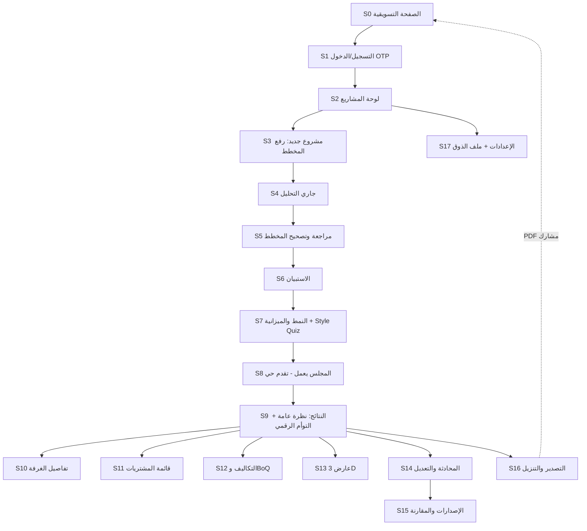
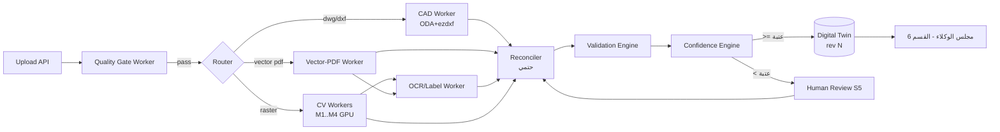

# Product Requirements Document (PRD) — Bayti AI

| | |
|---|---|
| **المنتج** | Bayti AI — منصة تحويل مخططات المنازل إلى تصاميم تنفيذية مُسعَّرة |
| **الإصدار** | v2.0 — يُبنى قسمًا بقسم باعتماد المؤسس |
| **المالك** | CTO |
| **الحالة** | 🟡 قيد الكتابة والمراجعة — القسم 4 جاهز للاعتماد |
| **آخر تحديث** | 2026-07-14 |

---

## فهرس الوثيقة (خطة الأقسام)

| # | القسم | الحالة |
|---|-------|--------|
| 1 | **الملخص التنفيذي ونظرة المنتج** + المبادئ الحاكمة الثمانية | ✅ **معتمد من المؤسس** |
| 2 | السوق والمستخدمون (تحليل السوق، TAM/SAM/SOM، Personas، JTBD، رحلة المستخدم، المنافسون، خطة التوسع) | ✅ **معتمد (بعد تعديلات المؤسس)** |
| 3 | رحلة المستخدم التفصيلية (شاشة بشاشة — UX) | ✅ **معتمد** |
| 4 | المواصفة الهندسية: رفع المخطط وتحليله وتحويله إلى Digital Twin | 🔍 **جاهز للمراجعة** |
| 5 | المتطلبات الوظيفية: الاستبيان واختيار النمط | ⬜ |
| 6 | المتطلبات الوظيفية: مجلس الوكلاء ومواصفات التصميم | ⬜ |
| 7 | المتطلبات الوظيفية: التسوق، النسخ الثلاث، والتكلفة | ⬜ |
| 8 | المتطلبات الوظيفية: المخرجات (صور، فيديو، 3D، PDF) | ⬜ |
| 9 | المتطلبات الوظيفية: التعديل بالمحادثة | ⬜ |
| 10 | الحسابات، الباقات، والتسعير | ⬜ |
| 11 | المتطلبات غير الوظيفية (أداء، أمان، لغة، امتثال) | ⬜ |
| 12 | خارج النطاق، معايير القبول، وبوابات الإطلاق | ⬜ |

> **منهجية العمل:** لا يُكتب قسم قبل اعتماد الذي يسبقه. كل اعتماد يُسجَّل في جدول الحالة أعلاه. لا برمجة قبل اعتماد الوثائق كاملة.

---

# القسم 1 — الملخص التنفيذي ونظرة المنتج

## 1.1 المشكلة

عائلة تستلم منزلها (فيلا من مطوّر، شقة تمليك، أو بيت أنهى مرحلة العظم) تواجه فجوة ضخمة بين **المخطط** وبين **منزل جاهز للسكن**:

1. **آلاف القرارات المتشابكة بلا خبرة:** أثاث، إنارة، كهرباء، تكييف، أرضيات، دهانات، مطبخ، حمامات، حديقة — كل قرار يؤثر على غيره، والعائلة تقرر بالتخمين.
2. **الخيار البشري مكلف وبطيء:** مصمم داخلي محترف يكلف 10,000–100,000+ ريال، يستغرق أسابيع لكل نسخة، وغالبًا يغطي "الديكور" فقط دون الكهرباء والتكييف والتكلفة التنفيذية.
3. **لا أحد يجيب على السؤال الحقيقي: "كم سيكلفني فعلًا؟"** — الميزانيات تنفجر لأن التقدير يتم بعد الالتزام، لا قبله.
4. **الفجوة بين التصميم والشراء:** حتى مع وجود تصميم، تتحول رحلة الشراء إلى أسابيع من البحث في المتاجر عن قطع "تشبه" الصورة — وغالبًا بمقاسات خاطئة.
5. **أدوات التصميم الحالية لا تحل المشكلة:** أدوات مثل Planner 5D وHomestyler تتطلب أن يبني المستخدم النموذج بنفسه يدويًا، وتنتج صورًا لا قوائم شراء حقيقية ولا تكاليف موثوقة، ولا تفهم السياق الخليجي (مجلس، ملحق، غرفة سائق).

**حجم الألم في سوقنا الأول:** برنامج سكني ورؤية 2030 يستهدفان تملّك 70% — مئات آلاف الوحدات الجديدة سنويًا في السعودية، كل واحدة تمر بهذه الفجوة، بمتوسط إنفاق تأثيث وتشطيب يتراوح بين 100 ألف وأكثر من 500 ألف ريال للفيلا.

## 1.2 الحل

**Bayti AI: مجلس من وكلاء ذكاء اصطناعي متخصصين يحوّل مخطط المنزل إلى مشروع تنفيذي كامل خلال دقائق.**

المستخدم يرفع مخططه (PDF/DWG/PNG/JPG)، يجيب عن أسئلة قصيرة (المدينة، الميزانية، تكوين الأسرة)، يختار نمطه المفضل — ثم يعمل لأجله 11 وكيلًا متخصصًا (معماري، مصمم داخلي، مهندس إنارة، كهرباء، تكييف، مطابخ، حمامات، حدائق، أثاث، تكاليف، تسوق) ليستلم:

1. **تصميمًا كاملًا لكل عنصر في المنزل** — بالنوع والمقاس واللون والخامة والكمية ومكان التركيب.
2. **قائمة تسوق حقيقية** من متاجر سعودية: اسم المنتج، صورته، سعره، رابط شرائه، مع بديل أرخص وبديل أفخم لكل قطعة.
3. **ثلاث نسخ كاملة:** اقتصادي / متوازن / فاخر.
4. **تكلفة مفصلة** لكل غرفة وكل قسم وإجمالي المشروع — مقارنة بميزانيته.
5. **مخرجات بصرية:** صور فوتوريالية مطابقة لغرفه الحقيقية، فيديو، نموذج 3D، وتقرير PDF شامل.
6. **تعديل فوري بالمحادثة:** "غيّر الكنبة"، "اجعل المجلس أفخم"، "قلّل الميزانية 20%" — والتصميم والتكلفة يتحدثان أمامه.

## 1.3 لماذا نحن ولماذا الآن (بإيجاز)

- **نضج تقني:** نماذج الرؤية واللغة أصبحت قادرة على فهم المخططات، والتوليد الصوري الموجَّه قادر على إنتاج صور تطابق هندسة الغرفة الفعلية.
- **فجوة سوقية:** لا يوجد لاعب — عالميًا — يربط السلسلة كاملة: مخطط → تصميم متعدد التخصصات → منتجات محلية حقيقية → تكلفة → تنفيذ.
- **أفضلية محلية قابلة للتصدير:** فهم السياق الخليجي (مجلس رجال/نساء، ملحق خارجي، غرفة خادمة/سائق) لا يملكه أي منتج عالمي، والبنية متعددة الدول تجعل كل سوق جديد "تكوينًا" لا إعادة بناء.

## 1.4 أهداف المنتج (Goals)

| # | الهدف | المقياس |
|---|-------|---------|
| G1 | إثبات الثقة: المستخدم يبني قرارات مالية حقيقية على مخرجاتنا | ≥ 25% من المشاريع المكتملة يتبعها ضغط روابط شراء أو تصدير PDF |
| G2 | تجربة "الوااو" خلال الجلسة الأولى | من الرفع إلى النتائج الكاملة ≤ 7 دقائق (P95) |
| G3 | دقة هندسية غير قابلة للتفاوض | ≥ 95% من القطع المقترحة تدخل مقاساتها فعليًا في أماكنها |
| G4 | تسعير موثوق | ≥ 80% من العناصر القابلة للشراء لها منتج متاح بسعر بعمر ≤ 72 ساعة |
| G5 | اقتصاد وحدة صحي | تكلفة AI للمشروع ≤ 30% من سعر الباقة |
| G6 | بناء أصول البيانات من اليوم الأول | كل تصحيح مخطط وكل قبول/استبدال منتج يُسجَّل كبيانات تدريب |

**North Star Metric:** عدد المشاريع التي تصل شهريًا إلى "قائمة تسوق مُسعَّرة كاملة".

**مقياس الجودة المقابل (Quality Counter-Metric):** نسبة المشاريع التي **يقبل المستخدم تصميمها فعليًا** — يصدّر التقرير أو يضغط رابط شراء منتج. الوصول إلى القائمة وحده لا يثبت أن التصميم مفيد؛ المقياسان يُقرآن معًا دائمًا، وارتفاع الأول مع انخفاض الثاني إنذار جودة فوري.

## 1.5 غير الأهداف (Non-Goals) — ما لا نفعله عمدًا

| ✗ | لماذا |
|---|-------|
| التصميم الإنشائي أو تعديل جدران حاملة | مسؤولية هندسية/قانونية خارج رسالتنا؛ نتكامل لاحقًا مع مكاتب هندسية |
| التراخيص والتقديم الحكومي | خارج الرحلة الأساسية؛ شراكات مستقبلية |
| تنفيذ الأعمال (مقاولات) في v1 | يحتاج كثافة طلب أولًا — Marketplace في v3 |
| بناء متجر إلكتروني خاص (مخزون/شحن) | نحن طبقة القرار فوق المتاجر، لسنا منافسًا لها |
| أداة CAD احترافية للمهندسين | جمهورنا الأساسي العائلة، ثم المصمم عبر وضع Pro لاحقًا |

## 1.6 الجمهور المستهدف (موجز — تفصيله في القسم 2)

- **أساسي:** مالك منزل جديد في السعودية (فيلا/شقة) مقبل على تأثيث وتشطيب كامل.
- **ثانوي:** المُجدِّد (غرف محددة)، والمصمم الداخلي المستقل (كأداة تسريع).
- **مستقبلي (B2B):** المطور العقاري، والمتاجر.

## 1.7 مقاييس نجاح المنتج (أول 12 شهرًا بعد الإطلاق)

| المقياس | الهدف |
|---------|-------|
| Activation: رفع مخطط → نتائج كاملة | ≥ 60% |
| تعديلات محادثة لكل مشروع (مؤشر انخراط) | 3–15 |
| تحويل Free → مدفوع | ≥ 8% |
| NPS | ≥ 50 |
| نسبة الروابط الصالحة في قوائم التسوق | ≥ 95% |
| مشاريع مكتملة شهريًا (نهاية السنة الأولى) | 1,000+ |

## 1.8 الافتراضات الحرجة (Assumptions نختبرها مبكرًا)

1. المستخدم السعودي **يثق** بتصميم من AI بما يكفي للشراء بناءً عليه — إذا شارك في تأكيد المخطط ورأى منتجات حقيقية بأسعار حقيقية.
2. يمكن الوصول لدقة تحليل مخططات ≥ 85% (بمساعدة تصحيح المستخدم) على المخططات السعودية الشائعة.
3. المتاجر الكبرى ستتعاون (feeds/affiliate) لأننا قناة مبيعات لهم وليس خصمًا.
4. تكلفة التوليد لكل مشروع يمكن ضبطها تحت سقف يحفظ هامشًا صحيًا.

> كل افتراض من هذه الأربعة له اختبار مبكر في خارطة الطريق؛ فشل أي منها يستدعي مراجعة استراتيجية لا ترقيعًا.

## 1.9 المبادئ الحاكمة الثمانية (Core Principles) — متطلبات أساسية معتمدة من المؤسس

> هذه المبادئ **دستور المنتج**: كل قسم قادم في هذه الوثيقة، وكل قرار معماري، وكل سطر كود — يُقاس عليها. أي ميزة تخالف مبدأً منها تُرفض.

### P1 — التنفيذ أولًا (Execution First)
كل قرار يتخذه الذكاء يجب أن يكون **قابلًا للتنفيذ في الواقع**، لا مجرد تصميم جميل: المنتج موجود ويُشترى فعلًا، المقاس يدخل من الباب ويُركَّب في مكانه، الخامة متوفرة في السوق المحلي، والسعر حقيقي.
**الأثر على النظام:** كل عنصر تصميمي يحمل حالة `executability` تُفحص آليًا (متوفر/قابل للتركيب/ضمن السوق المحلي)، وأي عنصر غير قابل للتنفيذ لا يظهر للمستخدم.

### P2 — كل قرار مُبرَّر (Justified Decisions)
لكل عنصر يعرضه النظام **سبب اختيار** واضح بلغة المستخدم. أمثلة: *"اخترنا هذه الإنارة لأن مساحة الغرفة 24م² تحتاج 4 نقاط إضاءة عامة"*، *"اخترنا هذا الباب لأنه مقاوم للرطوبة (حمّام)"*, *"اخترنا هذا الرخام لأنه ضمن ميزانيتك"*.
**الأثر على النظام:** حقل `justification_ar` إلزامي في مخرجات كل وكيل لكل عنصر — عنصر بلا مبرر يُرفض آليًا في مرحلة الدمج.

### P3 — القوانين الهندسية حاكمة (Engineering Rules Engine)
التصميم يخضع لمحرك قواعد هندسية صارم لا يسمح بتصميم غير عملي، يشمل كحد أدنى:
- مسافات الحركة (ممرات ≥ 75–90 سم حسب الاستخدام)
- خلوص فتح الأبواب كاملًا دون اصطدام
- خلوص فتح الأدراج والخزائن (أمام المطبخ والدواليب)
- خلوص فتح باب الثلاجة والأجهزة
- منطق أماكن الجلوس (مسافات المشاهدة، الحوار، الطاولات)
- توزيع الإضاءة (شدة كافية لكل وظيفة غرفة — Lux لكل استخدام)
- توزيع الكهرباء (أفياش كافية وفي الأماكن الصحيحة، بعيدة عن الماء)
- قواعد السلامة (زوايا آمنة مع الأطفال، مواد مقاومة للانزلاق في المناطق الرطبة، تهوية)
**الأثر على النظام:** هذه القواعد **كود حتمي** (لا اجتهاد LLM) تعمل كبوابة فحص إلزامية قبل إخراج أي تصميم — التصميم الذي يكسر قاعدة يُعاد للوكيل المختص لتصحيحه آليًا.

### P4 — كل منتج قابل للاستبدال (Swappable Products)
أي عنصر يمكن استبداله (ببديل أرخص/أفخم/مختلف) **دون إعادة تصميم المشروع** — يُعاد حساب التكلفة والتحقق الهندسي للعنصر ومحيطه فقط.
**الأثر على النظام:** فصل صارم بين "القرار التصميمي" (كنبة 3 مقاعد، 220سم، بيج، مكانها هنا) وبين "المنتج المطابق" (موديل معين من متجر معين) — الاستبدال يمس الطبقة الثانية فقط.

### P5 — النظام يتعلم من المستخدم (Personalization Memory)
تفضيلات المستخدم (ألوان، خامات، متاجر مفضلة، نطاق ميزانية، أنماط) تُستخلص من سلوكه (قبول/استبدال/رفض/تعديلات المحادثة) وتُخزَّن في **ملف ذوق شخصي** يُغذّي كل مشروع قادم — المشروع الثاني أدق من الأول.
**الأثر على النظام:** كيان `UserTasteProfile` يُبنى تراكميًا ويُمرَّر للوكلاء كسياق؛ مع شفافية كاملة (المستخدم يرى ويعدّل ملف ذوقه).

### P6 — التعديل بالمحادثة حق أساسي (Conversational Editing)
أي تعديل يكتبه المستخدم يُنفَّذ مباشرة: *"غيّر الكنبة"، "أضف مكتبة"، "اجعل المجلس أفخم"، "قلّل الميزانية 15%"، "استبدل الأرضية برخام"*. التعديل يشمل الإضافة والحذف والاستبدال وتغيير الخامات والميزانية — ويُحدَّث التصميم والتكلفة والمبررات فورًا.

### P7 — كل مشروع له إصدارات (Versioning)
كل تعديل ينشئ نسخة جديدة (Version 1, 2, 3...) مع إمكانية **الرجوع لأي إصدار سابق** والمقارنة بين إصدارين (ما الذي تغيّر؟ وكم فرق التكلفة؟). لا يُفقد عمل المستخدم أبدًا.

### P8 — المشروع مبني على توأم رقمي (Digital Twin)
النظام **لا يولّد صورًا** — بل يبني **نموذجًا رقميًا كاملًا للمنزل** (هندسة المخطط + كل عنصر بموقعه ومواصفاته وعلاقاته) هو مصدر الحقيقة الوحيد. الصور والفيديو والـ 3D والتقارير والتكلفة كلها **مشتقات** من هذا التوأم، وجميع التعديلات تتم عليه ثم تنعكس على كل المشتقات.
**الأثر على النظام:** أي ميزة تنتج مخرجًا بصريًا غير مشتق من التوأم الرقمي (صورة "جميلة" لا تطابق النموذج) مرفوضة من حيث المبدأ.

### P9 — نظام الثقة (Confidence System): النظام لا يخمّن
كل مرحلة في النظام تُخرج **نسبة ثقة رقمية** لكل ناتج (تحليل المخطط 98%، اكتشاف الأبواب 94%، الشبابيك 91%، الغرف 99%...). لكل مرحلة **حد أدنى معتمد**: إذا انخفضت الثقة عنه يتوقف التنفيذ الآلي وينتقل الناتج إلى المراجعة اليدوية — **النظام لا يخمّن أبدًا في قرار منخفض الثقة**.
**الأثر على النظام:** حقل `confidence` إلزامي في مخرجات كل مرحلة وكل عنصر؛ جداول عتبات معتمدة لكل مرحلة (تُعرَّف في أقسامها)؛ تجاوز العتبة شرط عبور آلي، ودونها بوابة مراجعة.

### P10 — طبقة التحقق البشري (Human Verification Layer)
أي خطوة منخفضة الثقة تُعرض على المستخدم للتعديل، **ثم يتابع المشروع من نفس النقطة** — لا إعادة من البداية أبدًا.
**الأثر على النظام:** خط المعالجة مبني على **checkpoints** قابلة للاستئناف؛ التصحيح البشري يُبطل فقط النتائج المشتقة من العنصر المصحح (invalidation انتقائي) ويعيد تشغيلها وحدها.

### P11 — قابلية التفسير الكاملة (Explainability)
كل قرار يتخذه أي وكيل قابل للتفسير: لماذا وُضعت الكنبة هنا؟ لماذا هذا الباب؟ لماذا هذا اللون؟ لماذا هذا النوع من الإنارة؟ كل قرار يحتوي إلزاميًا على:
1. **السبب** (بلغة المستخدم)
2. **القاعدة المستخدمة** (مرجع قاعدة هندسية/تصميمية مرقمة)
3. **التأثير على الميزانية**
4. **التأثير على الاستخدام** (الحركة، الراحة، السلامة)
**الأثر على النظام:** بنية `DecisionExplanation` إلزامية لكل عنصر (توسيع P2)؛ قرار بلا تفسير رباعي يُرفض في مرحلة الدمج.

### P12 — محرك القواعد قبل الذكاء (Rule Engine First)
أي شيء يمكن حسمه بقواعد هندسية ثابتة **لا يُترك للـ LLM**. الترتيب المعماري الملزم لكل خط معالجة:
```
Rule Engine  →  AI Agents  →  Validation Engine  →  Digital Twin  →  Rendering
```
القواعد تسبق الذكاء (تقيّد فضاء الحلول قبل التوليد)، والتحقق يلي الذكاء (يرفض ما كسر قاعدة)، والتوأم يُحدَّث فقط بما اجتاز التحقق، والرندر لا يقرأ إلا من التوأم.
**الأثر على النظام:** كل وكيل يستلم "قيود القواعد" كمدخل صريح؛ وأي منطق حتمي يُكتشف داخل prompt يُنقل إلى المحرك.

### P13 — لوحة صحة المشروع (Project Health)
كل مشروع يعرض لوحة صحة حية لكل مرحلة/قسم: ✅ سليم، ⚠ يحتاج مراجعة (مع السبب: "الإنارة: غرفتان دون العتبة"، "المشتريات: منتجان غير متوفرين")، ❌ فشل. اللوحة هي المدخل الدائم لطبقة التحقق البشري (P10).
**الأثر على النظام:** كيان `ProjectHealth` محسوب آليًا من حالات المراحل والثقة والتحقق، ويتحدث لحظيًا مع كل تغيير.

### P14 — سجل التدقيق (Audit Log)
كل تعديل يُسجَّل: **من** قام به (مستخدم/وكيل/نظام)، **متى**، **ما الذي تغيّر** (قبل/بعد)، **ولماذا** (أمر محادثة، تصحيح يدوي، قاعدة فرضت التغيير). السجل غير قابل للتعديل ويغذي شاشة الإصدارات (P7).

### P15 — ذاكرة المشروع المستقلة (AI Memory)
كل مشروع يملك ذاكرة مستقلة تتذكر: ألوان المستخدم، متاجره المفضلة، خاماته، ميزانيته، وكل تعديلاته السابقة — **ولا يُسأل المستخدم عن الشيء نفسه مرتين**. ذاكرة المشروع (خاصة بسياقه) تتكامل مع ملف الذوق العام (P5) دون أن تختلط به: ما قرره في هذا المشروع لا يُفرض على غيره إلا كاقتراح.
**الأثر على النظام:** كيان `ProjectMemory` يُمرَّر لكل وكيل في كل استدعاء؛ أي سؤال للمستخدم يمر بفحص "هل أجاب عنه سابقًا؟" قبل العرض.

---

# القسم 2 — السوق والمستخدمون

## 2.1 تحليل السوق السعودي

### المحركات الكلية (لماذا السعودية هي أفضل نقطة انطلاق في العالم لهذا المنتج)

1. **أكبر موجة بناء سكني في تاريخ المنطقة:** برنامج الإسكان (رؤية 2030) يستهدف رفع تملّك الأسر السعودية للمساكن إلى 70%. أكثر من **117 ألف أسرة** استفادت من منصة سكني في 2024 وحدها، و54 ألف أسرة في النصف الأول من 2025، والشركة الوطنية للإسكان (NHC) ملتزمة بـ **600 ألف وحدة بحلول 2030**. كل وحدة جديدة = مشروع تأثيث وتشطيب كامل — عميل مثالي لـ Bayti.
2. **سوق أثاث ومفروشات ضخم ونامٍ:** تقديرات سوق الأثاث السعودي لعام 2025 تتراوح بين **4.8 و9.3 مليار دولار** — التفاوت سببه اختلاف تعريف السوق بين المصادر (انظر جدول المصادر أدناه)، ولذلك نعتمد النطاق لا رقمًا قطعيًا. وهذا قبل إضافة التشطيبات (أرضيات، دهانات، إنارة، أدوات صحية) التي تزيد الإنفاق القابل للتأثير بشكل كبير.

### جدول مصادر أرقام السوق (تاريخ الوصول لجميع المصادر: 2026-07-14)

| المصدر | التقدير (2025) | تعريف السوق المشمول |
|--------|----------------|----------------------|
| [Nexdigm](https://www.nexdigm.com/market-research/report-store/ksa-home-furniture-market-research-report/) | 4.76 مليار دولار | الأثاث **المنزلي** فقط |
| [Expert Market Research](https://www.expertmarketresearch.com/reports/saudi-arabia-home-furniture-market) | ~6.60 مليار دولار | الأثاث المنزلي |
| [IMARC Group](https://www.imarcgroup.com/saudi-arabia-furniture-market) | 6.9 مليار دولار | الأثاث الكلي (منزلي + تجاري) |
| [Statista](https://www.statista.com/outlook/cmo/furniture/saudi-arabia) | 7.18 مليار دولار | الأثاث الكلي (منهجية Consumer Market Outlook) |
| [Mordor Intelligence](https://www.mordorintelligence.com/industry-reports/saudi-arabia-furniture-market) | 8.27 مليار دولار | الأثاث الكلي شاملًا الفندقي/المكتبي |
| [Research and Markets](https://www.researchandmarkets.com/reports/5012744/saudi-arabia-furniture-market-share-analysis) | 9.33 مليار دولار | الأثاث الكلي بأوسع تعريف |

### التمييز بين الأسواق الأربعة التي نلمسها (لا يجوز خلطها)

| السوق | طبيعته | علاقتنا به |
|-------|---------|-------------|
| **سوق الأثاث والمفروشات** (~4.8–9.3 مليار دولار/سنة) | بيع منتجات | **نؤثر فيه** (عمولة توجيه شراء) — لا نبيع مخزونًا |
| **سوق خدمات التصميم الداخلي** | أتعاب مصممين ومكاتب | **ننافس/نمكّن** — منتجنا بديل ذاتي وأداة Pro للمصممين |
| **سوق التشطيب والتنفيذ (Fit-out)** | مقاولات وتوريد | **نُسعّره ونوجهه** (BoQ) — لا ننفذه في v1 |
| **سوق برمجيات التصميم** (Planner 5D وأشباهه) | اشتراكات أدوات | **سوقنا المباشر للإيراد الاشتراكي** — الأصغر حجمًا لكنه مدخلنا للثلاثة الأخرى |

> إيراداتنا تأتي من سوق البرمجيات (اشتراكات) + هامش تأثير على سوق الأثاث (عمولات) — ولذلك نموذج TAM/SAM/SOM أدناه يقيس **إيرادات Bayti الممكنة**، لا مجموع أحجام هذه الأسواق.
3. **ديموغرافيا مثالية:** مجتمع شاب (غالبية تحت 35)، من الأعلى عالميًا في تبنّي التقنية والتجارة الإلكترونية والذكاء الاصطناعي، ويتخذ قرارات المنزل عائليًا عبر الجوال وواتساب — يطابق تمامًا نموذج "تقرير يُشارك ويُناقش".
4. **خصوصية ثقافية تصنع حاجزًا تنافسيًا:** المجلس (رجال/نساء)، الملحق الخارجي، غرف الخدم والسائق، الفصل بين المطبخ النظيف و"المطبخ التحضيري" — لا تفهمها أي أداة عالمية، ونحن نبنيها في قلب النظام.
5. **فجوة عرض الخدمة:** المصممون المحترفون متركزون في الرياض/جدة وبأسعار تبدأ من ~10 آلاف ريال، بينما شريحة الطلب الأكبر (وحدات سكني، 100–300 ألف ريال ميزانية تجهيز) غير مخدومة إطلاقًا — هذه فجوتنا.

### توقيت الدخول
ذروة تسليمات الوحدات 2026–2030 تعني أن **نافذة بناء العلامة كـ"الخيار الافتراضي" مفتوحة الآن** — من يبني الثقة والكتالوج المحلي أولًا يحصد الموجة.

## 2.2 حجم السوق (TAM / SAM / SOM)

> **منهجية:** نُسعّر سوقنا نحن (إيرادات Bayti الممكنة)، لا إنفاق الناس على الأثاث. مصادر دخلنا: باقات مدفوعة + عمولة تسوق + اشتراكات Pro + B2B لاحقًا. لكل رقم: معادلة، افتراضات، مصدر، مستوى ثقة، وثلاثة سيناريوهات. تُراجع الأرقام كل ربع سنة مقابل الفعلي.

### 2.2.1 الجدول الرئيسي: TAM / SAM / SOM بالسيناريوهات

| | **TAM** (عالمي) | **SAM** (السعودية + الخليج، أفق 5 سنوات) | **SOM** (السعودية، نهاية سنة 3) |
|---|---|---|---|
| **المعادلة** | GMV الأثاث العالمي × نسبة العمولة الممكنة + (وحدات جديدة/مجددة عالميًا × سعر باقة) | GMV أثاث الخليج × الحصة القابلة للتأثير رقميًا × العمولة + اشتراكات الشريحة الرقمية | نموذج من الأسفل للأعلى (2.2.2) عبر 3 فئات عملاء |
| **الافتراضات** | GMV عالمي ~700 مليار دولار؛ عمولة توجيه 2–3%؛ اختراق طويل الأمد لطبقة "القرار الرقمي" | GMV خليجي 10–14 مليار دولار (منزلي)؛ 35–45% مرتبط بسكن جديد/تجديد شامل؛ عمولة 2–3% | انظر جدول 2.2.2 — كل متغير مفصّل |
| **المصدر** | تقارير الأثاث العالمية (نطاقات عامة) — **رقم اتجاهي لا تشغيلي** | جدول مصادر 2.1 (تاريخ الوصول 2026-07-14) + استقراء للإمارات/الخليج | افتراضاتنا التشغيلية + بيانات سكني/NHC |
| **مستوى الثقة** | 🔴 منخفض (استدلالي — للسياق الاستثماري فقط) | 🟡 متوسط (مصادر متعددة لكن التعريفات متفاوتة) | 🟢 الأعلى (تحت سيطرتنا وقابل للقياس شهريًا) |
| **محافظ** | ~8 مليار دولار/سنة | ~200 مليون دولار/سنة | 8.5 مليون ريال/سنة |
| **أساسي** | ~15 مليار دولار/سنة | ~350 مليون دولار/سنة | 27 مليون ريال/سنة |
| **متفائل** | ~25 مليار دولار/سنة | ~550 مليون دولار/سنة | 55 مليون ريال/سنة |

### 2.2.2 بناء SOM من الأسفل إلى الأعلى (السيناريو الأساسي، نهاية سنة 3)

**الفئة أ — أصحاب المنازل (B2C):**

| المتغير | محافظ | أساسي | متفائل | أساس الافتراض |
|---------|-------|-------|--------|----------------|
| زوار مسجلون/سنة | 150k | 300k | 500k | تسويق + انتشار التقارير |
| يرفعون مخططًا ويكملون (Activation) | 45% | 60% | 70% | بوابة G2 |
| تحويل إلى مدفوع | 5% | 8% | 12% | معيار freemium أدوات |
| **مشاريع مدفوعة/سنة** | **3,400** | **14,400** | **42,000** | — |
| إيراد الباقة المتوسط | 250 ريال | 300 ريال | 350 ريال | تسعير القسم 10 |
| نسبة مشاريع تولّد شراء عبر روابطنا | 30% | 50% | 65% | مقياس الجودة المقابل |
| سلة متأثرة متوسطة × عمولة فعلية | 40k × 2% | 60k × 2.5% | 80k × 3% | اتفاقيات المتاجر |
| **إيراد الفئة أ** | **~1.7م + 0.8م = 2.5م ريال** | **~4.3م + 10.8م = 15.1م ريال** | **~14.7م + 32.8م = 47.5م ريال** | باقات + عمولات |

**الفئة ب — المصممون المستقلون وشركات التصميم الصغيرة (Pro):**

| المتغير | محافظ | أساسي | متفائل |
|---------|-------|-------|--------|
| مشتركو Pro (أفراد + مكاتب صغيرة) | 150 | 500 | 1,200 |
| متوسط الاشتراك/شهر | 400 ريال | 500 ريال | 600 ريال |
| معدل الاحتفاظ السنوي | 60% | 75% | 85% |
| **إيراد الفئة ب** | **~0.5م ريال** | **~2.6م ريال** | **~7.3م ريال** |

**الفئة ج — المطورون العقاريون (يبدأ تجاريًا نهاية سنة 2 — عمدًا محدود):**

| المتغير | محافظ | أساسي | متفائل |
|---------|-------|-------|--------|
| مطورون متعاقدون | 2 | 6 | 15 |
| متوسط العقد السنوي | 400k ريال | 800k ريال | 1.2م ريال |
| **إيراد الفئة ج** | **0.8م ريال** | **4.8م ريال** | **18م ريال** |

**الإجمالي (SOM سنة 3):** محافظ **≈ 3.8م ريال** · أساسي **≈ 22.5م ريال** · متفائل **≈ 72.8م ريال**
*(الأرقام المعروضة في الجدول الرئيسي 2.2.1 بعد تقريب وتحفظ على الفئة ج: 8.5 / 27 / 55 مليون ريال — الفارق في السيناريو المحافظ سببه افتراض نجاح جزئي للعمولات حتى مع ضعف التحويل.)*

**اقتصاد الوحدة المفترض (يُثبت قبل التوسع):**

| المتغير | الهدف |
|---------|-------|
| CAC (تكلفة اكتساب عميل مدفوع B2C) | ≤ 150 ريال (مزيج أداء + انتشار عضوي للتقارير) |
| LTV للعميل الفرد (مشروع + عمولات + عودة/إحالة) | ≥ 900 ريال |
| LTV/CAC | ≥ 3x شرط التوسع |
| معدل عودة/إحالة خلال 24 شهرًا | ≥ 25% (مشروع ثانٍ، غرفة جديدة، إحالة عائلية) |
| تكلفة توليد AI للمشروع الكامل (COGS) | ≤ 90 ريال أساسي / سقف 150 ريال |

### 2.2.3 اختبار الحساسية (على السيناريو الأساسي — إيراد سنة 3)

| الصدمة | الأثر على الإيراد | الأثر على الهامش | خطة الاستجابة |
|--------|--------------------|-------------------|----------------|
| التحويل المدفوع ينخفض 8% → 5% | 27م → **~18م ريال** (-33%) | محايد نسبيًا | تعزيز الباقة المجانية كمولّد عمولات؛ رفع قيمة النسخة المدفوعة (3D/PDF) |
| نسبة الشراء عبر الروابط تنخفض 50% → 30% | 27م → **~20.5م ريال** (-24%) | محايد | تحسين المطابقة؛ اتفاقيات خصم حصرية تدفع الشراء عبرنا |
| تكلفة التوليد ترتفع 90 → 180 ريال/مشروع | محايد على الإيراد | هامش المساهمة B2C ينخفض من ~70% إلى **~40%** | model routing أرخص؛ قوالب معادة الاستخدام؛ رفع سعر الباقة 50–100 ريال |
| الصدمتان الأوليان معًا | **~13–14م ريال** (-50%) | — | خطة النجاة: التركيز على Pro (إيراد متكرر) + مطوّرين اثنين إضافيين يعوضان الفجوة |

> **الخلاصة الإدارية:** أخطر متغيرين هما التحويل المدفوع ونسبة الشراء عبر الروابط — وكلاهما يقاس أسبوعيًا من الشهر الأول للإطلاق، مع مراجعة التسعير كل ربع.

### 2.2.4 ترتيب العملاء عند الإطلاق (قرار مؤسس معتمد)

| الأولوية | الفئة | التوقيت | ملاحظة حاكمة |
|----------|-------|---------|----------------|
| 1 | **صاحب المنزل الفردي** | من اليوم الأول | كل قرارات v1 تُبنى له |
| 2 | **المصمم الداخلي المستقل (Pro)** | بعد استقرار v1 (شهور 3–6 من الإطلاق) | نفس المنتج + طبقة إدارة عملاء — لا fork |
| 3 | **شركات التصميم الصغيرة** | مع نضج Pro (فرق صغيرة، فوترة موحدة) | امتداد لـ Pro لا منتج جديد |
| 4 | **المطور العقاري** | لاحقًا (نهاية سنة 2+) | ⚠️ **قاعدة صارمة: لا يُسمح لأي متطلب B2B مطورين بتعقيد النسخة الأولى** — تُبنى له واجهات لاحقة فوق نفس المحرك |

## 2.3 الشخصيات المستهدفة (Personas)

### Persona 1 — "أبو سعود" · مالك فيلا جديدة (الشخصية الأساسية — 60% من التركيز)
| | |
|---|---|
| العمر/الحالة | 32–45، متزوج، 2–4 أطفال، موظف حكومي/قطاع خاص |
| الموقف | استلم فيلا (سكني/مطوّر) أو أنهى العظم؛ معه المخطط PDF وميزانية 150–400 ألف ريال |
| هدفه | تجهيز كامل: أثاث + تشطيب + مطبخ + حوش، **ضمن الميزانية وبدون أخطاء مكلفة** |
| آلامه | لا يعرف من أين يبدأ؛ عروض المصممين غالية وبطيئة؛ يخاف من مقاسات خاطئة وميزانية تنفجر؛ زوجته وأمه شريكتا القرار وكل واحدة برأي |
| اقتباس | *"أبغى أحد يقول لي: هذا اللي تحتاجه بالضبط، وهذا سعره، ومن وين أشتريه"* |
| معيار نجاحه معنا | تقرير كامل يشاركه بالواتساب مع العائلة والمقاول، وقائمة شراء يمشي عليها |
| استعداده للدفع | 200–500 ريال للمشروع الكامل — يقارنها بعشرات الآلاف للمصمم |

### Persona 2 — "سارة" · شقة تمليك أول (25% من التركيز)
| | |
|---|---|
| العمر/الحالة | 26–35، موظفة/متزوجة حديثًا، شقة 120–180م² |
| الموقف | ميزانية 40–120 ألف ريال؛ ذوق واضح تكوّن من Pinterest وTikTok لكن لا خبرة تنفيذية |
| هدفها | بيت "يشبه الصور" لكن بمقاسات شقتها الفعلية وضمن ميزانيتها |
| آلامها | تشتري قطعًا تتضارب مع بعضها؛ المقاسات تخونها؛ تعرف "الشكل" ولا تعرف "التنفيذ" |
| اقتباس | *"عندي 100 صورة حفظتها… بس ما أعرف كيف أحولها لبيتي أنا"* |
| ميزة حاسمة لها | Style Quiz البصري + التعديل بالمحادثة + البدائل الأرخص |

### Persona 3 — "المهندسة نورة" · مصممة داخلية مستقلة (10% — بوابة قناة Pro)
| | |
|---|---|
| الموقف | تخدم 3–8 عملاء/شهر عبر إنستغرام؛ تستهلك 70% من وقتها في القياسات والبحث عن منتجات والتسعير |
| هدفها | مضاعفة عدد عملائها دون فريق |
| قيمتنا لها | Bayti ينجز المسودة الأولى والتسعير في دقائق، وهي تضيف لمستها — **من منافس محتمل إلى أقوى قناة توزيع** |
| استعدادها للدفع | اشتراك شهري احترافي (Pro) 300–800 ريال |

### Persona 4 — "شركة التطوير العقاري" (5% الآن — محرك الهامش في v3)
مطوّر لديه 500 وحدة من 4 نماذج مخططات: يريد بيعها "مؤثثة افتراضيًا" لرفع التحويل، وباقات تأثيث حقيقية عند التسليم. 4 عمليات توليد تخدم 500 عميل — أعلى هامش في المنصة. تُبنى له البنية الآن ويُفعَّل تجاريًا لاحقًا (وفق قاعدة 2.2.4: لا تعقيد للنسخة الأولى).

### المصفوفة السلوكية للـ Personas (متطلبات مؤسس معتمدة)

| البُعد | أبو سعود (فيلا) | سارة (شقة) | نورة (مصممة Pro) | المطور العقاري |
|--------|------------------|-------------|--------------------|-----------------|
| **المحفز لبدء المشروع** | استلام الفيلا/مفاتيح سكني؛ ضغط العائلة "متى نجهز؟" | عقد شقة أول + حماس التجهيز قبل الزواج/الانتقال | عميل جديد وقّع، وضيق الوقت | حملة بيع وحدات على الخارطة تحتاج تمايزًا |
| **الاعتراضات المتوقعة** | "AI يفهم بيوتنا؟ والمجلس؟"؛ "الأسعار صحيحة؟" | "بيطلع شكله عام مو أنا"؛ "ليش أدفع وفي Pinterest؟" | "بياخذ مكاني؟"؛ "جودته تليق باسمي أمام عميلي؟" | "أين استوديو الرندر الذي أعرفه؟"؛ مشتريات بطيئة |
| **مستوى الثقة المطلوب قبل الدفع** | مرتفع: يرى تحليل مخططه صحيحًا + أمثلة فلل سعودية + تجربة غرفة مجانية | متوسط: تجربة مجانية لغرفتها + صور تشبه ذوقها | مرتفع جدًا: يجرب على مشروع حقيقي له قبل الاشتراك | صفقة مؤسسية: pilot مدفوع مصغّر |
| **الجهاز الأساسي** | جوال (آيفون) + مشاركة واتساب؛ يفتح التقرير على الابتوب أحيانًا | جوال بالكامل | لابتوب (عمل) + جوال (تواصل عملاء) | ديسكتوب + عروض داخلية |
| **طريقة الدفع المفضلة** | مدى / Apple Pay | Apple Pay / STC Pay / تقسيط (تمارا وأشباهها) | بطاقة ائتمانية باشتراك شهري | فاتورة وتحويل بنكي (آجل 30 يوم) |
| **نقطة الانسحاب المحتملة** | شاشة التصحيح إن بدت "شغلة مهندسين"؛ أو أول سعر خاطئ يكتشفه | طول الاستبيان؛ نتيجة أول غرفة لا تشبه ذوقها | أول مخرج ضعيف أمام عميل | غياب SLA أو تكامل مع أنظمة مبيعاته |
| **الميزة التي تُرجعه للمنصة** | تحديث الأسعار الحي + مشروع الملحق/الحوش القادم + تقرير يفتخر به | ملف الذوق (المشروع الثاني أدق) + التعديل بالمحادثة | توفير 70% من وقته لكل عميل جديد | لوحة قياس أثر التأثيث الافتراضي على مبيعاته |

## 2.4 المهام المطلوب إنجازها (Jobs To Be Done)

| # | عندما... (السياق) | أريد أن... (المهمة) | حتى... (النتيجة) |
|---|---|---|---|
| J1 | أستلم منزلًا جديدًا ومعي مخططه | أعرف بالضبط ماذا أحتاج لكل غرفة وبكم | أبدأ التنفيذ بثقة ودون استشارات مكلفة |
| J2 | أملك ميزانية محددة | أتأكد أن التجهيز الكامل يدخل فيها قبل أن ألتزم | لا أتفاجأ في منتصف الطريق |
| J3 | أرى تصميمًا أعجبني | أعرف أين أشتري كل قطعة فيه بمقاس يناسب غرفتي | لا أضيع أسابيع بحثًا عن "شيء يشبهه" |
| J4 | أختلف مع عائلتي على قرار | أعرض بدائل جاهزة بمستوياتها وأسعارها | نحسم القرار بمعلومات لا بجدال |
| J5 | يتغير ذوقي أو ميزانيتي أثناء المشروع | أعدّل بجملة واحدة وأرى الأثر فورًا | لا أعيد المشروع من الصفر |
| J6 | أسلّم القوائم للمقاول/المنفذ | أعطيه مستندًا دقيقًا بالمواصفات والكميات | ينفذ ما قررته أنا، لا ما يرتجله هو |

## 2.5 رحلة المستخدم الكاملة (User Journey)

> هذه الرحلة على مستوى التجربة والمشاعر؛ التفصيل شاشة-بشاشة في القسم 3.

| المرحلة | ما يفعله المستخدم | ما يفعله النظام | الشعور المستهدف |
|---------|-------------------|------------------|------------------|
| **1. الاكتشاف** | يصل عبر إعلان/توصية/تقرير مشارك | صفحة تعرض "قبل/بعد" حقيقي بمثال مخطط سعودي | *"هذا اللي كنت أدور عليه"* |
| **2. الرفع** | يرفع المخطط (PDF/DWG/صورة) | معاينة فورية + بدء التحليل مع مؤشر تقدم | سهولة — "أقل من دقيقة" |
| **3. التأكيد** | يراجع الغرف المكتشفة، يصحح اسمًا أو حدًا، يجيب سؤال المقياس | مخطط تفاعلي ملوّن بأسماء الغرف والمساحات | ثقة — *"النظام فهم بيتي فعلًا"* |
| **4. التعريف** | يجيب 7 أسئلة (مدينة/ميزانية/أسرة/أطفال/كبار سن/حيوانات) | أسئلة ذكية إضافية حسب المخطط (مسبح؟ ملحق؟) | اهتمام شخصي — "يسأل الأسئلة الصح" |
| **5. الذوق** | يختار النمط (أو Style Quiz بصري: أعجبني/لا) | 8 أنماط بصور مرجعية + استثناءات لغرف محددة | متعة — أشبه بلعبة |
| **6. المجلس** | يشاهد شاشة المجلس الحية | 11 وكيلًا يعملون بالتوازي مع ملخص عربي لكل منجز | انبهار — *لحظة الـ TikTok* |
| **7. النتيجة** | يتصفح غرفه: تصاميم، مواصفات، مبررات، صور | التوأم الرقمي كاملًا: 3 نسخ، تكلفة حية مقابل الميزانية | **الوااو + الثقة** (كل قرار مُبرَّر) |
| **8. الضبط** | يعدّل بالمحادثة: "غيّر الكنبة"، "قلّل الميزانية 15%" | تنفيذ فوري + إصدار جديد + فرق التكلفة | تحكم — "البيت بيتي والقرار قراري" |
| **9. الحسم** | يشارك التقرير مع العائلة، يقارن الإصدارات | PDF بهوية جميلة + روابط شراء حية | فخر — *"شوفوا وش سويت"* |
| **10. التنفيذ** | يشتري بالروابط، يسلّم الـ BoQ للمقاول | تتبع الروابط، تحديث الأسعار، ملف الذوق يتحدث | إنجاز — ويعود للمشروع القادم |

**لحظات الحقيقة الثلاث (Moments of Truth):** (م3) هل فهم النظام مخططي؟ — (م7) هل النتيجة تستحق الدفع؟ — (م10) هل الروابط والأسعار صادقة؟ فشل أي منها يقتل الثقة؛ ولذلك ربطنا بها بوابات إطلاق صريحة (القسم 12).

## 2.6 المنافسون ونقاط ضعفهم

### المنافسون العالميون

| المنافس | ما يقدمه | نقاط ضعفه أمامنا |
|---------|-----------|-------------------|
| **Planner 5D / Homestyler / Coohom** | محررات 2D/3D منزلية بمكتبات أثاث عامة | المستخدم يبني النموذج **يدويًا** (ساعات)؛ كتالوج عام لا يُشترى محليًا؛ لا تكلفة حقيقية؛ لا عربي/سياق خليجي؛ لا كهرباء/تكييف |
| **Foyr Neo** | أداة رندر سريعة للمصممين المحترفين | B2B للمصممين فقط؛ منحنى تعلم؛ لا يخدم العائلة النهائية؛ لا تسوق محلي |
| **RoomGPT / Interior AI وأشباهها** | إعادة تصميم صورة غرفة واحدة بالـ AI | صور "إلهام" لا تصميم: لا مقاسات، لا منتجات، لا تكلفة، لا مخطط — **جميل وغير قابل للتنفيذ** (عكس مبدئنا P1) |
| **Houzz / Decorilla / Havenly** | ربط بمصممين بشر + متجر (أمريكا أساسًا) | نموذج بشري: أيام وتكلفة أعلى؛ لا يعمل في السعودية؛ الشراء من متاجر أمريكية |
| **IKEA Kreativ وأدوات المتاجر** | تصميم داخل كتالوج المتجر الواحد | محبوس في متجر واحد وأصنافه؛ لا حيادية؛ لا يغطي التشطيب/الكهرباء/التكييف |

### المنافسون المحليون (فئات)

| الفئة | نقاط ضعفها |
|-------|-------------|
| **مكاتب التصميم الداخلي** | 10–100+ ألف ريال؛ أسابيع لكل نسخة؛ تتركز في "الديكور" وتترك التسعير الحقيقي والشراء للعميل |
| **المصممون المستقلون (إنستغرام)** | جودة متفاوتة؛ لا التزام زمني؛ نادرًا ما يقدمون BoQ وتكلفة بندية — **وهم شريحة سنحوّلها لعملاء Pro** |
| **المقاول "يصمم لك"** | تضارب مصالح (يبيع ما يربحه)؛ ذوق محدود؛ لا بدائل ولا شفافية تكلفة |
| **قرار العائلة الذاتي (المنافس الأكبر فعليًا: "بدون حل")** | أخطاء مقاسات وتضارب أسلوب وميزانية تنفجر — وهو بالضبط الألم الذي نحل |

### مصفوفة المقارنة الموحدة (بتاريخ البحث: 2026-07-14)

> ✅ متوفر · 🟡 جزئي/بقيود · ❌ غير متوفر — بناءً على مراجعة المواقع والوثائق العامة لكل منافس بتاريخ البحث؛ تُحدَّث المصفوفة كل ربع سنة.

| القدرة | Planner 5D / Homestyler / Coohom | Foyr Neo | RoomGPT / Interior AI | Houzz / Decorilla | أدوات المتاجر (IKEA Kreativ) | مكاتب التصميم المحلية | **Bayti AI (المستهدف)** |
|--------|-----------------------------------|----------|------------------------|--------------------|------------------------------|------------------------|--------------------------|
| تحليل مخطط حقيقي (PDF/DWG/صورة) تلقائيًا | 🟡 استيراد كخلفية للرسم اليدوي | 🟡 مشابه | ❌ | ❌ (يدوي بشري) | ❌ (مسح غرفة لا مخطط) | ✅ بشريًا | ✅ آلي + تأكيد المستخدم |
| Digital Twin (نموذج رقمي مصدر حقيقة واحد) | 🟡 نموذج ثابت يبنيه المستخدم | 🟡 | ❌ صور فقط | ❌ | 🟡 داخل نطاق المتجر | ❌ ملفات متفرقة | ✅ P8 |
| دقة مقاسات ملزمة (لا عنصر لا يدخل مكانه) | 🟡 بجهد المستخدم | 🟡 | ❌ | ✅ بشريًا | 🟡 | ✅ بشريًا | ✅ محرك قواعد آلي |
| تصميم كامل للمنزل (داخلي + خارجي) | 🟡 حسب جهد المستخدم | 🟡 | ❌ غرفة/صورة | 🟡 حسب العقد | ❌ | 🟡 غالبًا ديكور فقط | ✅ 11 تخصصًا |
| إنارة + كهرباء + تكييف + أبواب/شبابيك + مطبخ + حمامات | ❌ | ❌ | ❌ | 🟡 نادرًا | ❌ | 🟡 بمقابل إضافي | ✅ ضمن الرحلة الواحدة |
| محرك قواعد هندسية (حركة/خلوص/سلامة) | ❌ | ❌ | ❌ | 🟡 خبرة المصمم | ❌ | 🟡 خبرة | ✅ P3 حتمي |
| ثلاث مستويات ميزانية جاهزة | ❌ | ❌ | ❌ | 🟡 بالتفاوض | ❌ | 🟡 نادرًا | ✅ |
| منتجات سعودية حقيقية بروابط شراء وبدائل | ❌ | ❌ | ❌ | ❌ (أمريكا) | 🟡 متجر واحد | 🟡 عروض أسعار يدوية | ✅ متعدد المتاجر |
| عربي كامل + RTL | 🟡 ترجمات جزئية | ❌ | ❌ | ❌ | 🟡 | ✅ | ✅ أصلي |
| تعديل بالمحادثة ينفَّذ فورًا | ❌ | ❌ | 🟡 إعادة توليد صورة | ❌ (إيميلات وأيام) | ❌ | ❌ | ✅ P6 |
| Versioning ورجوع لأي نسخة | 🟡 حفظ يدوي | 🟡 | ❌ | ❌ | ❌ | ❌ | ✅ P7 |
| قابلية تنفيذ (كل عنصر يُشترى ويُركَّب فعلًا) | ❌ | ❌ | ❌ | ✅ بشريًا وببطء | 🟡 | ✅ بشريًا | ✅ P1 مفحوصة آليًا |

**الخلاصة بصياغة دقيقة:** كل قدرة من هذه القدرات موجودة منفردة أو جزئيًا عند طرف ما — لكن **لم نجد، حتى تاريخ البحث (2026-07-14)، منصة تجمع هذه القدرات كلها في تجربة واحدة موجهة للسوق السعودي**. تمايزنا هو التركيبة والسياق المحلي، لا اختراع كل قدرة من الصفر — وهذه المصفوفة تُراجع ربع سنويًا لرصد أي متغير تنافسي.

### لماذا سيفضّل المستخدم Bayti AI (خلاصة التمايز)

1. **يبدأ من مخططك الحقيقي** — لا بناء يدوي كأدوات المحررات، ولا صور عامة كأدوات إعادة التصميم.
2. **يغطي المنزل كله في رحلة واحدة** — من الأثاث إلى الكهرباء والتكييف والحديقة، بمجلس متخصصين.
3. **ينتهي بقائمة شراء سعودية حقيقية** بأسعار وروابط وبدائل — تصميم يُنفَّذ لا يُشاهَد.
4. **صدق هندسي مضمون بمحرك قواعد** (P3) — كل قطعة تدخل مكانها فعلًا.
5. **كل قرار مُبرَّر** (P2) — ثقة تُبنى بالمنطق لا بالصور.
6. **ثلاث نسخ وتكلفة مقابل ميزانيتك** — يجيب السؤال الذي يتجنبه الجميع: "بكم؟"
7. **سرعة وتحكم:** دقائق للنتيجة، وجملة واحدة لأي تعديل، وذاكرة تتعلم ذوقك.
8. **يفهم بيتك الخليجي:** مجلس، ملحق، غرفة خادمة — من قلب النظام لا كترجمة شكلية.

## 2.7 خطة التوسع: السعودية ← الخليج ← العالم

### الترتيب المبدئي (خريطة لا قيد)

1. **السعودية** — بناء النموذج المرجعي (الرياض ثم جدة/الدمام).
2. **الإمارات** — أكبر سوق ثانٍ، متاجر متداخلة (IKEA/Home Centre/West Elm تعمل في البلدين → جهد كتالوج أقل)، وتتطلب الإنجليزية كاملة.
3. **الكويت وقطر** — بعد إثبات ملاءمة نموذج "التكوين لكل سوق" في الإمارات.
4. **البحرين وعُمان** — استكمال الخليج.
5. **الأسواق العالمية** — المرشحون الأوائل: مصر وتركيا (روابط ثقافية وحجم)، ثم جنوب شرق آسيا؛ وB2B (مطورون/متاجر) كقناة دخول أسرع من B2C في الأسواق الجديدة.

> هذا الترتيب **مبدئي وقابل لإعادة الترتيب**: القرار الفعلي لدخول أي سوق تحكمه بوابة المعايير الرقمية أدناه، لا الترتيب الجامد. إن أظهر سوقٌ لاحق جاهزية أعلى (شريك مطّور كبير في قطر مثلًا)، يُقدَّم.

### بوابة دخول السوق الجديد (Market Entry Gate — كل المعايير إلزامية)

| # | المعيار | العتبة الرقمية |
|---|---------|-----------------|
| 1 | اقتصاد وحدة إيجابي في السوق الحالي | LTV/CAC ≥ 3x لربعين متتاليين + هامش مساهمة موجب |
| 2 | دقة المنتجات والأسعار في السوق الحالي | ≥ 95% روابط صالحة، أسعار بعمر ≤ 72 ساعة |
| 3 | معدل إكمال المشاريع | Activation ≥ 60% + وصول لقائمة مُسعَّرة ≥ 80% من المدفوعة |
| 4 | رضا المستخدمين | NPS ≥ 50 + مقياس الجودة المقابل ≥ 40% |
| 5 | جاهزية السوق المستهدف: شركاء ومتاجر | ≥ 3 متاجر رئيسية بتغطية ≥ 70% من فئات العناصر (feeds أو اتفاقيات موقعة قبل الإطلاق) |
| 6 | جاهزية السوق المستهدف: قواعد البناء والخامات | Cost database محلي مُتحقق ميدانيًا + معايرة أنواع الغرف/الأنماط/الخامات المحلية + قواعد P3 مُراجعة لكود البناء المحلي |

### ما يتطلبه كل سوق جديد (بحكم البنية multi-country الجاهزة)
كتالوج متاجر محلي + أسعار سوق مرجعية + عملة + طبقة تكوين ثقافية (أنواع غرف، أنماط، خصوصية) — **تكوين وتشغيل، لا إعادة بناء**. درسنا السعودي (المجلس، الملحق) هو منهج الدخول المتكرر لأي سوق.

> **القاعدة الذهبية:** التوسع يُموَّل من النجاح لا من الأمل — لا سوق جديد قبل أن يجتاز السابق البوابة كاملة.

---

# القسم 3 — رحلة المستخدم التفصيلية (شاشة بشاشة)

## 3.1 خريطة الشاشات الكاملة



**التدفق الحرج (Critical Path):** S3 → S5 → S7 → S8 → S9 → S11 — أي احتكاك فيه يقاس ويحسَّن أسبوعيًا.

## 3.2 معايير عامة تسري على كل الشاشات

### الجوال وRTL (الجمهور الأساسي جوال — Persona 1 و2)
- تصميم **Mobile-first**: كل شاشة تُصمَّم للجوال أولًا ثم تتوسع للديسكتوب؛ عناصر اللمس ≥ 44px.
- RTL أصلي: كل التخطيطات بخصائص منطقية (start/end لا left/right)؛ الأرقام بالصيغة العربية الغربية (1,234.56)؛ العملة "ريال" بعد الرقم؛ التواريخ ميلادية بصيغة محلية.
- المخطط التفاعلي وعارض 3D يدعمان إيماءات اللمس (قرص للتقريب، سحب للتحريك).
- مشاركة أي شيء (تقرير/صورة/غرفة) عبر Share Sheet الأصلي (واتساب أولًا).

### حالات التحميل والفشل (نمط موحد)
- **تحميل قصير (< 2 ث):** skeleton screens — لا spinners فارغة.
- **تحميل طويل (تحليل/مجلس/رندر):** شاشة تقدم ذات مراحل مسماة + تقدير زمني + إمكانية المغادرة والعودة (يُكمل في الخلفية ويُشعر عند الانتهاء).
- **فشل قابل للإعادة:** رسالة عربية واضحة بسبب الفشل + زر "أعد المحاولة" + الحالة محفوظة (لا يفقد المستخدم خطوة أبدًا).
- **فشل يحتاج تدخلًا:** توجيه محدد قابل للتنفيذ ("الصورة منخفضة الدقة — صوّر المخطط بإضاءة أفضل أو ارفع ملف PDF الأصلي").
- كل شاشة لها حالة **فارغة** مصممة (لا صفحات بيضاء).

## 3.3 مواصفات الشاشات

### S0 — الصفحة التسويقية
- **الهدف:** تحويل الزائر إلى "رفع أول مخطط" خلال دقيقة.
- **العناصر:** عرض قبل/بعد لمخطط فيلا سعودية حقيقية؛ شريط الرحلة (ارفع → أكّد → استلم)؛ أمثلة النسخ الثلاث بأسعارها؛ CTA واحد: "ابدأ بمخططك مجانًا".
- **معايير القبول:** ① زمن تحميل LCP < 2.5s على 4G ② CTA يعمل قبل التسجيل (الرفع أولًا، الحساب عند الحفظ) ③ عربي/إنجليزي بتبديل فوري.

### S1 — التسجيل/الدخول (OTP)
- **العناصر:** رقم الجوال → رمز SMS؛ بريد إلكتروني اختياري لاحقًا؛ الموافقات (خصوصية، واستخدام البيانات للتدريب opt-in منفصل).
- **الحالات:** رمز لا يصل (إعادة إرسال بعد 30 ث + بديل مكالمة)؛ رقم غير سعودي (يُقبل مع تنبيه أن الأسعار سعودية).
- **معايير القبول:** ① الرحلة كاملة ≤ 30 ثانية ② لا يُطلب أي حقل غير ضروري ③ استئناف الجلسة يعيد المستخدم لآخر خطوة كان فيها.

### S2 — لوحة المشاريع
- **العناصر:** بطاقات المشاريع (اسم، صورة مصغرة للمخطط، الحالة، آخر تحديث، الإصدار الحالي)؛ زر "مشروع جديد" بارز؛ مؤشر حصة الباقة المتبقية.
- **الحالة الفارغة:** بطاقة تجريبية بمشروع مثال جاهز للاستكشاف (فيلا نموذجية) — يجرب قبل أن يرفع.
- **معايير القبول:** ① مشروع قيد المعالجة يعرض تقدمًا حيًا دون دخول ② حذف مشروع يتطلب تأكيدًا مزدوجًا ويوضح أنه نهائي.

### S3 — مشروع جديد: رفع المخطط
- **العناصر:** منطقة سحب/إفلات + كاميرا الجوال + اختيار ملف؛ الصيغ المدعومة ظاهرة (PDF/DWG/DXF/PNG/JPG ≤ 50MB)؛ دعم تعدد الطوابق (إضافة ملف لكل طابق)؛ معاينة فورية مع تدوير/قص.
- **حالات الفشل (إلزامية التصميم):**
  - صيغة غير مدعومة → رسالة بالصيغ المقبولة.
  - ملف تالف/محمي بكلمة مرور → طلب نسخة غير محمية.
  - **صورة غير واضحة (كشف مبكر قبل التحليل الكامل):** فحص جودة فوري (دقة/تباين/انحراف زاوية) → "المخطط غير واضح — جرّب: تصوير عمودي من الأعلى، إضاءة أقوى، أو ملف PDF الأصلي من المطور" + أمثلة صورة جيدة/سيئة.
  - PDF متعدد الصفحات → شاشة اختيار الصفحات التي تمثل مخططات.
- **معايير القبول:** ① رفع ناجح ≤ 10 ث لملف 10MB على 4G ② رسالة الفشل تشرح "ماذا أفعل" لا "ماذا حدث" فقط ③ فحص الجودة المبكر يرفض قبل إهدار وقت المستخدم في تحليل سيفشل.

### S4 — جاري التحليل
- **العناصر:** مراحل مسماة تتقدم فعليًا ("قراءة الملف → كشف الجدران → تحديد الغرف → قراءة الأبعاد")؛ تقدير زمني؛ زر "أشعرني عند الانتهاء" (يغادر بأمان).
- **حالات الفشل:** فشل جزئي (طابق من اثنين) → يكمل الناجح ويطلب إعادة رفع الفاشل؛ فشل كامل → تحويل لمسار S3 مع التوجيه.
- **معايير القبول:** ① P95 ≤ 90 ث ② لا شاشة تجمد أبدًا: أي انتظار > 10 ث يظهر تقدمًا حقيقيًا ③ مغادرة الصفحة لا تفقد شيئًا.

### S5 — مراجعة وتصحيح المخطط (أهم شاشة ثقة في المنتج)
- **العناصر:** المخطط الأصلي وفوقه طبقة SVG ملونة (كل غرفة بلون + اسمها + مساحتها)؛ قائمة جانبية بالغرف المكتشفة مع confidence؛ عناصر منخفضة الثقة مميزة بصريًا للمراجعة.
- **أدوات التصحيح اليدوي:** إعادة تسمية غرفة (من قائمة أنواع خليجية + حر)؛ دمج/تقسيم غرف؛ تعديل حدود (سحب رؤوس المضلع)؛ إضافة/حذف باب أو نافذة (نقر على الجدار)؛ تصحيح المساحة رقميًا.
- **سؤال المقياس (عند غيابه):** "ما طول هذا الجدار؟" مع تظليل الجدار المسؤول عنه — سؤال واحد فقط.
- **معايير القبول:** ① متوسط زمن الشاشة ≤ 90 ث (إن زاد فالتحليل ضعيف — يقاس كمؤشر جودة) ② كل تصحيح يُخزَّن كبيانات تدريب ③ زر "يبدو صحيحًا — تابع" بارز دائمًا ④ على الجوال: التصحيح باللمس مريح فعليًا (يُختبر مع مستخدمين حقيقيين كشرط إطلاق).

### S6 — الاستبيان
- **العناصر:** 7 أسئلة أساسية بخطوة لكل سؤال (مدينة، ميزانية بشريط + إدخال يدوي، أفراد الأسرة، أطفال + أعمار، كبار سن، حيوانات، أولويات الإنفاق)؛ + حتى سؤالين ديناميكيين حسب المخطط (مسبح → أمان أطفال؛ ملحق → تأثيثه؟).
- **معايير القبول:** ① إكمال الاستبيان ≤ 60 ث ② كل سؤال يوضح "لماذا نسأل" بسطر واحد ③ يمكن التخطي (بقيم افتراضية معلنة) عدا المدينة والميزانية.

### S7 — النمط والميزانية
- **العناصر:** الأنماط الثمانية ببطاقات بصرية (4–6 صور لكل نمط)؛ **Style Quiz** اختياري (10 صور أعجبني/لا → يرشّح نمطًا مع نسبة ثقة)؛ استثناءات لغرف محددة (المجلس New Classic والباقي Modern)؛ ملخص الميزانية مقابل توزيع مبدئي تقديري بالأقسام.
- **معايير القبول:** ① اختيار نمط ≤ 45 ث بدون Quiz ② الـ Quiz كاملًا ≤ 90 ث ③ عند تعارض (ميزانية 80k + نمط Luxury لفيلا 400م²) يظهر تنبيه صادق مبكر: "هذا النمط بهذه الميزانية سيكون تحديًا — سنريك أفضل الممكن + نسخة أعلى للمقارنة".

### S8 — المجلس يعمل (شاشة التقدم الحية)
- **العناصر:** 11 بطاقة وكيل (صورة رمزية + تخصص)؛ حالة كل وكيل (ينتظر/يعمل/أنجز)؛ عند الإنجاز يظهر ملخص عربي بجملة ("مهندس الإنارة: صممت 46 نقطة إضاءة على 3 طبقات")؛ تقدير زمني إجمالي.
- **الحالات:** فشل وكيل → "يعيد المحاولة" ثم عند الفشل النهائي يستمر الباقون ويُعلَّم قسمه "قيد المراجعة" (لا يفشل المشروع كاملًا)؛ مغادرة آمنة مع إشعار عند الاكتمال.
- **معايير القبول:** ① P95 للجولة الكاملة ≤ 5 دقائق ② الشاشة مشوّقة فعلًا (تُختبر: هل يشاركها الناس؟) ③ لا يظهر مصطلح تقني إنجليزي واحد للمستخدم.

### S9 — النتائج: نظرة عامة + التوأم الرقمي (قلب المنتج)
- **العناصر:**
  - **مبدّل النسخ الثلاث** (اقتصادي/متوازن/فاخر) ثابت أعلى الشاشة مع السعر الإجمالي لكل نسخة مقابل الميزانية (شريط ملون: ضمن/فوق).
  - المخطط التفاعلي (التوأم الرقمي 2D): كل غرفة تفتح تفاصيلها، وكل عنصر عليه نقطة قابلة للنقر.
  - ملخص "ملاحظات كبير المصممين" (3–5 أسطر عربية عن روح التصميم وقراراته الكبرى).
  - بطاقات الغرف (صورة فوتوريالية مصغرة + التكلفة + عدد العناصر).
  - أزرار عائمة: محادثة التعديل، 3D، تصدير.
- **معايير القبول:** ① التبديل بين النسخ ≤ 1 ث (البيانات الثلاث محملة مسبقًا) ② كل رقم تكلفة يطابق مجموع بنوده حسابيًا 100% ③ أول انطباع (فوق الطية على الجوال) يعرض: صورة + سعر إجمالي + زر استكشاف.

### S10 — تفاصيل الغرفة
- **العناصر:** صور الغرفة الفوتوريالية (2+ زاوية)؛ مخطط الغرفة مع مواقع كل عنصر؛ قائمة العناصر مجمعة (أثاث/إنارة/كهرباء/تشطيب) — لكل عنصر: النوع، المقاس، اللون، الخامة، الكمية، مكان التركيب، **والمبرر (P2)** بجملة عربية؛ المنتج المطابق + بديلاه (أرخص/أفخم) مع الصور والأسعار.
- **استبدال منتج (P4):** زر "استبدل" يفتح: البديلين الجاهزين + "أرني خيارات أخرى" (قائمة مرشحة بفلاتر سعر/متجر/لون) → الاختيار يُحدّث التكلفة فورًا ويُسجَّل في ملف الذوق؛ إن كان البديل بمقاس مختلف يمر بفحص P3 قبل التأكيد ("هذا الخيار أعرض 15سم — سيضيق الممر إلى 70سم. متابعة؟").
- **معايير القبول:** ① كل عنصر بلا استثناء يعرض مبررًا ② الاستبدال يكتمل ≤ 5 ث مع تحديث التكلفة في نفس الشاشة ③ فحص المقاس يمنع الاستبدال الكاسر لقاعدة هندسية إلا بتأكيد صريح.

### S11 — قائمة المشتريات
- **العناصر:** كل المنتجات مجمعة بالغرفة أو بالمتجر (تبديل عرض)؛ لكل منتج: صورة، اسم، متجر، سعر + تاريخه، كمية، رابط شراء مباشر؛ حالة كل بند (مقترح/مؤكد من المستخدم/تم شراؤه — checklist تنفيذي)؛ إجمالي متحرك؛ تصدير Excel.
- **الحالات:** منتج نفد → شارة "غير متوفر حاليًا" + بديل مقترح تلقائيًا؛ سعر تغيّر منذ التوليد → شارة "السعر تحدّث" بالقيمتين.
- **معايير القبول:** ① كل رابط يفتح صفحة المنتج الصحيحة في المتجر (يُفحص آليًا يوميًا) ② وضع Checklist يجعل القائمة أداة تنفيذ فعلية تُستخدم لأسابيع ③ عمر كل سعر ظاهر بشفافية.

### S12 — التكاليف وBoQ
- **العناصر:** إجمالي مقابل الميزانية (رسم واضح)؛ تفكيك بالغرفة وبالقسم (أثاث/إنارة/كهرباء/تشطيب/...)؛ مقارنة النسخ الثلاث جنبًا إلى جنب؛ بنود السوق المرجعية (دهان/م²) معلَّمة "تقديري ±" بتمييز بصري عن أسعار المنتجات الحقيقية؛ تصدير BoQ (Excel/CSV) بصيغة يفهمها المقاول.
- **معايير القبول:** ① لا رقم واحد بلا مصدر (منتج حقيقي أو سعر سوق مؤرخ) ② التقديري والحقيقي لا يختلطان بصريًا أبدًا ③ تغيير أي عنصر في أي شاشة ينعكس هنا فورًا.

### S13 — عارض 3D (التوأم الرقمي مجسّمًا)
- **العناصر (MVP):** نموذج 2.5D/3D مبسط مشتق من التوأم الرقمي (الجدران بارتفاعها، الفتحات، الأثاث بأحجامه الفعلية بأشكال مبسطة)؛ تنقل حر + مسار جولة مقترح؛ النقر على عنصر يفتح بطاقته.
- **معايير القبول:** ① يعمل على متصفح جوال متوسط ≥ 30fps ② كل ما يظهر مشتق من التوأم الرقمي (P8) — لا عنصر "ديكوري" غير موجود في القوائم ③ تحميل أولي ≤ 8 ث.

### S14 — المحادثة والتعديل (P6)
- **العناصر:** محادثة عربية بسياق المشروع كاملًا؛ اقتراحات جاهزة ("أفخم"، "أرخص"، "غيّر الأرضية"، "زد الإنارة")؛ كل رد يعرض: ما فُهم (الإجراء/النطاق) → ما تغيّر → **فرق التكلفة** → رقم الإصدار الجديد.
- **الحالات:** طلب غامض → سؤال توضيح بخيارات ("أي كنبة تقصد: المجلس أم المعيشة؟") — لا تخمين؛ طلب يكسر قاعدة هندسية → رفض مُعلَّل ببديل ("لا تتسع كنبة رابعة مع ممر آمن — أقترح استبدال الثلاثية بزاوية")؛ طلب خارج النطاق (هدم جدار) → اعتذار واضح بحدود المنتج.
- **معايير القبول:** ① P95 للتعديل النصي ≤ 15 ث ② لا تعديل ينفَّذ دون عرض أثره على التكلفة ③ الأوامر المركبة ("أفخم وقلل الإنارة") تُفكَّك وتُنفَّذ كلها ④ كل تعديل ينشئ إصدارًا (P7).

### S15 — الإصدارات والمقارنة (P7)
- **العناصر:** خط زمني بالإصدارات (رقم + وصف التغيير + التاريخ + التكلفة)؛ مقارنة إصدارين جنبًا إلى جنب (ما تغيّر من عناصر + فرق التكلفة ملوّنًا)؛ زر "ارجع لهذا الإصدار" (ينشئ إصدارًا جديدًا من القديم — لا يمحو التاريخ).
- **معايير القبول:** ① الرجوع لا يفقد أي إصدار أبدًا ② المقارنة تعرض فروقًا فعلية قابلة للفهم (لا JSON) ③ كل إصدار يحتفظ بأسعاره لحظة إنشائه.

### S16 — التصدير والتنزيل
- **العناصر:** تقرير PDF كامل (غلاف باسم العائلة، المخطط، تصاميم الغرف بصورها ومبرراتها، قائمة المشتريات، التكاليف، QR يفتح المشروع التفاعلي)؛ تنزيل الصور بدقة عالية؛ تنزيل الفيديو؛ تنزيل النموذج ثلاثي الأبعاد (GLB) وBoQ (Excel)؛ مشاركة رابط للقراءة فقط.
- **الحالات:** التوليد يستغرق (> 15 ث) → يعمل بالخلفية + إشعار؛ المشروع على إصدار قديم → تنبيه "تُصدّر الإصدار 3 وليس الأحدث 5".
- **معايير القبول:** ① PDF عربي RTL سليم 100% (أرقام، اتجاه، خطوط) على أي قارئ ② كل تصدير يحمل رقم إصداره وتاريخ أسعاره ③ رابط المشاركة لا يكشف بيانات المالك الشخصية.

### S17 — الإعدادات + ملف الذوق (P5)
- **العناصر:** بيانات الحساب والباقة؛ **ملف الذوق الشخصي ظاهر وقابل للتعديل**: الألوان المفضلة/المرفوضة، الخامات، المتاجر المفضلة، نطاق الميزانية المعتاد — مع مصدر كل استنتاج ("لأنك استبدلت 3 قطع بنية اللون")؛ مفاتيح الخصوصية (opt-in للتدريب).
- **معايير القبول:** ① المستخدم يستطيع حذف أي استنتاج ذوقي فيتوقف أثره فورًا ② حذف الحساب متاح ذاتيًا وواضح العواقب.

## 3.4 مصفوفة القبول الإجمالية للقسم 3

| المعيار الجامع | العتبة |
|-----------------|--------|
| الرحلة الحرجة كاملة (S3→S11) لمستخدم جديد على جوال | ≤ 12 دقيقة شاملة وقت المعالجة |
| كل شاشة لها حالات: تحميل/فشل/فارغة مصممة | 100% قبل الإطلاق |
| اختبار قابلية استخدام مع 10 مستخدمين حقيقيين (جوال، عربي) | ≥ 8 يكملون دون مساعدة |
| كل نص واجهة بالعربية دون مصطلح تقني إنجليزي | 100% |
| WCAG AA (تباين، أحجام لمس، قارئ شاشة للمسارات الأساسية) | ملتزم |

---

# القسم 4 — المواصفة الهندسية: رفع المخطط، تحليله، وتحويله إلى Digital Twin

> **طبيعة القسم:** مواصفة تنفيذية (Engineering Spec) يبدأ منها الفريق مباشرة. كل قرار معماري يصعب تغييره لاحقًا مسجَّل مع سببه وبدائله المرفوضة (ADR). المصطلح "Twin" هنا = `DigitalTwin` كيان النظام المركزي.

## 4.0 القرارات المعمارية الحاكمة (ADRs — قرارات يصعب عكسها)

### ADR-4.1 · تمثيل الـ Digital Twin
- **القرار:** التوأم الرقمي = **مستند JSON هندسي هرمي** (`DigitalTwin v1`) بمخطط صارم (JSON Schema)، وحداته بالمتر، يُخزَّن في PostgreSQL (JSONB) مع جداول مشتقة مفهرسة (rooms, openings, items) تُبنى منه آليًا، وإصداراته immutable (P7).
- **لماذا:** قابل للتحقق الآلي 100%؛ يقرؤه TypeScript وPython معًا؛ يدعم partial re-run (كل عقدة لها id ثابت)؛ رخيص التخزين والنسخ.
- **البدائل المرفوضة:**
  - **IFC/BIM كامل (IfcOpenShell):** أثقل بعشرات المرات مما نحتاج، أدواته ضعيفة خارج عالم الإنشاءات، ويبطئ كل تكرار منتج. *(نضيف مسار تصدير IFC لاحقًا للB2B — التصدير سهل، الأساس عليه مستحيل التغيير.)*
  - **صورة + annotations فقط:** غير قابلة للاستعلام الهندسي (لا يمكن حساب "هل تتسع الكنبة؟").
  - **3D Scene Graph (glTF) كمصدر حقيقة:** يخلط همّ العرض بهمّ المجال؛ الرندر مشتق لا مصدر (P8).

### ADR-4.2 · استراتيجية التحليل: ثلاثة مسارات متخصصة تصب في Reconciler واحد
- **القرار:** لكل صيغة مسار مستقل (CAD path / Vector-PDF path / Raster path) تنتهي كلها إلى **تمثيل وسيط موحد** `RawExtraction` ثم **Reconciler** واحد يبني التوأم.
- **لماذا:** DXF يعطي دقة شبه كاملة حتميًا — إهداره بالتحويل لصورة جريمة هندسية؛ والصور تحتاج CV/OCR لا يحتاجه CAD. فصل المسارات يسمح بتحسين كل واحد مستقلًا وقياسه مستقلًا.
- **البدائل المرفوضة:** "كل شيء يُحوَّل صورة ثم Vision-LLM" (أبسط تنفيذًا، لكنه يهدر دقة CAD ويجعل السقف الأعلى للدقة رهين نموذج رؤية)؛ "Vision-LLM فقط بلا CV متخصص" (لا يعطي إحداثيات هندسية موثوقة ولا confidence حقيقي قابل للمعايرة).

### ADR-4.3 · الـ Pipeline محرك حالات بcheckpoints لا سلسلة jobs حرة
- **القرار:** التحليل **آلة حالات صريحة** (State Machine) كل انتقال فيها job idempotent، وناتج كل مرحلة **checkpoint** مخزَّن (S3 + DB). الاستئناف من أي نقطة، والإبطال انتقائي (P10).
- **لماذا:** المراجعة البشرية في المنتصف (P9/P10) تجعل الـ pipeline قابلًا للتوقف بطبيعته؛ بدون checkpoints سنعيد الحساب من الصفر بعد كل تصحيح — تكلفة وزمن غير مقبولين.
- **البديل المرفوض:** orchestration ضمني (سلاسل callbacks/jobs) — يعمل شهرًا ثم يصبح غير قابل للتتبع أو الاستئناف.

### ADR-4.4 · الثقة معايَرة إحصائيًا لا أرقام النماذج الخام
- **القرار:** confidence كل مرحلة يُحسب بدالة معايرة (calibration) مبنية على الـ Golden Set — لا تُستخدم أرقام النماذج الخام أبدًا (النماذج مغرورة بطبعها). المعايرة تُعاد مع كل إصدار نموذج.
- **لماذا:** P9 يوقف التنفيذ على عتبات — عتبة فوق رقم غير معاير = قرارات إيقاف عشوائية.
- **البديل المرفوض:** استخدام softmax/logprob مباشرة — غير قابل للمقارنة بين نماذج ولا يعكس الدقة الفعلية.

---

## 4.1 رفع المخطط (Upload Service)

### الوظيفة
استلام الملفات بأمان، التحقق منها، تخزينها، وفتح مشروع تحليل.

### المواصفات
| البند | القيمة |
|-------|--------|
| الصيغ | `pdf`, `dwg`, `dxf`, `png`, `jpg/jpeg`, `webp`, `heic` (جوال) |
| الحد الأقصى | 50MB/ملف، 10 صفحات/PDF، 6 طوابق/مشروع |
| التحقق | **Magic bytes** (لا الامتداد)، فحص فيروسات (ClamAV)، فحص PDF خبيث (qpdf --check)، رفض PDF محمي بكلمة مرور برسالة موجهة |
| المسار | Presigned S3 upload مباشر من العميل → `POST /floorplans/complete` يؤكد ويطلق المعالجة |
| مفاتيح S3 | `projects/{project_id}/floorplans/{fp_id}/original.{ext}` — versioning مفعّل، تشفير SSE-KMS |
| HEIC/WEBP | تُطبَّع إلى PNG في مرحلة الاستقبال (worker `normalize`) |

### بوابة الجودة المبكرة (Pre-flight Quality Gate) — قبل أي معالجة مكلفة
Worker خفيف (< 5 ثوانٍ) يحسب على الصور/الـ PDF الممسوح:
- الدقة الفعلية (≥ 1200px على البعد الأطول للطابق الواحد)
- التباين والحدة (Laplacian variance فوق عتبة معايرة)
- زاوية الانحراف (deskew angle ≤ 15° قابل للتصحيح آليًا، فوقها يُطلب إعادة تصوير)
- نسبة "حبر/خلفية" (كشف الصفحة الفارغة أو الصورة الفوتوغرافية غير المخططية — مصنّف ثنائي صغير: مخطط/ليس مخططًا)

**النتيجة:** `pass` / `pass_with_warning` / `reject(reason_code)` — كل reason_code له رسالة عربية موجهة بفعل محدد (S3 في القسم 3).

## 4.2 تحليل PDF

```
PDF ──► pdfium: هل يحتوي مسارات vector ونصوص؟
        ├─ Vector-born (مصدَّر من CAD) ──► Vector-PDF Path
        └─ Scanned (صورة داخل PDF)  ──► rasterize 300dpi ──► Raster Path (4.4)
```

### Vector-PDF Path
1. استخراج المسارات (lines/polylines/rects) والنصوص مع إحداثياتها عبر `pdfium/pikepdf`.
2. تصنيف المسارات هندسيًا: جدران (أزواج خطوط متوازية بسماكة 10–40سم بعد الscale)، فتحات (أقواس الأبواب)، أثاث مرسوم (يُتجاهل كهندسة ويُستخدم كتلميح لنوع الغرفة).
3. النصوص تذهب لمسار OCR-free (نص أصلي) → نفس معالج التسميات (4.5).
4. الناتج: `RawExtraction(source=vector_pdf)` بثقة أساس أعلى (calibrated base ≥ 0.9).

**كشف الـ scale:** البحث عن نص مقياس ("1:100")، أو أبعاد مكتوبة على جدران تُطابق أطوالها المرسومة (أقوى إشارة)، وإلا `scale_source=missing` → سؤال المستخدم (S5).

## 4.3 تحليل DWG/DXF

1. **DWG → DXF** عبر ODA File Converter (حاوية معزولة — ملفات CAD ناقل exploits معروف: sandbox بلا شبكة، قتل بعد 60 ثانية).
2. **DXF عبر `ezdxf`:** قراءة entities (LINE, LWPOLYLINE, ARC, INSERT blocks, TEXT/MTEXT, DIMENSION).
3. **استدلال الطبقات (Layer Heuristics):** قاموس أسماء طبقات شائع (wall/جدار/A-WALL/...) + مصنّف احتياطي عند غياب التسمية المنطقية (تصنيف بالهندسة: السماكة، الإغلاق، التوازي).
4. Blocks الأبواب/الشبابيك تُميَّز بالاسم وبالشكل (قوس ربع دائرة = باب).
5. وحدات القياس من header الملف (`$INSUNITS`) مع تحقق صحة (مساحة منزل بين 40 و3000م² وإلا علم `unit_suspect`).
6. الناتج: `RawExtraction(source=cad)` — أعلى ثقة أساس في النظام (≥ 0.95 بعد المعايرة).

## 4.4 تحليل الصور (Raster Path)

### Preprocessing (حتمي — OpenCV)
`EXIF orientation → grayscale → denoise (fastNlMeans) → deskew (Hough dominant angle) → adaptive binarization → morphological cleanup` — كل خطوة تحفظ ناتجها للـ debugging (S3: `.../pipeline/preproc/`).

### نماذج الـ CV (تفصيلها في 4.6)
segmentation + detection على الصورة المطبَّعة.

### قيد معماري
الصور الفوتوغرافية للمخططات (تصوير جوال بمنظور) تمر بتصحيح المنظور أولًا (كشف حدود الورقة → homography). فشل الكشف = رسالة "صوّر عموديًا من الأعلى".

## 4.5 OCR (النصوص العربية والأبعاد)

| المهمة | الأداة | الدور |
|--------|--------|------|
| نص عربي/إنجليزي عام (أسماء الغرف) | **Vision-LLM (Claude)** على قصاصات مناطق النص | القارئ الأساسي — الأفضل عربيًا في النص المشوش |
| كشف مواقع النص (text regions) | نموذج detection (DBNet/CRAFT) | يحدد القصاصات قبل إرسالها |
| الأبعاد الرقمية ("4.50"، "3500"، "12'-6\"") | OCR متخصص أرقام + parser قواعدي | regex + وحدات: م/سم/مم/قدم — التحقق بمطابقة الطول المرسوم |
| Cross-validation | مقارنة ناتج المصدرين عند توفرهما | اختلاف = خفض confidence للعنصر |

**معالج التسميات (Label Processor):** تطبيع الأسماء العربية إلى enum أنواع الغرف (مجلس/مقلط/صالة/معيشة/نوم رئيسية/طعام/مطبخ/دورة مياه/غسيل/خزين/ملحق/غرفة سائق...) بقاموس مرادفات سعودي مُدار كملف بيانات (`room_synonyms_ar.yaml`) + fallback تصنيف LLM بالسياق (الموقع، المساحة، الجيران).

## 4.6 Computer Vision Pipeline

```
الصورة المطبَّعة
  ├─► [M1] Wall Segmentation (semantic seg. — U-Net/DeepLab family)
  │        fine-tuned بدءًا من أوزان CubiCasa5K → على مخططات سعودية موسومة
  ├─► [M2] Opening Detection (object det. — أبواب/شبابيك/سلالم/أقواس مجالس)
  ├─► [M3] Room Instance Extraction (من M1: flood-fill + polygonization → مضلعات غرف)
  └─► [M4] Junction/Vectorization (تحويل pixels الجدران إلى segments متعامدة نظيفة
           مع snap للزوايا 0/90/45 ± tolerance)
```

- **M1..M4 نماذج/خوارزميات منفصلة قابلة للاستبدال مستقلًا** — لكل واحدة evals خاصة على الـ Golden Set.
- كل كشف يخرج بـ raw score → يمر بالمعايرة (ADR-4.4) → confidence لكل جدار/باب/شباك/غرفة.
- **خطة النماذج:** MVP يبدأ بالأوزان المفتوحة + Vision-LLM كطبقة سد فجوات (يُسأل عن المناطق الغامضة تحديدًا لا الصورة كلها — تكلفة أقل ودقة أعلى)، وبعد 10k مخطط مصحح: fine-tune شامل. **مقياس القرار:** أي مكون يظل تحت عتبته على الـ Golden Set إصدارين متتاليين يُستبدل.

## 4.7 التحويل إلى Digital Twin (Reconciler)

يستلم `RawExtraction` (من أي مسار) + تصحيحات المستخدم إن وجدت، ويبني `DigitalTwin v1`:

### خطوات الدمج (حتمية بالكامل — P12)
1. **بناء topology:** إغلاق فجوات الجدران الصغيرة (≤ 15سم)، تقاطعات نظيفة، كشف المضلعات المغلقة = غرف.
2. **ربط الفتحات:** كل باب/شباك يُسند لأقرب جدار ويُحسب اتجاه فتحه (من قوس الباب إن وجد).
3. **حل الـ scale:** أولوية: أبعاد مكتوبة متحققة > مقياس مكتوب > بُعد مرجعي من المستخدم > رفض (لا تخمين — P9).
4. **إسناد الأسماء:** ناتج معالج التسميات + استدلال بالسياق للغرف بلا اسم (مساحة + جيران + تجهيزات مرسومة) — الاستدلال يخفض confidence ويعلَّم `inferred`.
5. **بناء العلاقات:** adjacency (غرف متجاورة)، connectivity (عبر الأبواب)، orientation (إن وُجد سهم الشمال).
6. **التحقق الأولي** (4.9-A) ثم حساب الثقة الإجمالية (4.8).

### مقتطف مخطط `DigitalTwin v1` (JSON Schema كامل في `packages/design-schema`)
```jsonc
{
  "twin_version": "1.0",
  "project_id": "prj_...",
  "revision": 3,                          // يزيد مع كل تصحيح/تعديل (P7)
  "scale": { "source": "user_confirmed", "confidence": 0.99 },
  "floors": [{
    "level": 0,
    "rooms": [{
      "id": "room_a1f4",                  // ثابت عبر المراجعات
      "type": "majlis_men",
      "name_ar": "مجلس الرجال",
      "name_source": "ocr",               // ocr | inferred | user
      "polygon_m": [[0,0],[6.2,0],[6.2,4.8],[0,4.8]],
      "area_m2": 29.76,
      "confidence": 0.97,
      "provenance": { "path": "cad", "corrected_by_user": false }
    }],
    "walls":   [{ "id": "w_01", "from": [0,0], "to": [6.2,0], "thickness_m": 0.2, "confidence": 0.98 }],
    "openings":[{ "id": "d_01", "kind": "door", "wall_id": "w_01", "width_m": 1.0,
                  "offset_m": 2.1, "swing": "inward_left", "confidence": 0.94 }]
  }],
  "graph": { "adjacency": [["room_a1f4","room_b2c1"]], "connectivity": [["room_a1f4","room_b2c1","d_01"]] },
  "audit": [ { "at": "...", "actor": "reconciler_v1", "action": "twin_created", "why": "initial_analysis" } ]
}
```

## 4.8 Confidence Pipeline (تطبيق P9)

### الحساب
- **عنصر** (جدار/باب/غرفة/اسم/بُعد): score خام → **دالة معايرة** لكل (مكوّن × إصدار نموذج) مبنية على Golden Set (isotonic regression) → `confidence ∈ [0,1]`.
- **مرحلة:** دالة تجميع محافظة — ليست المتوسط بل **مرجحة بالأثر**: `stage_conf = min(weighted_mean, worst_critical_element)` — غرفة واحدة مجهولة الاسم لا تُخفيها 9 غرف ممتازة.
- **مشروع (تحليل):** أدنى ثقة مراحل حرجة (rooms, scale) موزونة مع البقية.

### جدول العتبات المعتمد v1 (يُعاير ربع سنويًا مع الـ Golden Set)
| المخرج | ✅ عبور آلي | ⚠ مراجعة بشرية (P10) | ❌ إيقاف (رفض/إعادة رفع) |
|--------|------------|------------------------|---------------------------|
| كشف الغرف (المجموعة) | ≥ 0.90 | 0.65–0.90 | < 0.65 |
| غرفة مفردة (حدود+نوع) | ≥ 0.85 | 0.55–0.85 | تُعلَّم للمراجعة دائمًا |
| الأبواب/الشبابيك | ≥ 0.85 | 0.60–0.85 | < 0.60 (يرسم المستخدم) |
| الأبعاد/الـ scale | ≥ 0.95 | 0.80–0.95 | < 0.80 → سؤال البُعد المرجعي إلزاميًا |
| أسماء الغرف | ≥ 0.90 | 0.70–0.90 | < 0.70 → قائمة اختيار للمستخدم |

**قاعدة صارمة:** المشروع لا يعبر إلى مجلس الوكلاء إلا بثقة تحليل إجمالية ≥ 0.85 **وscale مؤكد** — دونها بوابة S5 إلزامية. النظام لا يخمّن.

## 4.9 Validation Pipeline (حتمي 100% — P12)

**A. تحقق هندسي (بعد الـ Reconciler):**
مضلعات صالحة غير متقاطعة ذاتيًا؛ لا تداخل غرف؛ مجموع مساحات الغرف ≤ مساحة الطابق؛ كل باب على جدار فعلًا وعرضه 0.6–2.5م؛ كل شباك sill ≥ 0؛ سماكات جدران 5–60سم؛ كل غرفة ≥ 1.5م² وقابلة للوصول (متصلة بالـ graph عبر باب — غرفة معزولة = خطأ topology).

**B. تحقق منطقي (سلامة النموذج):**
مطبخ/حمام بلا باب؟ منزل بلا مدخل؟ مساحة إجمالية خارج نطاق 40–3000م²؟ طابق علوي بلا سلم؟

كل فشل → `ValidationIssue{code, severity, element_id, auto_fixable}`:
- `auto_fixable` (فجوة جدار صغيرة) → يصلحها الـ Reconciler ويسجل في الـ audit.
- غير قابلة → تخفض confidence العنصر تحت عتبة المراجعة → تظهر في S5 بتمييز بصري + في لوحة الصحة (P13).

## 4.10 Human Review Pipeline (تطبيق P10)

```
Twin(rev N) + قائمة العناصر ⚠ ──► S5 (شاشة المراجعة)
   المستخدم يصحح: rename/merge/split/redraw/add_opening/set_reference_length
        │  كل تصحيح = CorrectionOp مسجل (P14) ومخزن كبيانات تدريب
        ▼
   Reconciler.apply(corrections) ──► Twin(rev N+1)
        │  إبطال انتقائي: يعاد حساب المشتقات المتأثرة فقط
        │  (تعديل اسم غرفة ≠ إعادة CV؛ تعديل حدود = إعادة topology محلية)
        ▼
   Validation ──► Confidence ──► عبور أو جولة مراجعة أخرى
```

- **عقد الاستئناف:** كل `CorrectionOp` يصرّح بما يُبطله (`invalidates: [topology?, labels?, scale?]`) — المحرك يعيد فقط المراحل المعلنة ومشتقاتها. لا إعادة من البداية أبدًا.
- تصحيحات المستخدم ترفع confidence العنصر إلى 1.0 (`source=user`) — الإنسان مرجع أعلى.
- حد أقصى معروض: كل العناصر ⚠ مرتبة بالأثر (scale أولًا، ثم الغرف، ثم الفتحات) — لا نغرق المستخدم: ما دون العتبة الحمراء فقط إلزامي، والباقي "راجع إن شئت".

## 4.11 معمارية التحليل (Components)



| المكوّن | التقنية | الموارد |
|---------|---------|---------|
| Quality Gate / Router / Reconciler / Validation / Confidence | Python (CPU) | خفيف — replicas بالطلب |
| CAD Worker | حاوية sandbox معزولة | CPU، بلا شبكة |
| CV Workers (M1..M4) | PyTorch — GPU | serverless GPU (يتوسع لصفر) |
| OCR/Label | detection (GPU خفيف) + Vision-LLM API | حسب الحمل |
| Queues (BullMQ/Redis) | `q.analysis.quality`, `q.analysis.cad`, `q.analysis.cv`, `q.analysis.ocr`, `q.analysis.reconcile` | أولوية بالباقة |

## 4.12 Data Flow (المسار الكامل بالـ artifacts)

| # | الخطوة | المدخل | المخرج (S3/DB) | الحالة بعدها |
|---|--------|--------|-----------------|---------------|
| 1 | Upload complete | ملف المستخدم | `original.{ext}` + صف `floorplans` | `uploaded` |
| 2 | Quality Gate | original | `quality_report.json` | `quality_checked` أو `rejected(reason)` |
| 3 | Route + Extract | original | `raw_extraction.json` (+ `preproc/*.png` للraster) | `extracted` |
| 4 | OCR/Labels | text regions | `labels.json` | `labeled` |
| 5 | Reconcile | 3+4 (+corrections) | **`twin.rev{N}.json`** | `reconciled` |
| 6 | Validate | twin | `validation_report.json` | `validated` |
| 7 | Confidence | كل ما سبق | `confidence_report.json` + تحديث `ProjectHealth` | `analysis_passed` أو `needs_review` |
| 8 | Human Review (شرطي) | تقارير 6+7 | `corrections.rev{N}.json` → عودة لخطوة 5 | `needs_review` → `reconciled` |

- كل ملف مفتاحه: `projects/{pid}/floorplans/{fpid}/pipeline/{step}/...` — **كل شيء قابل للتدقيق وإعادة التشغيل من أي خطوة**.
- الأحداث تُبث SSE لكل انتقال حالة (عقد الأحداث في القسم 6 من وثيقة API).

## 4.13 Failure Recovery

| نمط الفشل | السلوك |
|-----------|--------|
| فشل عابر (OOM، timeout، API 5xx) | Retry تلقائي ×3 بـ exponential backoff (10s/60s/300s) — الـ job idempotent بمفتاح `{fp_id}:{step}:{rev}` |
| فشل مستمر لمرحلة | إلى DLQ + إنذار فريق + المستخدم يرى "نراجع مخططك يدويًا" (فريق العمليات يعالج من لوحة داخلية — أول أشهر الإطلاق هذا **ميزة** تعلم لا عيب) |
| فشل طابق من متعدد | الطوابق الناجحة تتقدم؛ الفاشل يُطلب بديله — المشروع لا يفشل كاملًا |
| فشل GPU provider | failover تلقائي للمزود الثاني (تجريد provider في طبقة inference) |
| انقطاع منتصف مرحلة | الاستئناف من آخر checkpoint (ADR-4.3) — لا فقدان عمل المستخدم أبدًا |
| ملف يعطّل الـ worker (poison) | عزل بعد محاولتين + بصمة الملف تُحفظ لمنع إعادة إدخاله + تذكرة تحقيق |

## 4.14 Performance Targets (P95 ما لم يُذكر)

| المرحلة | الهدف |
|---------|-------|
| Upload (10MB على 4G) | ≤ 10s |
| Quality Gate | ≤ 5s |
| مسار CAD كامل | ≤ 30s |
| مسار Vector-PDF كامل | ≤ 45s |
| مسار Raster كامل (CV+OCR) | ≤ 90s |
| Reconcile + Validate + Confidence | ≤ 10s |
| تطبيق تصحيح واحد (S5) وإعادة الحساب | ≤ 5s |
| **الرفع → جاهز للمراجعة (إجمالي)** | **≤ 120s** |
| Throughput تصميمي (مرحلة الإطلاق) | 50 تحليلًا متزامنًا دون تدهور |

## 4.15 Acceptance Criteria (تُقاس على Golden Set: 50 مخططًا سعوديًا موسومًا يدويًا + مجموعة عمياء 20)

| # | المعيار | العتبة |
|---|---------|--------|
| AC-1 | استخراج الغرف (نوع صحيح + IoU حدود ≥ 0.85) | ≥ 85% من الغرف (raster) / ≥ 95% (CAD) |
| AC-2 | خطأ المساحة لكل غرفة بعد تأكيد الـ scale | ≤ ±5% |
| AC-3 | كشف الأبواب والشبابيك (F1) | ≥ 0.85 (raster) / ≥ 0.97 (CAD) |
| AC-4 | قراءة أسماء الغرف العربية الصحيحة | ≥ 90% حيث الاسم مقروء بشريًا |
| AC-5 | معايرة الثقة: في نطاق الثقة المصرح 0.9 تكون الدقة الفعلية | 90% ±5 (calibration error ≤ 0.05) |
| AC-6 | صفر "تخمين صامت": كل عنصر دون عتبته معلَّم ⚠ في S5 | 100% |
| AC-7 | الاستئناف بعد تصحيح لا يعيد مراحل غير متأثرة | 100% (يُختبر آليًا) |
| AC-8 | كل مخرج مطابق لـ JSON Schema | 100% (فشل schema = فشل بناء) |
| AC-9 | كل تعديل مسجل في الـ Audit Log بمن/متى/ماذا/لماذا | 100% |
| AC-10 | زمن الرحلة الكاملة رفع→مراجعة | ≤ 120s (P95) |

> **بوابة القسم:** لا يُبنى فوق هذا الأساس (مجلس الوكلاء) في الإنتاج قبل تحقيق AC-1 حتى AC-8 على الـ Golden Set — هذا هو خطر R1 الوجودي، ونحسمه هنا.

---

*(الأقسام 5–12 تُكتب تباعًا بعد اعتماد كل قسم)*
