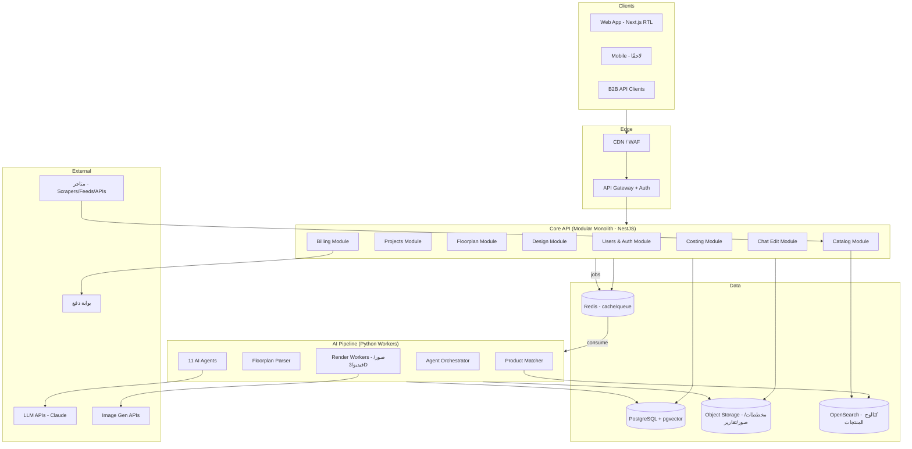

> ⚠️ **لافتة Architecture Freeze v1.0:** هذه وثيقة تأسيسية من الجيل الأول. عند أي تعارض مع أقسام الـ PRD المعتمدة ([docs/02-prd.md](02-prd.md)) أو القاموس الرسمي في [ARCHITECTURE_FREEZE_v1.md](ARCHITECTURE_FREEZE_v1.md)، **فالـ PRD هو المرجع** (مثال: DigitalTwin لا FloorPlanGraph، وDesignVariant لا tier). إعادة كتابتها الرسمية ضمن أقسام PRD 7–12 (TD-01).

# 3. Software Architecture — المعمارية البرمجية

## 1. الفلسفة المعمارية

- **Modular Monolith أولًا، Microservices عند الحاجة.** نبدأ بخدمة واحدة منظمة بحدود Domain صارمة (سهلة التفكيك لاحقًا)، مع فصل **خط معالجة الذكاء الاصطناعي** كخدمة Workers مستقلة من اليوم الأول لأن خصائصها (GPU، طويلة الأمد، async) مختلفة جذريًا عن الـ API.
- **Event-driven للمعالجة الطويلة:** كل ما يتجاوز ثانيتين يمر عبر Queue.
- **كل مخرجات AI مُهيكلة (JSON Schema) ومخزنة** — النظام قابل للتدقيق وإعادة التشغيل الجزئي.

## 2. المخطط العام



## 3. المكونات الرئيسية

### 3.1 Core API (TypeScript / NestJS)
مسؤول عن: المصادقة، المشاريع، حالة خط المعالجة، الكتالوج، الفوترة، تقديم النتائج للواجهة. **لا يستدعي LLM مباشرة أبدًا** — فقط يضع Jobs في الطابور ويستقبل النتائج.

الوحدات (Bounded Contexts):
| Module | المسؤولية |
|--------|-----------|
| `identity` | مستخدمون، جلسات، OTP، أدوار |
| `projects` | المشروع، المخططات، الاستبيان، النمط، حالة الـ pipeline |
| `floorplan` | تمثيل المخطط المُحلل (غرف/جدران/فتحات) + تصحيحات المستخدم |
| `design` | Master Design Document، النسخ الثلاث، إصدارات التعديل |
| `catalog` | المنتجات، المتاجر، الأسعار، الـ embeddings |
| `costing` | أسعار السوق المرجعية، BoQ، حسابات التكلفة |
| `chat` | جلسات التعديل بالمحادثة وربطها بالوكلاء |
| `billing` | الباقات، الدفع، حدود الاستخدام |

### 3.2 AI Pipeline (Python)
Workers مستقلة تستهلك من الطابور:
- **Floorplan Parser:** CV + Vision-LLM لتحويل الصورة/الـ DWG إلى `FloorPlanGraph` (JSON).
- **Agent Orchestrator:** يدير مجلس الوكلاء وفق DAG تبعيات (تفاصيل في وثيقة AI).
- **Product Matcher:** بحث هجين (vector + filters) في الكتالوج.
- **Render Workers:** توليد الصور الفوتوريالية (ControlNet-style conditioning على هندسة الغرفة)، الفيديو، تجميع الـ 3D، وتوليد الـ PDF.

### 3.3 Catalog Ingestion (خدمة مستقلة)
- Scrapers/Feeds لكل متجر تعمل بجدولة (أسعار كل 24–72 ساعة).
- خط تنظيف وتوحيد (Normalization): فئة موحدة، مقاسات بالسم، ألوان قياسية، خامات قياسية.
- **Enrichment بالذكاء الاصطناعي:** LLM يوسّم كل منتج (النمط، اللون الحقيقي من الصورة، الخامة) + embedding للصورة والوصف.

## 4. تدفق البيانات الرئيسي (Happy Path)

```
1. POST /projects + upload → S3، إنشاء Project(status=uploaded)
2. Job: parse_floorplan → FloorPlanGraph → status=analyzed
3. المستخدم يصحّح/يعتمد → intake + style → POST /projects/:id/generate
4. Job: run_council → Orchestrator يشغّل الوكلاء (DAG) → Master Design Document v1
5. Jobs متوازية: match_products (×3 tiers) + compute_costs + render_images
6. status=ready → الواجهة تعرض النتائج (WebSocket/SSE للتحديث الحي)
7. تعديل محادثة → Job: apply_edit(agent scope) → Design v2 → إعادة حساب جزئية
```

## 5. قرارات معمارية مسجلة (ADRs مختصرة)

| # | القرار | البديل المرفوض | السبب |
|---|--------|----------------|-------|
| ADR-1 | Modular Monolith + AI Workers منفصلة | Microservices كاملة | سرعة فريق صغير؛ الفصل الوحيد الضروري هو GPU/async workloads |
| ADR-2 | TypeScript للـ API و Python للـ AI | لغة واحدة | نضج نظام Python البيئي في CV/ML لا بديل له؛ وNestJS أفضل لواجهات منضبطة |
| ADR-3 | PostgreSQL + pgvector كمصدر حقيقة واحد | Mongo + Pinecone | تقليل عدد الأنظمة؛ pgvector يكفي حتى ملايين المنتجات |
| ADR-4 | كل مخرجات الوكلاء JSON Schema صارم | نص حر يُفسَّر لاحقًا | قابلية الدمج، التقييم الآلي، وإعادة التشغيل الجزئي |
| ADR-5 | إعادة تشغيل جزئية (per-agent) للتعديلات | إعادة توليد كاملة | تكلفة وزمن أقل 10x؛ شرط تجربة "التعديل الفوري" |
| ADR-6 | Multi-locale/currency من اليوم الأول في الـ schema | إضافة لاحقًا | إعادة الهيكلة لاحقًا أغلى 100x |

## 6. الحالة والتزامن

- حالة المشروع آلة حالات صريحة: `uploaded → analyzing → needs_review → intake → generating → matching → rendering → ready → editing`.
- كل Job idempotent مع `job_key` فريد — إعادة المحاولة آمنة.
- التحديث الحي للواجهة عبر SSE (أبسط من WebSocket ويكفي أحادي الاتجاه).

## 7. الملاحظة والمراقبة (Observability)

- Tracing موحّد (OpenTelemetry) يربط طلب المستخدم بكل استدعاءات الوكلاء وتكلفة الـ tokens لكل مشروع.
- لوحة تكلفة AI لكل مشروع/وكيل — **تكلفة التوليد هي COGS الأساسي ويجب مراقبتها كمقياس منتج**.
- سجل Prompt/Response كامل (مع إخفاء PII) لأغراض debugging والـ evals.
