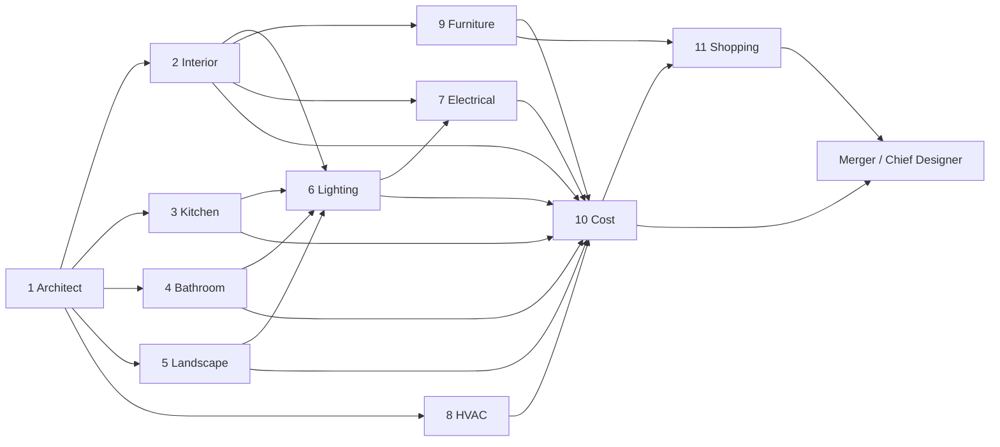

# 4. AI Architecture — مجلس وكلاء الذكاء الاصطناعي

## 1. الفلسفة

- **مجلس متخصصين، لا نموذج واحد عملاق.** كل وكيل له دور ضيق، مدخلات محددة، ومخرجات JSON Schema صارمة — هذا يرفع الدقة ويجعل كل وكيل قابلًا للتقييم والتحسين والاستبدال مستقلًا.
- **Orchestrator حتمي (Deterministic DAG)، وكلاء إبداعيون.** ترتيب التنفيذ وحل التعارضات كود صريح، لا نترك "من يتكلم أولًا" لاجتهاد LLM.
- **المخطط هو مصدر الحقيقة الهندسية.** كل وكيل يستلم `FloorPlanGraph` نفسه؛ لا وكيل يخترع أبعادًا.
- **إعادة تشغيل جزئية:** أي تعديل يمس الوكيل المختص فقط ومَن يعتمد عليه.

## 2. حجر الأساس: FloorPlanGraph

مخرج Architect AI وبنية البيانات المركزية للنظام كله:

```jsonc
{
  "floors": [{
    "level": 0,
    "rooms": [{
      "id": "room_majlis_1",
      "name_ar": "مجلس الرجال",
      "type": "majlis",                  // enum موسّع للسياق الخليجي
      "polygon": [[0,0],[6.2,0],[6.2,4.8],[0,4.8]],   // متر
      "area_m2": 29.76,
      "ceiling_height_m": 3.2,
      "doors": [{ "id": "d1", "wall": "south", "width_m": 1.0, "position": 2.1 }],
      "windows": [{ "id": "w1", "wall": "east", "width_m": 1.8, "sill_m": 0.9 }],
      "adjacent_rooms": ["room_entry_1"],
      "confidence": 0.94
    }],
    "walls": [ { "from": [0,0], "to": [6.2,0], "thickness_m": 0.2, "load_bearing": null } ]
  }],
  "scale_source": "user_confirmed",       // detected | user_confirmed | assumed
  "orientation": { "north_deg": 45 }
}
```

**أنواع الغرف تشمل السياق المحلي:** `majlis_men`, `majlis_women`, `dining`, `living`, `bedroom_master`, `bedroom`, `kids_room`, `maid_room`, `driver_room`, `kitchen`, `kitchen_dirty`, `bathroom`, `wc_guest`, `laundry`, `storage`, `garage`, `garden`, `pool`, `roof`, `prayer_room`, `corridor`, `entry`, `balcony`, `external_annex`.

## 3. الوكلاء: الأدوار والعقود

| الوكيل | المدخلات | المخرجات (Schema) | يعتمد على |
|--------|----------|--------------------|-----------|
| **1. Architect AI** | ملف المخطط + تصحيحات المستخدم | `FloorPlanGraph` | — |
| **2. Interior Designer AI** | Graph + Intake + Style | `RoomDesign[]`: لكل غرفة مفهوم التصميم، لوحة ألوان، الأرضيات، الدهانات، الأبواب/الشبابيك (نوع/خامة/لون)، توزيع الأثاث بإحداثيات | 1 |
| **3. Kitchen Designer AI** | Graph(kitchen) + Intake + Style | تخطيط الخزائن (مثلث العمل)، الأجهزة، الأسطح، المغاسل — بمقاسات | 1 |
| **4. Bathroom Designer AI** | Graph(bathrooms) + Style | الأطقم، البلاط، الإكسسوارات، النقاط الصحية | 1 |
| **5. Landscape Designer AI** | Graph(outdoor) + Intake | الحديقة، السور، الواجهة، المسبح، الممرات، الجراج | 1 |
| **6. Lighting Engineer AI** | RoomDesigns + Graph | لكل غرفة: طبقات إضاءة (عام/مهام/جمالي)، عدد الوحدات، النوع، Lumen/K، مواقع التركيب | 2,3,4,5 |
| **7. Electrical Engineer AI** | RoomDesigns + Lighting | الأفياش، المفاتيح، نقاط TV/Data، الدوائر — بمواقع تركيب | 2,6 |
| **8. HVAC Engineer AI** | Graph + المدينة (مناخ) | حساب حمل تبريد لكل غرفة (BTU)، نوع النظام (سبليت/مخفي/مركزي)، مواقع الوحدات | 1,2 |
| **9. Furniture AI** | RoomDesigns + Intake | قائمة قطع مفصلة (نوع/مقاس/لون/خامة/كمية/موقع) متحققة الملاءمة هندسيًا | 2 |
| **10. Cost Engineer AI** | كل المخرجات + أسعار السوق | BoQ كامل، تكلفة/غرفة و/قسم، مطابقة الميزانية، توصيات الموازنة | 2–9 |
| **11. Shopping AI** | القوائم + الكتالوج | لكل عنصر: منتج مطابق + بديل أرخص + بديل أفخم (اسم/صورة/سعر/رابط/متجر) | 9,10 |

### مخطط التنفيذ (DAG)



المستوى 2 (Interior/Kitchen/Bathroom/Landscape/HVAC) يعمل **بالتوازي** — توفير زمن كبير.

## 4. الدمج وحل التعارضات (Merger — "كبير المصممين")

خطوة نهائية من شقين:
1. **فحوصات حتمية (كود):** تصادم مواقع (مكيف فوق لوحة)، تجاوز أبعاد، أبواب محجوبة بأثاث، مجموع التكلفة ≠ مجموع البنود، عنصر بلا موقع تركيب.
2. **مراجعة LLM (Chief Designer):** اتساق الأسلوب بين الغرف، منطق تدفق الحركة، ملاءمة السياق (أطفال → زوايا آمنة وخامات قابلة للتنظيف). يُصدر `MasterDesignDocument` النهائي + "ملاحظات كبير المصممين" للمستخدم (لمسة منتج مميزة).

فشل أي فحص حتمي → إعادة توجيه آلية للوكيل المختص بتعليمة تصحيح محددة (حد أقصى 2 retry ثم تعليم العنصر `needs_review`).

## 5. Floorplan Parsing (أصعب مشكلة تقنية — خطة هجينة)

| الطبقة | الدور |
|--------|------|
| **DWG/DXF path** | إن كان الملف vector: تحليل حتمي بمكتبات CAD (دقة شبه كاملة) — نشجع المستخدمين عليه |
| **CV Models** | كشف الجدران/الأبواب/النوافذ من الصور النقطية (نماذج مفتوحة مدربة على CubiCasa5K وأمثالها كنقطة بداية، ثم fine-tune على مخططات خليجية) |
| **Vision-LLM** | قراءة النصوص العربية (أسماء الغرف، الأبعاد المكتوبة)، تصنيف الغرف، وسد فجوات الـ CV |
| **Reconciliation** | دمج المصادر الثلاثة + حساب scale + توليد الـ Graph مع confidence |
| **Human-in-the-loop** | شاشة تأكيد المستخدم — وكل تصحيح يُخزن كبيانات تدريب لنموذجنا الخاص |

> **استثمار استراتيجي:** بعد ~10k مخطط مُصحح، نملك أفضل dataset لمخططات المنازل الخليجية في العالم — أصل لا يُشترى.

## 6. اختيار النماذج (Model Routing)

| المهمة | النموذج | لماذا |
|--------|---------|-------|
| الوكلاء التصميميون والهندسيون | Claude (Opus/Sonnet حسب التعقيد) | أفضل اتباع تعليمات + structured output + عربي ممتاز |
| قراءة المخططات (Vision) | Claude Vision + نماذج CV متخصصة | هجين للدقة |
| توسيم الكتالوج (ملايين المنتجات) | Haiku / نموذج صغير | تكلفة — مهمة بسيطة متكررة |
| الصور الفوتوريالية | Diffusion موجَّه بالهندسة (ControlNet: depth/segmentation من مخطط الغرفة) | الصورة يجب أن تطابق الغرفة الحقيقية لا خيالًا عامًا |
| المحادثة/التعديل | Sonnet + tool use (استدعاء الوكلاء كأدوات) | زمن استجابة + توجيه دقيق |

- **Model-agnostic layer:** كل استدعاء عبر طبقة داخلية موحدة (provider/prompt/version/cost logging) — تبديل النماذج بلا لمس كود الوكلاء.
- **Prompt versioning:** كل prompt ملف مُصدَّر برقم، وكل مخرج يسجل نسخة الـ prompt التي أنتجته.

## 7. التعديل بالمحادثة (Edit Router)

```
"اجعل المجلس أفخم" →
  1. Intent Parser (LLM): { action: upgrade_tier, scope: room_majlis_1, aspect: all }
  2. Router: يحدد الوكلاء المتأثرين → Interior(majlis) → Furniture → Shopping → Cost
  3. تنفيذ جزئي على الغرفة فقط → Design v(n+1) + فرق تكلفة معروض فورًا
  4. إعادة رندر صور الغرفة المتأثرة فقط (async)
```

أمثلة تغطية إلزامية في الـ evals: تغيير قطعة واحدة، تغيير خامة، تغيير نمط غرفة، تعديل ميزانية إجمالي ("قلّل الميزانية 20%") — الأخير يمر عبر Cost Engineer الذي يقترح تخفيضات موزونة بدل خفض أعمى.

## 8. التقييم (Evals) — بنفس أهمية الكود

- **Golden Set:** 50 مخططًا حقيقيًا متنوعًا (فلل/شقق/دوبلكس) بحقيقة أرضية موسومة يدويًا.
- مقاييس آلية لكل إصدار prompt/نموذج:
  - دقة استخراج الغرف/الأبعاد (IoU + خطأ مساحة %)
  - صلاحية Schema بنسبة 100%
  - **Geometric validity:** نسبة عناصر الأثاث التي تدخل مقاساتها فعلًا (هدف ≥ 95%)
  - انحراف التكلفة عن الميزانية المطلوبة
  - دقة مطابقة المنتجات (تقييم بشري عيّني أسبوعي)
- CI يمنع نشر أي prompt جديد يُنزل مقياسًا رئيسيًا.

## 9. ضبط التكلفة (AI COGS)

- Caching صارم: تحليل المخطط يُحسب مرة واحدة؛ الأنماط الثلاثة تشارك نفس الـ Graph.
- Prompt caching لثوابت السياق الكبيرة (الـ Graph، الكتالوج المرشّح).
- ميزانية tokens لكل مشروع مع تنبيه تجاوز — التكلفة المستهدفة للمشروع الكامل تُراقب كـ KPI هندسي.
