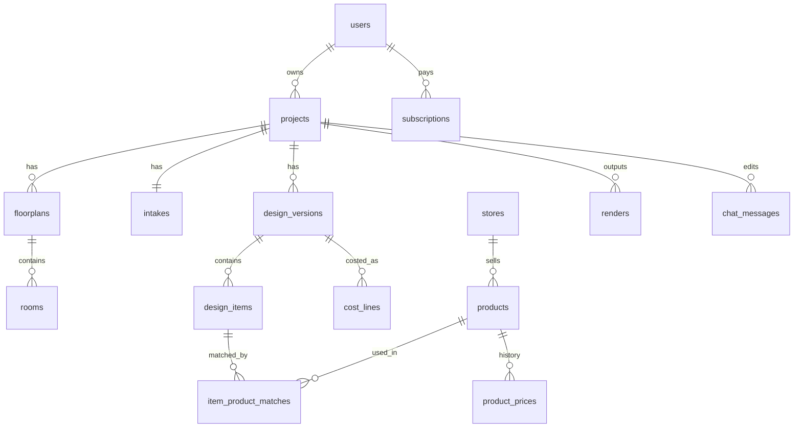

> ⚠️ **لافتة Architecture Freeze v1.0:** هذه وثيقة تأسيسية من الجيل الأول. عند أي تعارض مع أقسام الـ PRD المعتمدة ([docs/02-prd.md](02-prd.md)) أو القاموس الرسمي في [ARCHITECTURE_FREEZE_v1.md](ARCHITECTURE_FREEZE_v1.md)، **فالـ PRD هو المرجع** (مثال: DigitalTwin لا FloorPlanGraph، وDesignVariant لا tier). إعادة كتابتها الرسمية ضمن أقسام PRD 7–12 (TD-01).

# 5. Database Design — تصميم قواعد البيانات

## 1. الأنظمة

| النظام | الدور |
|--------|------|
| **PostgreSQL 16 + pgvector** | مصدر الحقيقة: مستخدمون، مشاريع، تصاميم، كتالوج، أسعار، embeddings |
| **Redis** | Queue (BullMQ)، cache، rate limiting، جلسات |
| **Object Storage (S3-compatible)** | المخططات الأصلية، الصور المولدة، الفيديو، PDF، ملفات 3D |
| **OpenSearch** *(مرحلة 2)* | بحث نصي/فلترة متقدمة على الكتالوج عندما يتجاوز مليون منتج |

> مبدأ: أقل عدد أنظمة ممكن في البداية. JSONB لمخرجات الوكلاء (مرنة ومتغيرة)، وجداول علائقية لكل ما يُستعلم عنه ويُجمَع (منتجات، أسعار، بنود تكلفة).

## 2. المخطط العلائقي (الجداول الأساسية)



## 3. تعريف الجداول الرئيسية

```sql
-- الهوية
CREATE TABLE users (
  id            UUID PRIMARY KEY DEFAULT gen_random_uuid(),
  phone         TEXT UNIQUE,             -- OTP هو الأساس في السعودية
  email         TEXT UNIQUE,
  full_name     TEXT,
  locale        TEXT NOT NULL DEFAULT 'ar-SA',
  country_code  TEXT NOT NULL DEFAULT 'SA',
  created_at    TIMESTAMPTZ NOT NULL DEFAULT now()
);

-- المشروع = وحدة العمل المركزية
CREATE TABLE projects (
  id            UUID PRIMARY KEY DEFAULT gen_random_uuid(),
  user_id       UUID NOT NULL REFERENCES users(id),
  title         TEXT NOT NULL,
  status        TEXT NOT NULL DEFAULT 'uploaded',
    -- uploaded|analyzing|needs_review|intake|generating|matching|rendering|ready|editing|failed
  currency      TEXT NOT NULL DEFAULT 'SAR',
  city          TEXT, country_code TEXT NOT NULL DEFAULT 'SA',
  budget_total  NUMERIC(14,2),
  style_primary TEXT,                     -- modern|luxury|minimal|japandi|scandinavian|new_classic|classic|industrial
  created_at    TIMESTAMPTZ NOT NULL DEFAULT now(),
  updated_at    TIMESTAMPTZ NOT NULL DEFAULT now()
);

CREATE TABLE intakes (
  project_id    UUID PRIMARY KEY REFERENCES projects(id),
  family_size   INT, has_children BOOLEAN, children_ages INT[],
  has_elderly   BOOLEAN, has_pets BOOLEAN, pet_types TEXT[],
  extra_answers JSONB NOT NULL DEFAULT '{}'   -- أسئلة ديناميكية حسب المخطط
);

-- المخطط المُحلل
CREATE TABLE floorplans (
  id            UUID PRIMARY KEY DEFAULT gen_random_uuid(),
  project_id    UUID NOT NULL REFERENCES projects(id),
  level         INT NOT NULL DEFAULT 0,
  source_file   TEXT NOT NULL,            -- S3 key
  source_type   TEXT NOT NULL,            -- pdf|dwg|dxf|png|jpg
  graph         JSONB,                    -- FloorPlanGraph الكامل
  scale_source  TEXT,                     -- detected|user_confirmed|assumed
  parse_confidence NUMERIC(4,3),
  user_corrections JSONB NOT NULL DEFAULT '[]'  -- ذهب: بيانات تدريب
);

-- الغرف مفكوكة للاستعلام (مشتقة من graph، denormalized عمدًا)
CREATE TABLE rooms (
  id            UUID PRIMARY KEY DEFAULT gen_random_uuid(),
  floorplan_id  UUID NOT NULL REFERENCES floorplans(id),
  room_key      TEXT NOT NULL,            -- room_majlis_1 (ثابت عبر الإصدارات)
  room_type     TEXT NOT NULL,            -- enum السياق الخليجي
  name_ar       TEXT, area_m2 NUMERIC(8,2),
  geometry      JSONB NOT NULL,           -- polygon/doors/windows
  style_override TEXT                     -- نمط مختلف لهذه الغرفة إن وجد
);

-- إصدارات التصميم (immutable — كل تعديل نسخة جديدة)
CREATE TABLE design_versions (
  id            UUID PRIMARY KEY DEFAULT gen_random_uuid(),
  project_id    UUID NOT NULL REFERENCES projects(id),
  version       INT NOT NULL,
  tier          TEXT NOT NULL,            -- economy|balanced|luxury
  parent_version UUID REFERENCES design_versions(id),
  change_summary TEXT,                    -- "جعل المجلس أفخم"
  master_doc    JSONB NOT NULL,           -- MasterDesignDocument
  agent_reports JSONB NOT NULL,           -- تقارير الوكلاء الخام (تدقيق/إعادة تشغيل)
  created_by    TEXT NOT NULL,            -- council|chat_edit
  created_at    TIMESTAMPTZ NOT NULL DEFAULT now(),
  UNIQUE(project_id, version, tier)
);

-- كل عنصر تصميمي (كنبة، ثريا، مكيف، متر أرضية...)
CREATE TABLE design_items (
  id            UUID PRIMARY KEY DEFAULT gen_random_uuid(),
  design_version_id UUID NOT NULL REFERENCES design_versions(id),
  room_key      TEXT NOT NULL,
  category      TEXT NOT NULL,   -- furniture|lighting|electrical|door|window|flooring|paint|kitchen|bathroom|hvac|landscape|facade|fence|pool|garage|pathway
  item_type     TEXT NOT NULL,   -- sofa_3seat, chandelier, split_ac ...
  spec          JSONB NOT NULL,  -- {dimensions_cm, color, material, finish, ...}
  quantity      NUMERIC(10,2) NOT NULL DEFAULT 1,
  unit          TEXT NOT NULL DEFAULT 'piece',   -- piece|m2|lm|point
  placement     JSONB,           -- {x,y,rotation,wall} على المخطط
  source_agent  TEXT NOT NULL
);

-- الكتالوج
CREATE TABLE stores (
  id            UUID PRIMARY KEY DEFAULT gen_random_uuid(),
  name          TEXT NOT NULL, name_ar TEXT,
  country_code  TEXT NOT NULL DEFAULT 'SA',
  website       TEXT, affiliate_program JSONB,
  ingestion_type TEXT NOT NULL   -- api|feed|scraper
);

CREATE TABLE products (
  id            UUID PRIMARY KEY DEFAULT gen_random_uuid(),
  store_id      UUID NOT NULL REFERENCES stores(id),
  external_id   TEXT NOT NULL,
  url           TEXT NOT NULL, image_url TEXT,
  name          TEXT NOT NULL, name_ar TEXT,
  category      TEXT NOT NULL,           -- taxonomy موحد خاص بنا
  item_type     TEXT,                    -- نفس enum design_items.item_type
  attrs         JSONB NOT NULL DEFAULT '{}',  -- {dimensions_cm, colors[], materials[], style_tags[]}
  embedding     vector(1024),            -- نص+صورة موحد
  in_stock      BOOLEAN NOT NULL DEFAULT true,
  last_seen_at  TIMESTAMPTZ NOT NULL DEFAULT now(),
  UNIQUE(store_id, external_id)
);
CREATE INDEX products_embedding_idx ON products USING hnsw (embedding vector_cosine_ops);
CREATE INDEX products_type_idx ON products(item_type, in_stock);

CREATE TABLE product_prices (         -- تاريخ الأسعار (أصل بيانات مستقبلي)
  id            BIGSERIAL PRIMARY KEY,
  product_id    UUID NOT NULL REFERENCES products(id),
  price         NUMERIC(12,2) NOT NULL,
  currency      TEXT NOT NULL DEFAULT 'SAR',
  captured_at   TIMESTAMPTZ NOT NULL DEFAULT now()
);

-- مطابقة عنصر ↔ منتج
CREATE TABLE item_product_matches (
  id            UUID PRIMARY KEY DEFAULT gen_random_uuid(),
  design_item_id UUID NOT NULL REFERENCES design_items(id),
  product_id    UUID NOT NULL REFERENCES products(id),
  match_role    TEXT NOT NULL,           -- primary|cheaper_alt|premium_alt
  match_score   NUMERIC(4,3),
  price_at_match NUMERIC(12,2) NOT NULL,
  user_action   TEXT                     -- accepted|replaced|removed  ← بيانات تفضيل ذهبية
);

-- التكلفة
CREATE TABLE cost_lines (
  id            UUID PRIMARY KEY DEFAULT gen_random_uuid(),
  design_version_id UUID NOT NULL REFERENCES design_versions(id),
  room_key      TEXT, category TEXT NOT NULL,
  description   TEXT NOT NULL,
  qty NUMERIC(10,2), unit TEXT, unit_price NUMERIC(12,2),
  total NUMERIC(14,2) NOT NULL,
  source        TEXT NOT NULL             -- product_match|market_rate
);

CREATE TABLE market_rates (              -- أسعار سوق مرجعية (دهان/م²، تمديدات...)
  id UUID PRIMARY KEY DEFAULT gen_random_uuid(),
  country_code TEXT NOT NULL, city TEXT,
  item_type TEXT NOT NULL, unit TEXT NOT NULL,
  price_low NUMERIC(12,2), price_mid NUMERIC(12,2), price_high NUMERIC(12,2),
  valid_from DATE NOT NULL
);

-- المخرجات والمحادثة
CREATE TABLE renders (
  id UUID PRIMARY KEY DEFAULT gen_random_uuid(),
  project_id UUID NOT NULL REFERENCES projects(id),
  design_version_id UUID REFERENCES design_versions(id),
  room_key TEXT, kind TEXT NOT NULL,      -- image|video|model3d|pdf
  file_key TEXT NOT NULL, status TEXT NOT NULL DEFAULT 'queued',
  created_at TIMESTAMPTZ NOT NULL DEFAULT now()
);

CREATE TABLE chat_messages (
  id UUID PRIMARY KEY DEFAULT gen_random_uuid(),
  project_id UUID NOT NULL REFERENCES projects(id),
  role TEXT NOT NULL,                     -- user|assistant|system
  content TEXT NOT NULL,
  parsed_intent JSONB,                    -- ما فهمه النظام
  resulting_version UUID REFERENCES design_versions(id),
  created_at TIMESTAMPTZ NOT NULL DEFAULT now()
);

-- الفوترة وحدود الاستخدام + تتبع تكلفة AI
CREATE TABLE subscriptions (
  id UUID PRIMARY KEY DEFAULT gen_random_uuid(),
  user_id UUID NOT NULL REFERENCES users(id),
  plan TEXT NOT NULL,                     -- free|pro|premium
  status TEXT NOT NULL, current_period_end TIMESTAMPTZ,
  provider TEXT, provider_ref TEXT
);

CREATE TABLE ai_usage (
  id BIGSERIAL PRIMARY KEY,
  project_id UUID REFERENCES projects(id),
  agent TEXT NOT NULL, model TEXT NOT NULL,
  prompt_version TEXT,
  input_tokens INT, output_tokens INT, cost_usd NUMERIC(10,5),
  created_at TIMESTAMPTZ NOT NULL DEFAULT now()
);
```

## 4. قرارات تصميمية مهمة

1. **`design_versions` غير قابلة للتعديل (immutable):** كل تعديل محادثة = نسخة جديدة بمؤشر `parent_version`. يمنح Undo/مقارنة/تدقيق مجانًا.
2. **`room_key` نصي ثابت** عبر الإصدارات (وليس FK) — يسمح بمقارنة الغرفة نفسها بين نسخ التصميم.
3. **الأسعار جدول تاريخي منفصل:** سعر لحظة المطابقة محفوظ في `item_product_matches.price_at_match` — التقرير لا يتغير تحت المستخدم، وتاريخ الأسعار أصل بيانات (مؤشر أسعار تأثيث المنازل في السعودية — منتج مستقبلي بحد ذاته).
4. **`user_action` في المطابقات:** كل قبول/استبدال يغذي نموذج التفضيل — خندق البيانات.
5. **JSONB حيث التغير سريع** (تقارير الوكلاء، specs) **وأعمدة حيث الاستعلام** (تكلفة، فئة، مقاسات المنتجات ضمن attrs مفهرسة بـ GIN عند الحاجة).
6. **كل الجداول متعددة الدول من اليوم الأول** (`country_code`, `currency`) — التوسع الخليجي لا يتطلب هجرة.

## 5. الاحتفاظ والخصوصية

- المخططات الأصلية: تشفير at-rest، وحذف نهائي خلال 30 يومًا من حذف الحساب.
- `user_corrections` و`user_action` تُستخدم للتدريب فقط بعد de-identification وموافقة صريحة.
- نسخ احتياطي PITR (نقطة زمنية) يومي + اختبار استعادة شهري.
