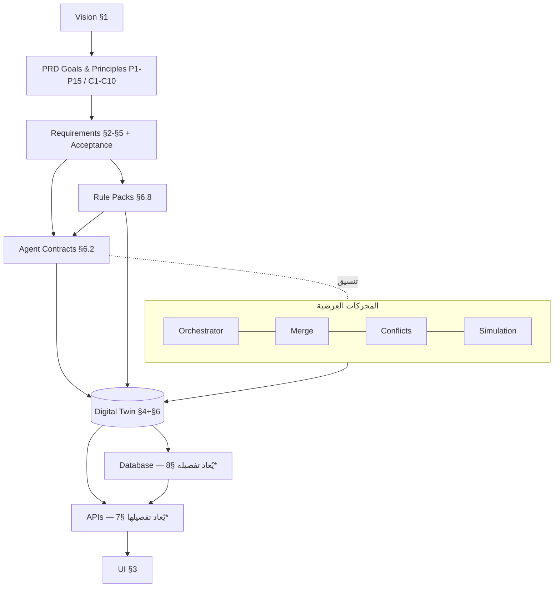

# Architecture Freeze v1.0 — Bayti AI

| | |
|---|---|
| **الوثيقة** | بوابة اعتماد وتجميد المعمارية — ليست مراجعة شكلية |
| **النطاق** | كل الوثائق: PRD الأقسام 1–6 + الوثائق التأسيسية 01–14 + ADR.md |
| **التاريخ** | 2026-07-15 |
| **الحالة** | ✅ **Approved — Architecture v1.0 (Frozen)** · صادق المؤسس بتاريخ 2026-07-15 مصادقة مشروطة نُفِّذت شروطها كاملة: F-03/F-04/F-05/F-07 مطبقة على الـ PRD + ADR-030/031/032 مضافة (Canonical Truth · AI Is Advisory · UI Independence) + [PROJECT_CONSTITUTION.md](PROJECT_CONSTITUTION.md) |

> **قاعدة ما بعد التجميد:** أي تغيير معماري بعد المصادقة يتطلب ADR جديدًا معتمدًا من المؤسس — لا استثناءات. أي مصطلح خارج القاموس الرسمي (المرحلة 2) مرفوض في الوثائق والكود والواجهات.

---

## المرحلة 1 — Cross Document Audit (نتائج التدقيق الفعلي)

منهجية: فحص نصي (grep عابر للوثائق) + تتبع منطقي للكيانات والأرقام والعقود عبر الأقسام. النتيجة: **11 نتيجة** — لا يوجد تعارض قاتل؛ 4 تتطلب مصادقة مؤسس لأنها تعدّل نصوصًا معتمدة.

| # | النتيجة | الخطورة | القرار المقترح (يُصادَق باعتماد هذا التقرير) |
|---|---------|----------|-----------------------------------------------|
| F-01 | ازدواج مصطلح **tier / variant**: وثيقتا API وDB والقسمان 2 و13 تستخدم `tier`، والقسم 6.20 المعتمد يعرّف `DesignVariant/variant_id` | متوسط | **الرسمي: `DesignVariant` / `variant_id`** — "tier" مرادف مرفوض (القاموس)؛ تُحدَّث وثائق API/DB عند إعادة كتابتها في الأقسام 7–9 (TD-01) |
| F-02 | ازدواج **FloorPlanGraph / DigitalTwin**: الوثائق القديمة (03/04/05/07/10) تستخدم الأول، والقسم 4 المعتمد أسس الثاني | متوسط | **الرسمي: `DigitalTwin`** — FloorPlanGraph مرادف مرفوض نهائيًا (كان اسمًا انتقاليًا) |
| F-03 | **تعارض زمني**: شاشة S4 تقول "P95 ≤ 90 ث" بينما 4.14/AC-10 يحددان "الرفع → جاهز للمراجعة ≤ 120s" | متوسط | التعريف الرسمي: مسار المعالجة (parsing) ≤ 90s **و**الإجمالي رفع→جاهز للمراجعة ≤ 120s؛ يُعدَّل نص S4 ليقول "معالجة المخطط ≤ 90 ث ضمن إجمالي ≤ 120 ث" ⚠ **يتطلب مصادقة (تعديل قسم معتمد)** |
| F-04 | **أرقام SOM غير متطابقة**: الجدول الرئيسي 2.2.1 (8.5/27/55م) لا يساوي حاصل الجمع من الأسفل 2.2.2 (3.8/22.5/72.8م) — الفرق مبرر نصيًا لكنه يضعف مصداقية الوثيقة أمام مستثمر | **عالٍ** | اعتماد أرقام البناء من الأسفل **كما هي** في الجدول الرئيسي (3.8/22.5/72.8) مع سطر تحفظ واحد ⚠ **يتطلب مصادقة** |
| F-05 | حساب G2 (≤7 دقائق للرحلة) غير مفكك | منخفض | إضافة تفكيك توضيحي: تحليل ≤2د + مجلس ≤5د = 7د — توضيح لا تغيير |
| F-06 | **الوثائق التأسيسية 03–14 أقدم من PRD v2**: وثيقة AI القديمة بلا مرحلتي إنارة/كهرباء وبـ"Merger" بدل Merge Engine+ConflictResolver؛ وثيقة DB بلا كيانات المجلس (AgentRun/Proposal/Conflict/MergeTransaction)؛ وثيقة API بلا نقاط variants/proposals | متوسط | وُضعت لافتة "canonical-where-conflicting = PRD" على الوثائق الثلاث الأكثر تعارضًا (04/05/06)؛ إعادة كتابتها الكاملة هي بالضبط موضوع أقسام PRD 7–9 القادمة (TD-01) |
| F-07 | `AgentRun.project_version_id` اسم ملتبس (المقصود نسخة IntakeBundle) | منخفض | يُعاد تسميته `intake_bundle_version` (لا كود بعد — إعادة تسمية مجانية) |
| F-08 | S8 SLO للمجلس ≤5د بينما سقف RunBudget للـ Free = 7د | لا تعارض | علاقة سليمة بالتعريف (SLO هدف، Budget سقف قطع) — وُثّقت صراحة |
| F-09 | نظامان لترقيم ADR (أرقام PRD الداخلية 4.x/5.x/6.x مقابل ADR.md 001–029) | منخفض | **ADR.md هو السجل الرسمي الوحيد**؛ أرقام PRD تبقى كمؤشرات (مثبت في ADR.md) |
| F-10 | وثيقة Roadmap القديمة (مرحلة 1: "3 وكلاء فقط") تناقض عقود المجلس المعتمدة | متوسط | مغطاة بـ F-06/TD-01 — الـ Roadmap يُعاد بناؤه بعد اكتمال الوثائق (هو نفسه قسم لاحق) |
| F-11 | اقتصاد الوحدة (2.2: باقة ~300 ريال، COGS ≤90) لم يُقفل بعد مقابل تسعير القسم 10 غير المكتوب | متوسط | يُسجَّل كاعتماد مفتوح إلزامي على القسم 10 (Dependency Map) — لا قرار الآن |

**خلاصة المرحلة 1:** لا تعارض بنيوي في قلب النظام (الأقسام 4–6 متسقة داخليًا بشكل ممتاز — بُنيت متأخرة فوق مبادئ مثبتة). التعارضات كلها "قشرة زمنية" بين جيلين من الوثائق، ومعالجتها محددة المسار.

---

## المرحلة 2 — Canonical Glossary (القاموس الرسمي المُلزِم)

> بعد التجميد: يُمنع استخدام أي مصطلح تقني أساسي خارج هذا القاموس. المالك: من يملك تعريف المصطلح وتطويره.

| العربي | English | الاختصار | التعريف | المالك | أول ظهور | مرادفات مرفوضة |
|--------|---------|-----------|----------|--------|-----------|------------------|
| التوأم الرقمي | Digital Twin | DT | النموذج الرقمي الكامل للمنزل — مصدر الحقيقة الوحيد (P8) | CTO | PRD §1.9/P8 | ~~FloorPlanGraph~~، ~~النموذج~~، ~~الخريطة~~ |
| مجلس الوكلاء | Agent Council | — | الوكلاء الأحد عشر + Orchestrator + المحركات | AI Lead | PRD §1.2 | ~~الفريق الذكي~~ |
| المنسق | Orchestrator | ORCH | المكوّن الوحيد المسؤول عن تنسيق المجلس (C5) | AI Lead | §6.7 | ~~المدير~~، ~~الموزع~~ |
| تشغيلة وكيل | Agent Run | — | تنفيذ واحد لوكيل بعقده الكامل | AI Lead | §6.3 | ~~جلسة~~، ~~مهمة~~ |
| مقترح | Proposal | — | مخرج الوكيل المنظم الوحيد المسموح (C2) | AI Lead | §6.4 | ~~نتيجة~~، ~~قرار~~ (القرار بعد الدمج) |
| تفسير القرار | Decision Explanation | DE | البنية الثلاثية الطبقات القابلة لإعادة الحساب | AI Lead | §6.5 | ~~الشرح~~، ~~التبرير~~ (justification حقل داخلي) |
| محرك القواعد | Rule Engine | RE | المقيّم الحتمي لكل القواعد الهندسية (P12) | Eng Lead | §1.9/P12 | ~~الفاحص~~ |
| حزمة قواعد | Rule Pack | RP | مجموعة قواعد مُصدَّرة تُسجَّل نسختها لكل مشروع | Eng Lead | §6.8 | — |
| محرك الدمج | Merge Engine | ME | الكاتب الوحيد على التوأم — دمج ذري بحارس دلالي | Eng Lead | §6.14 | ~~Merger~~، ~~كبير المصممين~~ |
| حل التعارضات | Conflict Resolver | CR | تصنيف وحسم التعارضات بترتيب الأولوية الثماني | Eng Lead | §6.13 | — |
| نسخة تصميم | Design Variant | DV | ملف معايرة (اقتصادي/متوازن/فاخر) فوق توأم واحد | Product | §6.20 | ~~tier~~، ~~مستوى~~، ~~باقة~~ (الباقة = خطة اشتراك فقط) |
| حزمة السياق | Intake Bundle | IB | الكيانات الثمانية المجمدة المسلَّمة للمجلس | Product | §5.10 | ~~الاستبيان~~ (الاستبيان واجهة جمعها فقط) |
| متجه الذوق | Style Vector | SV | 10 أبعاد مسماة [0,1] — الاسم واجهة والمتجه الحقيقة | AI Lead | §5.5 | ~~النمط~~ وحده |
| ملف الذوق العام | User Taste Profile | UTP | التفضيلات عابرة المشاريع (ترقية بموافقة فقط) | Product | §1.9/P5 | — |
| ذاكرة المشروع | Project Memory | PM | ذاكرة خاصة بسياق مشروع واحد (P15) | Product | §1.9/P15 | — |
| القيود الصلبة | Hard Constraints | HC | فلاتر مطلقة لا يتجاوزها وكيل (C8) | Product | §5.7 | ~~الممنوعات~~ (لغة واجهة مقبولة، لا وثائق) |
| المجموعة الذهبية | Golden Set | GS | مخططات موسومة بحقيقة أرضية للمعايرة والقياس | AI Lead | §4.20 | ~~بيانات الاختبار~~ |
| الثقة | Confidence | — | قيمة معايَرة إحصائيًا [0,1] — ليست رقم النموذج الخام | AI Lead | §4.8 | ~~الاحتمال~~ |
| نقطة استئناف | Checkpoint | CP | ناتج مرحلة مخزَّن يُستأنف منه (ADR-010) | Eng Lead | §4/ADR-4.3 | — |
| الإبطال الانتقائي | Selective Rerun | SR | إعادة الحد الأدنى من الوكلاء عند تعديل (مصفوفة 6.6) | Eng Lead | §6.6 | ~~إعادة التشغيل~~ الكاملة |
| عقد السياق | Context Contract | CC | الحد الأدنى الحصري من السياق لكل وكيل | AI Lead | §6.7 | — |
| ميزانية الجولة | Run Budget | RB | سقوف زمن/تكلفة/tokens للجولة مع توقف آمن | Eng Lead | §6.7 | — |
| الإنارة المعمارية | Architectural Lighting | LA | الطبقة العامة قبل الأثاث — تتبع الهندسة | Eng Lead | §6.9 | — |
| إنارة المهام واللمسات | Task & Accent Lighting | LT | تتبع الأثاث — تُعاد انتقائيًا | Eng Lead | §6.9 | — |
| التأسيس الكهربائي | Electrical Rough-In | ERI | النقاط المنفذة قبل الأثاث | Eng Lead | §6.10 | — |
| الكهرباء النهائية | Final Electrical | EF | النقاط التابعة للأثاث والأجهزة | Eng Lead | §6.10 | — |
| المراجعة البشرية | Human Review | HR | الأنواع الثلاثة (تصميم/هندسة/تسوق) بـ SLA | Ops | §6.23 | — |
| طبقة المحاكاة | Simulation Layer | SIM | فحوص الاستخدام الحتمية كبوابة اعتماد | Eng Lead | §6.17 | — |
| صحة التوأم | Twin Health | TH | الدرجة المركبة السبعية بعد كل دمج | Eng Lead | §6.18 | — |
| قائمة الكميات | Bill of Quantities | BoQ | مخرج التكلفة البندي للتنفيذ | Product | §2 (v1) | — |
| أسعار السوق المرجعية | Market Rates | MR | أسعار البنود غير المنتجية (دهان/م²...) | Ops | §5 (v1) | — |

---

## المرحلة 3 — Dependency Map

`*` وثيقتا API/DB الحاليتان (05/06) تصلحان كأساس لكن **الرسمي بعد الـ Freeze هو ما ستنتجه أقسام PRD 7–9**.

### نقاط الفشل المفردة (SPOF) وتخفيفها

| النقطة | لماذا SPOF | التخفيف المعتمد |
|--------|-------------|------------------|
| **Digital Twin schema** | كل شيء يشتق منه — كسره يكسر الكل | SPOF **بالتصميم عمدًا** (مصدر حقيقة واحد)؛ التخفيف: ADR-029 (هجرة مُدارة) + قانون 6.15 + فحص توافق CI |
| **Merge Engine** | الكاتب الوحيد على التوأم | تسلسل لكل مشروع (لا تنافس)، أفقي عبر المشاريع؛ rollback مضمون |
| **Orchestrator** | منسق وحيد | Stateless فوق الطوابير — أي replica تكمل من الأحداث والcheckpoints |
| **الكتالوج وحداثة الأسعار** | خارج سيطرتنا جزئيًا (متاجر) | R2/R3: تعدد متاجر، feeds رسمية أولوية، price_confidence شفاف |
| **مزود LLM** | انقطاعه يوقف المجلس | طبقة موحدة متعددة المزودين + fallback مقيس (ADR-002/016) |
| **Redis (طوابير)** | ناقل كل العمل | Managed + DLQ + idempotency تجعل الفقد غير مدمر؛ ترقية broker مسار معلن (TD-05) |
| **Golden Set** | كل المعايرة تعتمد عليه | نسخ احتياطي مصنف كأصل حرج + قواعد منع تسرب |

---

## المرحلة 4 — Traceability Matrix

**السجل الرسمي للمتطلبات القابلة للتتبع:** المبادئ P1–P15، الدستور C1–C10، الأهداف G1–G6، معايير القبول (AC-*, AC5-*, بوابات §6.28)، والقواعد Rule IDs.

### عيّنة التتبع الكاملة (12 صفًا ممثِّلة — البنية الملزمة لكل السجل)

| Requirement | Vision | Persona | User Story | Rule | Agent | Schema | API* | DB* | Acceptance | ADR |
|---|---|---|---|---|---|---|---|---|---|---|
| P1 قابلية التنفيذ | §1 "الدقة قبل الإبهار" | أبو سعود | J1 | KIT-002, SHP-* | الكل + Shopping | AgentProposal.evidence | /design, /shopping | design_items, products | §6.28-5, AC-6 | 018 |
| P2/P11 التفسير | §1 الثقة | الكل | J1,J4 | C6 | الكل | DecisionExplanation | /design/items | JSONB explanation | §6.5 AC 100% | 020 |
| P3 محرك القواعد | §1 | الكل | J1 | كل RP | RE (عرضي) | RuleDefinition/Evaluation | — | rule packs config | §6.8 حتمية bit-bit | 022 |
| P7 الإصدارات | §1 | الكل | J5 | قانون 6.15 | ME | MergeTransaction/TwinDiff | /versions | design_versions | E2E-3 | 024,025 |
| P8 التوأم | §1 | — | — | Semantic checks | ME | DigitalTwin | /design | floorplans/twin | Geometry=100 gate | 008 |
| P9 الثقة/لا تخمين | §1 | الكل | م3 | عتبات 4.8 | الكل | confidence fields | /events | confidence_report | AC-5/AC-6 | 011 |
| G3 دقة هندسية 95% | §1.4 | أبو سعود | J3 | FUR-*, SIM | Furniture+SIM | clearance polygons | /design/items | placement | ≥95% + KIT-SIM | 026 |
| G4 أسعار ≤72h | §1.4 | أبو سعود | J2 | SHP-*, CST-* | Shopping/Cost | CostLine, ShoppingCandidate | /shopping, /costs | product_prices | G4 gate, §6.21 | 028 |
| 3 نسخ | §1.2 | الكل | J4 | variant_rules | Cost+Shopping | DesignVariant | /design?variant= | variants | §6.20 الثابت/المتغير | 027 |
| تعديل بالمحادثة P6 | §1.2 | سارة | J5 | مصفوفة SR | Router+المتأثرون | Intent→AgentRuns | /chat | chat_messages | E2E-3 ≤15s | 005,021 |
| خصوصية المخططات | §1.5 قيم | الكل | — | 4.21 | — | deletion pipeline | /me delete | S3+DB cascade | صفر بقايا hash-audit | — |
| Style بالمتجه | §1 عربي/عالمي | سارة | J3 | style presets | Interior | StyleVector | /style | intakes | AC5-* + مسافة style | 013 |

`*` أعمدة API/DB تشير حاليًا لوثيقتي 05/06 وستُعاد المصادقة عليها مع أقسام PRD 7–9.

**حالة الاكتمال:** P1–P15: 15/15 قابلة للتتبع ✓ · C1–C10: 10/10 ✓ · G1–G6: 6/6 ✓ · فجوة معلنة: الربط الآلي (ملف CSV مُدار) يُبنى مع القسم 7 — **TD-02**. لا متطلب "يتيم" اكتُشف؛ متطلبان ينتظران قسمهما: التسعير (القسم 10) والمخرجات البصرية التفصيلية (القسم 8).

---

## المرحلة 5 — Architecture Review (المحاور العشرة)

| المحور | تقييم | نقاط القوة | المخاطر | التوصيات |
|--------|-------|-------------|----------|-----------|
| Maintainability | 92 | rules-as-data، prompts مُصدَّرة، config لا كود، schemas بهجرة | حجم الـ PRD كوثيقة واحدة سيصعب صيانته | تقسيم PRD لملفات لكل قسم بعد الـ Freeze (TD-09) |
| Extensibility | 90 | سجل وكلاء تصريحي، Rule Packs، variants كملفات، ملحق A بمداخل جاهزة | إضافة وكيل جديد تتطلب مراجعة DAG يدوية | قالب "إضافة وكيل" جاهز ضمن TD |
| Performance | 84 | ميزانيات لكل مرحلة، توازٍ مصمم، caching عميق | **الأرقام نظرية غير مثبتة** (أكبر مخاطرة المحور) | Spike قياس مبكر في Sprint 0-1: تحليل مخطط حقيقي + جولة مجلس مصغرة |
| Security | 88 | عزل بنيوي، prompt-injection defense، supply chain، rotation | لم يُختبر خارجيًا بعد | pentest قبل الإطلاق (مثبت أصلًا §9) |
| Reliability | 90 | checkpoints، idempotency، partial results، rollback، F2E-1 | تعقيد الحالة الموزعة نفسه مصدر أخطاء | اختبارات chaos-lite مبكرة على staging |
| Cost | 82 | COGS مُتتبع لكل مرحلة/مشروع بسقوف | **COGS الفعلي غير مقيس** + تسعير القسم 10 معلق | قياس فعلي في أول spike؛ إقفال F-11 في القسم 10 |
| Testability | 95 | test_cases إلزامية للقواعد، evals، سيناريوهات خماسية، E2E حية في CI | حجم الاختبارات المطلوب بناؤه كبير | بناء الاختبارات مع الكود لا بعده (قاعدة PR) |
| Explainability | 97 | الأقوى في المشروع — بنيوية لا اجتهادية | كلفة tokens للتفسيرات | مراقبتها ضمن COGS |
| Scalability | 88 | queue-first، أفقي، خطة مراحل §10 | Merge تسلسلي لكل مشروع (مقبول: مشروع واحد لا يُدمج بالتوازي أصلًا) | لا فعل الآن |
| Operability | 90 | Timeline، Health، metrics بمالكين، DLQ+ops مسارات | فريق العمليات غير موجود بعد | تعريف دور Ops مع أول توظيف |

---

## المرحلة 6 — Risk Register (مرتب بالأولوية)

| ID | الخطر | احتمال | أثر | أولوية | التخفيف | المالك | Trigger | Contingency |
|----|-------|--------|-----|--------|----------|--------|---------|-------------|
| RSK-01 | دقة تحليل المخططات دون العتبة على مخططات حقيقية | عالٍ | قاتل | **P0** | مسار هجين + HITL + Golden Set + بوابة AC-1 | AI Lead | AC-1 < 85% إصدارين | تكثيف HITL + توسيع ops اليدوي مؤقتًا |
| RSK-02 | ميزانيات الأداء/التكلفة النظرية لا تصمد أمام الواقع | متوسط-عالٍ | عالٍ | **P0** | Spike قياس مبكر إلزامي | CTO | قياس أول يتجاوز الميزانية >50% | مراجعة نطاق MVP (غرف أقل/رندر أقل) |
| RSK-03 | قانونية بيانات المتاجر / حجب | متوسط | عالٍ | **P1** | اتفاقيات رسمية من الأسبوع 1، لا تحايل (6.22) | CEO/قانوني | إنذار متجر أو حجب | تنويع + market_rates fallback |
| RSK-04 | أسعار/روابط غير موثوقة تكسر الثقة | متوسط | عالٍ | **P1** | price_confidence + فحص يومي + needs_verification | Ops | روابط ميتة >5% | تجميد الفئة + تحديث طارئ |
| RSK-05 | COGS يلتهم الهامش | متوسط | عالٍ | **P1** | سقوف + routing + caching + قياس لكل مشروع | CTO | COGS >30% من الباقة | رفع أسعار/خفض توليد الصور الافتراضي |
| RSK-06 | تحقق مصادر القواعد (ادعاء كود سعودي بلا سند) | متوسط | عالٍ (قانوني/سمعة) | **P1** | التصنيف الخماسي + verified_by إلزامي | Eng Lead | أي قاعدة official بلا تحقق | إعادة تصنيف فوري لكل القواعد المشكوك فيها |
| RSK-07 | تسرب مخططات المنازل | منخفض | قاتل سمعويًا | **P1** | 4.21 + 6.26 + pentest + hash-audit للحذف | CTO | أي حادثة وصول شاذ | خطة استجابة PDPL المعلنة |
| RSK-08 | تعقيد المعمارية يفوق قدرة فريق صغير على التنفيذ | متوسط | عالٍ | **P2** | MVP مقسوم بوابات؛ الأقسام تحدد الأدنى القابل للتشغيل | CTO | Sprint velocity تحت الخطة ربعًا | قص نطاق بالـ variants (نسخة واحدة أولًا) دون كسر العقود |
| RSK-09 | Bus factor (المعرفة في رأس واحد) | متوسط | متوسط | **P2** | هذه الوثائق نفسها + ADR + قاموس | CTO | مغادرة أي شخص محوري | خطة onboarding بالوثائق (اختبار 6.28-12) |
| RSK-10 | Scope creep قبل الكود (وثائق للأبد) | متوسط | متوسط | **P2** | الـ Freeze نفسه + خطة أقسام مغلقة 7–12 | المؤسس | قسم يتجاوز دورتي مراجعة | تجميد النطاق والدفع للتنفيذ |

---

## المرحلة 7 — Technical Debt Register

| ID | الدين | السبب (لماذا قبلناه) | البديل المؤجل | موعد المراجعة | أثر عدم الإصلاح |
|----|-------|------------------------|----------------|----------------|-------------------|
| TD-01 | الوثائق التأسيسية 03–14 غير محدثة على PRD v2 | كتابتها الرسمية هي نفسها الأقسام 7–12 القادمة | إعادة كتابة فورية موازية | مع كل قسم مقابل (7→API، 8→DB/مخرجات، 9→…) | التباس مطورين جدد — مخفف باللافتات |
| TD-02 | Traceability كجدول يدوي عيّني | لا كود بعد؛ الربط الآلي يحتاج سجل REQ مرقم | CSV/أداة مُدارة بفحص CI | مع القسم 7 | فقدان تتبع تدريجي |
| TD-03 | المحاكاة 2D بارتفاعات مقطعية لا 3D كامل | تكفي لكل فحوص v1 وأرخص 10x | فيزياء 3D | عند أول فئة فشل واقعية لا تلتقطها 2D | تعارضات ثلاثية نادرة قد تفلت |
| TD-04 | pgvector بدل OpenSearch للكتالوج | نظام أقل حتى 1M منتج | OpenSearch hybrid | عند 500k منتج أو بطء ملموس | بطء بحث تدريجي |
| TD-05 | BullMQ/Redis كناقل وحيد | كافٍ للمرحلة A/B وأسرع تطويرًا | SQS/Rabbit | عند 50k مشروع/شهر | حدود صمود الناقل |
| TD-06 | الدوائر الكهربائية "منطقية" v1 (بلا اعتماد لوحة نهائي) | يتطلب مهندسًا معتمدًا — خارج v1 بقرار | تكامل مهندس معتمد (HR هندسي موجود أصلًا) | v2/B2B | مفهوم — معلَّم للمستخدم بوضوح |
| TD-07 | market_rates الأولية ستكون بحثًا ميدانيًا محدودًا | لا بديل قبل تراكم Actuals | معايرة بـ Estimate→Actual variance | ربع سنويًا من الإطلاق | نطاقات أوسع مؤقتًا (معروضة بصدق) |
| TD-08 | PRD ملف واحد ضخم (~2900 سطر) | حافظ على سياق المراجعة قسمًا بقسم | تقسيم لملفات لكل قسم + فهرس | بعد الـ Freeze مباشرة | صعوبة صيانة وتعارضات merge |

---

## المرحلة 8 — NFR Review

| NFR | الحالة في الوثائق | فجوة/فعل |
|-----|---------------------|-----------|
| Availability | 99.9% API محدد (§10/§11 القديمة + SLOs) | يُعاد تثبيته رسميًا في قسم NFR (11) للـ PRD v2 |
| Latency | ميزانيات شاملة لكل مرحلة ومسار (4.14/4.22/6.7) | قياس فعلي (RSK-02) |
| Throughput | 50 تحليلًا متزامنًا تصميميًا + خطة توسع | حمل اختباري في staging قبل الإطلاق |
| Cost | سقوف مرحلية + RunBudget + COGS KPI | إقفال التسعير (F-11، القسم 10) |
| Accessibility | WCAG AA (§3.2) + ACC rule pack للمنتج نفسه | تدقيق a11y قبل الإطلاق |
| Localization | عربي RTL أولًا + بنية multi-locale/currency من اليوم الأول | الإنجليزية تفعيلًا في v2 (مقرر) |
| Observability | من الأقوى: أحداث مرقمة، Timeline، Health، metrics بمالكين | — |
| Disaster Recovery | PITR + اختبار استعادة شهري (§5 القديمة) + immutable versions | تمرين DR كامل قبل الإطلاق العام |
| Privacy | 4.21 + P15 + قائمة استنتاجات محظورة + حذف مُدقق بالبصمة | pentest + مراجعة PDPL خارجية |
| Compliance | PDPL مسار واضح؛ تصنيف مصادر القواعد يحمي من ادعاءات كاذبة | مستشار قانوني للأسواق الجديدة (بوابة التوسع أصلًا) |

---

## المرحلة 9 — ADR Freeze

**السجل: 29 قرارًا (ADR-001 → ADR-029).** فحص كل قرار: مبرر؟ له بدائل مرفوضة؟ يتعارض مع غيره؟

| النتيجة | التفصيل |
|---------|----------|
| **Active: 29/29** | لا Deprecated، لا Superseded، لا Pending |
| بدائل مرفوضة | 29/29 موثقة (الأقدم 001–006 بدائلها مختصرة في وثيقة 03 — كافية) |
| تعارضات | **صفر** — فُحصت الأزواج الحرجة: 004↔018 (تكامل: schema صارم + اقتراح-فقط)، 016↔019 (تكامل: DAG حتمي + سجل تصريحي)، 005↔021 (تكامل: إعادة جزئية + مراحل مجمدة)، 010↔024 (تكامل: checkpoints + دمج ذري) |
| قرارات بلا مبرر | صفر |
| ملاحظة حوكمة | ADR.md هو السجل الرسمي الوحيد (F-09)؛ **بعد التجميد: أي تغيير معماري = ADR جديد معتمد من المؤسس قبل التنفيذ** |

---

## المرحلة 10 — Architecture Readiness Score

| المحور | /100 |
|--------|------|
| Maintainability | 92 |
| Extensibility | 90 |
| Performance (نظري غير مقيس) | 84 |
| Security | 88 |
| Reliability | 90 |
| Cost | 82 |
| Testability | 95 |
| Explainability | 97 |
| Scalability | 88 |
| Operability | 90 |
| **النهائية (متوسط مرجح — Performance وCost بوزن 1.5 لأنهما الأقل إثباتًا)** | **≈ 89 / 100** |

### ما يمنع بدء التطوير؟ **لا شيء معماريًا.**
### شروط قبل أول سطر كود (قائمة Go / No-Go)

| البند | الحالة | القرار |
|-------|--------|--------|
| اتساق الوثائق 1–6 | ✅ بعد مصادقة F-01…F-11 | **Go** |
| قاموس ملزم | ✅ | **Go** |
| ADRs بلا تعارض | ✅ 29/29 | **Go** |
| أقسام PRD 7–12 (API/DB/مخرجات/محادثة/تسعير/NFR/قبول) | ⬜ غير مكتوبة | **No-Go للكود** حتى اكتمالها واعتمادها (قرار مؤسس قائم) |
| مصادقة المؤسس على هذا التقرير | ⬜ | **بوابة التجميد** |
| Spike قياس الأداء/التكلفة (RSK-02) | ⬜ | أول عمل تقني بعد اكتمال الوثائق — **قبل** البناء الواسع |

### ما يمكن تأجيله بأمان
OpenSearch (TD-04) · محاكاة 3D (TD-03) · broker ترقية (TD-05) · الإنجليزية · B2B endpoints · كل ملحق A.

---

## إعلان التجميد (يُفعَّل بمصادقة المؤسس)

بمصادقة المؤسس على هذا التقرير:
1. **Architecture v1.0 مجمدة** — القرارات الـ 29 + دستور C1–C10 + مبادئ P1–P15 + قانون 6.15 + القاموس الرسمي.
2. **أي تغيير معماري يتطلب ADR جديدًا معتمدًا من المؤسس** قبل أي تنفيذ.
3. القرارات المقترحة F-01…F-11 تصبح نافذة (وتُطبَّق تعديلات F-03/F-04/F-05/F-07 على الـ PRD فور المصادقة).
4. تبدأ كتابة الأقسام 7–12 فوق هذا الأساس المجمد — **ولا كود قبل اكتمالها واعتمادها.**

**التوصية النهائية: المشروع جاهز معماريًا (89/100) — Go للمرحلة التالية بالشرطين المعلنين (Spike القياس + إقفال التسعير في القسم 10).**
